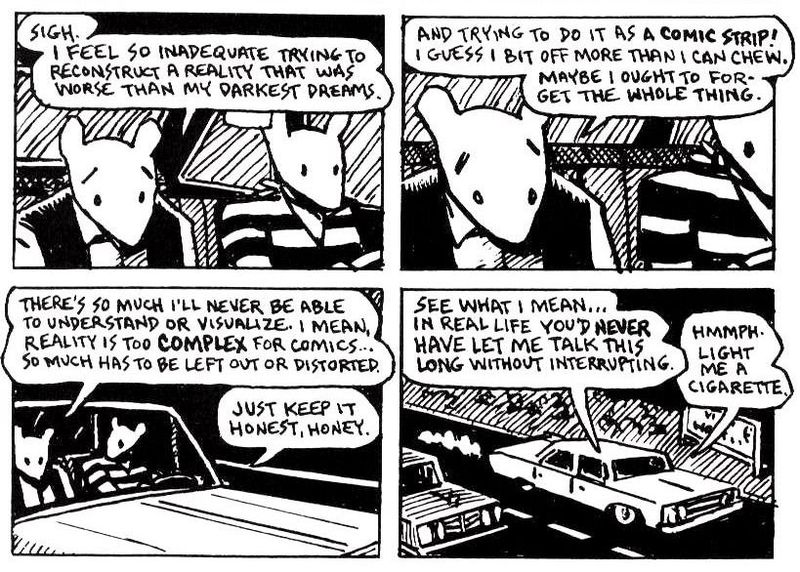
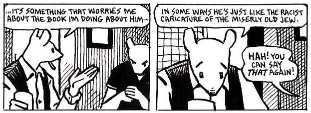
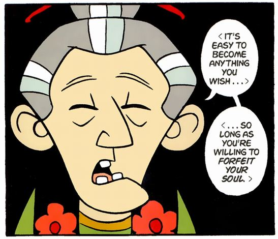
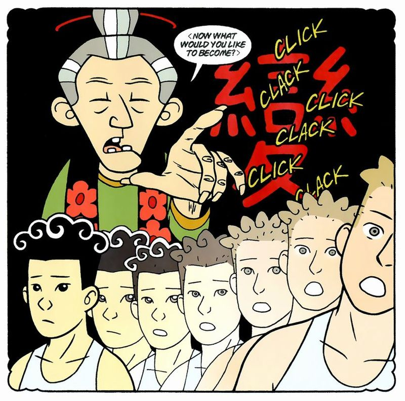
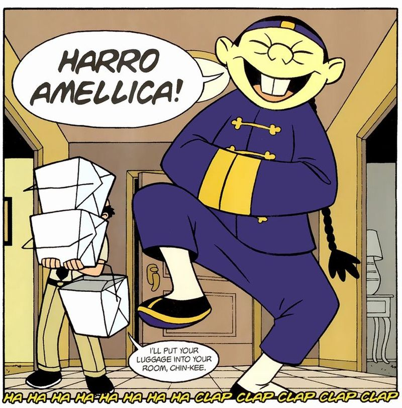

## American Born Chinese: On teaching racially fraught literature in racially diverse classrooms

 * Originally located at http://acephalous.typepad.com/acephalous/2011/01/american-born-chinese-lecture-notes.html

The two problems that confront any author attempting to write a confessional comic are likely best summarized in these two sequences from Art Spieglman's [*Maus*](http://www.amazon.com/exec/obidos/ASIN/0679748407/diesekoschmar-20):

\ 

\ 

In short: how are painful memories and painfully stereotypical people best represented in a medium associated with childishness?  I'll discuss Spiegelman's answer to this question in more detail when I teach *Maus* in a few weeks.  For now, it is enough to pose it and identify it as a critical problem faced by all non-white authors, including that of [*American Born Chinese*](http://www.amazon.com/exec/obidos/ASIN/1596431520/diesekoschmar-20), Gene Yang.  Unlike *Maus*, in which an already assimilated Art Spiegelman is depicting his decidedly unassimilated father, *American Born Chinese* is very much concerned with the process of assimilation: what is gained, what is lost, etc.  For example:

\ 

\ 

Those panels are not consecutive, but they do get the point across: the central metaphor of the novel is a Transformer toy and its primary function is as a figure of the costs and benefits of cultural assimilation.  Is it better to be a robot who can turn into a car or a car that can turn into a robot?  If you can move between the two states fluidly which one is the default?  Most students claim that it is better to be a robot who can turn into a car then a car that can turn into a robot, and the fact that I used the relative pronoun "who" to refer to the robot and "that" to refer to the car betrays why: the robot is seen to have greater agency even though it still thinks, is still sentient, as a car.  Map that onto to the assimilation debate and you end up with this:

\ 

To undergo this transformation, Jin Wang must "forfeit [his] soul," which indicates fairly strongly that his essential identity is Chinese and points to what I think is a central problem with this book: it can easily be mistaken as an argument in favor of identitarian politics.  Map the moment-to-moment transition in that panel there back onto the Transformer metaphor and it is clearly better to be a vanilla robot than a robot who can transform into a car because a vanilla robot still possesses its soul, whereas a transforming robot has forfeited its.  I don't actually think that's a tenable reading of the book, but it's certainly a palpable one when, for example, your student population consists largely of Asian-American students whose parents have insisted on the cultural superiority of the Asian half of that equation for their entire young lives.  The reason I don't find the superior-of-the-still-ensouled-robot reading defensible is that these same students sympathize strongly with Wang; that is, they prefer their culture to that of their parents.
Except their culture isn't the lily white "American" one that Yang offers as an alternative to the "Asian."  It's profoundly hybrid.  Yang understands this, as is evident from the fact that the typical "American" storyline—which interleaves with a repurposing of *Journy to the West* and Wang's bildungsroman—initially and explicitly bills itself as a sitcom called:

\ 

Now it should be fairly obvious why I brought up *Maus*.  As Yang himself [puts it](http://www.firstsecondbooks.com/authors/geneYangBlogMain.html): "What would possess a self-respecting Asian-American cartoonist to draw a character like that?"  His own answer to to his rhetorical question strikes me as less of an answer than a dodge:

> I've been told that Jeff Smith, the genius behind the  cartoon epic *Bone*, first created Fone Bone and Company in kindergarten.  In many ways, Cousin Chin-Kee is my Bone. He's a character conceived in  childhood who's stayed with me ever since, consciously or not.  
> *American Born Chinese* is an exploration of ***why*** Cousin Chin-Kee is my Bone. And just as Fone Bone now looks much the way he did in Jeff Smith's kindergarten sketches, so Chin-Kee's current design remains consistent with that initial second grade drawing. I've got to stay true to the source material.  
> There is always the danger, of course, that by making a comic book about  Cousin Chin-Kee I'm helping to perpetuate him, that readers—especially younger readers—will take his appearance in *American Born Chinese* at face value. I think it's a danger I can live with. In order for us to defeat our enemy, he must first be made visible.  

The discussion of *Bone* seems a bit beside the point, and that last sentence suggests that Chin-Kee is "our" enemy and must be defeated.  But who are the "we" behind that "our" and how are "we" defeating him?  The question of audience, always an issue, looms even larger here: if "we" are about half of the students at UCI, "we" are first-generation Asian-Americans who can sympathize with Yang's desire to represent their experiences; if "we" are the general comic book reading community, "we" are a far more heterogeneous group; and if "we" are everybody in my "Confessional Narratives" course, "we" are a heady combination of the two.  When members of the second group comment on the book, the members of the first often feel like their cultural experience is being co-opted.  Moreover, most students laughed at the following panel in the privacy of their solitary reading experience, but none will admit it in the classroom:

\ 

In short, class discussion is fraught, and the only way to work within that tense atmosphere is to encourage the students to discuss what they can: word-picture relations, panel transitions, film terminology, etc.  Once they start to impute the intention behind the formal elements to Yang instead of their own (imagined or otherwise) implicit racism, the tension wanes enough to return the conversation to the earlier topic: which element of a hyphenated identity is primary.  In the character of Chin-Kee, students who argue (often on the basis of the third panel above) that it's the Asian element are confronted with what Yang may believe that unadulterated Asianness looks like.  That's a harsh but not entirely unwarranted assessment, because as Yang himself [contends](http://www.firstsecondbooks.com/authors/geneYangBlogMain.html), his "second-grade self [may have] identified with [a] Chinese caricature" he had drawn as a child.  That caricature, the basis of Chin-Kee, may be his perception of himself or his perception of other people's perception of him, which would make the caricature a visible manifestation of Yang's [double consciousness](http://en.wikipedia.org/wiki/Double_consciousness).
Or Yang is an unrepetant old-school racist, though the fact that [*spoiler alert*] Chin-Kee is actually the Monkey King from narrative that borrows from and builds on *The Journey to the West* somewhat undermines that line of argument.  You'll note that this entire conversation fails to address why they laughed at that panel in private but refuse to admit to doing so in public, but it needn't: it's just the bog-simple fear of being caught thinking something racist.  It's much easier to call someone else a racist than to confront the fruit of one's own unthinking racism.  What's interesting to someone who's studied race for years (and has taught multiple courses on race and literature) is just how deeply rooted this fear is.  The amount of intellectual labor required for me to circumvent it is dwarfed by the amount of intellectual labor they perform in order to avoid confronting it.  Note how little formal analysis I've done in this post: I've alluded to it, but that's about it, because I guarantee that it'll take the majority of the class just to reach this point.
