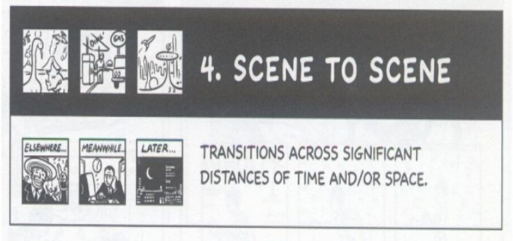

## Blankets: Teaching Panel Transitions via Craig Thompson's Blankets

 * Originally located at http://acephalous.typepad.com/acephalous/2010/09/teaching-panel-transitions-via-craig-thompsons-blankets.html

> The [standard caveat](http://acephalous.typepad.com/acephalous/2010/08/creating-critical-distance-or-on-teaching-avatar-the-last-airbender.html) applies: these analyses are designed for freshmen-level composition courses.  I repeat: **these analyses are designed for freshmen-level composition courses**.  The wheel will not be reinvented here.

I begin the quarter teaching excerpts from Scott McCloud's *Understanding Comics* and *Making Comics* not because all arguments about comic form and content end with the theories contained therein, but because 1) his terms have come to define the debate and 2) they are damn useful in setting up classroom debates.  (My students don't realize that they frequently recapitulate the scholarly arguments inspired by the book, but they do.)  The basic idea behind this exercise is to get them to understand that [they're all murderers](http://acephalous.typepad.com/acephalous/2009/10/on-informing-your-students-that-theyre-murderers.html) and the only way they'll get their heads out of the gutters is figure out how to move from one panel to the next.  First I provide the McCloud:

\ 

Then I follow it with an example from their text, in this case Craig Thompson's *[Blankets](http://www.amazon.com/exec/obidos/ASIN/1891830430/diesekoschmar-20)*:

\ 

You'll note that I haven't included an obvious example of a moment-to-moment transition here, but that's because I want them to understand from the get-go that this terminology is flexible.  In this case, I would argue that this is moment-to-moment on two accounts: the first would be conventional McCloud, because in the gutter between the those panels the reader must imagine Phil squirm until he can spot the "sharks" on the floor beside the bed.  My assumption here is that "squirming" represents "a single action" and Thompson portrays its constituent parts, but my assumption is also an assertion that students can (and tomorrow will be forced to) take issue with.
For example, it could be argued that "squirming" is an indivisible act and that, as such, it cannot be broken down into a series of moments (although the very existence of these panels would seem to indicate otherwise).  Here as elsewhere, the poor fit between McCloud's term and Thompson's text works to my advantage: something cannot simply be said to be something.  It must be argued.  The same difficulties arise with McCloud's next transition:

\ 

The problem is right there in the word-picture relation: is the "single subject" of McCloud's panels a baseball player and a drunk ("person") or a baseball bat and a drink ("object")?  It may seem like a distinction without difference until you imagine a fourth panel for each example: if the baseball player swings and the fourth panel presents him rounding the bases, the "single subject" had to be him; if the batter swings and the fourth panel presents the bat flying into the stands and injuring a spectator, the "single subject" must have been the bat.  Implicit in retroactive determinations of the sort is a more complicated argument about what the meaningful elements within a panel are.  Here's the Thompson I'm pairing with the above:

\ 

What is the subject of this panel?  Is it Thompson or the blood on his hands?  An argument can made be for either (though obviously one is more interesting the the other).  I could continue in this vein, but I want my students to figure this out on their own and not simply repeat what I write on the blog.  With that in mind, I will simply present the last examples (minus non-sequitur for Thompson-specific reasons I'll cover later) in the order in which they will appear on the wall.  Feel free to knock them (and me) about in the comments.  Here goes:

\ 

\ 

\ 

\ 

\ 

\ 

I warn you (and preemptively defend myself): the aspect-to-aspect example requires a stronger argument to make it work, but toying with failure can be a bonding experience early in the quarter, so I ran with it anyway.
