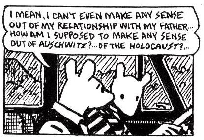
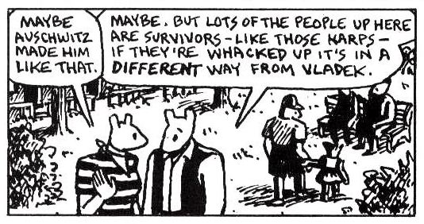
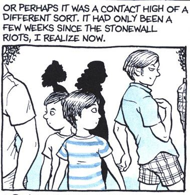
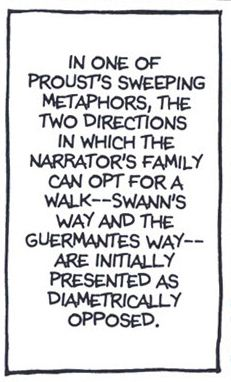

## Fun Home: Reifying memory in Alison Bechdel's Fun Home

 * Originally located at http://acephalous.typepad.com/acephalous/2011/02/alison-bechdel-fun-home-lecture-notes.html

Alison Bechdel's *[Fun Home](http://www.amazon.com/exec/obidos/ASIN/0618871713/diesekoschmar-20)* fits neatly into the last third of my "[Confessional Narratives](http://acephalous.typepad.com/acephalous/2011/01/confessional-narratives-syllabus.html)" course for all the obvious reasons: it's intensely autobiographical; it's told from an emotional and temporal remove from the events narrated; those events are of indisputable significance to the life of the confessor; etc.  In particular, it resembles Craig Thomspon's *[Blankets](http://www.amazon.com/exec/obidos/ASIN/1891830430/diesekoschmar-20)* and Art Spiegelman's *[Maus](http://www.amazon.com/exec/obidos/ASIN/0141014083/diesekoschmar-20)* in that its focus is on the narrator's relationship with someone particular; however, unlike Thompson's relationship with God or Spiegelman's with his father, Vladek, Bechdel's interested in a fundamental reconcilation with her closeted father.  
I'm not claiming that Spiegelman was uninterested in understanding his father better, only that his attempt was doomed to failure because the unknowable horror of the Holocaust made it impossible for him to either share that experience or even understand the gravity of its effects on his father, *e.g.* these non-consecutive panels from "And Here My Troubles Began":  

\ 

\ 

There is something non-universal about the way in which the Holocaust altered Vladek Spiegelman, and as much as Art attempts to divine the particular from the universal or vice versa, he never succeeds.  The nightmare of history is such that his father's story can only ever be that: his father's story.  The same doesn't logic doesn't hold for Bechdel's *Fun Home*, not only because the horrors of discovering you're gay aren't comparable to finding yourself in Aushwitz, but because Bechdel's lament is that her father, Bruce, didn't live long enough to experience life outside the closet.  It's no coincidence that Bechdel has "a hallucinogenic memory" of accompanying her closeted father to retreive her mother from the city:

\ 

The irony of this memory occupying an hallucinogenic space "a few weeks since the Stonewall Riots" in Bechdel's memory should be obvious.  I'm not saying she's lying or even misremembering, only that she's making history meaningful in a way that's similar to what Vladek performed on the first-order and Art did on the second.  The difference between her performance and Art's is that she's doing so in order to make sense of his life in a way Art could never duplicate.  

Again, not faulting anyone for anything here, merely acknowledging what Art himself does above: the inability to understand, however tenuously vicariously, someone else's experience will prevent you from ever sympathizing with or being able to offer anything but sympathy to this other person.  That's not the case in *Fun Home*, which is less concerned with communicating the attempt to reach an inreconciable understanding than the act of coming to an understanding you can live with.
Put in the starkest possible terms: Art fails to understand Vladek because he can't comprehend the Holocaust, whereas Bechdel tries to understand herself through her father's life and succeeds because the attempt is a thing in itself, *e.g.* the book's Proustian returns to Proust:

\ 

*Fun Home* reifies memory via narrative, but it does so in a way that reminds readers that human beings aren't made of words.  Granted, the above panel is about as word-specific as word-picture relations come, but in a graphic novel it's panels like this one that are intruding on the conventions of the medium.  People typically think of their memories as feelings and images punctuated by what others said, but outside of graphic novels the only means of communicating them *without recourse to someone else's interpretation of them* is through words.  This difference is figured in the book as the relation between Gatsby in the novel and Redford's portrayal of him onscreen: the former remains closer to Fitzgerald's vision of him because there's no other mind translating, via performance, Gatsby for the audience.
