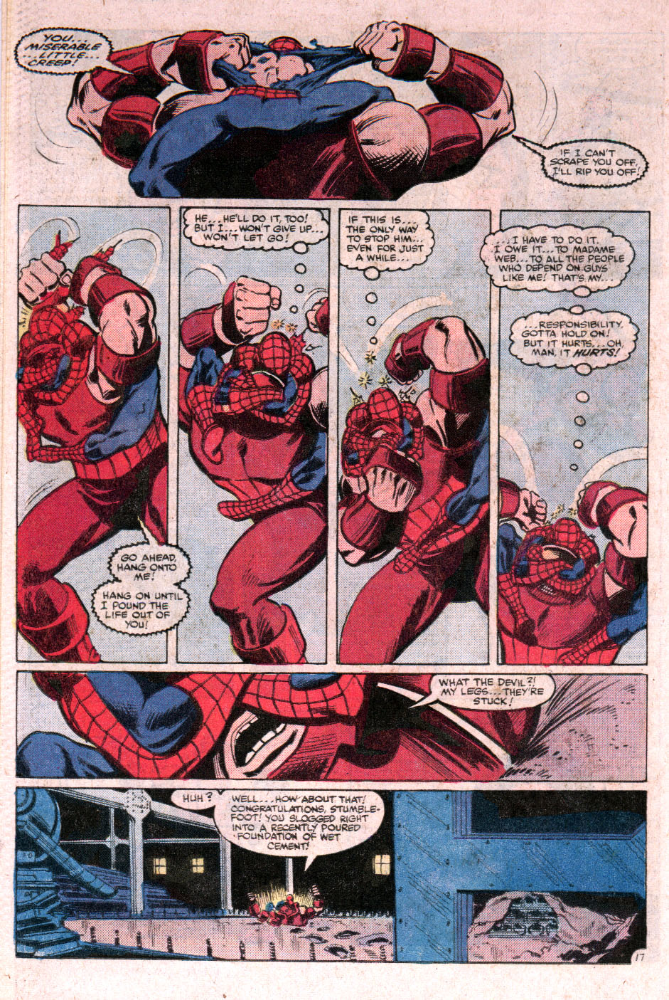

## John Romita Jr: At least explain *why* John Romita Jr. is one of the top 50 comic book artists

 * Originally located at http://acephalous.typepad.com/acephalous/2014/12/at-least-explain-why-john-romita-jr-is-one-of-the-top-50-comic-book-artists.html

Because it’s my birthday and I have the God-given right to behave insufferably on it, I’d like to complain about this otherwise excellent list of [the top 50 comic book artists](http://goodcomics.comicbookresources.com/category/top-100-comic-book-writers-and-artists/) that Brian Cronin at *Comic Book Resources* has put together. Obviously, there are problems with objectively ranking art and what-not, but despite a bit of presentism, the list is mostly solid.

My complaint is with the analysis — or more accurately, the lack thereof. For example, Cronin includes this sequence of panels from *Amazing Spider-Man* #230:

\ 

And says this about them: “Amazing. His character work is different now, but his page designs are the same and they’re still excellent.”

I know Cronin’s capable of more — and again, because I have the right to be insufferable today and *demand* more — I’m going to provide more. Want to know why this sequence by John Romita Jr. warrants his inclusion in any top 50 list of comic book artists?

Panel 1 is open — that is, without defined borders — and that openness is used to indicate that events depicted within it don’t have a predefined outcome as of yet. This kind of non-panel paneling is often used in splash pages at the beginning of epic tight-filled battles, with hundreds of dozens of characters spilling over each other in a mad rush to do justice.

But here, despite the openness of the panel, Romita Jr. opts for intimacy — not only are Spider-Man and the Juggernaut the only two characters in the open panel, but they’ve been transported into a Beckett play. There literally is no world beyond their struggle and the words they have to say about it.

In Panel 2 — properly bordered as the outcome becomes more clear — the Juggernaut is still the dominant figure, and his defiant words occupy the bottom half of the panel.
But as Spider-Man starts to get the upper hand in Panel 3, the compositional balance shifts. Peter Parker’s thoughts start to crowd the action further down the panel, and no matter how hard the Juggernaut tries to pound him off — as indicated by the little stars dancing around Spider-Man’s head — Parker’s indomitable will is proving to be the decisive element in this fight.

In Panels 4 and 5, Spider-Man’s thoughts *about* responsibility are allowing him to subdue his much more powerful opponent. The weight of those thoughts is allowing the slight web-slinger to defeat a man who goes by *nom de guerre* “Juggernaut.”

Romita Jr. is using these first five panels to compose a stunning tribute to the power of will to triumph over brute strength — or it’s just a set-up. Panel 6 is a close-up of the Juggernaut’s gums, which had stopped flapping for a few panels there, indicating that he’s having mobility issues. Given the way the world fell away in Panel 1, the close-up in Panel 6 works like the final beat a comic holds before delivering the punchline — which in this case is that the pair had been fighting in a pond of wet cement.

All those words I wrote about how the weight of Parker’s responsibility overpowered the Juggernaut in Panels 2, 3, 4 and 5 remains true — but now it becomes clear that they were *also* slowly sinking in wet cement. Not that the reader knows that, because they fought in a Beckettian void of will and word, but even after the punchline’s been delivered, the tension remains. Yes, they were sinking into a sea of cement — but they were also engaged in a struggle which, for Parker, was deeply connected to his ever-present and always-punishing sense of responsibility.

And *that*, my friends, is why John Romita Jr. is one of the top 50 comic book artists of all time.
