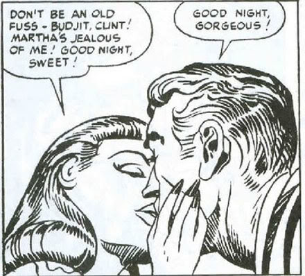
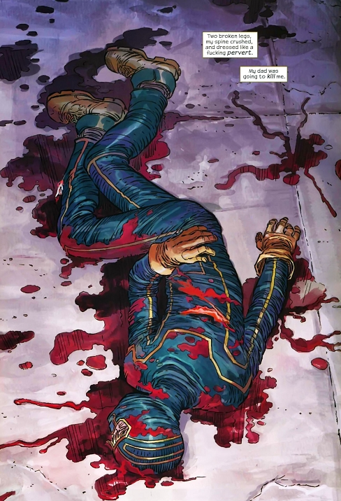
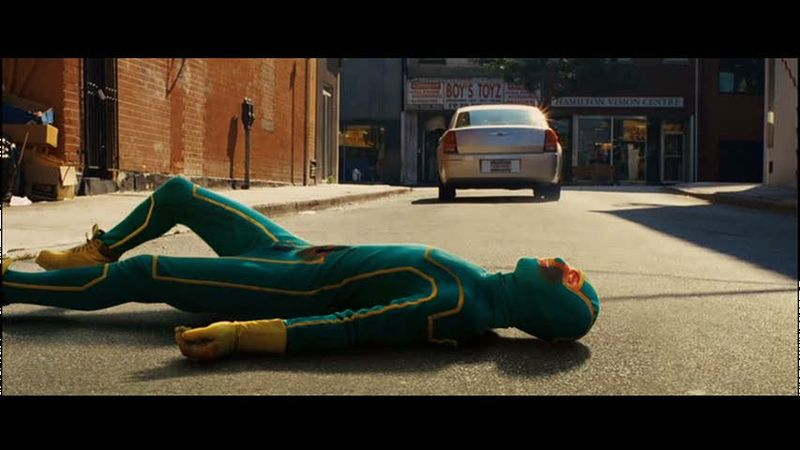

## Kick Ass: Becoming Mark Millar

 * Originally located at http://acephalous.typepad.com/acephalous/2010/10/my-feelings-about-mark-millar-are-with-one-notable-exception-have-been-rehearsed-often-enough-that-youll-probably-be-surpri.html

My feelings about Mark Millar (with [one notable exception](http://acephalous.typepad.com/acephalous/2010/04/kick-ass-sorta-saved-my-life-the-other-night.html)) [have been](http://acephalous.typepad.com/acephalous/2009/02/thesis-mark-millar-is-why-you-still-feel-guilty-reading-comic-books.html) [rehearsed](http://acephalous.typepad.com/acephalous/2010/03/on-the-moral-universe-of-mark-millar-which-makes-little-sense-but-frequently-explodes.html) often enough that you'll probably be surprised that I allowed my students to talk me into teaching *Kick Ass* (the book and film) in my American Manga courses.\* I hadn't seen the film yet but knew from having read the book what to expect: a premise that's not nearly as clever as Millar thinks it is ([*ahem Nemesis ahem*](http://acephalous.typepad.com/acephalous/2010/03/on-the-moral-universe-of-mark-millar-which-makes-little-sense-but-frequently-explodes.html)) would be presented as if it were a brilliant counterfactual (*ahem Red Son ahem*) only to be violated when the opportunity arose to "cleverly" twist the narrative with no regard for the logical or moral implications such a twist entailed (*ahem The Ultimates ahem*).  A quick diagram of *Kick Ass* would work something like this:

1. an unclever premise (*what if superheroes were real?*)
2. presented as a brilliant counterfactual (*they would regularly get their asses kicked! in extremely graphic ways! by amoral people!*)
3. whose logic would be violated at the first opportunity (*superheroes do exist!*)
4. to "cleverly" twist the narrative (*but they're sympathetic 10-year-old girls who like to say the word "cunt"!*)
5. with no regard for the logical (*supereheroes can't exist! but they do!*) or moral (*Hit Girl is a sympathetic sociopath!*) consequences such a twist entails

As I've [already discussed his fascination with the word "cunt"](http://acephalous.typepad.com/acephalous/2010/03/on-the-moral-universe-of-mark-millar-which-makes-little-sense-but-frequently-explodes.html) and he's since named his magazine after the old printing pun

\ 

so I think it goes without saying that Hit Girl is Millar indulging in a spot of gender-bending narcissism with pedophiliac overtones and, as such, is telling me things about himself I frankly don't want to know.  Think about it: Big Daddy and Hit Girl are clearly variations of Batman and Robin, itself [a relationship of questionable provenance](http://www.bilerico.com/2008/07/when_batman_was_gay.php), only Millar turns the 10-year-old proxy for Robin in a female version of an idealized vision of himself.  How is that not disturbing?  But I digress:

His premise is that superheroes can't exist in a world constructed with something resembling a realist ethos, and in order to prove this he has John Romita, Jr. draw the reason why with unflinching brutality.  (This is because at our current historical moment, "realism" functions as a synonym for "gritty," but you already knew that.)  For example:

\ 

In the real world, panels like this argue, a superhero would be stabbed and then hit by a car and then all the blood in his body would fly from his wounds like so many kicked-in teeth.  Such panels claim to be realist but are, in fact, hyper-stylized indulgences in violent juvenile fantasies ... which also happens to be a fairly accurate assessment of the entire book.
All that said, you might be surprised to learn that I actually *liked* the film.  Why?  Compare the above to its on-screen equivalent:

\ 

Notice a difference?  The first and most obvious one is that the amount of blood on the pavement approximates the amount someone stabbed in the stomach would bleed.  The second and more important difference is that Matthew Vaughn shoots the aftermath of the accident from the side in a medium long shot, whereas Millar and Romita, Jr. frame the shot from above in a manner that fetishizes the effect of violence on the human body.  To put it differently:

Vaughn's shot selection is essentially *critical* of Millar and Romita, Jr.'s excessive lust for representing broken human bodies.  It quietly claims that the "realist" premise Millar claimed to be operating under is the very ruse Millar himself reveals it to be when Hit Girl first appears.  The book is [pure torture porn](http://acephalous.typepad.com/acephalous/2008/07/i-challenge-any.html) of the sort that the film initially attempts to undermine.  Vaughn demonstrates that Millar is a monster by showing you what the book should have looked like *and then turning you into Millar*.  After all, the audience's understanding of the dynamics of the narrative is very different when Hit Girl first appears after Vaughn's implicit criticism of Millar's bloodlust.

\* It turns out that the significant overlap between [the demographics of UCI](http://edgeofthewest.wordpress.com/2009/02/19/where-i-am-i-dont-know-ill-never-know-in-the-silence-you-dont-know-you-must-go-on-i-cant-go-on/) and the readership of manga is no overlap at all, forcing me to expend too much time explaining what the conventions with which I assumed they would be familiar were and how they worked.  As the reasons behind teaching popular culture in a composition class are 1) the students have an intuitive understanding of the conventions, which allows me 2) to focus on creating a formal vocabulary for discussing them, so that I might 3) show the students how to organize those technical discussions into persuasive arguments.  In other words: I need them to pick up the vocabulary quickly so I can focus on the teaching the process of formal writing.  As the manga and anime weren't facilitating those goals, I had no choice but to shift gears.
