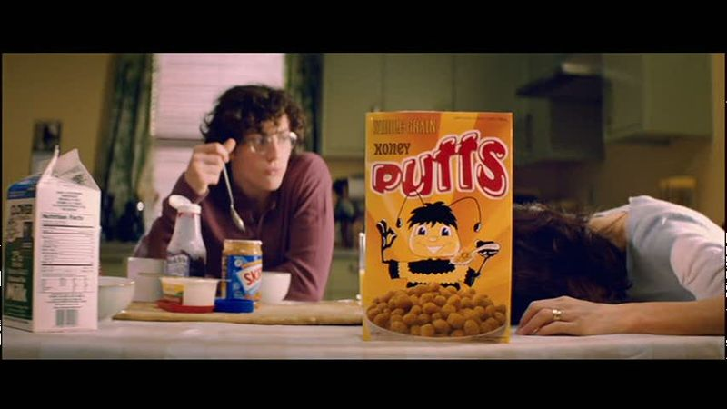

## Kick Ass: How a person becomes a body

 * Originally located at http://acephalous.typepad.com/acephalous/2010/11/kick-ass-millar-.html

Since some complained that my lack of detailed anatomical knowledge or emergency room experience undermined my larger argument in [my first *Kick-Ass* post](http://acephalous.typepad.com/acephalous/2010/10/my-feelings-about-mark-millar-are-with-one-notable-exception-have-been-rehearsed-often-enough-that-youll-probably-be-surpri.html), I thought I'd approach the same argument from another angle.  If you'll recall, in that post I argued that

> Vaughn's shot selection is essentially *critical* of Millar and Romita, Jr.'s excessive lust for representing broken human bodies.

To put it another way: in Millar and Romita's book, the characters aren't people so much as bodies to broken; whereas in Vaughn's film, the characters are sympathetic people with lives to be invested in.  This dynamic, it turns out, also exists in scenes that don't involve [the quantity of blood that a body can realistically bleed out](http://www.lawyersgunsmoneyblog.com/2010/10/becoming-mark-millar/comment-page-1#comment-72591).  Consider the scene in which the titular hero, Dave Lizewski, teases the audience with a typical origin story:

\ 

In the first panel, the dead mother is a headless body sprawled on the floor.  The high angle of framing only allows for the reader to register the shock of her death via Lizewski's body language, as his face is so distant that the only visible emotional marker is his oblong, half-opened mouth.  That's not a shot that's liable to build sympathy for a character; in point of fact, the almost omniscient perspective in the panel creates a sense of the narrator's distance from the events being narrated (despite said events being the death of his mother).

The second panel transposes the reader from the reality (however coldly rendered) of a mother's death to the decidedly unreal world of superhero origin stories.  Again, the distance of the reader from Lizewski places the emphasis on his body; his face is an open howl, but his vengence (such that it is) is communicated through the Liefeldian posturing.  (I have a strong memory of Sunspot frequently being in an identical posture during Liefeld's run on *New Mutants*, but Google's being unforthcoming.)  All of which is only to say that, in the book, grief is demonstrated not through facial expressions that might lead readers to sympathize with Lizewski, but with exaggerated postures that render him less of a person than a trope.
Compare that to the same scene in the film.  It opens with an establishing medium shot of the family at breakfast:

\ 

Then zooms to the right and into a medium close-up of the dead mother:

\ 

For narrative reasons the cereal occupies the center of the screen, but it also divides the scene between the mother's head and Lizewski's reaction to it falling to the table.  His face is visible; his reaction is measurable.  The woman at the table is not a headless anonymous thing called "Mother," but a woman who once was, but is no longer, a presence in a life.  The camera then pans up into the next shot, which mirrors the one from the book:

\ 

Before panning back down to the table:

\ 

This shot is identical to the previous with the exception of the fact that the mother is missing.  It then pans back into a reestablishing shot:

\ 

Which also emphasizes the mother's absence: medium pans in to a medium close-up, she dies; medium close-up pans out to a medium, she's gone.  Her death and subsequent absence are rendered visibly memorable despite the fact that *the explicit content of the narrative is that they shouldn't be* because it's irrelevant to his origin story.  In the Millar, hers is an irrelevant dead body and is framed as such; in the Vaughn, it's an irrelevant woman whose presence is missed by both of the other characters on-screen.

In short, in one she's just a body; in the other, a mother.
