## Planetary/Batman: Night on Earth: How to teach the interrelatedness of historical context and audience

 * Originally located at http://acephalous.typepad.com/acephalous/2009/04/teaching-rhetoric-via-warren-ellis-planetary-batman-night-on-earth.html

Someone emailed to ask how it is I [teach historical context via a single comic](http://www.thevalve.org/go/valve/article/academic_respectability_comics_and_criticism/#24721).  The book in question: Warren Ellis's one-shot cross-over between the Wildstorm imprint *[Planetary](http://en.wikipedia.org/wiki/Planetary_%28comics%29)* and the DC franchise that is the Batman.  Ellis created the book as a means of investigating [the enduring popularity](http://interviews.slashdot.org/interviews/03/05/09/1727245.shtml?tid=188&amp;tid=192) of [the superhero genre](http://www.ultrazine.org/ultraparole/ellis/english.htm). Over the course of thirty-odd issues his team of quasi-cultural anthropologists tore through the history of the 20th Century in an attempt to answer that deceptively simple question: Why have impossible people in tights mattered so much for so long?  

*Planetary/Batman: Night on Earth* (2003) opens by jiggering that old comic standby: the multiverse.  An incidental murderer named John Black has been having seizures, and every time he seizes, a blue dome extends from his body and shifts him and everyone else from one dimension to another.  The dome looks like this:

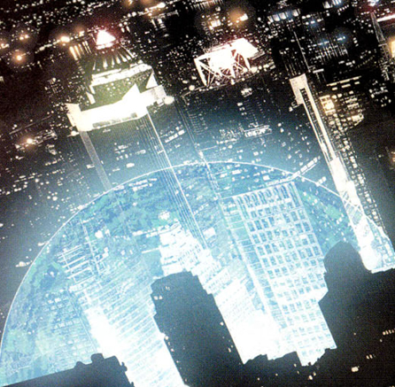\ 

The people who shift from a point in their dimension to an already-occupied point in another end up like this:

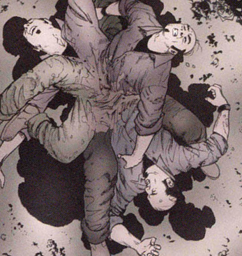\ 

Not a pleasant way to die.  So the Planetary team is called in to investigate.  They learn that Black's fingerprints were recently found outside a soup kitchen and go to investigate.  They corner him in an alley when:

\ 

They reorient themselves and move to apprehend him when they hear something above them:

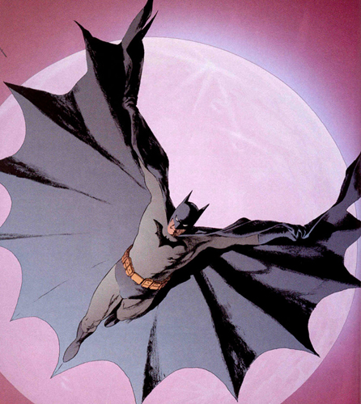\ 

That would be Batman circa 2003.  How do I know?  The Batsuit lacks the yellow shield around the symbol on his chest, meaning this iteration must come before the introduction of the "New Look" suit in *Detective Comics* \#329 (July 1964) or after they retired the shield in *Detective Comics* \#742 (March 2000):

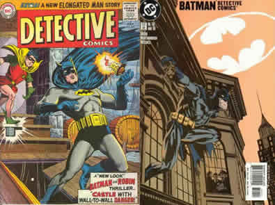\ 

Factor in the photorealistic gestures and that can only be the Batsuit of the 21st Century.  But why did folks at DC decide to go with the throwback costume at the dawn of a new century?  Nostalgia?  What happened in 2000 that made the less cartoonish Batsuit more attractive to fans of the book?  Because the subtraction of the shield was not the only change: the greys now skew black, the blues shift black-navy, and the yellow of the utility belt pales to a washed and muted gold.  

My class and I begin to talk a little about the turn of the last century within the context of the story—at this point a fight between one member of the Planetary team and Batman—until the scene abruptly shifts again to reveal:

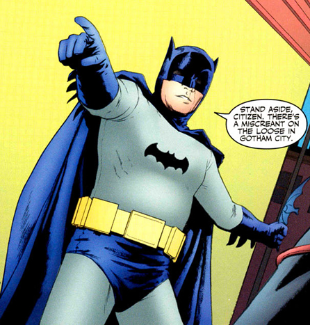\ 

Adam West!  We talk about what America would have been like when the show was on the air (1966-1968) and then I show them [this clip](http://www.youtube.com/watch?v=Z1RqxHQOG7w).  Why would people in the 1960s want a Batman who walks into a bar and orders orange juice?  What would have been appealing about a Batman who was a fully deputized Peace Officer in the Gotham City Police Department?  They respond very generally about the Civil Rights Movement and Vietnam and and drugs and hippies and the perceived erosion of the moral fabric of society—at which point I stop and ask, "Who *exactly* was perceiving the erosion of what now?"  

The class shifts from discussing audience and historical context *generally* to situating particular audiences in particular historical contexts.  I use the word "square" as a pejorative and we continue slicing chunks off this imagined audience of all Americans when John Black (remember him?) seizes again and the team is confronted by this guy:

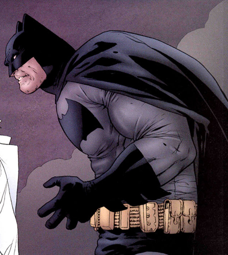\ 

That would be the almost impossibly thick-trunked Batman from Frank Miller's *The Dark Knight Returns* (1986).  (Those seeking an *impossibly* thick-chested character can [click here](http://acephalous.typepad.com/files/impossiblecap.jpg).  Just remember those are the only eyes God gave you and some images can't be stabbed out of them no matter how hard you try.)  We chat a little about identifiable style, which is to say we stare at this picture and to figure out what makes the top one an obvious visual allusion to the bottom:

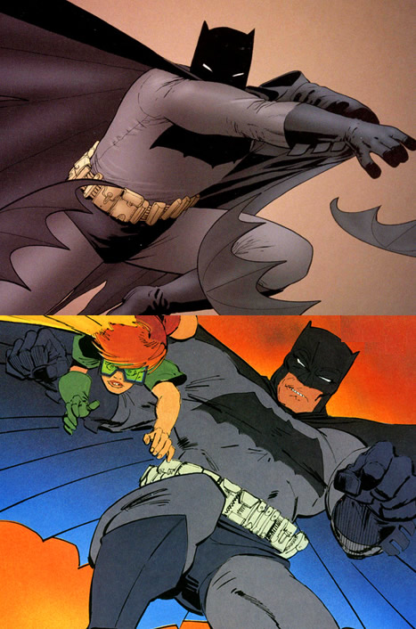\ 

The idea is to begin to build a specific, usable vocabulary for discussing cartooned images.  (The thickness of the lines, the shapes of the body, the gradation of the background, &c.)  Then I hark back to earlier film-oriented discussions about the contemporary conventions of realism (dark and grimy) and the body as costume ([method acting](http://acephalous.typepad.com/acephalous/2009/02/im-surprised-to-learn-this-christian-bale-fellow-is-so-intense.html)) and we try to determine how applicable they are to the comic medium.  Are the expectations of a comic reader identical to those of a film audience just because they are both partially visual mediums?  Then:

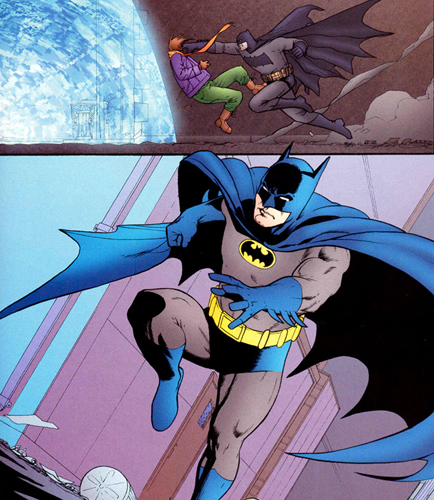\ 

I ask the class to welcome Neal Adams and [his iconic Batman](http://acephalous.typepad.com/files/adams.jpg) into the fold.  Context is discussed again.  Convention is discussed again.  ("Who let his bat-ears bat-extend out the frame?")  I ask them, "When did we last see a photorealistic Batman?"  

They respond, "The 21st Century."  

I twist my mouth to look perplexed.  "What about Adam West?"  

They say, "We didn't think of that.  The whole medium thing threw us off track."

We discuss "the whole medium thing."  Batman questions John Black.  The Planetary team explain that Black is sick.  That something terrible happened to his parents.  Batman gets introspective:

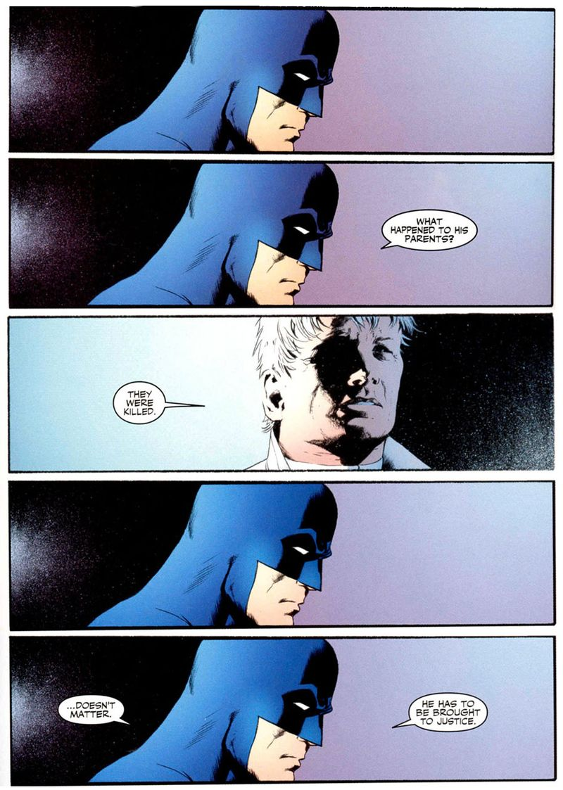\ 

They explain that Black's parents were murdered.  I ask the students how you would paint a picture of someone deep in thought.  ("Thought bubbles!"  "But wouldn't that ruin the 'Mona Lisa'?"  "We didn't think of that.")  We talk about body language and the repetition of the panels—how it slows our experience of narrative time to a crawl.  

We discuss what an audience needs to know for the pathos of this scene to be communicated effectively.  Then I ask them, "What was the name of that alley they're in again?"  Black seizes again and the scene shifts from one in which an introspective and sympathetic Batman balances compassion for a fellow orphan and the immutable requirements of indifferent justice to this:

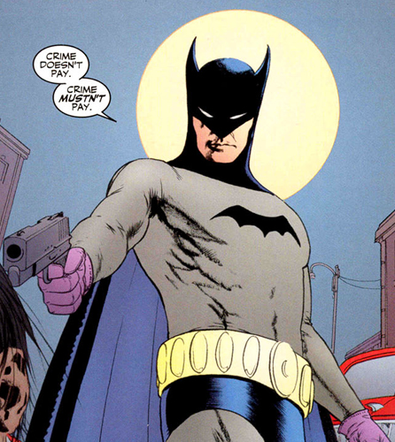\ 

I ask them, "Besides the pink lady-gloves, what's unusual about this Batman?"  They point out the gun.  I nod and respond, "Where have we seen this Batman before?"  They correctly identify him as the original Batman from *Detective Comics* \#27 (1939).  This quarter they even noted its resemblance to the first ever appearance of Batman in that same comic:

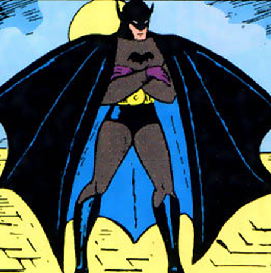\ 

, says that Batman has some strong connection to this particular alley.  As soon as the Drummer finishes that sentence Black shifts again and we get this strange sequence of panels:

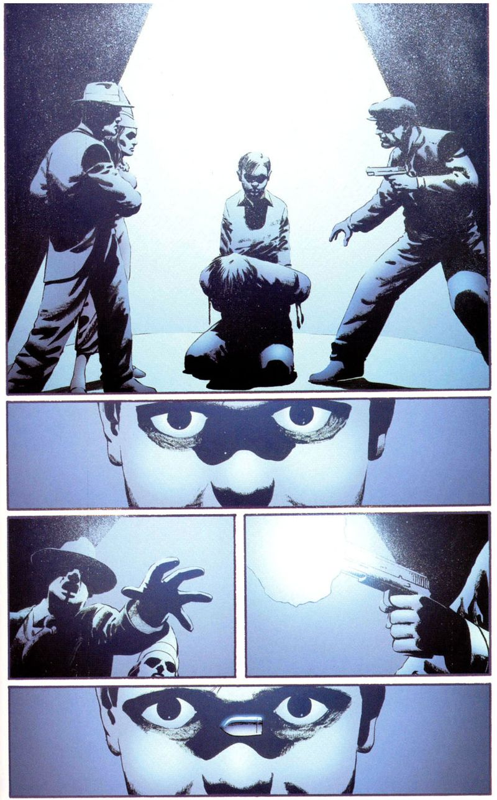\ 

What are we to make of this flashback?  The top panel shows a hand-cuffed Black kneeling before a young Bruce Wayne, who stares down at him with socket-shadowed eyes.  But whose perspective is being represented in this panel?  It can't be that of the gun-wielding Batman, because his parents were never murdered.  This trauma belongs to someone else.  Young Wayne raises his eyes from Black and seems to stare out from the panel and at the reader.  Is the scene broken down into still frames by Wayne?  

Look at that bullet in the bottom panel.  Look how it hangs there—sans speed lines—between the whites of young Wayne's eyes.  The presence of Black suggests that this is no flashback.  This bullet the child never saw—could *not* have seen—frozen in the middle of a locked stare.  But *who* is Wayne staring at?  I put my money on the guy in the next panel:

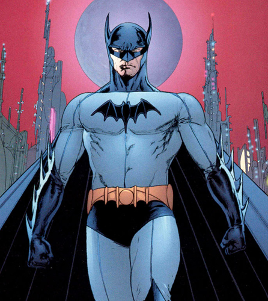\ 

This is no known Batman.  The Gotham behind him resembles an industrial plant more than a city.  This is an Aristotelian amalgam or Platonic ideal (take your pick) of all the Batmen called to mind when someone says his name.  In his body, Miller's grotesquerie is tempered by Adams's photorealism into mere [muscular hypertrophy](http://en.wikipedia.org/wiki/Muscle_hypertrophy).  In his words, the thoughtful deliberation of the sternly bowed head combines with the civic-minded optimism of Adam West:

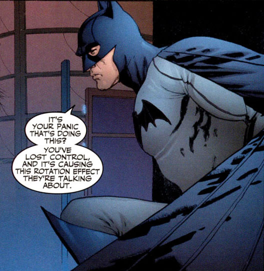\ 

To my mind (though I could well be wrong) this odd amalgam of Batmen is who the young Wayne stared at: not out of the comic at the audience, but out of his memory at himself.  As the youth raises his eyes from Black to lock them on his older self, he calls attention to the slumped figure before him.  He—whoever "he" may be here, be it the rememberer or the remembered—freezes the bullet square in the center of their shared gaze but he pays it no mind.  The bullet is incidental.  The character it created is not.  

Ellis manages to represent the act of contemplation *in a superhero comic*.  He demonstrates that the even though the character appeals differently at different historical moments—what delights in the '60s becomes unimaginable and unrecognizable as Batman by 2009—there is a sound narrative logic behind the sustained popularity of this impossible person in tights.  There is one appeal whose effectiveness has remained operative since 1939.

Then class ends and I let them stew over my contradictory claim until next Tuesday.  
