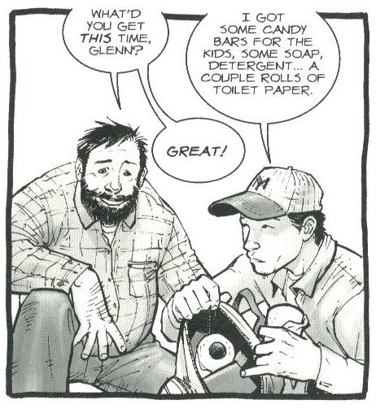
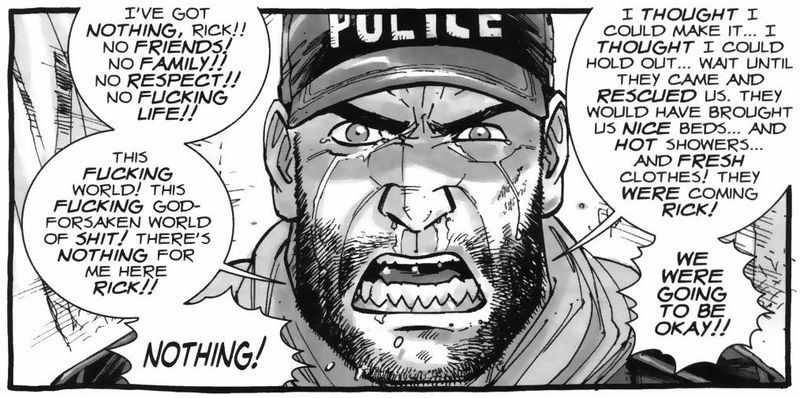

## The Walking Dead: On wordiness and time in Robert Kirkman's The Walking Dead

 * Originally located at http://acephalous.typepad.com/acephalous/2011/01/walking-dead-robert-kirkman-teaching-comics-post.html

I'm transitioning from teaching film to comics in my unfortunately named ["Slow Horror" course](http://acephalous.typepad.com/acephalous/2011/01/slow-horror-syllabus.html) tomorrow and so I'm preparing to introduce my students to comic conventions using Robert Kirkman's *The Walking Dead*.  Kirkman's wordiness works to my advantage, as [with duo-specific word-picture relations](http://acephalous.typepad.com/.a/6a00d8341c2df453ef0147e1ae93c3970b):

\ 

Kirkman didn't need to inform the reader that Glenn returned with toilet paper because the paper is clearly visible.  Because the characters are constantly carrying on, examples of them pointing out the obvious abound.  The same applies for [interdependent word-picture relations](http://acephalous.typepad.com/.a/6a00d8341c2df453ef0147e1aea1cb970b):

\ 

Notice the difference between the examples McCloud used at the link and Kirkman and penciller Tony Moore's panel?  The examples use textual elements in a variety ways—be it thought balloons or captioned narration—but the Kirkman and Moore panel only uses them as a means for delivering direct dialogue.  It wasn't until I wrote the previous sentence that I realized the same might be true for the entire run of *The Walking Dead.* After I flipped through the first few issues to confirm my suspicions, I thought about why he might have chosen to eschew one of the formal properties of comic grammar that differentiates it from televisual media: natural interiority.

Unlike first-person voice overs in television and film, thought balloons and captions provide a window into the mind of character without calling attention to themselves as narrative devices.  In other words, there is nothing special about the audience's access to the mind of the characters because such access is a feature of the medium so ingrained as to be beneath notice.  A comic book in which such access is never granted creates characters whose motivations seem cryptic *despite the fact that such access is almost never granted on television or in film*.  To be uncharitable: Kirkman is writing a television show that happens to be in a comic book and the fact that it was adapted is a function of its easy adaptability.

But to say that would be to miss the point, which is that the ease with which it could be adapted obscures what has been lost in the translation to the small screen: because interior access is only very rarely granted, whatever is gained by withholding it in the book is lost in the transition to the screen. *The characters will no longer be ciphers whose thoughts must be inferred from their words and actions: they will merely be characters on a television show.* The implications for the television show are obvious: recreating the suspicious atmosphere of the comic must be done by other means ... which I will discuss when I teach the show next week.
Returning to the panel above: the wordiness of that specific panel and the book generally creates some interesting formal difficulties, the most interesting of which relates to the disconnect between the single expression on his face and the time it would have taken him to speak all those words.  As represented in that panel, time is both slowing to a halt (visually) and speeding up (verbally).  Moreover, Shane's face must adequately account for all of the emotions he communicates in those text balloons because the fact that [some of them are burst](http://www.blambot.com/images/gram_burst.jpg) means that some will be more strongly felt than others.\*  It must account for both the double exclamation points in the first balloon and the ellipses that trail off his his quieter remarks in the third. 

How did Moore accomplish this?  He draws very well.  How was Kirkman complicit in this?  By [joining the balloons directly](http://www.blambot.com/images/gram_balloonballoon.jpg) instead of [connecting them](http://www.blambot.com/images/gram_connector.jpg), Kirkman creates the impression that this entire speech is the articulation of a single train of thought.  It clearly isn't: his fear for his life intermingles with his need for a family and those two intertwine with his desire for creature comforts, but they are all independent emotions that become entangled *only when they all refer back to the same face*.  The wordiness works to Kirkman's advantage here: Shane becomes more psychologically complex because his single expression is associated with a host of conflicting emotion.

In short: time is out of joint and even the simplest characters seem psychologically complex simply by dint of the wordiness.  The effect disorients the reader and leaves them unsure about their relation to narrative time or the characters—which is exactly the same situation in which the characters find themselves as they lose track of the days they've lived in a world in which they must suspect that the motives of everyone are more complicated than they seem.

\* This and subsequent balloon images borrowed from Nate Piekos's excellent [Comic Grammar](http://www.blambot.com/grammar.shtml).
