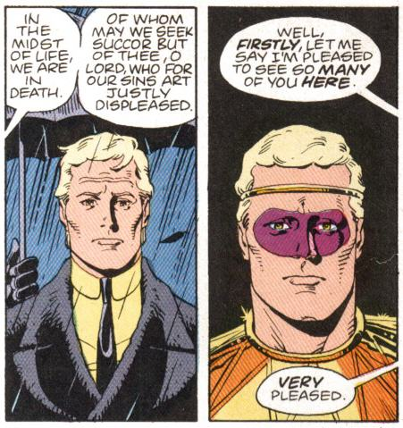
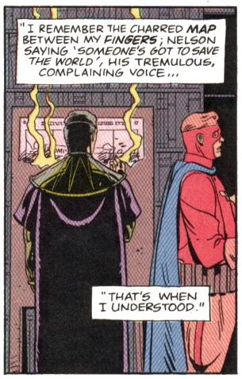
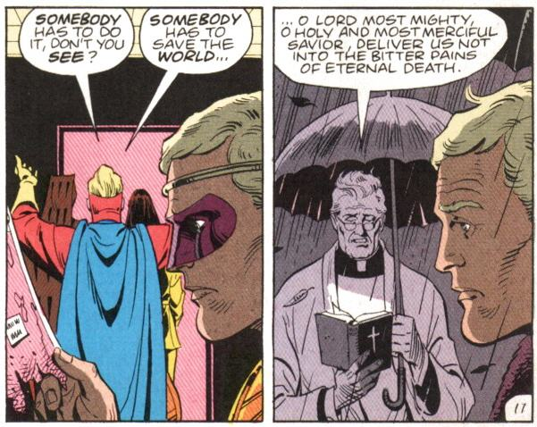
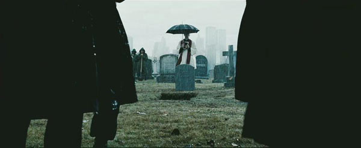

## Watching <em>Watchmen</em>: How unfilmable novels become unwatchable films. - Acephalous

 * Originally located at http://acephalous.typepad.com/acephalous/2009/03/watching-watchmen-how-unfilmable-novels-become-unwatchable-films.html

(*This beast began as [the post I promised last week](http://acephalous.typepad.com/acephalous/2009/03/watchmen-and-the-scene-of-reading-being-a-response-to-anthony-lanes-review-of-zak-snyders-adaptation.html).  Now that [I've played hooky](http://www.motherjones.com/kevin-drum/2009/03/blogs-and-man) all my points about the uniqueness of **Watchmen**'s narrative mode seem more salient in light of their absence from the film.  So I decided to fold my review into the half-composed post.  But for the record I **still** never get around to discussing my larger theory of Manhattan as readerly proxy.*)  

Some books teach you how to read them: *Ulysses*,* Gravity's Rainbow*, *JR*, and *Infinite Jest* spring first to mind.  From a purely formal perspective *Watchmen* belongs in their company.  It does to the conventions of comic narrative what Joyce did to realism, Pynchon did to pulp, Gaddis did to dialogue and Foster Wallace did to sentiment.  All the techniques discussed in the following had been used in comics before—there is nothing new under [the oxen of the sun](http://en.wikipedia.org/wiki/Ulysses_%28novel%29#Episode_14.2C_The_Oxen_of_the_Sun)—but never in the service of creating a new breed of reader.  Consider the following sequence of panels from the funeral of the Comedian:

\ 

The first three panels transition moment-to-moment.  Such transitions slow down the action by forcing the reader to observe actions divided into their constiuent parts.  They typically depict a realization on the part of the character which the author wants the reader to linger over ([for example](http://acephalous.typepad.com/files/oz02.jpg)) or a demonstration of how fast or powerful someone is.  But the "action" that Moore slices into its constiuent parts consists of "listening while standing still."  

For a hack like Mark Millar the [amount of dialogue](http://acephalous.typepad.com/.a/6a00d8341c2df453ef01116893a89f970c-pi) squeezed into the slow zoom of those panels would [stretch credulity](http://acephalous.typepad.com/acephalous/2009/02/thesis-mark-millar-is-why-you-still-feel-guilty-reading-comic-books.html?cid=149623615#comment-149623615).

But Moore is no Millar.  (How better to compel readers to pay attention to a face than four consecutive panels that zoom in on it?)  Moore wants the reader to focus his attention on the expression Ozymandias wears and the pat content of the eulogy.  The payoff of the latter is dialogue-driven and immediate; the former, however, pays off in a way only comics can.  When the moment-to-moment transitions give way to the scene-to-scene transitions in the third and fourth panels the change in Ozymandias's expression is as subtle as it is important:

\ 

As the scene moves from the present to the past the vacant expression Ozymandias wears in the third panel gives way to weariness in the fourth.  Pay attention to the eyes: somehow neither the mask nor the adhesive with which he glued it to his face can hide the bags beneath his eyes in the fourth panel.  The moment observed by the steely eyes in the third panel brims with resignation and despair . . . and yet those eyes reveal nothing but cold resolve.  Whatever flashback the reader witnesses will involve some sort of transformation from the man in the fourth panel into the man in third.  Ozymandias later confirms this suspicion:

\ 

That meeting catalyzed Ozymandias.  It changed him into the man who could do what he eventually did.  While serving witness to the burial of a brutal man, Ozymandias remembers the moment he realized his ends were incommensurate with his means.  And though he recalls his despair in the fourth panel with resolve in the third, remembering the moment in which he decides what he must do brings him no joy:

\ 

The scene-to-scene transition out of the flashback is a mirror image of the one that brought us in.  The memory of the moment he sternly turned to genocide causes a swell of unwanted emotion and his mask cracks.  Seems like juxtaposing the magnitude of the scheme he set in motion and the hardening of heart required to do so saddened him.  His eyes soften once deprived of the contrast the regal purple of his mask provided.  Devoid of the flushed conviction that drove him to this moment, the corners of his lips turn down.  The past is the past and cannot be undone.  Unless you happen to be Dr. Manhattan — about whom more momentarily.  (That odd-looking link allows you to [choose your own adventure](http://acephalous.typepad.com/acephalous/2009/03/dr-manhattan-as-a-figure-of-reader-of-alan-moores-watchmen.html).)  Now to the film.

Zack Snyder's dogged dedication to the panel makes those moments in which his film deviates from the book all the more apparent.  My first (and minor) complaint is that he shoehorned the Twin Towers (formerly located in Lower Manhattan) into what had been [in the novel](http://en.wikipedia.org/wiki/Midtown_Manhattan) a shot of [the Chrysler Building](http://en.wikipedia.org/wiki/Chrysler_Building) in Midtown Manhattan:

\ 

if you can't see the Twin Towers to the right of the priest's umbrella.  I'm not such a stickler for fidelity as to be annoyed by the fact that Snyder buries the Comedian in [Jersey City instead of Weehawkin or Hoboken](http://en.wikipedia.org/wiki/Hudson_County,_New_Jersey#Municipalities).  (The establishing shot puts the Midtown skyline on the left side of the screen, so we must be looking at Manhattan Island from New Jersey instead of Brooklyn.)  But I am bothered by the fact that Snyder *moves the Twin Towers* in order to keep them in-frame both in the establishing shot *and* the long-shot of the priest approaching the grave.  This undue attention to the Towers continues throughout the film.  When Dan Dreiberg first arrives at Adrian Veidt's office, the Towers are clearly visible through the window.  One of the ubiquitous Veidt Industries blimps creeps from the left side of the screen to the right *and is seemingly aimed directly at the Twin Towers*. (Avoiding even the appearance of a collision is likely the reason for [the second continuity error listed here](http://www.imdb.com/title/tt0409459/goofs).)
If Snyder had done something meaningful with 1 and 2 World Trade Center
that would be one thing.  Sticking them in as many shots as possible is
little more than an undignified grasp at an unearned gravitas.  

My second (and more significant) complaint is that for all his literalism, Snyder completely punts the unique formal elements I discussed above. All the transitions that distinguish *Watchmen* from its lessers are gone. For example, during the funeral he cuts from a close-up of Ozymandias (shot straight-on) to the flashback of the inaugural (and only) meeting of the Crimebusters *from the Comedian's perspective*. That they are now called the Watchmen and helmed by Ozymandias instead of Captain Metropolis matters less than the fact that Snyder chucked the original transitions (which focused on mourners engaged in acts of remembrance) in favor of transitions that focused on what the Comedian did.  

Why is this significant?  Because it demonstrates that Snyder never grappled with his source material in formal or structural terms.  The narrative techniques that contributed to his own sense of the book's significance went unrecognized; in their place is the kind of fanboy literalism that compels people to write open letters to Peter Jackson accusing him of [assaulting Tolkien](http://www.subgenius.com/bigfist/FIST2002-1/Movies-TV-Books/X0029_The_lamest_Tolkien_f.html).  Snyder recognized the genius of *Watchmen *but never learned where it originated.  As [Dana noted](http://edgeofthewest.wordpress.com/2009/03/08/watching-watchmen/), the narrative itself is as inherently compelling as [a novel](http://edgeofthewest.wordpress.com/2008/06/16/today-in-history/#comment-12377) about a man who spends the day trying not to think about the affair his wife is having.  Put differently: The experience of viewing *Watchmen* resembles what it would be like to watch an adaptation of *[The Bloomsday Book](http://www.amazon.com/exec/obidos/ASIN/0415138582/diesekoschmar-20)*.

(*Note: I chose to air these complaints because I haven't seen them out there yet.  I could've complained, for example, about the pornographic violence and listless pornography.  Who charges fight scenes with erotic energy but shoots sex scenes as if they were moving diagrams of a V8 engine?  That would be Zack Snyder.  I have many more complaints of this sort, but as you've already read variations of them elsewhere, I see no need to pile on.*)
