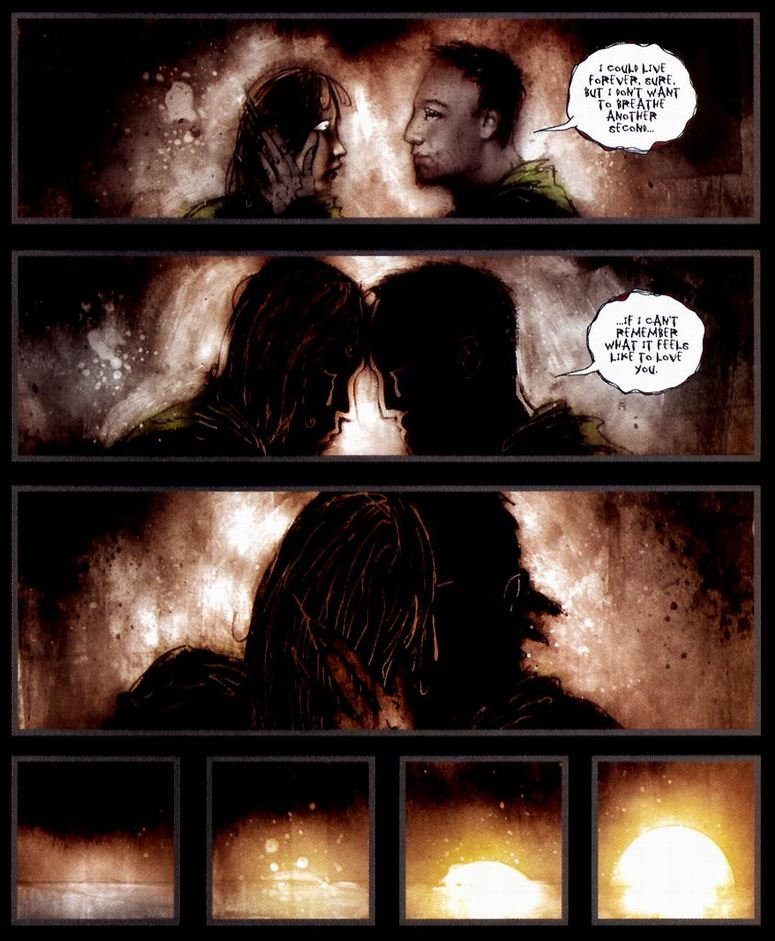
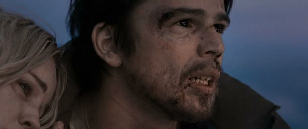
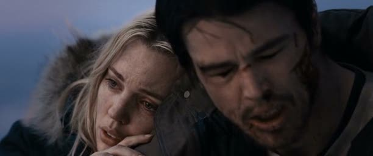
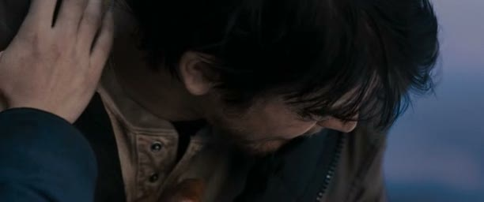
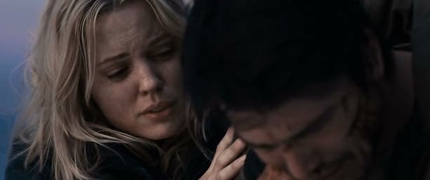
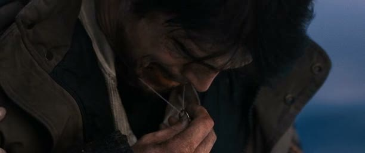
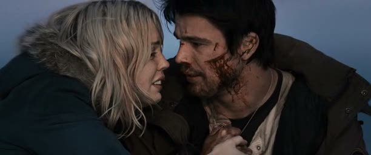
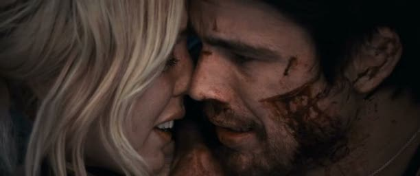
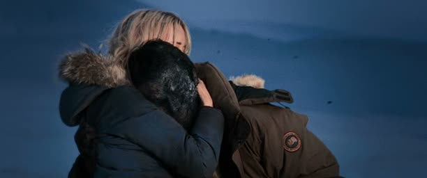

## 30 Days of Night: How to ruin thirty days in a night (by violating the *Dayenu* Principle)

 * Originally located at http://acephalous.typepad.com/acephalous/2011/03/how-to-ruin-thirty-days-in-a-night.html

On the last day I teach in a quarter, I like to leave the students with a memorable example—something so memorable they'll hold the lessons of the class close long after they leave.  For my "[slow horror](http://acephalous.typepad.com/acephalous/2011/01/slow-horror-syllabus.html)" course, I chose to remind them that the purpose of a film is to manipulate its audience, and that this is readily apparent when films falter.  The film in question is the David Slade (of *Twilight: Eclipse* fame) helmed *30 Days of Night*.  But being a good professor, I had them read the Steve Niles and Ben Templesmith books first.  Here are the final panels of the first series, in which—spoilers abound from here on out—the protagonist, Eben, and his wife are sitting on a hill after having toughed out thirty days of Alaskan night in a town, Barrow, overrun by vampires.  It's a clever premise—vampires select a town that far north in order to feast undisturbed for a month—but they're defeated when Eben injects himself with vampire blood, becomes a vampire, and defeats them.  He saved the town, Jesus-style, but now must die, Jesus-style, as the sun's about to rise and turn him to ashes.  Here are the final panels:

\ 

\ 

Notice the quiet beauty here: he dies a dignified death, off-panel, in the arms of a wife who loves him, and then she cries.  It's a fitting end for a man who's sacrificed his life to save the woman and the town he loved, and Niles and Templesmith handle it with class.  Here are the same moments represented in the panels above as David Slade would have them, starting with an establishing shot:

\ 

Moving to a close-up of Eben, played in the film by Josh Hartnett:

\ 

It's not in the book, but I'm not the sort of stickler who wants a literal translation, so whatever.

'

I understand, the camera was a little close to Hartnett and you couldn't see Melissa George's Stella, so the audience would be clueless as to how she felt about her (in the film) ex-husband, who she only realized she'd fallen back in love with after he'd doomed himself to save her:

\ 

I was wrong, apparently the camera wasn't close enough to Hartnett's face to register the fact that he's about to die, so an extreme close-up is very much in order.

\ 

REMINDER: SHE JUST FELL BACK IN LOVE WITH HIM AND DOESN'T WANT HIM TO DIE.

\ 

HE DOESN'T WANT TO DIE EITHER.

\ 

NOR DOES SHE WANT HIM TO.

\ 

NEITHER DOES HE.

\ 

THEY ARE A COUPLE.  Actually, this medium close-up works: it demonstrates their intimacy by placing them both in frame, and by panning out a bit, allows the audience to witness his impending death from a comfortable perspecti—

\ 

THEIR LOVE IS A BEAUTIFUL LOVE.  AND DYING.  THEY HAVE A BEAUTIFUL DYING LOVE.

\ 

Just in case you forgot where we were and what was happening, a re-establishing shot.  Slade doesn't think you're an idiot with the short-term memory of an untrained seal, but he's not sure you aren't either.  At least he'll replicate the quiet, off-panel dignity of Eben's death by having it occur off-screen.

\ 

Or not.

\ 

At least he's dying in peace, on the shoulder of the woman he loves.

\ 

Or not.  

\ 

He looks like he's dead, but since the audience hasn't seen a vampire die via sunlight in the film, it'd be best to get a—

\ 

—close-up.  He is very dead.  But where did he die?  I thought I saw a string and can't remember anymore.

\ 

Alaska, I remember now, and the character who just died Jesus-styled just died.  Wait—I'm confused.  Who am I supposed to sympathize with now?

\ 

The grieving widow, I remember now.  But I wouldn't have, were it not for the extreme close-up and frontality.  (And just in case I forgot someone just died, Slade was kind enough to leave Eben's crusted head in-frame.)

Even without talking about the diegetic (Eben's scream) and non-diegetic (the thumping score) sound, this scene violates what I call the *[Dayenu](http://en.wikipedia.org/wiki/Dayenu)* Principle.  For those of you who aren't Jewish, "*Dayenu*" roughly translates as "it would have been enough," and we sing this song on [Passover](http://en.wikipedia.org/wiki/Passover), the holiday whose events it roughly narrates.  (For example: "If He had just brought us out Egypt, it would have been enough.  If He had just executed the Egyptians, it would have been," etc.)  The point being, the *Dayenu* Principle refers to those moments in a film in which a director beats his audience over the head with a meaning-stick so viciously that its members stumble away stoned with pain.  So, as to the above:

If Slade had just used a medium shot of Eben and Stella, it would have been enough; if he had only used two establishing shots, it would have been enough; if had merely used one close-up to drum up sympathy via frontality, it would have been enough; etc.  
In short, instead of the quiet, dignified death in the book—which is neither more nor less inherently moving for its quiet dignity, unless you're talking about its effectiveness—the audience of the film is treated to a beating at the hands of a man who is, in visual rhetorical terms, YELLING YOU THE EMOTIONAL RESPONSE YOU WILL BE HAVING.  THERE IS NO *DAYENU*.  THERE IS CAN BE NO ENOUGH.  Add in an image of me thumping on the table with my meaning-stick and you pretty much have my last day of class.
