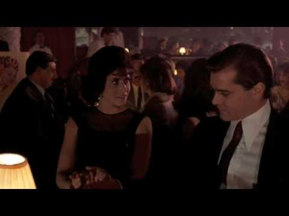
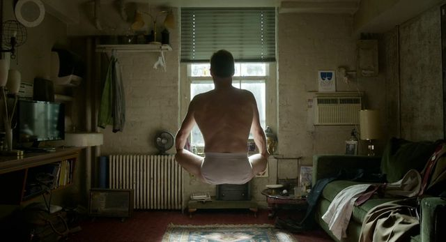
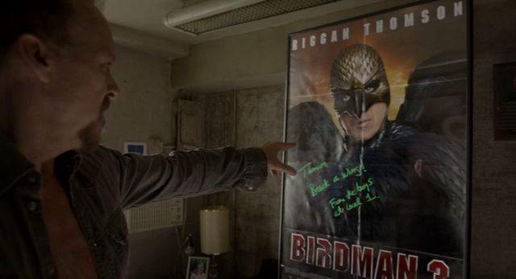

## Birdman: How reality becomes a function of film technique in Birdman 

 * Originally located at http://www.avclub.com/article/how-reality-becomes-function-film-technique-birdma-215503

In the comments of [my previous column](http://www.avclub.com/article/how-perfect-shot-can-ruin-film-213906), I asked whether there were any particular aspects of modern cinema that you would like addressed. A number of you chimed in with "long takes." I’m more than happy to oblige—especially since the request coincided with the DVD release of the newly minted "Best Picture" *Birdman*, a film whose central cinematic conceit is that it was filmed in a single take.

It wasn’t—and if I wanted to be a pedantic bore I’d point out the 14 places in which you can see the seams director Alejandro Gonzalez Iñárritu, cinematographer Emmanuel Lubezki, and editors Douglas Crise and Stephen Mirrione so deftly hid. But before praising these talented individuals for their almost two-hour-long high-wire act, the context in which they accomplished this feat needs a little fleshing out.

As David Bordwell has pointed out, the "average shot length," or "ASL," in American cinema has been getting [increasingly shorter](http://www.cinemetrics.lv/bordwell.php), such that most Hollywood films now have an ASL between 4 and 6 seconds. Most shots are so short that even films containing notoriously long takes—like Martin Scorsese’s *[GoodFellas](/review/martin-scorsese-collection-11309)*—clock in with an ASL around [7 seconds](http://www.cinemetrics.lv/database.php?clear). All of these short takes make a film "feel faster," because they constantly present the viewer with new information, such as when a director uses a reaction shot to inform viewers how a character is processing what he or she just heard or saw.

If Person A says "I love you" in a medium close-up and the director cuts to a medium close-up of Person B grimacing, the audience immediately knows how to interpret that reaction because the director’s editing technique signals, "This is a reaction to what was said." But if the director filmed the same scene with a static medium two-shot of Person A and Person B sitting on a park bench, the audience would be forced to decide whether Person B’s grimace was a reaction to Person A’s statement or to something else, without the short-take shorthand to do thinking for them. In all probability, the meaning of the grimace hasn’t changed—but the director is no longer telegraphing the intended interpretation as forcefully as the reaction shot does.

Which is my own shorthand way of saying that the longer a take is, the more burdened the audience—especially if its members were raised on the conventions of contemporary American cinema—is by the task of interpretation. This becomes apparent as soon as you try to describe what the director of the above hypothetical scene meant to communicate versus what Scorsese wanted the audience to understand about Henry Hill in the Copacabana shot in *Goodfellas*:

\ 

First, Hill is seen tipping the man who opens the back doors for him. Then he greets Gino and tells a couple necking in the hall that "every time I come here, every time you two" are making out. He then demonstrates that he is the kind of person with all-access, familiar with scenes of Asian men arguing in kitchens, as well as beloved by the white staffers and chefs in the back. When he finally makes it into the dining room proper, he gets his own table pulled out of nowhere, again underlying his power—need I continue?

The shot does but I think the point is made—Scorsese allows these various impressions of Hill to gradually accrue. The audience is as overwhelmed as its proxy, Karen, who has been whisked into the club and off her feet. The impression of Hill’s importance is a function of the length of the take—partly because Hill is the central character in it. The mere fact that Scorsese devotes this much uncut screen time to a single character impresses Hill’s importance on the audience. We don’t need to cut to the reaction of Person B, because as Hill wends into the restaurant because there is no Person B of sufficient importance to stop the shot for.

This is where the inherent tension in the contemporary long take comes from: The director forgoes conventional editing to telegraph intended meaning, instead employing a technique that urges the audience to consider the subject of the shot to be increasingly meaningful. 

The long take also allows directors to use the standard magician’s ruse of having "nothing up his sleeve," because the absence of cuts appears to indicate that there is neither time nor opportunity to insert special effects in a shot. Obviously this isn’t true—everyone unfortunately remembers *Cloverfield*—but the suggestion persists that a long take can’t be manipulated because some things can’t be faked in real-time.

Which is why it’s interesting that the opening shot of *Birdman*—before the ASL has even been established—consists of Riggan (Michael Keaton) performing the oldest trick in the magician’s handbook: [levitation](https://www.youtube.com/watch?v=ZwvYkRzpq4g).

\ 

Since Riggan is hearing the voice he used 20 years ago while playing the Birdman character, the scene suggests that he either possesses the powers of the heroic alter-ego currently haunting him, or he is experiencing a psychotic break that has him hearing voices and believes, mistakenly, that he is actually levitating. 
As the [illusory single take](http://www.davidbordwell.net/blog/2015/02/23/birdman-following-riggans-orders/) progresses, Riggan’s psychotic break seems to become increasingly apparent. It also appears that Gonzalez Iñárritu is allowing the non-diegetic "Birdman" voice inside Riggan’s head to infiltrate a film that is otherwise, thanks to its ASL, oppressively realistic. And then:

\ 

This long take might be a bit of a ruse by Gonzalez Iñárritu, designed to convince the audience that Riggan isn’t having a psychotic break, but actually has the powers of the character he played—which leaves the viewers stranded at the same interpretive crossroads they were at when the film began.

Of course, appearing to make objects move telekinetically is another old magician’s trick. But unlike the earlier shot, in which Riggan could have set up the levitation contraption before the movie began, this telekinesis happens in the moment. The length of this take, then, makes a strong argument. If Riggan has these powers, then the film exists in a world unlike our own, and is a magical realist film in the mold of Kurt Busiek’s *[Astro City](/article/exclusive-dc-preview-astro-city-14-takes-trip-supe-207995)* comic. If he doesn’t, this film’s ASL and accompanying documentary style deliberately betray its content. Because even though it appears as if the camera’s always *following* Riggan, its perspective is actually Riggan’s own—"documenting" his dissociative state. So when he appears to use telekinesis to slam the framed poster into the wall, the audience is actually seeing a fantasy version, from inside Riggan’s own head, of him tearing the poster down from the wall and throwing it. What better way to film a dissociative state, after all, then to do so from outside of the head-space of the individual in it?

Because the film’s central conceit is that it was shot in a single long take, the audience doesn’t have much time to think about such matters. The impression of Riggan’s complex character is created so breathlessly, it is difficult to answer a question as simple as, "Is this actually happening?" 

Film can be deceptive this way—anyone who tells you they know what is "really" going on as *[Blow-Up](http://www.avclub.com/review/blow-up-11550)* ends [is a liar](http://acephalous.typepad.com/acephalous/2011/01/the-disturbing-wrongness-of-antonionis-blowup.html)—but in *Birdman*'s case, Gonzalez Iñárritu’s decision to shoot it as a long take magnifies that difficulty. By the time the audience is confronted by a scene like the one pictured below, it has become nearly impossible to determine what relation the image on the screen bears to reality.

\ 

However, because of the long take and the intellectual energy required to keep up, everyone who has seen the film will have a strong opinion about interpretation of this scene’s reality: They will say that anyone who disagrees with them or their interpretation of the film’s final moments is not merely wrong, but has missed the point entirely.

To my mind, the strength of the viewers’ conviction is nothing more than a function of Gonzalez Iñárritu’s decision to film it as if it were a single long take. Feel free to disagree vehemently in the comments—just remember where that vehemence comes from.
