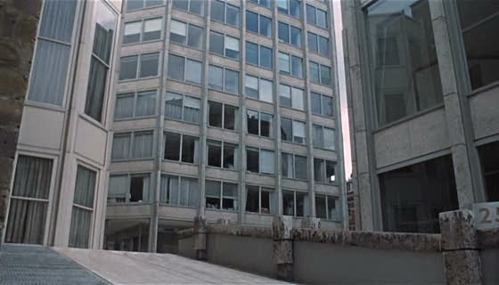
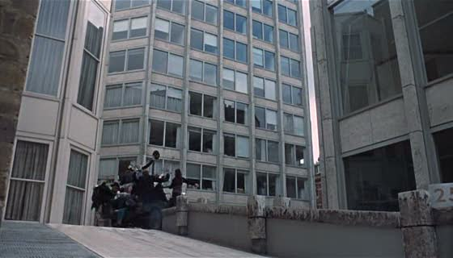
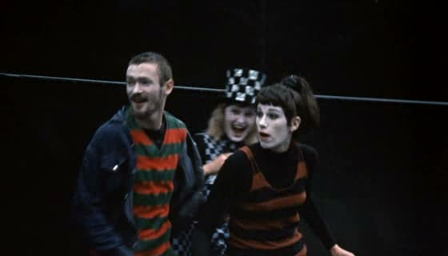
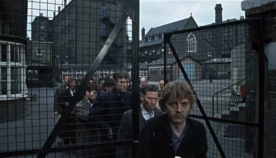
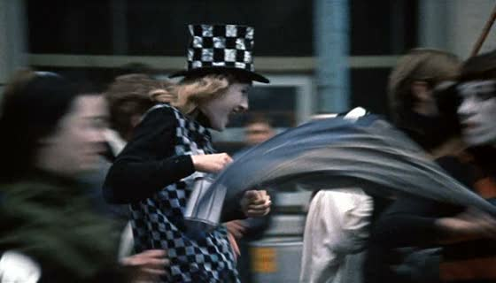

## Blow Up: Blowing up slowly.

 * Originally located at http://acephalous.typepad.com/acephalous/2011/01/blowing-up-slowly.html

I put the word "slow" in [the title of the course with the unsatisfactory title](http://acephalous.typepad.com/acephalous/2011/01/slow-horror-syllabus.html) because it's defining feature of menace: if something is stationary, it's unthreatening; if something is celeritous, it's frightening.  For something to be menacing requires pacing.  Tension does not "build" in films: it must be built.  Moreover, like all well-built things, its construction must be deliberate and methodical, and those qualities translate in film as a slow pace.  I'm employing "building" as a metaphor here because 1) everyone knows about Rome, but more importantly, 2) it allows me segue neatly into a conversation about the relationship of space to pace (about which more shortly).  All of which is only to say that because I'm claiming slowness to be an essential quality of a mode of horror, I need to quantify it; that is, I need to define what it means, mechanically, for a film to be slow.  Where better to turn for such a definition than to a filmmaker universally acclaimed for that quality?

So then, why is Michelangelo Antonioni's *Blowup* considered such a slow film?
One element of slowness is going to be **shot length**—or "[average shot length](http://en.wikipedia.org/wiki/Average_shot_length#Duration)," to be more precise.  Generally speaking, a film comprised of a single [long take](http://en.wikipedia.org/wiki/Long_take) will feel longer to an audience because it is not being provided with new and novel visual information, whereas a film comprised of countless rapid cuts will provide so much new and novel information that the audience feels it lacks the time required to process it, thereby making the experience of the film seem shorter in duration.  According to Yuri Tsivian's [cinemetric database](http://www.cinemetrics.lv/database.php?sort=asl), the average shot length in *Blowup* is between 10.7 and 11 seconds long; however, that number is neither representative of Antonioni's larger corpus (*e.g. La Signora Senza Camelie* clocks in at 55.6 seconds) nor the film itself (many of the quick shots responsible for that time are between different photographs being compared).  I would quantify that mathematically, but my doctorate is in English and the bylaws prohibit me from doing so.

Another element of filmic slowness is the use of multiple **[establishing shots](http://classes.yale.edu/film-analysis/htmfiles/editing.htm#51530)**, which in aggregate have the same effect on pacing as **[aspect-to-aspect panel transitions](http://acephalous.typepad.com/.a/6a00d8341c2df453ef013487c57069970c-500wi)** in comics; that is, by presenting multiple perspectives on the same very large tableau, the audience can't simply assume that the establishing shot is establishing a location, and must perforce start to think that the sequence is attempting to define a mood.  In *Blowup*, these shots are tied, albeit loosely at first, to the plot.  So we have this building:

\ 

Which is about to be invaded by mimes:

\ 

The mimes tool around the plaza, then exit their vehicle and run around like mad:

\ 

In short, the establishing shot, which is meant to show "the spatial relations among the important figures, objects, and setting in a scene," is instead invaded for a moment and then exited.  It establishes, then, not the scene but the ambivalent *attitude* of the characters to the "important figures, objects, and setting in [the] scene."  These mimes are free agents who can't be contained by the frame.  The same, however, cannot be said of the people in the next establishing shot:

\ 

Ignore the presence of Thomas for moment and consider the scale of this **[extreme long shot](http://classes.yale.edu/film-analysis/htmfiles/cinematography.htm#48035)**: the people in it are visually dominated by the factory behind them, by which I mean they only occupy the bottom half of the frame and are fenced in and are walking in a strangely staged manner.  They are, in short, *contained*. Compare that to the earlier shot of the mimes gone wild:

\ 

Antonioni shoots the herd of mimes in a **[medium closeup](http://classes.yale.edu/film-analysis/htmfiles/cinematography.htm#48047)**, and even though the faces of the factory workers are as clearly articulated as those in this shot, the lack of a dominating background provides the impression that these mimes are more uncontained than the men for whom Monday signals a welcome to the working week.

Note that while the mimes signal energy and the workers its dissipation, both groups interact with the establishing shots in unconventional ways that force the audience to have to think about what is in the frame.  Conventionally, the introduction of new information speeds up the experience of watching the film; here, however, it does precisely the opposite because the average shot length in the opening minutes of the film is 48 seconds.  In other words, despite all this action, these shots seem inert for the same reason American audiences find televised soccer dull: the distance and framing of the shot belie the movement contained therein.  

That tension is significant, obviously, to any film about a photographer ...

... and much more later, as this represents barely a fifth of my apparently-in-need-of-much-revision-lesson-plan for tomorrow.
