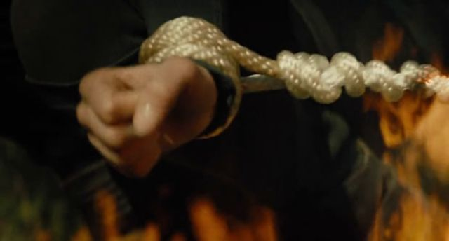

## Divergent: How the perfect shot can ruin a film

 * Originally located at http://www.avclub.com/article/how-perfect-shot-can-ruin-film-213906

*[Divergent](http://www.avclub.com/review/while-it-improves-book-divergent-remains-hunger-ga-202417)* may be the worst film released in the past decade—I found Kirk Cameron's *[Saving Christmas](http://www.avclub.com/review/saving-christmas-solemn-duty-inept-kirk-cameron-ve-211866)* to be [more entertaining](http://www.lawyersgunsmoneyblog.com/2014/12/intrepid-journalist-sek-experiences-growing-pains) — but that doesn't mean its awfulness can't be instructive. Most terrible films are simply terrible, but *Divergent* is different. Its horribleness is the result of director Neil Burger's shamelessly successful pursuit of the wrong kind of perfection. Every shot is the right one. Every angle evokes the appropriate emotion. Every symbol is eminently symbolic.

Consider this shot from the beginning of the film, in which actress Shailene Woodley's character, Tris, is watching a member of the Erudite class bully a member of her Abnegation class:

\ 

Because class—or faction—is such a central issue in the film, director Burger stuffs the shot full of other stiffs, as members of her group are called, to make Tris appropriately anonymous. However, because Tris is clearly the heroic figure whose individuality will transcend the class logic on which the film is predicated, she occupies the central area of the frame as the only person in the shot in focus. She is still unaware of her destiny at this juncture of the film, so instead of making confident eye contact with the camera before performing a defiant act of individuality, she bottles up her frustration and stares angrily at something frame-left.

If I were the head of a studio trying to create a dystopian franchise that appealed to the critical youth demographic, this is *exactly* how I would want this scene shot. The kind of resentment Burger depicts here belongs less to an overly contrived dystopian future than to a high school drama. The kind of belonging *Divergent* traffics in has nothing to do with class struggle—Tris wants to run wild with the jocks in Dauntless, but she was born to host bake sales with the rest of the stiffs in Abnegation. So when Tris must choose which faction she will belong to, Burger's shot is one-part high school assembly, one-part graduation ceremony:

\ 

It is not enough for an individual to choose their own destiny: They must do so on a stage in front of their color-coded peers and parents. But deciding which faction to align with is a deeply personal decision, which requires extreme close-ups on people wearing their thinking faces:

\ 

What decision will Tris make? As evidenced by the fact that her face fails to occupy the central area of the frame, not even she knows at this point. The shot informs the audience that she hasn't decided yet. Nor have her fingers:

\ 

Even though these shots are separated by a cut to some wailing Erudite parents, director Burger communicates that Tris is seeking an answer in her hands. Will they hand out food to the factionless? Or will they help her in her quest to join Dauntless, whose motto is "He who controls parkour, controls the world"?

Lest you think this shot of her hands is incidentally symbolic, when Tris steps in front of all her classmates and their parents to choose her faction, she must slice some blood from her hand to signal her decision:

\ 

Will her bleeding hand choose her faction—whose symbol is not the least bit symbolic? Of course it won't. Burger makes that clear by emptying the center of the frame and creating a distance between her bleeding hand and her faction's symbolic one. Her hand is destined for a life of running and jumping and climbing.

\ 

Look at her hands in the center of the screen as she literally climbs the first of many obstacles Dauntless will literally place not only in her way, but in the way of her friends:

\ 

Whose hands are in this extreme close-up? It doesn't really matter, so long as the audience knows that this shot is obviously representative of life in Dauntless, where it's every hand for itself. Or is it?

\ 

After a brutal beating in hand-to-hand fight training, Tris is late for a simulated combat mission. She jumps from the hospital bed and chases down the train carrying other Dauntless members to the exercise, but she's not going to make it without the aid of a helping hand.

I know what you're saying: "But Scott, I thought helping hands like the ones in the shot above are the symbol of Abnegation?" Oh, they are, but it appears that with this shot Burger is attempting to signal that there is something *different *both about Tris and the mysterious man named Four who offers her assistance here.

This shot of Tris being helped on the train is the *perfect* encapsulation of the film up to this point. She's already been told that she's "divergent" — meaning that she possesses traits that inherently only belong to each of the different factions. The fact that this Four person belongs to clan Dauntless and still helps Tris signals that he might be more than the mentor/love-interest function he served up to this point. All of these hand-shots are imbued with symbolic meaning—especially when they prominently appear in dream sequences like the one Tris is forced to undergo before officially joining Dauntless:

\ 

What makes her special? I don't know, but it is *definitely* symbolized by hands. All these hand-shots come from a mind more concerned with branding a film than building a complex depiction of a futuristic society that reveals to the audience something important about its own. It is as if some man in a gray flannel suit instructed a writer to create a visual motif that would resonate with teen audiences and Burger responded by saying, "What about hands? *Everybody* has hands."

And he would have a point. Most everyone who watches *Divergent* has a deep and abiding connection with their hands. But that doesn't make the connection meaningful: What makes it meaningful is the way Burger layers these visual references to hands as the film progresses. After a couple of faction-traitors attempt to murder Tris, the first shot of her in her rescuer Four's apartment is this:

\ 

When Four allows Tris to view his nightmare — don't ask

\ 

If I appear to be belaboring a point — and I am — it is because the film does. I haven't read the novels, so I don't know whether this one-minded focus on the amorphous symbolism of hands is present there or whether Burger introduces it himself. But I don't need to have read the novels to recognize that these shots resonate throughout the film in a way that is perfect to the point of meaninglessness. They signal that someone had one good idea and decided to use it again and again and again because they have no other. The problem is that while these shots may be perfectly executed — they're also perfectly predictable.

So when Tris takes her final nightmare-test — again don't ask

\ 

How will she escape?

\ 

And perhaps most tellingly

\ 

*Please* tell me you're not surprised.
