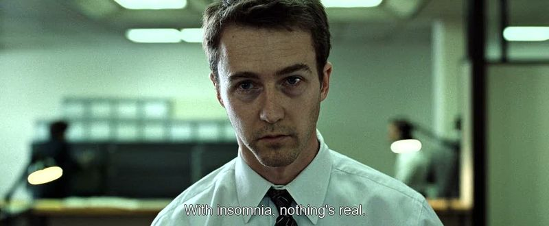
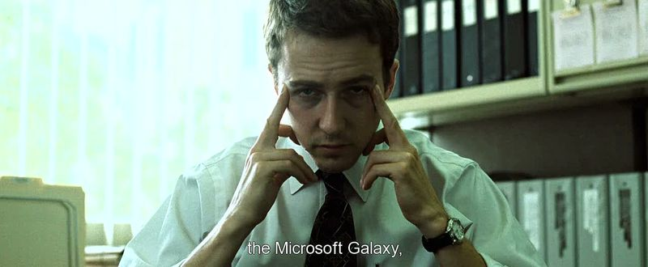
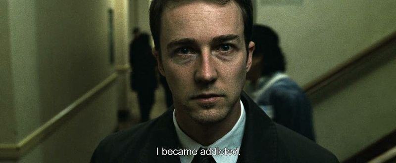
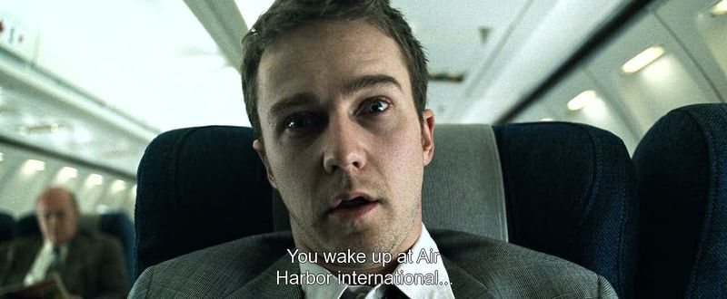

## Fight Club: I will make you love me.

 * Originally published at http://acephalous.typepad.com/acephalous/2011/01/fight-club.html

The first fifteen minutes of *Fight Club* strongly suggest to its audience that they're about to watch a much better film than the one they're actually watching—the critique of material culture has yet to embrace to the juvenile punk resistence of the novel and the depiction of insomnia is still pointed enough to be trenchant—so when I decided to teach it in my "[Confessional Narratives](http://acephalous.typepad.com/acephalous/2010/07/fall-comics-courses-american-manga-and-coming-of-age.html)" course, focusing almost entirely on the opening sequences was essentially a given.  The problem is that David Fincher's direction is as busy as it is effective, if only because representing a state of fevered distraction tends to look a bit frenetic.  (By my count, there are 659 cuts in the portion of the film I'm going to focus on, which means that any close reading of it will either be abridged or incomplete, depending on how trustworthy you think me.)  I'll attempt to discuss the pace of the editing shortly, but for now I want to discuss why we even care.

There are two lines of thought being represented in the first fifteen minutes of the film: the first is that the audience is being introduced to an unlikeable sociopath; the second is that the selfsame audience is being convinced to like him.  How does that work?  Via relentless [frontality](http://classes.yale.edu/film-analysis/htmfiles/mise-en-scene.htm#54569): when the audience stares into the void behind Edward Norton's eyes long enough, the void stares back until it becomes a welcoming presence.  To wit:

\ 

\ 

\ 

\ 

Note that the fourth wall is never actually being broken here: in the first image Norton is staring into space; the second, at his boss; the third, at a list of group meetings; and the fourth, into space again.  I point this out because frontality conventionally works to distance the audience from the characters by pulling the characters out of the diegetic world of the film and into that of the audience.  Here, however, Fincher is doing the exact opposite: he's enforcing an intimacy between the audience and a character it might not otherwise sympathize with (and rightly so).  The audience identifies with Norton because it has stared into the void of his eyes and recognizes in them something inelegant and desperately wanting; and it does so because Fincher has provided them with no other choice.  The film simply doesn't work if the sympathetic identification isn't immediately established.

Hence, the frontality.
