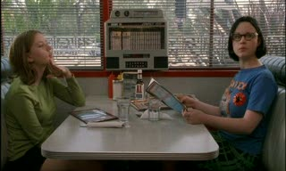

## Ghost World: Enid and Rebecca aren't winning Ghost World

 * Originally published at  http://acephalous.typepad.com/acephalous/2011/03/ghost-world-daniel-clowes-terry-zwigof-enid-rebecca.html

Given that I already related my attempt to make [the final day of my "Slow Horror" course memorable](http://www.lawyersgunsmoneyblog.com/2011/03/how-to-ruin-thirty-days-in-a-night-by-violating-the-dayenu-principle), it only makes sense to do the same for the "[Confessional Narratives](http://acephalous.typepad.com/acephalous/2011/01/confessional-narratives-syllabus.html)"  The final works we studied were the [print](http://www.amazon.com/exec/obidos/ASIN/1560974273/diesekoschmar-20) and [film](http://www.amazon.com/exec/obidos/ASIN/B00005T30L/diesekoschmar-20) versions of Daniel Clowes' *Ghost World*, both of which [I hate with a pre-critical vicerality](http://acephalous.typepad.com/acephalous/2010/05/daniel-clowes-is-not-per-his-insistence-one-of-those-comic-book-readers.html) that—to pat myself on the back for being responsible—doesn't prevent me from acknowledging their importance and teaching them anyway.  That said, I find the book far more unlikeable than the film.  Consider the scene in which Enid and Rebecca first meet the waiter they dub "Weird Al" in the novel:

\ 

\ 

It's not that they mock the decor of a restaurant they patronized solely to patronize, but the manner in which they treat Allen.  Enid responds to his "Hi! My name is Allen" with "Hi, Al!"  If he had wanted to be called "Al," presumably he would have introduced himself as such.  Enid renames him on the spot, and without getting all pop-philosophical about the significance of the act of naming something, her behavior here is indicative of her general belief that she's superior to people who look and are employed like him.  But Rebecca's response is even more indecorous: the insult that had been implicit in Enid's renaming is explicit in Rebecca's question, "Can we call you 'Weird Al'?"  That she asks whether "we" can call him "Weird Al" is significant, because throughout the book she's only emboldened to behave in this manner when Enid initiates such encounters.  In short, then, Enid's culpable both for her own statement and for Rebecca's, because Enid's responsible for the dynamic that makes Rebecca feel perpetually, if not always consciously, egged-on.  

At this point in the analysis, it's possible for readers to attribute the pair reveling in their unearned sense of superiority to an authorial critique, *i.e. *that Clowes is representing their reprehensible behavior, not endorsing it.  But as I noted in [my earlier post](http://acephalous.typepad.com/acephalous/2010/05/daniel-clowes-is-not-per-his-insistence-one-of-those-comic-book-readers.html), Clowes' own—albeit earned—sense of superiority infects most of his work, in this case in the fifth panel above.  Despite my formalist tendencies, I don't normally place too much stock into matters like the placement of speech bubbles, but between teaching this and Alison Bechdel's *[Fun Home](http://www.amazon.com/exec/obidos/ASIN/0618871713/diesekoschmar-20)*, I'm compelled to ditch my insistence that where the text is placed on a page matters less than whether readers can quickly ascertain the manner in which it was intended to flow.  

So, for example, in the second panel above Enid's conversation-stopping "Whatever" is separated from the mock-Fifties banter not only for the pragmatic reason that it wouldn't fit, but because it's meant to indicate a distinct break in the established conversational rhythm.  Clowes could've drawn the panel in a manner that placed it immediately beneath Rebecca's question, but that would suggested that Enid responded immediately; instead, placing it beneath the table suggests that she paused a beat before humiliating Rebecca for playing the language game Enid herself had initiated.

Apply the same logic of placement to the fifth panel's "You loser!" and you have *a speech bubble that doubles as a caption*, in effect branding the server what the pair's entitled renaming of him already indicated they thought him to be.  The difference here is that it's not Enid who chooses where her remarks are placed on the page, but Clowes, and if Enid's partly culpable for Rebecca's question, Clowes is wholly guilty for Enid's "captioning" of the server here.

Of course, Clowes can only accomplish this little feat if Enid and Rebecca frame the server as they do in the panels above.  His occupation of the central area of the frame is fundamentally ironic: he's not a person so much as a function of a restaurant they're only there to mock.  They (and Clowes) can dehumanize him because, as a "loser" who sacrificed his social mobility for a regular paycheck, he doesn't number among the human race anyway.

Now, consider the same scene in the film.  It opens with a pan-out from a close-up of a radio playing decidedly non-Fifties music to a medium shot of Rebecca and Enid seated in the booth:

\ 

\ 

The purpose of the panning out from the radio is to force the audience to pay attention to the diegetic sound, but the decision's immediately rendered redundant by the dialogue, as Rebecca opens the conversation by asking "Who could forget this memorable hit from the Fifties, huh?"  If this were a comic panel, the word-picture relation would be [duo-specific](http://acephalous.typepad.com/.a/6a00d8341c2df453ef0147e1ae93c3970b), which if you remember your McCloud (or clicked on that link) is used primarily in [children's literature](http://www.pan-tex.net/usr/j/julie/30prep2.jpeg).  In addition to being redundant, then, it's also condescending, the equivalent of director Terry Zwigof insisting that his audience won't understand the importance of the sequence unless he does everything twice.  Zwigof then cuts to a point-of-view shot of an approaching Allan:

\ 

You know it's a point-of-view shot because part of the booth is evident, but significantly, it's from Rebecca's point-of-view, and since Rebecca spots him first, when Zwigoff cuts back to the booth:

\ 

It's Rebecca who gets what had been Enid's line in the book: "Check out that waiter's awesome 'Fifties' hair-do."  In a work as predicated on the dynamic between two characters as both the book and film of *Ghost World* are, switching who initiates a particular conversation is bound to have significant consequences, and it does: Rebecca becomes more disagreeable.  But the obverse is also true: Enid becomes more likeable, which is significant because very few people would be able to sympathize with her if she behaved in the film as she does in the book. \*  Given that the majority of the film is focalized through Enid's perspective, creating and sustaining a sympathetic identification with her is critical to the film's aesthetic and financial success.  Zwigof's staging of the remainder of the scene bears my point out.  When Allen walks up, he's not framed by the young woman, but occupies the entire frame of a medium close-up:

\ 

The strong [frontality](http://classes.yale.edu/film-analysis/htmfiles/mise-en-scene.htm#54569) here—as well as the fact that he directly addresses the camera—would seem to indicate that Zwigof wants to create a bound between Allen and the audience.  Not including Enid and Rebecca in shot creates a distance between the three that continues when the camera reverses back to the booth:

\ 

When Enid greets him as "Al" and Rebecca asks whether they can call him "Weird Al," the audience can no longer see his face.  That is, instead of the triangle in the comic that make it clear that they are insulting him to his face, in the film their insults land, such as it were, on an aproned ass.  When the camera cuts back Allen, it returns to the frontal medium close-up:

\ 

Allen is being shot as a sympathetic—albeit emotionally unresponsive—character again, and Enid and Rebecca are not as formally connected to their insults as they were in when all three occupied the same panel and the pair were literally connected to their words by their speech bubbles.  In short, staging this as a series of reverse shots creates a disconnect between the pair and the object of their insults, which allows all three to remain more sympathetic.  The kicker?
Zwigof ditches the "You loser!" line entirely. \*\*

\* Without pressing the point, casting is also part of the rhetorical design of a film, so it bears mentioning that Scarlett Johansson is also better suited to carrying that line.  Her voice is warmer and her appearance more conventional, so audiences are more inclined to be forgiving of any attitudinal shortcomings.

\*\* This omission could be because the effect only works in comics: Enid's clearly conversing with Rebecca when she says "You loser!" but because the medium allows words to hang in the air, the statement can double as a caption.  The same effect would be difficult to replicate in film.
