## The Dark Knight: Lesson Planning 101: How to teach film responsibly in a composition class

 * Originally published at http://acephalous.typepad.com/acephalous/2009/01/dark-knight-scene-analysis.html

Lest you think I'm publishing a long introduction-to-film-studies-type scene analysis for no reason, I had a few English people ask me how I taught film after [I posted my syllabus](http://www.thevalve.org/go/valve/article/my/) last quarter.  So I thought as long as I'm doing it anyway, I might could help a few folk out.  I'm not an expert in film theory, so if you're looking for something along those lines, I suggest you head over to [yonder blog](http://chutry.wordherders.net/wp/) and consult its illustrious roll.  But if you want a workmanlike approach to teaching basic film vocabulary in a composition class, you could do worse.  (Albeit not much.)

Because I'm one of those cultural studies loons who believe that popular means culturally significant, the film I'm teaching is *The Dark Knight*.  The scene I've tasked my students to analyze begins 1 hour and 24 minutes into the film.  My lesson plan begins after the break:

Before I begin, one point to keep in mind: Nolan's camera is always moving in this scene.  He employs the conversational [shot/reverse shot](http://classes.yale.edu/film-analysis/htmfiles/editing.htm#51531) pattern and [edits for continuity](http://classes.yale.edu/film-analysis/htmfiles/editing.htm#22186), but instead of a static over-the-shoulder shot, Nolan's restless camera slowly circles to the left or right (depending on whose back is to the audience), such that it seems as if Batman and the Joker's heads are on a collision course.  More on that in a moment.  Let me set the scene:

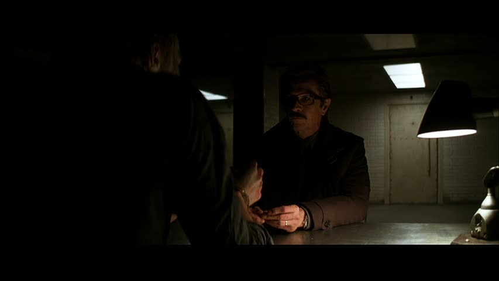\ 

We begin with [low-key lighting](http://classes.yale.edu/film-analysis/htmfiles/mise-en-scene.htm#140506) from two visible sources: the lamp on the desk and the lone lit florescent behind Gordon.  To the extent that it even is illuminated, the Joker's face is lit from below:

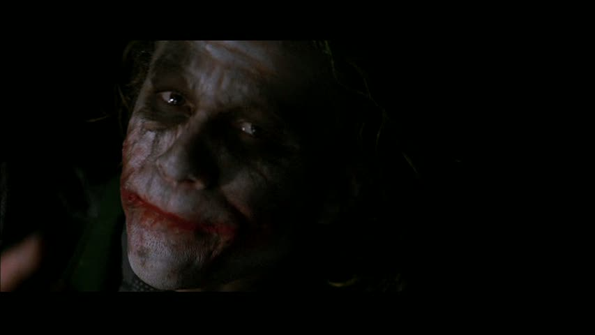\ 

The darkness behind him creates an [off-screen space](http://classes.yale.edu/film-analysis/htmfiles/mise-en-scene.htm#58416) that's foreboding, but ultimately [shallow](http://classes.yale.edu/film-analysis/htmfiles/mise-en-scene.htm#32777).  In the shot above, the Joker asks whether he's about to be treated to "[t]he good cop, bad cop routine?"  

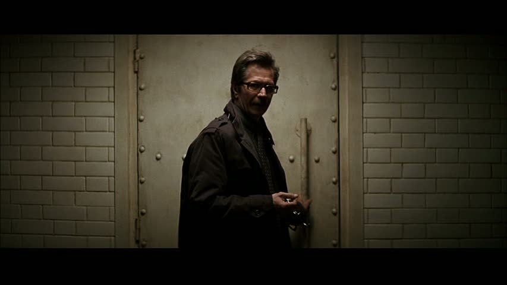\ 

To which Gordon responds: "Not exactly."  Note how Nolan frames the scene: Gordon within the door; the door within the walls; the walls by the four corner shadows reminiscent of the initial masking of an [iris-out](http://classes.yale.edu/film-analysis/htmfiles/editing.htm#51528).  All the compositional elements contribute to the sense of entrapment.  But they do so ironically: Gordon is about to open that door.  Cut back to the Joker:

\ 

Nolan places him on the left side of the screen in a [medium close-up](http://classes.yale.edu/film-analysis/htmfiles/cinematography.htm#48047).  As the Joker leans back, Nolan [reframes](http://classes.yale.edu/film-analysis/htmfiles/cinematography.htm#48018) while zooming in for a [close-up](http://classes.yale.edu/film-analysis/htmfiles/cinematography.htm#48048):

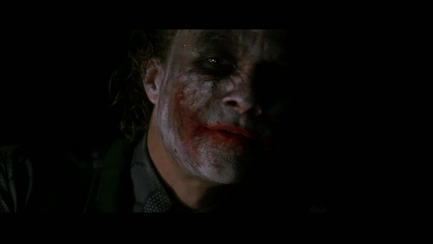\ 

As the camera creeps closer the Joker seems to pick up more of the ambient light from the table lamp.  Nolan then deepens the shot without refocusing by having someone turn on the rest of the florescent lights:

\ 

Nolan deepens the dark shallow space to reveal what we didn't know the [diagesis](http://classes.yale.edu/film-analysis/htmfiles/basic-terms.htm#25890) contained: the Batman.  The restricted [depth of field](http://classes.yale.edu/film-analysis/htmfiles/cinematography.htm#38662) renders the Batman as a blur, but fast things are blurry and the Batman is very fast.  (Emphasizing the blurriness likely accounts for why Nolan chose not to use [racking focus](http://classes.yale.edu/film-analysis/htmfiles/cinematography.htm#53908) here.)  The camera remains steady as both characters momentarily exit the frame:

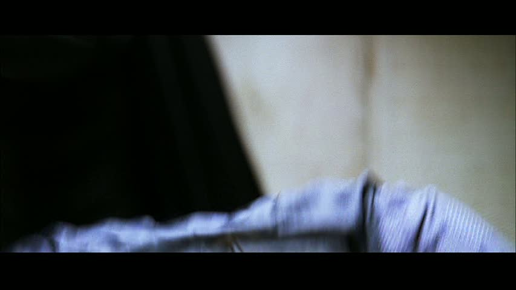\ 

Not only does the shallowness make the fast blurry thing look even faster, the blurriness is what makes the speed with which Batman circled the table seem plausible; that is, the camera does the work required to allow the film to remain realistic.  One beat later, the flamboyantly pained Joker bounces back into the shot.  

\ 

And by then Batman has already assumed an intimidatingly interrogative position.  Lots of staring, but as of yet no actual dialogue.

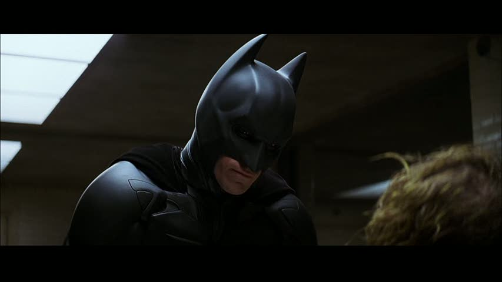\ 

The [angle of framing](http://classes.yale.edu/film-analysis/htmfiles/cinematography.htm#48004) shifts from eye-level to a mildly aggrandizing low.  Nolan also moves to a medium close-up in order to redouble the intimidating quality of the shot: the audience cowers below Batman and is given a massive chest's worth of evidence for why it should.  

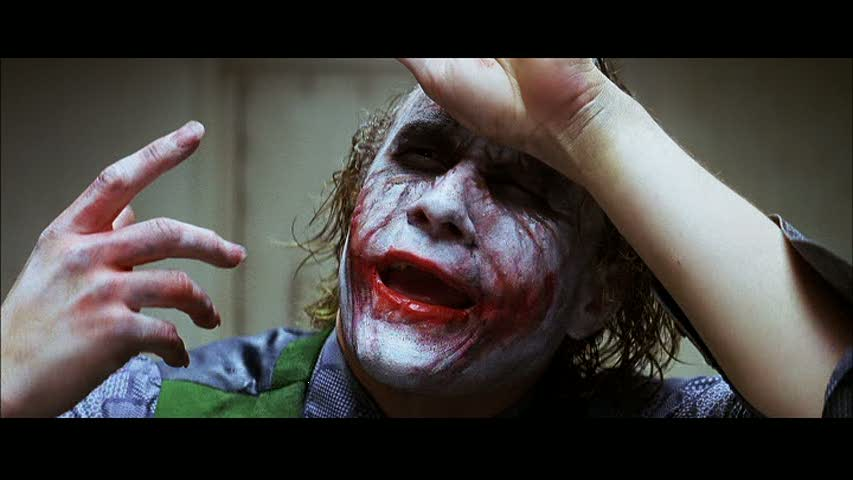\ 

Nolan returns to conversational framing so that the audience can see that the Joker must look up to speak to Batman, thereby transforming his complaint into a subtle supplication: "Never start with the head.  The victim gets fuzzy.  Can't feel the next—"  Nolan shows the consequences of his complaining by cutting to a framed [long shot](http://classes.yale.edu/film-analysis/htmfiles/cinematography.htm#48039):

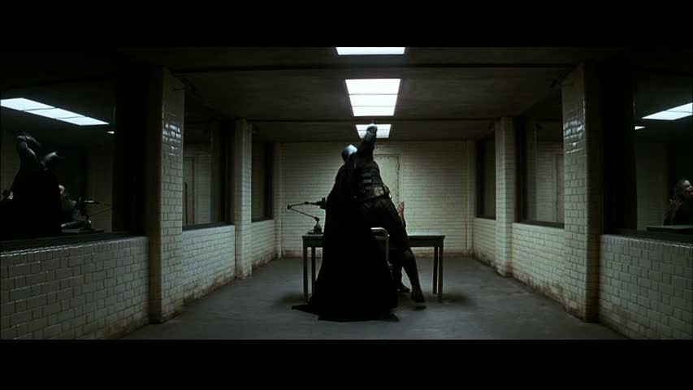\ 

This shot does a lot of work.  The framing is oppressively triangular: Batman's body, with his fist at its apex; Batman's cape, draped from his neck; the room itself, two vanishing lines aborted by the wall Nolan earlier framed.  The two-way mirror on the left encloses Batman.  The one on the right captures the Joker gesturing a histrionic "What?"  

For the second time in less than a minute, Nolan frames the shot so the compositional elements suggest entrapment; only this time, the effect seems justified.  The shot is too short to be an [extreme long shot](http://classes.yale.edu/film-analysis/htmfiles/cinematography.htm#48035), but it is longer than the average [long shot](http://classes.yale.edu/film-analysis/htmfiles/cinematography.htm#48039) in order to keep Batman's fist in the frame.  Note how Nolan concentrates all your attention on the fist: if the walls continued into infinity, the vanishing point would be where the fist is.  He chooses not to ruin the effect of all these visuals converging by cutting quickly to a close-up:

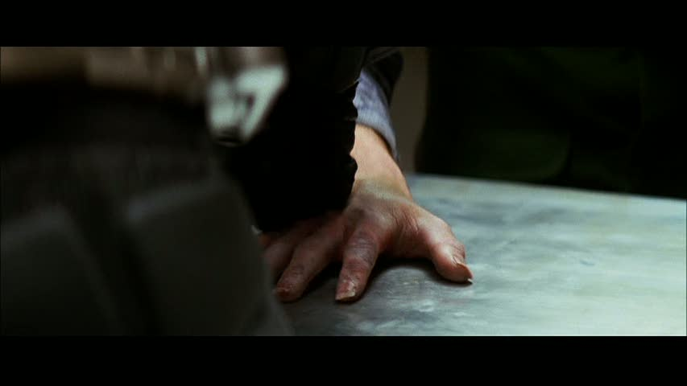\ 

Last the audience saw, Batman's fist occupied the apex of a triangle.  One beat later and it's planted atop the Joker's outstretched hand.  Had he shown Batman in the act of slamming his fist down with a long shot, the compositional niceties of the previous frame would collapse.  (Maybe that would've been effective: Nolan draws the audience's eyes up to catch Batman's fist, then the fist itself ruins the frame's compositional elements by crashing them down onto the Joker's hand.  Counter-factuals are fun.)  Needless to say, removing the intervening frames does enhance the audience's impression of Batman's speed and power, but the Joker's unimpressed:

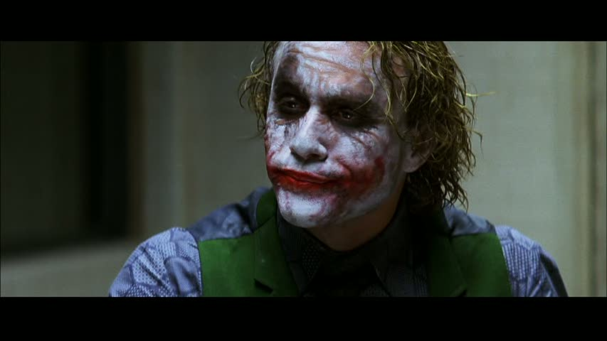\ 

Nolan returns to the previously established close-up to register the Joker's reaction.  However, the camera no longer looks at him dead on: it's moved about two feet to the left.  Nolan is preparing us for the conversational shots to follow.  But before he does so, he cuts outside the interrogation box to register the detectives' reactions:

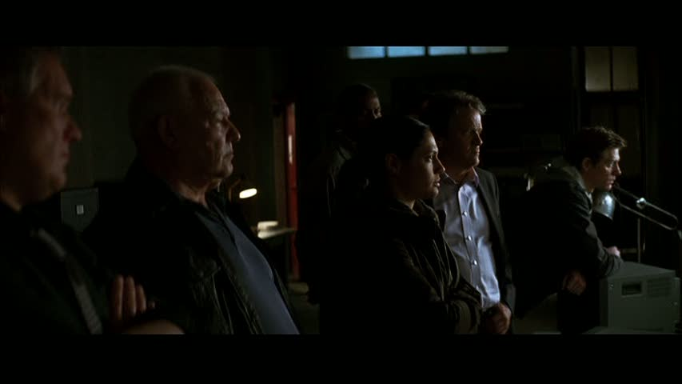\ 

They watch impassively.  They are somewhat concerned, but Batman's interrogation techniques apparently fall within the acceptable range of violence.  Back into the box and Batman has already taken a seat opposite the Joker.  Nolan now employs the moving over-the-shoulder shot I mentioned earlier:

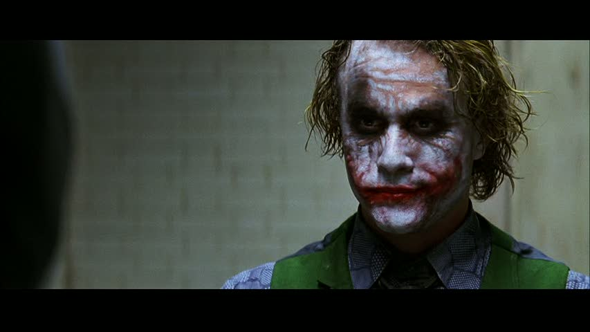\ 

\ 

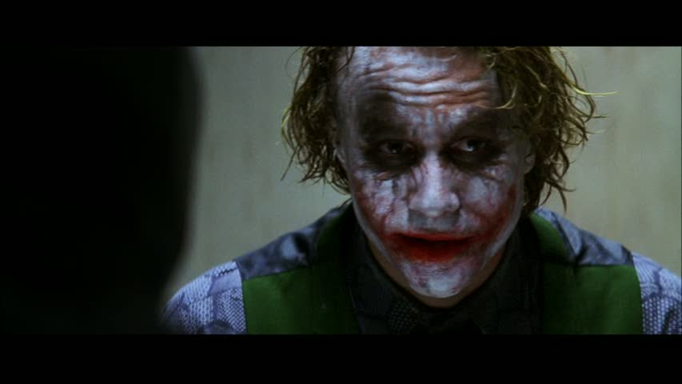\ 

Batman's blurry head acts like a waxing moon, gradually occupying more and more of the frame.  From the stills, it appears as if Nolan subtly zoomed in on the Joker.  He didn't.  What he did was move the camera slowly to the left as the Joker leaned forward.  The result is that Batman's head and the Joker's face seem to vie for central dominance of the frame; that is, the narrative struggle is reduplicated in the kinetic framing of the shot.  

Perhaps more importantly, the constant lateral motion allows Nolan demonstrate a key difference between the two players visually.  The camera may move—and Batman's new suit may allow his head to move—but in this scene it is utterly static.  That Wayne specified to Lucius Fox that the new suit should have a swivelling cowl becomes something more than a plot point here.  Because the audience knows he can swivel his head, his statuesque performance can be fully appreciated.  To prove this point, I'll need to jump out of a sequential analysis and show the next few shots of Batman's head:

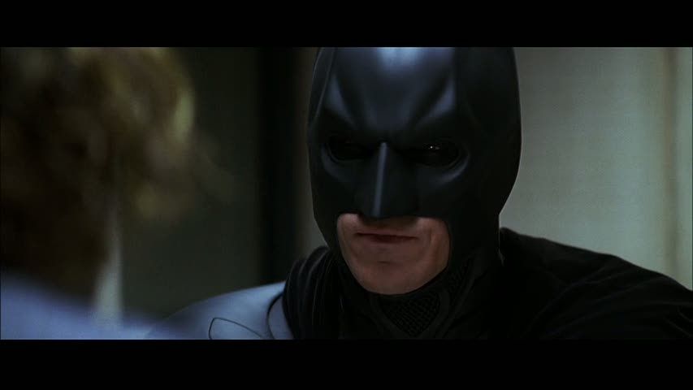\ 

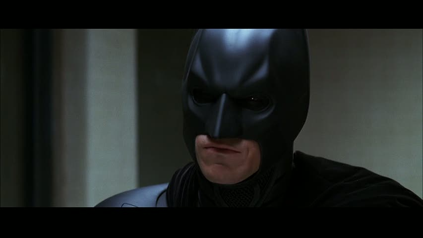\ 

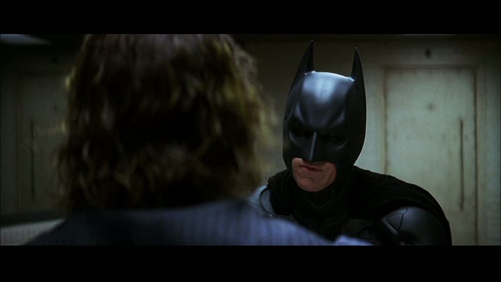\ 

That's three separate reverses back to Batman and his head has tilted all of an inch.  The same cannot be said of the Joker:

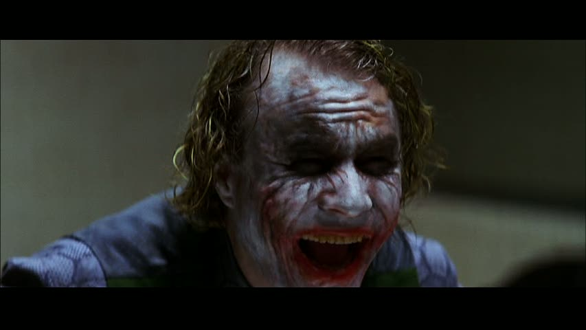\ 

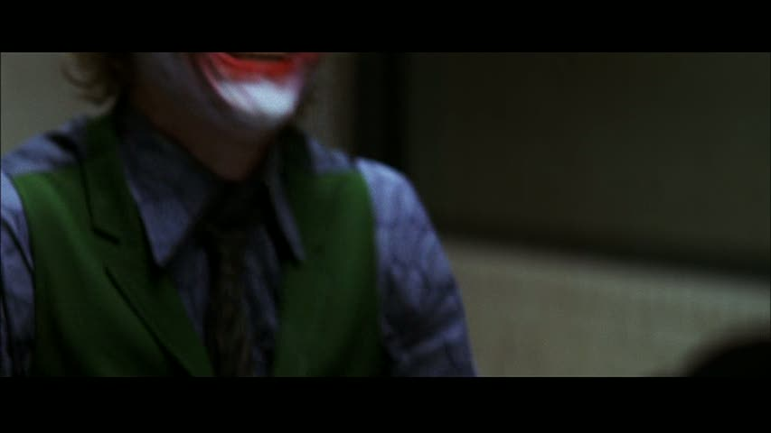\ 

The frame cannot contain him; nor, interestingly, does it try to.  Nolan's continues to circle the room, and what began as a tension between its restlessness and Batman's steadiness becomes something different.  The camera becomes complicit with Batman: its restlessness seems choreographed; it seems to register displeasure at the Joker's inability to stop moving and dance the part as the choreographer blocked it out.  

The camera-work reminds us of one of the film's central theses: the Joker only acts irrationally if the audience fails to notice the irrationality is an act.  He plays his part here—he remembers his lines, his cues, his blocking—but purposely says and hits them one beat too early or too late.  The performance is *unsettling*, not *irrational*.  If you're not in my class this may seem a stretch, but when you compare Nolan's Joker to Alan Moore's in *The Killing Joke* ([pdf](http://acephalous.typepad.com/files/killingjoke.pdf)), the connection should be plain: we have a hyper-literal, hyper-rational Joker who is less interested in chaos than in declaring his interest in chaos to great effect.  

At this point, the lecture ends and class discussion begins in earnest, so I can't show you the rest of the script *because I don't have one*.  (I lie, of course, but benevolent dictators must keep up appearances.)
