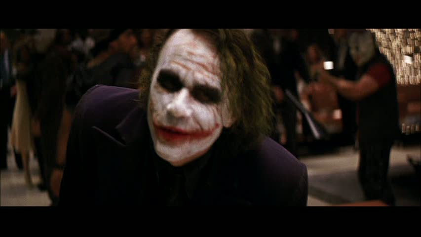

## The Dark Knight: Little bit more on teaching The Dark Knight

 * Originally published at http://acephalous.typepad.com/acephalous/2009/02/little-bit-more-on-teaching-the-dark-knight.html

What's the point of cataloging film and comic conventions in a composition course?  Students should leave my class knowing that the mechanics of a film or comic reveal the intentions of the mechanic.  Am I doing an end-around theoretical objections to authorial intent?  I certainly am—because I want to instill in my roomful of future rhetors that they need to pay attention to the effect their prose will have on their audience.  I want to slow down the process whereby they make claims, and the best way to do that is to explain the joke.  Consider the fundraiser scene in *The Dark Knight*.  I start shortly before the Joker puts the knife to Dawes' throat.

Here he is approaching her:

\ 

It's a [medium long shot](http://classes.yale.edu/film-analysis/htmfiles/cinematography.htm#48043) with a slightly [shallow focus](http://classes.yale.edu/film-analysis/htmfiles/cinematography.htm#38599).   Viewers know who to focus on, but are also given a strong sense of the *[mise-en-scene](http://classes.yale.edu/film-analysis/http://classes.yale.edu/film-analysis/htmfiles/mise-en-scene.htm#43394)*.  This frame belongs to a fairly long and unbroken tracking shot:

\ 

Note how the camera moves back more slowly than the Joker moves forward, transforming the medium long into a medium shot:

\ 

As the camera follows the Joker, the crowd slips off the frame—but we know what the *mise-en-scene* contains.  The camera moves with the Joker until this moment:

\ 

Now it swings to the left and begins to bring the crowd back into the frame.  As the camera pivots the frame momentarily centers on Dawes before returning the Joker.  The immediate intent is fairly straightforward: Nolan wants to keep the attention focused on the Joker.  Viewers now must gauge how Dawes reacts by how the Joker or the crowd reacts to her reaction.  

\ 

The camera continues moving left until the entire crowd is back in the frame.  Note that over the next three frames Nolan will show the crowd assembled behind the Joker in its entirety:  

\ 

\ 

\ 

For those shots the camera traces a circle around the Joker.  The viewer attends to his face because the camera gravitates around him like the Earth around the sun.  The camera moves behind Dawes's head and brings them into profile:

\ 

At this point it begins to describe a circle around her instead of him.  The effect is delicate if disorienting.  Note that over these three frames Nolan shows the entire crowd behind her in its entirety:

\ 

\ 

\ 

We now know who is behind her as well as him.  Nolan again uses the profile shot to switch dance partners.  The camera now circles the Joker again and again Nolan uses the attention on the Joker to scan the crowd behind him in its entirety:

\ 

\ 

\ 

\ 

Why all the circling?  The first reason is kinetic: a [shot and reverse shot combination](http://classes.yale.edu/film-analysis/htmfiles/editing.htm#51531) would have settled the action down by introducing a conversational rhythm.

The second reason is temporal: once a director starts reversing shots the audience begins to experience time as a function of narrative.  The first person says their say.  The second person says their say.  The first person responds.  The second responds.  I should note that this is a natural reaction only because it has been naturalized by film convention in a way that the tracking shot hasn't.  

With tracking shots the narrative is subordinate to the frame.  A tracking shot is conspicuous because it constantly reminds the viewer that what they see is mediated.  Consider the opening of *The Player* or almost every Scorsese film: people pass through the frame as the camera moves around them.  The audience is constantly reminded that it is an audience.  Nolan attempts to avoid this by creating a conversational pattern to the circle he describes—the purpose of the dance is to replace the harsh cuts of the reverse shot with a more graceful exchange of the faces in the frame.

As my emphasis on the crowd in these shots likely indicated, the third reason Nolan circled around them for so long is because the punchline requires him to.  For the joke to work the audience must be reminded of who is and who is not in the crowd.  The only way to do that is to show the crowd.  Note that he started with the crowd behind the Joker, then to the one behind Dawes, then back to the one behind the Joker.  Now the camera settles into sequential reverse shots.  For the sake of space I'll skip over the first few.  They cover the beginning and middle of the Joker's story about his scars.  Now note how tight the composition is when the camera turns to Dawes:

\ 

And compare it to how loosely the composition frames the Joker:

\ 

The frame provides no information about who is in the crowd behind her, but quite a bit about who's behind him.  As the story nears its conclusion the camera tightens into a close up.

\ 

The Joker delivers his punchline: "Now I'm always smiling."  Dawes promptly knees him in the balls:

\ 

The viewer can see behind him, and because he's looking right at Dawes, the Joker can therefore see everything behind her.  Now the Joker plays the straight man.  He says: "You have a little fight in you.  I like that."  

\ 

An off-camera Batman bat-growls: "Then you're going to love me."  Then:

\ 

Is it just me or is there no Batman in that shot?  How about we zoom in on that frame?

\ 

I see no Batman.  What about the next frame?

\ 

Batman!  But remember what I said about the Joker looking right at Dawes not but two seconds ago?  How exactly did Batman come to occupy the area immediately in front of the Joker without the Joker noticing?  And why does the Joker look to his left when Batman is in directly front of him?*  Did the Batman tiptoe through the crowd?  Why didn't the crowd react to Batman inching his way next Dawes?  The answer to all these questions is that Nolan threw realism out the window here.  

All that circling wasn't intended to show the audience who was in the *mise-en-scene*—it was intended to show them who wasn't.  In retrospect those tracking shots read: "No Batman no Batman no Batman no Batman no Batman."  Then Batman appears not where we expect him—that would be the crowd behind Dawes, as Nolan only showed viewers them once, then deliberately kept them off-frame when he went to reverse shots—but where *he cannot possibly be*: immediately to the left of Rachel, right in the Joker's line of sight.  Why does Nolan do all this?  In service of what profound thesis have I wasted all these words?  

**The Batman is really fast.**

If this is what's required to demonstrate the obvious, imagine what it takes to prove something legitimately complex.
