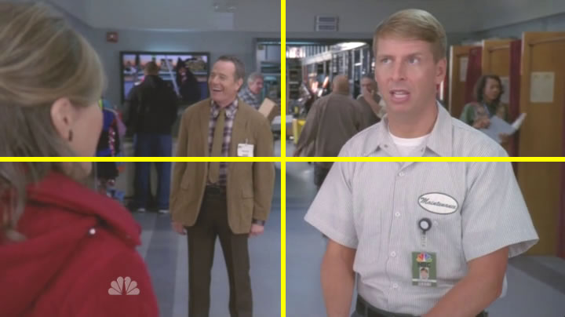
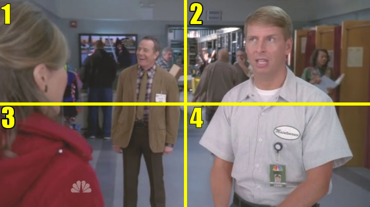
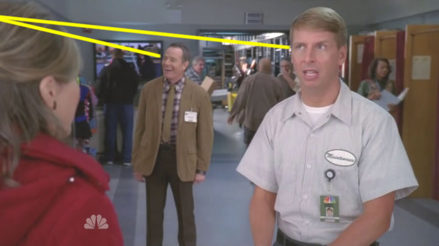
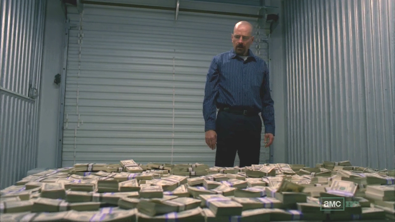

## Comedy vs. Drama\*

 * Originally located at http://acephalous.typepad.com/acephalous/2012/10/on-filming-comedy-versus-drama.html

I caught the latest *30 Rock* this afternoon and noticed something:

\ 

The guy in the midground is off-center:

\ 

This may seem like a blindingly obvious point, but one reason this shot is off-center is because the characters in it are off-kilter. The director, Robert Carlock, stages this shot in order to maximize the misdirection: Kenneth Parcell (Jack McBrayer) encourages viewers to follow an eyeline match left and somewhere north of his mother (Catherine O'Hara) before the camera gently racks the foreground out and the midground in to focus. The audience resets its eyes and sees nothing of interest until the movement of Kenneth's step-father (Bryan Cranston) attracts its attention, at which point an eyeline match *again* suggests viewers look left and somewhere north of his mother. Compelling the audience to bounce its eyes around this quickly within a sustained shot redoubles the manic impression the dialogue and narrative want to create. As I said, this point may seem obvious, but if you want to think about the difference between comedy and drama on a visual level, the scene above may be the perfect place to start. 

Situational comedies are filmed in an unsettling manner in order to maximize the capacity for surprise. When the audience haphazardly spirits its attention across the frame, the director literally has more space with which to work:

\ 

Before the camera racks, our attention is in quadrant one; after the camera racks, our attention is again drawn to quadrant one. In this case the director has at least three other quadrants in which to introduce new and potentially humorous information. We could actually divide the screen much more finely by following Kenneth and his step-father's eyelines:

\ 

But the four quadrants suffice for now. We look there in quadrant one when Kenneth's in focus, recenter when the midground comes into focus, and then follow Kenneth's step-father's eyes back to quadrant one. The rest of the screen is primed for hilarity. I grant that posts about creating comedy are by definition unfunny, but there's a reason this particular shot spurred me to write this post: [this person](http://acephalous.typepad.com/acephalous/breaking-bad/) ... about whom I wrote [an entire post concerning his staring](http://acephalous.typepad.com/acephalous/2012/09/breaking-bad-gliding-over-all-.html). 

In *Breaking Bad* the audience's eyes don't bounce around the scene from character to character in an attempt to ascertain the significant in-frame elements—they follow Walter White's in an attempt to understand some particular fact. The quiet dignity to Walter's unrelenting stare is partly a credit to Cranston and partly a credit to the plot, but it's also partly a credit to the directors of *Breaking Bad*, who know that creating shots that contain no quadrants capable of surprise results in a menacing atmosphere. Compare the shot above to this one:

\ 

I'll refrain from drawing yellow lines all over it because, unlike the shot above, the intended movement of our eyes is obvious. We center our eyes in the frame, move to Walter's face and then follow his eyes to the money pile. That's the *only* movement it makes sense to make. In the frame from *30 Rock*, our eyes are encouraged to move quickly but not decisively. We're not asked to stare so much as follow. I created quadrants and drew lines to indicate the misdirection that enhances comedic direction—that the two eyeline matches bracket a racking focus is significant too—whereas in this frame from *Breaking Bad* no such embellishment is necessary because there's nothing to embellish. Your eyes move the way director Michelle MacLaren wants them to or you lose the plot. 

\* This entire post was inspired by the fact that the episode had been 
over for half-an-hour before I realized that'd been Bryan Cranston, so I
 started to think about why it was, formally, that I hadn't recognized 
him. (Outside of the obvious fact that I'm not that bright.)
