## Doctor Who - "The Eleventh Hour": How the great and mighty dress themselves.

 * Originally located at http://acephalous.typepad.com/acephalous/2011/11/superman-versus-the-doctor.html

(*This be another one of [them posts](http://acephalous.typepad.com/acephalous/2011/02/a-visual-rhetoric-compendium.html).*)

Remember that post I wrote at the beginning of the quarter about the first episode of the fifth season of *Doctor Who*? Of course you don't: it's still in my draft folder. The whole point of that post—which I'll briefly recapitulate here—is that there's something unusual about a man sporting tweed and bowtie playing the cultural equivalent of Superman. [Spandex and tights](http://acephalous.typepad.com/acephalous/2011/09/richard-donner-knew-that-superman-needed-a-powerful-entrance-in-superman-1978-but-he-also-knew-that-the-one-element-that-i.html)? That's *American*. But tweed and a bowtie? That's *academic*, and surely no one wants the weight of the world resting on academic shoulders.
Unless, of course, you're English. In which case it makes perfect sense. So, to begin that post I never posted, here's Superman coming out of the closet and into his own:

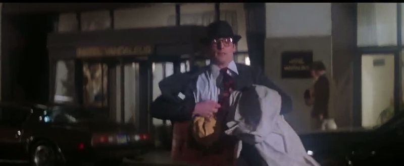\ 

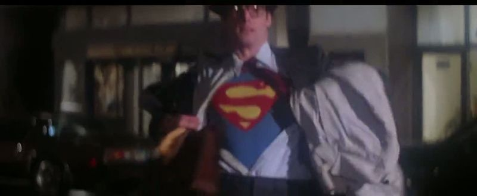\ 

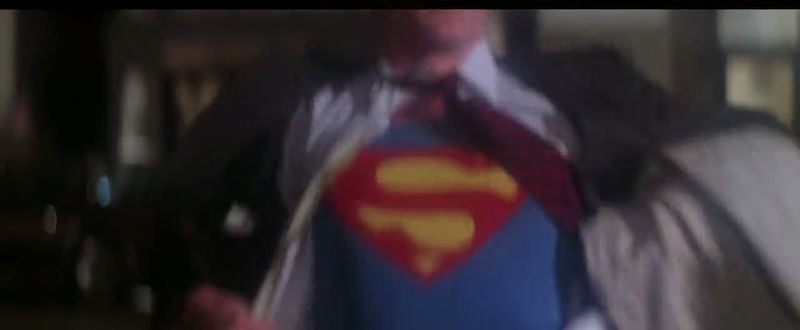\ 

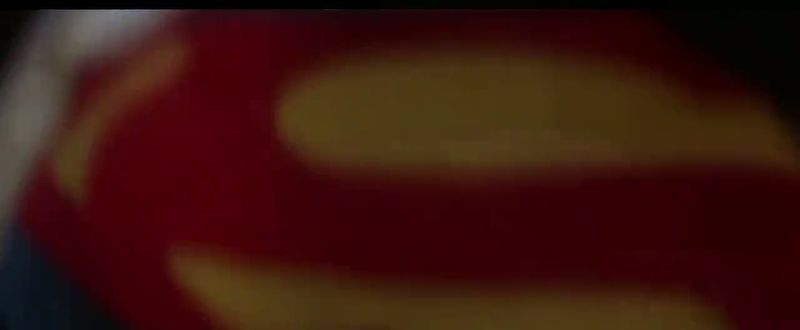\ 

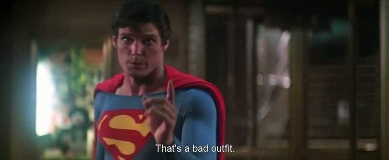\ 

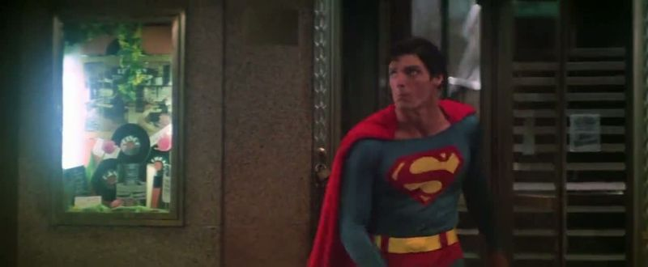\ 

Note that Richard Donner's American version of making manifest the hero's heroism involves stripping in public, entering a random office building, and emerging in jammies and a cape. The English version of this scene maps particularly well onto its American equivalent, with the one exception that director Adam Smith attempts to out-America America and film it in the sort of [long tracking shot Scorsese favors](http://www.youtube.com/watch?v=m1mHtkpkxiA). I'm only going to show the end of the first (Fig. 1) and the end of the second (Fig. 7) tracking shot, because the reaction shots in between are actually more crucial:

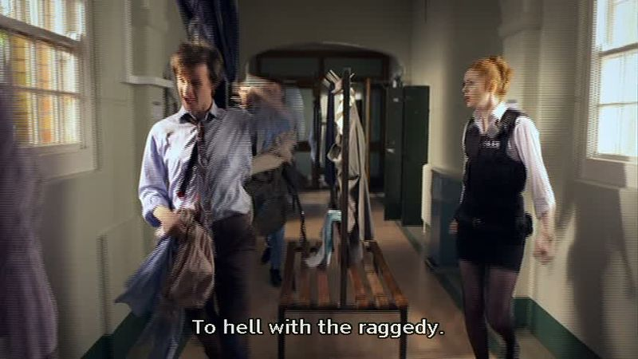\ 

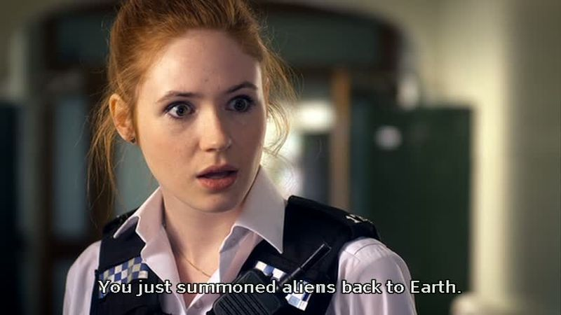\ 

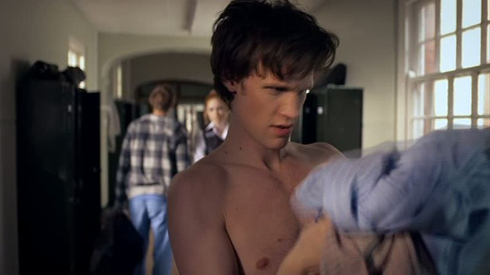\ 

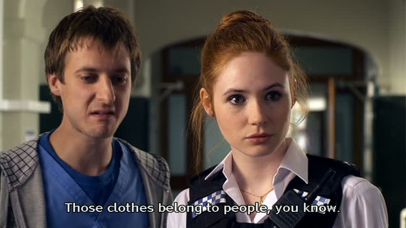\ 

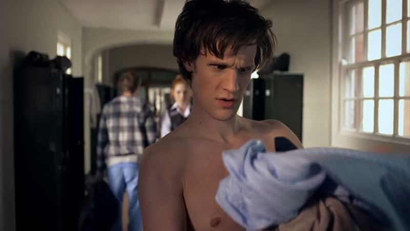\ 

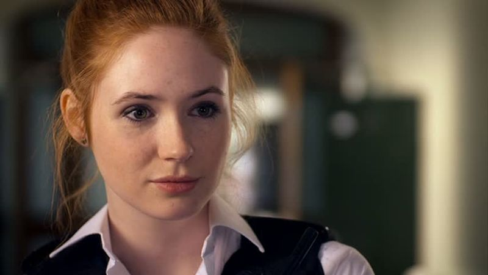\ 

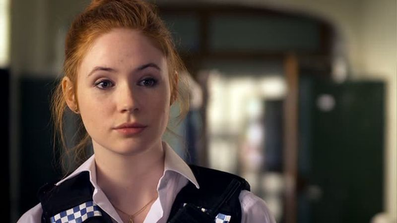\ 

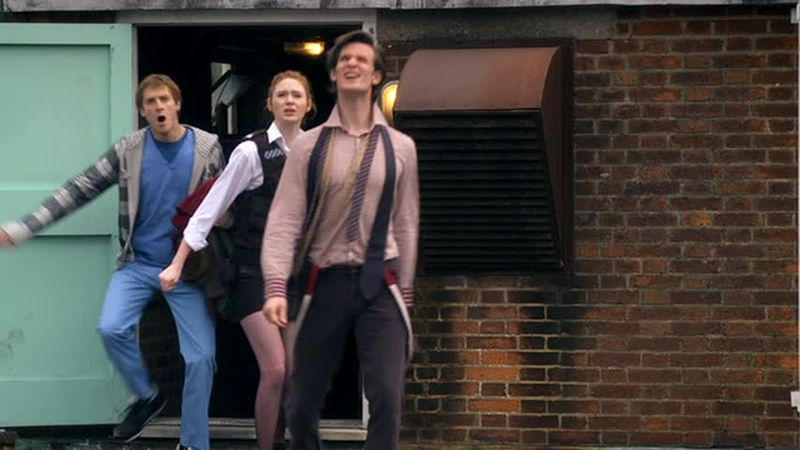\ 

What are the point of the tracking shots? First, watching men get changed isn't an inherently interesting activity, so the long tracking shots add some dynamism to an otherwise static scene. The fact that the shots are long hammers this home: a long shot holds the whole body in frame, so even if something interesting's going to happen, the audience'll already be privy to it—which is precisely why Smith interrupts the long take with a series of close-ups and reverse shots on the Doctor and Amy. Note that in the Fig. 2 Amy's aghast expression is purely a function of the Doctor's insanity: the Doctor's vanquished the alien Atraxi and won the day, so she's understandably surprised he decided to star-sixty-nine them. Smith kept the focus shallow so Amy's bewilderment occupies the entire frame—at least until the Doctor pops back into the foreground (Fig. 3) being very naked. What had been a close-up on her becomes a close-up on him—presumably the BBC has standards and practices—and she *and* Rory dissolve into the blur.

But only momentarily. Smith then cuts to a medium close-up whose sole purpose is to put the clean minds of the audience into Amy's prurient state (Fig. 4). Amy's eyeline match corresponds with the naked body of the Doctor, whereas Rory's terminates somewhere down and left there on the floor. Smith then returns to the close-up on the Doctor that previously blurred Rory and Amy, but there's a difference:

\ 

Amy is no doubt still blurry, but she now occupies the dead center of the frame. Don't take my word for it:

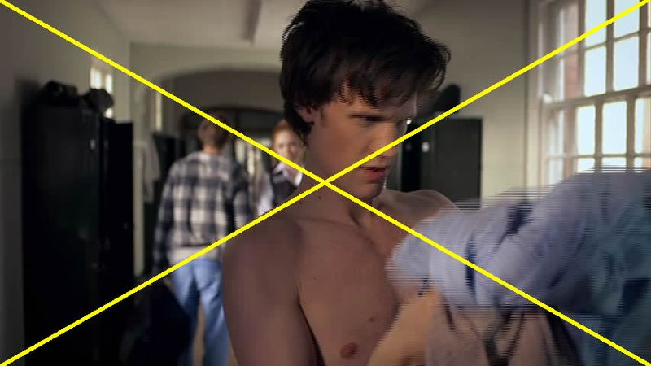\ 

If not the dead center, then, close enough. Let me explain: as Michael Land and Benjamin Tatler argue in *Looking and Acting: Vision and Eye Movements in Natural Behavior*, humans have "a bias towards looking at and near the centre of screens and monitors rather than their margins [and] because photographers tend to place objects of interest at the centre of the viewfinder ... salience will tend to be higher in the centre of the scenes used in many eye movement experiments" (39). Such "experiments," for our present purposes, being "television episodes" and "films." Viewers fixate, in Land and Tatler's sense of the term, on the center of the screen because they've been trained to do so. So strong is this training that if David Bordwell wants to be a bastard and introduce a string of continuity errors in the margins of a shot sequence, [he can do so without anybody noticing](http://www.davidbordwell.net/blog/2011/02/14/watching-you-watch-there-will-be-blood/). In short, we fixate on the center of the frame because we're barely mindful film-viewing automata, but what mindfulness we have, as David Bordwell argues, is [face-mindfulness](http://www.davidbordwell.net/blog/2011/02/06/the-eyes-mind/):

> [H]uman faces are a special case. We are sublimely sensitive to them. Faces are recognized even in low-resolution images, they are detected faster than other configurations, and we readily project them into ambiguous patterns. Hence we see the Man in the Moon and the Savior on a Cheeto. Naturally, artists realize the power of faces and gestures to attract our attention.

Even though Amy's is a blurry face, the combination of our filmic fixation on centers and our generalized face-mindfulness leads to this being, in the end, an eyeline match. Smith forces the audience to watch Amy watch the Doctor change, and just on the off chance that some member of the audience missed it (or her attitude towards it), I re-present Fig. 6:

\ 

Only that's not Fig. 6, that's what I'll call Fig. 7. It's a slight zoom in from Fig. 6 and its purpose is to communicate to anyone who missed the point of Amy staring down the half-naked Doctor in Fig. 5. (Note also that Rory's been shuffled out of this shot. He's there, in the diegetic sense, to her immediate right, but for some reason Smith is making this sequence all about Amy and the Doctor.) The subtle zoom from close-up to an extreme close-up works, in film terms, to get the audience "into her head" because it is, literally, being injected into her head. Smith used the same technique more dramatically earlier in the episode, when he had the Doctor enter Amy's mind via his zoomed-in-on-hands:

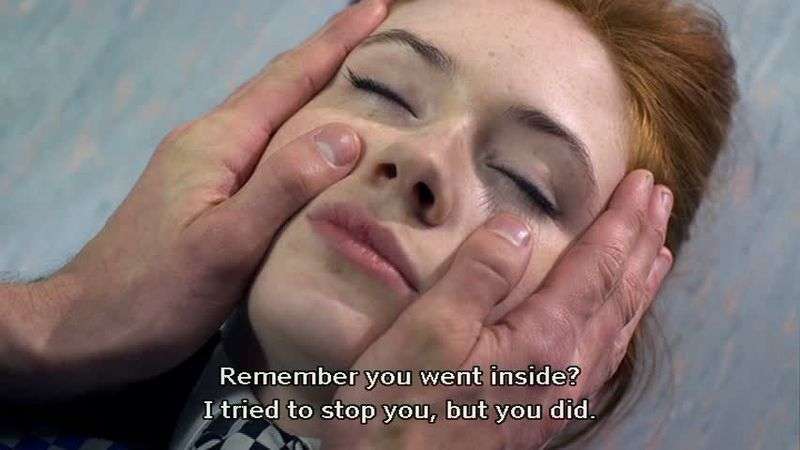\ 

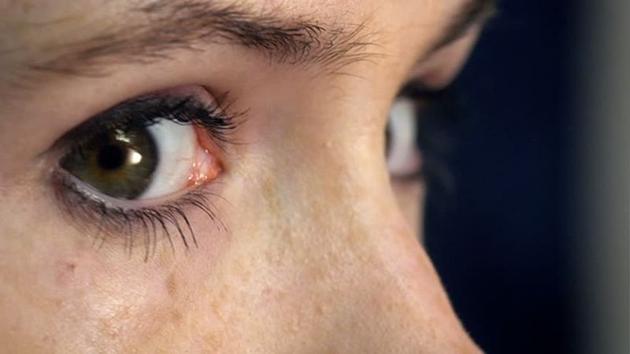\ 

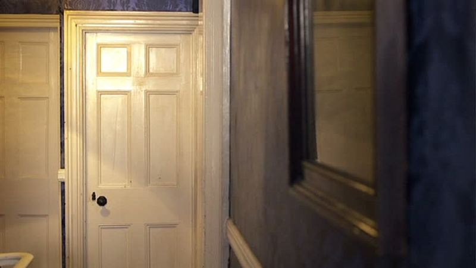\ 

The above scene, because of its science-fictional nature, is more obvious, but only because it has to be. Audiences aren't accustomed to having characters literally enter each other's memories; however, in the Fig. 7 the subtle zoom and her tightened eyes allow the audience to know what she's thinking without having to literally enter her head. (Naughty thoughts about the Doctor, obviously. I hope it didn't take you this long to figure it out.) Point being, this entire post is about the dressing of heroic figures and the manner in which said dressings are shot, except that it actually isn't. The point—the actual one—is that unlike Superman, the Doctor is just a man sporting tweed and a bowtie who is, nevertheless, able to saunter onto a rooftop and do this:

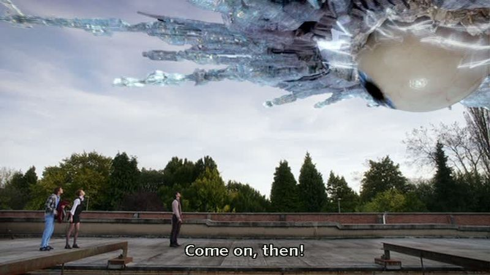\ 

In case you're wondering, yes, the Doctor is threatening a giant eyeball of a spaceship with tweed and a bowtie. Because this post is becoming unwieldy, I'll put the rest of the lesson-plan for tomorrow in a subsequent post and just note, for the record, that the significance of this final scene from the first Matt Smith episode will become apparent when compared with what could be his final scene in the penultimate episode of this season. About which, more very shortly. (I teach tomorrow, after all.)
