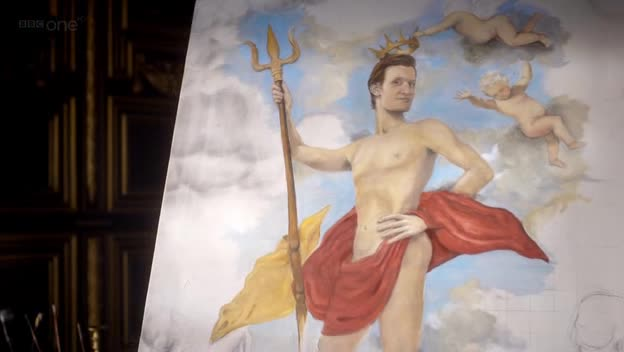
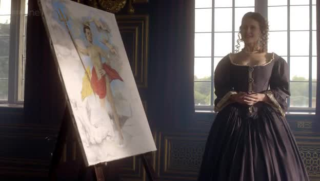
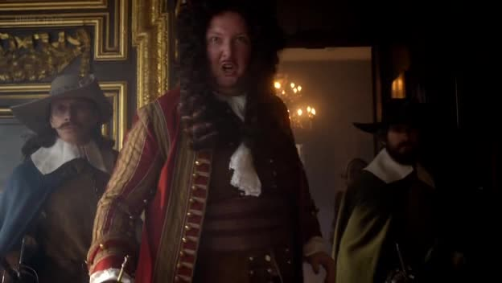
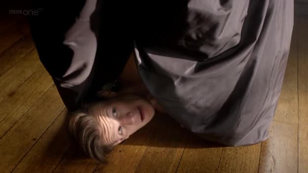
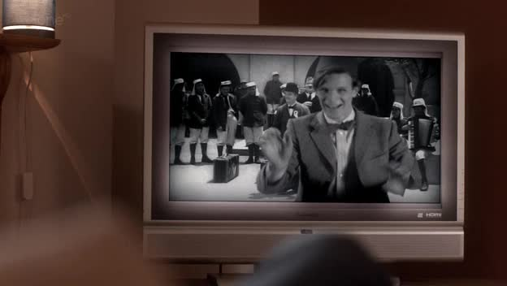

## Doctor Who - "The Impossible Astronaut": On notebooks–and the thirty seconds of narrative time I can squeeze into them.

 * Originally located at http://acephalous.typepad.com/acephalous/2012/03/doctor-who-impossible-astronaut.html

> I hadn't planned on writing another [rhetorical analysis](http://acephalous.typepad.com/acephalous/2012/02/scott-eric-kaufmans-visual-rhetoric-compendium-as-of-11282011.html) of Doctor Who until next quarter, but my Wednesday night class is composed of nerds and whiners who insist we keep on pushing through the Sixth Season even though the quarter's nearly over. Adding to the difficulty is the fact that the Sixth Season is infinitely more complicated than its fairy-tale precursor. In short, imagine an English seminar full of committed Jamesians who demand to read late-James even though every sane person knows that–[outside of the hilariously foreshortened "year" you spent preparing for qualifying exams](http://acephalous.typepad.com/acephalous/2007/10/what-are-qualif.html)–it's damn well impossible to do anything with [**The Golden Bowl**](http://www.amazon.com/exec/obidos/ASIN/0141441275/diesekoschmar-20), [**The Wings of the Dove**](http://www.amazon.com/exec/obidos/ASIN/0393978818/diesekoschmar-20), and **[The Ambassadors](http://www.amazon.com/exec/obidos/ASIN/0393963144/diesekoschmar-20)** in two weeks. That's what this feels like.

First let me tell you about how the sausage is made: I watch a film or an episode and I either enjoy it or I don't. If I enjoy a film, I'll watch it again to figure out what I enjoyed it. If I enjoy an episode, I'll usually wait for the next episode and then enjoy the season once it comes on DVD. I typically don't have the depth and complexity–such as they are–evident in these visual rhetoric posts when I'm watching them for the first time. Unless some detail is particularly compelling or some technical mistake particularly galling, I watch like a normal human being. It's only on those second watchings that I pull out the notebook and begin to figure out what I don't know. So what don't I know?

Judging by the number of notebooks I've burned through since Christmas, the empirical answer would be that I don't know a damn thing. That I'm constantly confused by everything in the world and have begun to hoard the finer points of other peoples' narratives on the off chance they or I forget them. The obvious stuff is obvious and mentioned just in case its obviousness becomes important subsequently. Consider the opening sequence of the premier episode of the Sixth Season of *Doctor Who* ("The Impossible Astronaut"), in which director Toby Haynes begins by showing the audience some paint:

\ 

[Paint can be important in this series](http://www.lawyersgunsmoneyblog.com/2012/02/vincent-and-the-doctor-together-alone), I think to myself, so I scribble "H. op w/ c-u paint & brushes." (That's "Haynes opens with a close-up of paint and brushes" for those who can't read my ideoletic shorthand.) I pause here because I want to remember what could be at play. Clearly there is a reason Haynes introduces the Sixth Season via the artistic tools the audience most closely associates with Vincent Van Gogh, but given that Gogh met his beastly death shortly after drawing an exploding TARDIS in the penultimate episode of Season Five ("The Pandorica Opens"), this likely has nothing to do with him. Then it occurs to me that Haynes directed and Steven Moffat wrote "The Pandorica Opens," "The Big Bang," and "The Impossible Astronaut," so the presence of meaningful continuity–even if that's not what I spy here–is more likely than not. I take a note to remind myself to take similar notes later and move on to the next frame:

\ 

Look who was wrong? That painting there has as much to do with Vincent's narrative as his style. It's the Doctor, which I could've imagined Vincent getting around to, but it's the Doctor *in the nude*. There's nothing wrong with a nude painting of a man–or wouldn't be a few decades later after Charles II dies and England rejoices by stripping off the gloom of their imported Flemish masters and then their clothes. (To be followed quickly by a intense desire to live in a world in which flat surfaces and solid colors were anathema.) Point being:

Mathilda's painting of the Doctor is too Rococo for its time–because it's not of its time. He's encouraged her to paint not in the departing style of the Flemish Masters, nor in the coming style of French Baroque or endemic Neoclassicism, and why would he? He doesn't need live time in order, and Mathilda, his companion at the moment, is herself learning a little morality lesson about the knowledge the Time Lord grants: more often than not the world isn't ready for it. Not that she minds:

\ 

She looks quite please with her anachronistic creation. Her benefactor seems less so:

\ 

Note that even though the shots of Mathilda and King Charles II are both [medium long shots](http://classes.yale.edu/film-analysis/htmfiles/cinematography.htm#48044), she and the image of her Doctor are both bathed in natural light, as if they belong to the world beyond the window's grilles. King Charles II and his men are exactly where they ought to be: the King in the middle and lackeys at both flanks. They have come for the Doctor for reasons unknown–but their tone implies that whatever those reasons may be, the Doctor needs a grand entrance and the sooner the better.

\ 

Perhaps not *that* soon. Appearing from beneath the swaths of Mathilda's skirts suggests that King Charles's haste and *j'accuse*-face may be warranted. The high [angle of framing](http://classes.yale.edu/film-analysis/htmfiles/cinematography.htm#48004) here is completely warranted. The Doctor may not be physically powerless, but his given that his moral code only seems to allow him to significantly alter history when [its in need of a significant alteration](http://www.lawyersgunsmoneyblog.com/2012/02/time-can-be-written-and-will-be-try-and-keep-up), the consequence of him having lost his social stature which much more likely lead to lots and lots of running. Which is exactly what Haynes has him do in the opening bits–and they are comedic "bits" in no uncertain terms–they establish both that he's no longer traveling with Amy and Rory but that he's no longer done with them (even when they fail to see him):

\ 

That's Rory's head you can't see failing to notice the Doctor trying to catch his attention. As I started watching these first few minutes–and keeping in mind I've seen the entire Sixth Season–I found it difficult not to see these as the Season's narrative arc written small. Bear with me:

1. The Doctor's there, like the Silence, but Amy and Rory can't see him.
2. The Doctor's *always been there*, like the Silence, but nobody can see them.
3. The Doctor's happy not because he's alive–though I've little doubt that pleases him–but because [his plan to redeem himself worked](http://acephalous.typepad.com/acephalous/2012/02/doctor-who-amys-choice-rhetorical-film-analysis.html). Perhaps not in full, but fully enough for him to embark, alone, on a series of adventures through human time seemingly designed to taunt Amy and Rory. (The last time the Doctor went on walkabout the results [were](http://en.wikipedia.org/wiki/Planet_of_the_Dead) [far](http://en.wikipedia.org/wiki/The_Waters_of_Mars) [darker](http://en.wikipedia.org/wiki/The_End_of_Time), so much so I contend that the darkness left in the Tenth's wake is what the Eleventh's had to deal with throughout Season Six.)
4. The Doctor's no longer afraid of what he'll do, because he can't do any more damage to the universe than gambling that he could extinguish it back to life would somehow work.
5. That it did is what allows him not only accept, but to crave the attention and flattery in oil of the otherwise insignificant Mathilda. Her ability to stand there, insignificantly, is a direct result of his actions, so whatever pleasure he gains from their interaction is because she exists, not because she exists in any particularly pleasing way.
6. Other stuff you can suss out in the comments while I cook my wife and I dinner.

I could go, but as aforementioned, it's dinner time and much as I would like sharing my notebook with you, I need food. Also, I wonder whether some of you wouldn't rather toss my notebook at me, in which case, slinking away to make some hash is still a solid idea.
