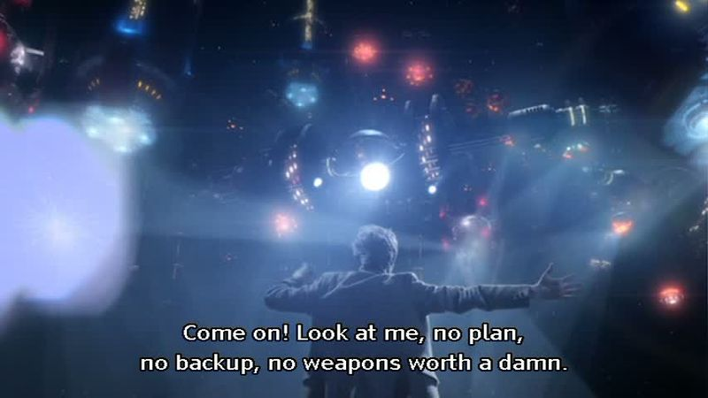

## Doctor Who - "The Pandorica Opens": Just in case you need to bluff your way out of a war.

 * Originally located at http://acephalous.typepad.com/acephalous/2011/11/doctor-who-the-pandorica-opens.html

In the previous post, we learned that the Doctor can accomplish quite a bit by yelling at things. Admonishment, it could be said, is his only consistent source of power. He has the uncanny ability to be clever at precisely the right moment, and if he lacks the tools required to bring his clever plan to fruition, he possesses an improvisonal knack for making do with whatever's at hands. As a list of powers go, the Doctor fares quite favorably to no known hero—though he could be compared to a Malthussian Lex Luthor. (He did *steal* the TARDIS, after all.) Point being, by the time the Doctor regenerates into his Matt Smith incarnation, his reputation is such that he can stand on a rooftop, unkempt and in other people's clothes, and stare down the very same spaceship that, moments earlier, was going to incinerate the entire planet.

Quite the reputation, that is, but what has he done to deserve it? "Been very clever with stuff on multiple occasions" covers it, but inadequately. Unlike Superman, the Doctor possesses no singular power that would require him to face a particular kind of foe in a particular type of manner. He can stand alone against an alien armada precisely because he lacks any clearly defined (or plausible) method of doing so. To quote the man himself in "The Pandorica Opens," in which the Doctor finds himself trapped beneath Stonehenge and the Earth surrounded by an alien armada:

\ 

\ 

\ 

\ 

Note how director Toby Haynes monkeys around with the shots in this short sequence. In the first frame, the Doctor is looking out the door, the locked Pandorica behind him, and he looks sheepish not only because of his slumped shoulders and pathetic frown, but because he's being oppressed by the compositional elements of the frame. Amy Pond and River Song flank him, and even though the shot scale is medium close-up—meaning the camera captures him from the waist to the top of his head—Haynes uses an unusually high level of framing, which creates an awkward amount of space between the top of the Doctor's head and the upper limit of the frame. This unusual level of framing makes it so the compositional oppressiveness parallels the narrative—or vice versa, as the relation between the narrative and composition is interdependent in film. In other words, it's as if Haynes squished the Doctor but left the camera in the same position it occupied pre-squishing.

But wait! There is a second frame in which the Doctor has one of his brilliant ideas!

Haynes cuts quickly from the Doctor staring out the door with his back to the Pandorica in a medium close-up to a medium long shot of the Doctor twirling around to address River and Amy. The oppressiveness of the previous frame is lifted by pulling the camera back—the Doctor has been freed by dint of his brilliant idea! Except there's a third frame, in which the spastic Doctor walks toward the camera, effectively entrapping himself in the very medium close-up from which he'd just escaped. Why is he re-oppressing himself?

Because his brilliant idea is actually a terrible one, so it makes sense that he should be no more free of the oppressive framing than he'd been before he had his terrible idea. But take a look at that fourth frame: something has changed. The camera swung back to keep frontality with the spinning Doctor, but it also zoomed out from the medium close-up of the first frame to the medium long shot of the second. The fourth frame is a combination of the first two: his knowledge that his brilliant idea will result in certain death is reflected in the composition. Before, he had nothing; now, he has something, terrible though it may be, and a terrible something is less oppressive than an empty nothing.

Why am I going on and on about compositional oppressiveness while the Doctor whirls about free as all can-do? Because as I mentioned in [my post on "Time of Angels"](http://acephalous.typepad.com/acephalous/2011/02/doctor-who-time-of-angels-lecture-notes.html):

The entire series is predicated on an escapist conceit, which is why "it's bigger on the inside" is so critical to the show's appeal—not to mention why a box that isn't bigger on the inside is such a terrifying concept to this audience.  To return to my point: this is a bad box.  A confining box.  Only bad things can happen in a confining box, and [the director, Adam Smith] is framing these shots in order to heighten the impression of confinement.

That big box behind the Doctor in the first and fourth frames there? Like the shipping container in "Time of Angels," it's a bad box. The answer to the Doctor's own question about it is right there in the composition of the shot in which he first asks it:

\ 

Only the kind of person who can shout down an alien armada can inspire that level of fear, and there's only one of those kind of people around anymore: the Doctor. Since he's currently bereft of any idea powerful enough to keep that armada from putting him in that bad box, he does the next best thing: he decides to yell at the people who want to put him in it. He runs out of the cave beneath Stonehenge and into the center of it. The long shot typically suggests a type of freedom:

\ 

It would here, too, if the Doctor didn't proceed to run directly toward the camera and entrap himself in a medium close-up:

\ 

For those in the audience wondering what a single man about to slug it out with an entire armada looks like, Haynes obliges:

\ 

The low angle of framing makes the armada appear just as impressive as it is, only more so, because making things look impressive is what a low angle of framing always does. (The difference here being that the impressive thing is genuinely impressive.) After some plot machinations that aren't relevant at the moment, the antsy armada decides to stop whirring and thrumming and start

\ 

Armed with (and emboldened by) another terrible idea—he now plans to defeat the armada with a single Roman legion—the Doctor rushes to the center of the circle, climbs atop a fallen stone and informs the fleet that whoever controls the Pandorica controls the universe, and can you guess who controls the Pandorica?

\ 

The Doctor controls the Pandorica. The low angle of framing indicates his power and importance, but remember, his new terrible idea is no less terrible now than it was ten seconds ago, which means this angle of framing is ironic. The actual odds look something more like this:

\ 

The low angle of framing here makes the Doctor seem imposing, certainly, but it also makes the impressive fleet he's admonishing appear even more so. Why does the Doctor want them to stop distracting him? He provides an answer in a frame whose angle is doubly ironic:

\ 

The Doctor is big enough to shush an invasion force, but the high angle of framing is literally diminishing him. His words assert his importance at the very moment the camera robs him of having the appearance of any. Except the entire universe is only here in the first place because he actually is as important as he thinks he is—only in this frame, Haynes shoots from the optimistic perspective of how important the universe wants to make him. Ironies within ironies, and all reflective of the Doctor's only decent plan to date: bluffing. Low angle of framing to indicate feigned importance? Check:

\ 

Blocking that allows the Doctor to dominate the frame by dictating what it can and can't contain? Check:

\ 

Ironic low angle of framing to increase the Doctor's importance but also suggests, compositionally speaking, that he's bluffing? Check:

\ 

Low angle of framing with a shallow focus that wipes the armada from the frame and suggests, against all odds, that the Doctor might not be bluffing? Check:

\ 

Cut to another low angle of framing followed by a sequence which does everything the preceding five frames did, only really quickly and in a way that suggests that the real victim of the Doctor's bluff is actually the audience? Check check check check check:

\ 

\ 

\ 

\ 

Zoom in from this absurdly high angle of framing to make it appear as if the power of the man the shot actively diminishes is actually increasing? Check:

\ 

\ 

Issue one last threat from this ironic angle? Check:

\ 

What next? Gloat?

\ 

Check. I would write "checkmate," but the Doctor's idea here is *still* no different than it was before he put on his little show:

Something something something Romans something something something I win.

Not the sort of reputation-establishing heroism Americans expect from their heroes, but then again, the Doctor's not exactly an American type of hero.
