## Doctor Who - "Time of Angels": How, exactly, do you film someone being stalked by a statue?

 * Originally located at http://acephalous.typepad.com/acephalous/2011/02/doctor-who-time-of-angels-lecture-notes.html

Something lumbering [as quickly as a zombie](http://acephalous.typepad.com/acephalous/2011/01/amc-the-walking-dead-series-lecture-notes.html) wouldn't seem to pose much of a threat, so it goes without saying that turning them into something threatening would entail speeding them up or increasing their numbers unto ubiquity.  In the former case, their uniqueness is reduced and they become just another movie monster; in the latter, they're horrifying because our inability to grasp the greatness of their numbers approaches the sublime.  But how would they pose a threat if they were unable to move at all?  I'm teaching the episode of *Doctor Who* entitled "Time of Angels" because the answer to that question is that they move via film cliché.  More on that in a moment.  First, let me introduce you to [the Doctor](http://en.wikipedia.org/wiki/Doctor_(Doctor_Who)):

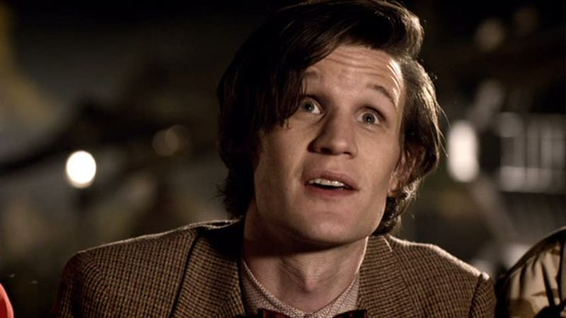\ 

He is a funny old man with a magic blue box [whose Wikipedia entry](http://en.wikipedia.org/wiki/TARDIS) is longer than [New Hampshire's](http://en.wikipedia.org/wiki/New_Hampshire), so I'm not sure I'll be able to briefly sum up who and what he is.  Suffice it to say he's the English equivalent of Superman, only intellectualized instead of strong.  You don't really need to understand the Doctor to understand this episode or my post, though; more important for the present are [the Weeping Angels](http://en.wikipedia.org/wiki/The_Time_of_Angels), a malevolent race of statues created by the current show-runner, Steven Moffatt.  Let me say it again: they are a malevolent race *of statues*.  How do they demonstrate their malevolence?  *When you're not looking*.

There's a purity to the concept of creating a monster whose movements perfectly (and can only, because they must) match the cinematographic vocabulary of horror.  Every time the camera is on them, they must be statues, meaning the audience must actively infer their off-screen movement.  The audience must be attentive because they won't be able to sit back and observe the proceedings (and because if they do there won't be any proceedings to sit back and observe).  The challenge for Moffat and director Adam Smith is to take this ingenious metaphor for horror films and turn it into something genuinely horrifying.  What follows is how they do it in the beginning of the episode.
First, they place the Doctor's companion, Amy Pond, in an enclosed space:

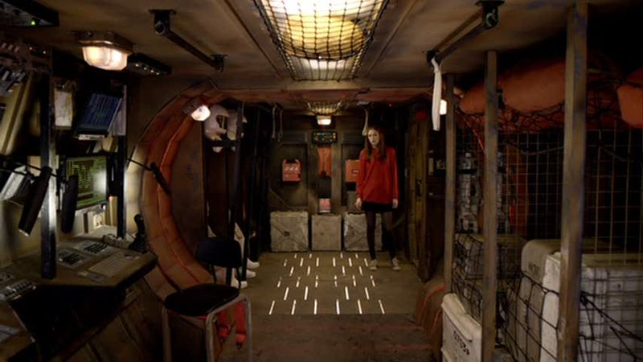\ 

This is a fairly [long shot](http://classes.yale.edu/film-analysis/htmfiles/cinematography.htm#48039), the purpose of which is to provide the audience with a sense of both a character and that character's status relative to his or her environment.  It also uses [deep focus](http://classes.yale.edu/film-analysis/htmfiles/cinematography.htm#38561) ironically, keeping everything in focus so that the audience can see just how much of it there isn't.  Additionally, the tight framing of the shot is similar to [this scene from *Mad Men*](http://acephalous.typepad.com/acephalous/2010/09/mad-men-in-the-suitcase.html), except here those lines are both imagined *and* actual because she's in a metal tube.  The result is a claustrophic atmosphere, but a bit menacing, too, because the audience knows the [cheat cut](http://classes.yale.edu/film-analysis/htmfiles/editing.htm#51524) is effected from the position on the wall occupied by the recorded image of an Angel:

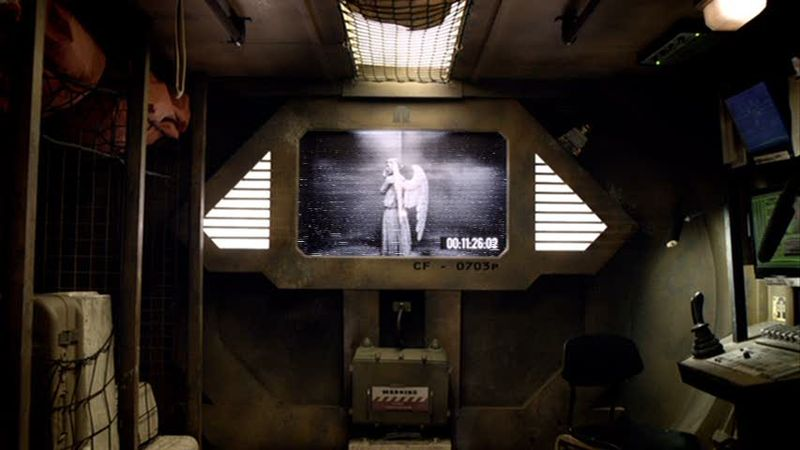\ 

Note that Smith eschews a [point-of-view shot](http://classes.yale.edu/film-analysis/htmfiles/cinematography.htm#48019) and instead places the camera equidistant between the recording and Pond.  The previous shot established that these are extremely tight quarters, and zooming in to this [eyeline match](http://classes.yale.edu/film-analysis/htmfiles/editing.htm#98485) makes them feel even tighter.  This is especially true because the series often consists of the camera following the Doctor as he whirls about in his magic blue box, which is itself whirling about through space and time.  The entire series is predicated on an escapist conceit, which is why "it's bigger on the inside" is so critical to the show's appeal—not to mention why a box that isn't bigger on the inside is such a terrifying concept to this audience.  To return to my point: this is a bad box.  A confining box.  Only bad things can happen in a confining box, and Smith is framing these shots in order to heighten the impression of confinement.  Both shots above are impressively framed themselves, but more significantly, the shots and [reverse shots](http://classes.yale.edu/film-analysis/htmfiles/editing.htm#51531) within the bunker use the same [angle of framing](http://classes.yale.edu/film-analysis/htmfiles/cinematography.htm#48004).  The [level of framing](http://classes.yale.edu/film-analysis/htmfiles/cinematography.htm#48009) shifts as Pond approaches the image, but not the angle, which results in the scene feeling very constricted: can't look up, can't look down, only straight ahead:

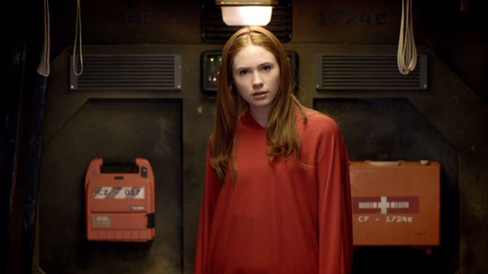\ 

Note that the camera seems to have zoomed slightly when it reversed, resulting in aggressive [frontality](http://classes.yale.edu/film-analysis/htmfiles/mise-en-scene.htm#54569) as Pond's eyes directly address the audience's.  But not only does she not see us, she sees *straight through us*.  She's staring at the image behind the audience, and there's an unsettling disconnect between the directness of her address and the audience's knowledge of its actual recepient.  It's also disorienting because shot sequences of this sort often signal that a character is paying more attention to an element in the scene, as the next shot, a [close-up](http://classes.yale.edu/film-analysis/htmfiles/cinematography.htm#48048) of the Angel, seems to suggest:

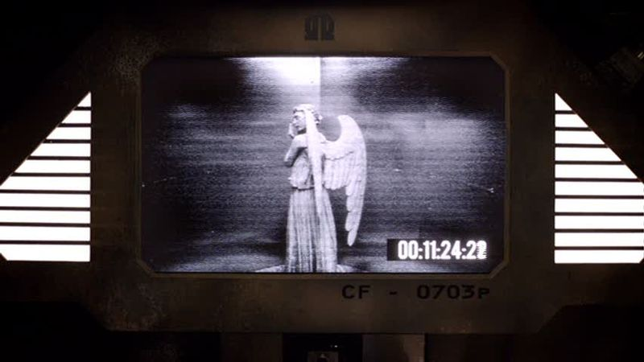\ 

As Pond becomes more interested in the image, the camera zooms in to communicate that interest to the audience.  Why is the next shot disturbing?

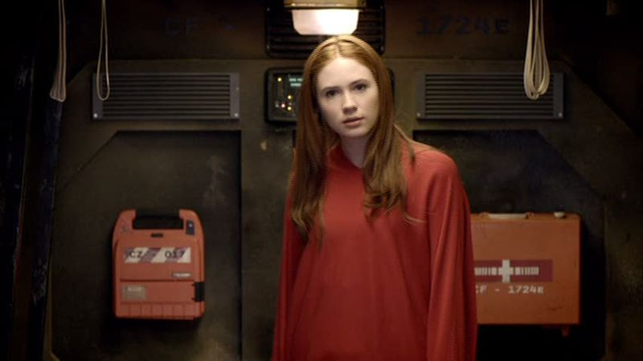\ 

Because it suggests that the image is staring back, and *images shouldn't be capable of staring back*.  Moreover, the zooming in suggests that the image is paying an increasing amount of attention to her, and *images ought not be able to express increasing interest*.  It's almost as if the audience becoming uncomfortable because the episode is telling them, in filmic terms, something they know can't be true.  Pond then leaves for a moment to ask the Doctor a question, and when she returns so too does the camera, first to its original position:

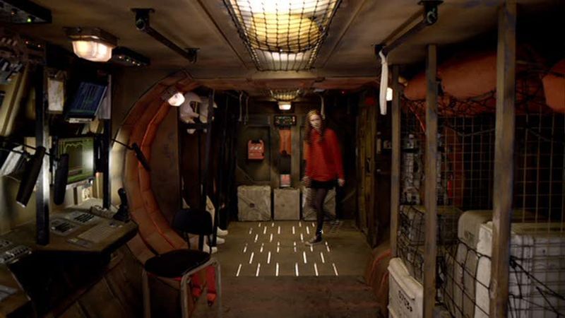\ 

Then to its second:

\ 

The edit between those two shots is not, as above, effected by reversing to the image of the Angel, but via a jarring [jump cut](http://classes.yale.edu/film-analysis/htmfiles/editing.htm#51529).  She enters the tube, then the camera interrupts the long shot bt moving, instantaneously, to the medium.  Such cuts are, as the link explains, anathema in conventional filmmaking because they break the illusion of seamlessness in a way that a zoom won't.  It's an unnatural edit, and Smith is using it here to signal that there's something unnatural going on here.  Moreover, it's unnatural partly because it mimicks the movement of an Angel even though the audience hasn't taken its eyes off Pond.  As she inspects the image, the camera cuts back to it:

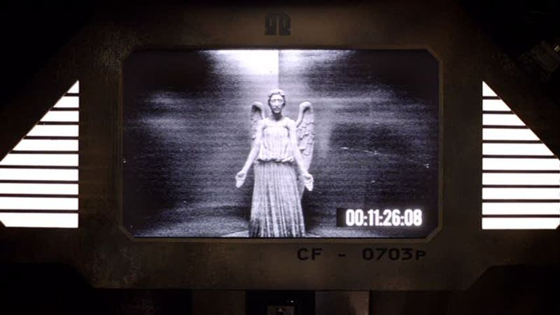\ 

Then back to her:

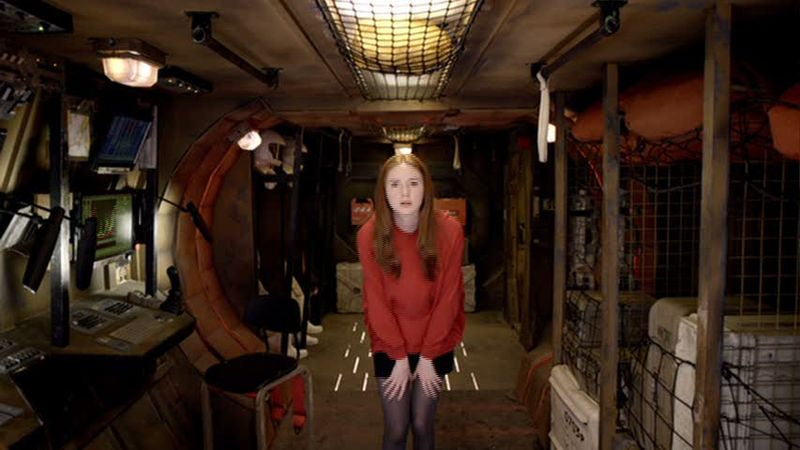\ 

Then jump cuts to a close-up of her.  After noticing the statue's moved, she checks the time-stamp in the corner of the image:

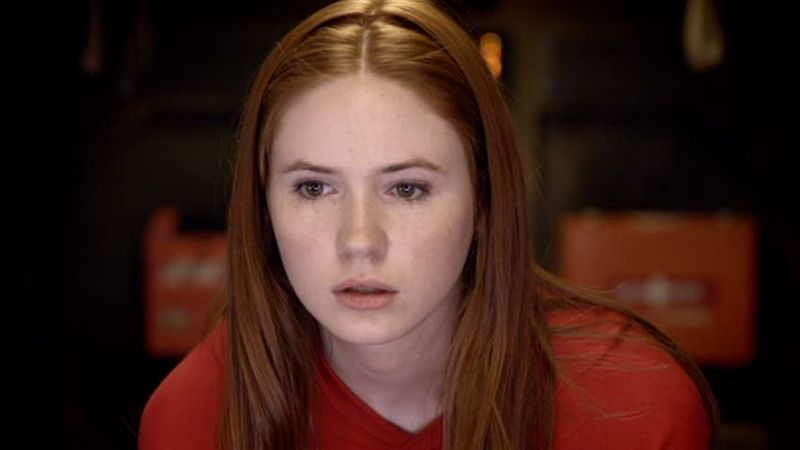\ 

An eyeline match tells the audience that Pond's still looking at the same four seconds from before, when the Angel was in the corner hiding its eyes:

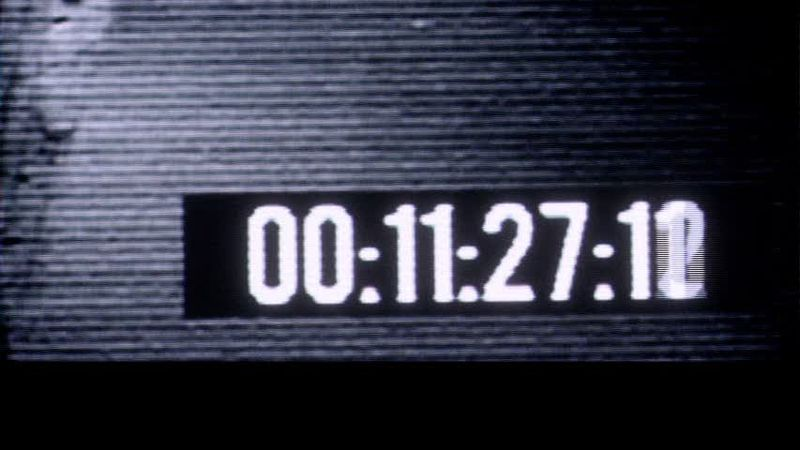\ 

And back to a reaction shot from Pond:

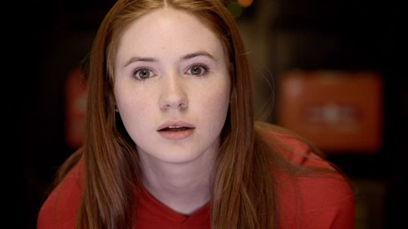\ 

And back to what she reacted to:

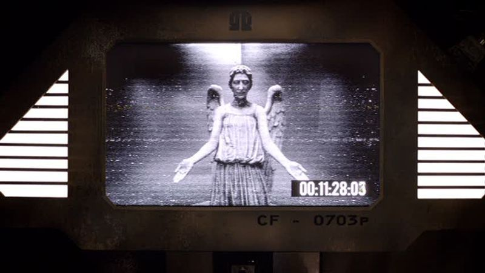\ 

The rhythm here is crucial, because from neither perspective is the camera zooming.  As Pond approaches the Angel, the Angel approaches Pond jump cut by jump cut by jump cut.  That's the point: it's stalking her in something slower than slow motion, a movement that isn't a movement but still moves.  She is watching it jump cut through space, but nothing can jump cut through space, only through film.  How do you stop a film from attacking you?  You turn it off:

\ 

This is the first [canted framing](http://classes.yale.edu/film-analysis/htmfiles/cinematography.htm#48012) within the tube, and well it should be: it's the first time she's both in it and can hope to escape it.  If the claustrophobia of what's happened previously is partly an effect of the stitled level framing, it makes sense to represent the possibility of escape from a canted angle.  And because this is *Doctor Who*, the thing that represents the possibility of escape is [a pointing thing](http://en.wikipedia.org/wiki/Sonic_screwdriver):

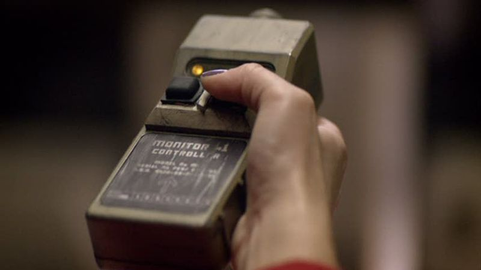\ 

The appeal here is to members of the audience who know the power of pointing small devices at problems, hence the [extreme close-up](http://classes.yale.edu/film-analysis/htmfiles/cinematography.htm#48049) on her holding the remote.  Alas:

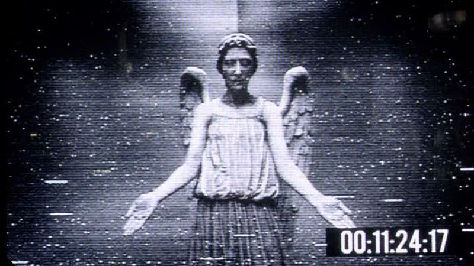\ 

Note how even though the Angel hasn't moved since it was seen earlier, the camera has: what had been a close-up on the monitor above is an extreme close-up on the image on the monitor.  It appears closer now, but only because the camera's zoomed in on it.  More moving without movement, which rightly startles Pond:

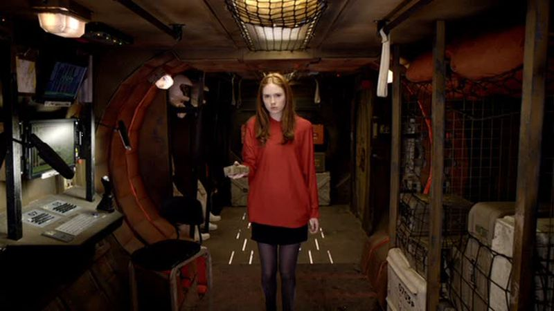\ 

Only now she's doing it too.  The cut to her grabbing the remote entailed a movement in space that the audience wasn't privy to.  All of the directorial energy in this sequence is going into establishing an impossible rhythm predicated on moving without movement.  After Pond tries to unplug the monitor, the camera reverses to this:

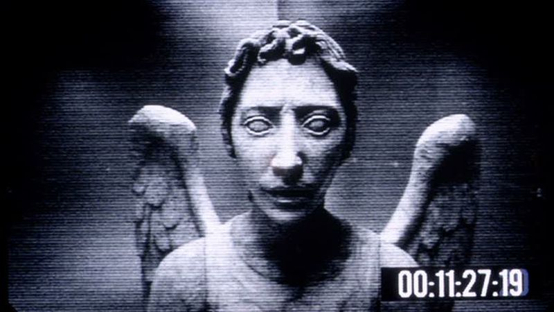\ 

For a moment it seems as if the camera's zoomed in on the Angel, but then the brain registers that the time-stamp is the same size and position relative to the camera, which means *God damn it* that statue is at it again.  If she looks away again it'll crash through the screen and be in the room with her, but that's impossible: it's just a four second recording of a statue, it can't move-without-moving through a screen and into the real world.  Of course, it shouldn't be able to move-without-moving either, yet here it is.

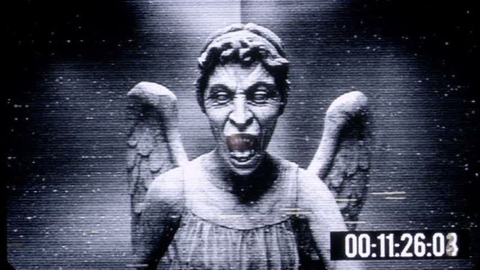\ 

Great, now it's angry.  Pond, will you please stop not-looking at the screen before someone, namely you, gets hurt?

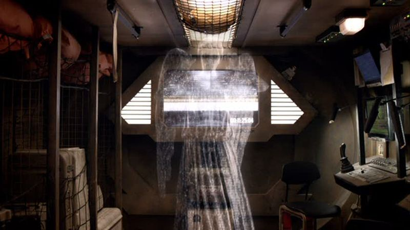\ 

Pond!  What did I just ask you, not even but a sentence ago?  Stop not-looking at the screen!  I think you can see where I, following Moffat and Smith, am headed with this one: telling someone not to not-be-looking at something is a fundamentally strange request, but it's one that's at the heart of horror films.  Only in this case, the directive isn't general—for example, if only those attractive young people had noticed all the signs of their impending deaths, they wouldn't have ended up monster-fodder—but literal.  The monster that you can see won't kill you if you just keep looking at it.

(There's much more to say about this scene and episode, but I still have another class to prepare for.  More then, possibly, later.)
