## Doctor Who - "Vincent and the Doctor": Together Alone

 * Originally located at http://acephalous.typepad.com/acephalous/2012/02/doctor-who-vincent-and-the-doctor.html

> This be [another one of those posts](http://acephalous.typepad.com/acephalous/2011/11/scott-eric-kaufmans-visual-rhetoric-compendium-as-of-11282011.html) in which I “[[feign] some kind of cultural superiority ... even though [my] opinions and tastes are largely shite of the first water [that force most commenters to] make an effort to shaddup when [I] want to wax long and philosophical about some mainstream film [I'm] content to call art.](http://www.lawyersgunsmoneyblog.com/2012/02/whitney-houston-again/comment-page-1#comment-224598)”

I covered the palette of "Vincent and the Doctor" in [my post about the *Leverage* episode "The Van Gogh Job,"](http://acephalous.typepad.com/acephalous/2012/01/leverage-post.html) so I'll save some time and just say the wheat:

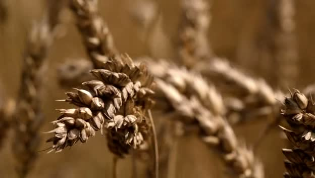\ 

The wheat:

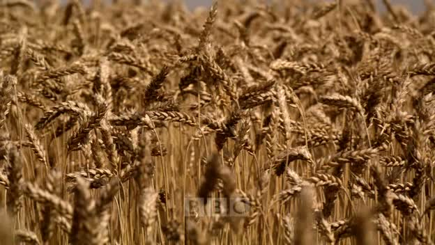\ 

The wheat:

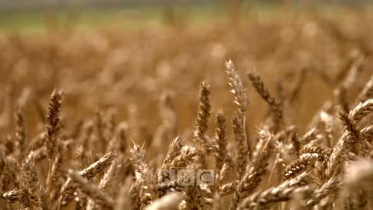\ 

The wheat may not seem that important—though [damn do I love it](http://acephalous.typepad.com/acephalous/2007/09/wheat-lots-of-w.html)—but it calls to mind Woody Allen's famous parody of Ingmar Bergman in *Love & Death*, which is relevant because "Vincent and the Doctor" is an episode devoted to the consequences of loneliness (felt or otherwise). The Doctor's alone because he's the Doctor; Amy's alone because (unbeknownst to her) Rory's been unwritten from existence; Vincent's alone because Vincent's always been alone; and the Krafayis is alone because it's been abandoned by its fellows. This is a story that's fundamentally about lonely people "coming together," only director Jonny Campbell doesn't shoot it that way. I bring up the visual punning on the wheat because the shots it parodies are relevant. To wit:

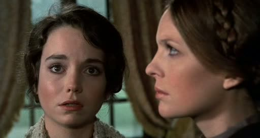\ 

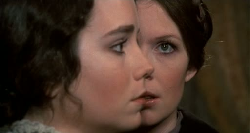\ 

All they're saying there is "wheat." They're together but alone—speaking but not communicating. I'm referencing the parody instead of the original because of the punned wheat, but it bears remembering that Bergman's use of this technique is equally ironic: he alienates his characters by going against the grain (*ahem*) of film convention ([as discussed here](http://acephalous.typepad.com/acephalous/2012/02/doctor-who-amys-choice-rhetorical-film-analysis.html)) and including characters whose isolation is destroying them in the same frame. They're made to look more alone by being shot together. Campbell employs a similar shot at the end of "Vincent and the Doctor":

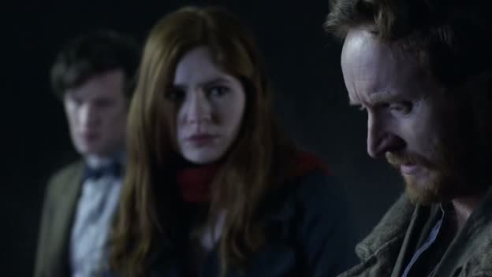\ 

It's staged like a Bergman shot, and although there's no mention of wheat in it, the moment Campbell chooses to go full-Bergman is significant: these three lonely souls have just dispatched the fourth mentioned above, but they can't come together either in victory or mourning. Their loneliness is too fundamental to their character. The can (and do) share a moment shortly thereafter, lying in the grass and seeing the night's sky as Van Gogh does:

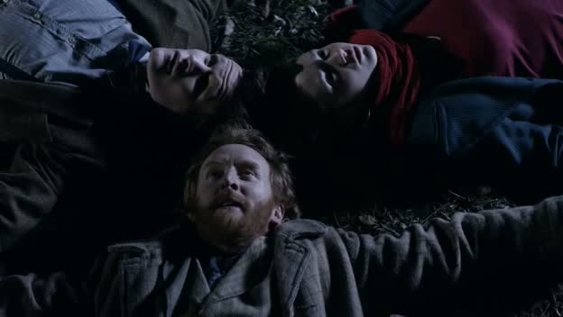\ 

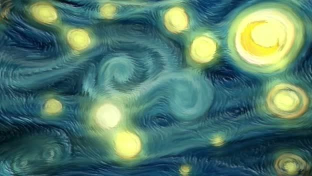\ 

But even this moment is purely compensatory: Amy's still lost Rory; the Doctor's still the Doctor; Vincent's still going to commit suicide; and the Krafayis is now that different kind of alone we call dead. My evidence for this together-alone dynamic is, as I'd hope you'd expect, more substantial than a pun and a parody. Unlike the other episodes this season ([linked above](http://acephalous.typepad.com/acephalous/2012/02/doctor-who-amys-choice-rhetorical-film-analysis.html)), "Vincent and the Doctor" includes more reverse shot sequences in which single characters inhabit a frame. Consider a few stills from a conversation between the Doctor, Amy, and Vincent:

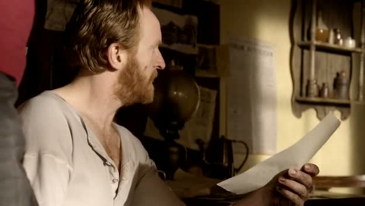\ 

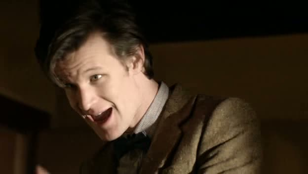\ 

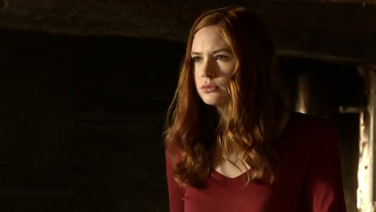\ 

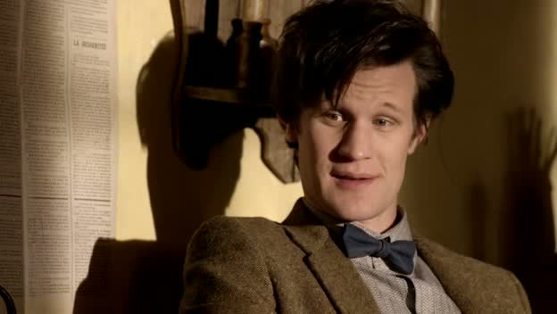\ 

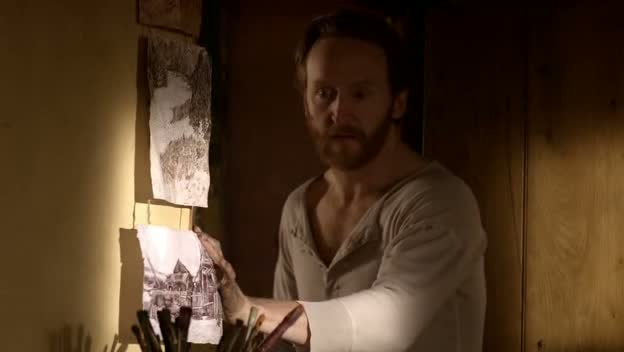\ 

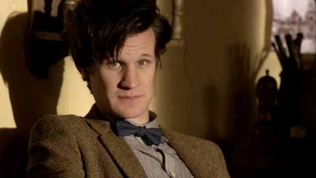\ 

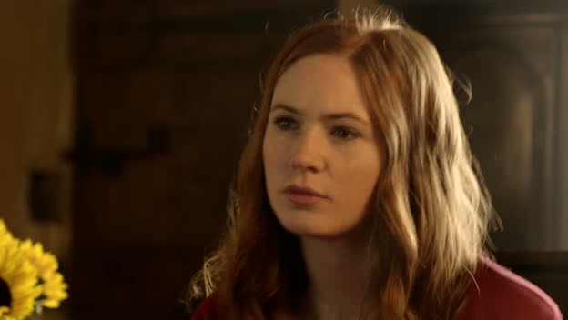\ 

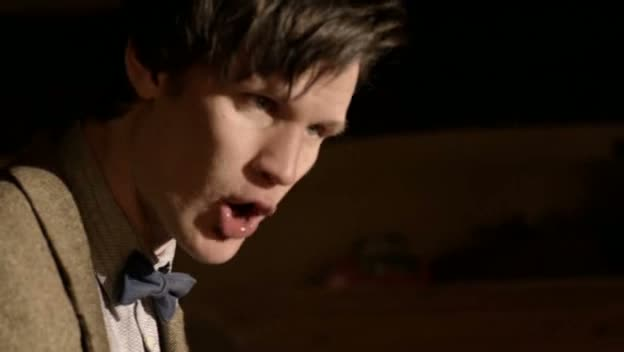\ 

There's a moment when the Doctor and Vincent occupy the same frame, but the overarching structure of Campbell's direction is visible nonetheless: instead of framing these characters in a way that encourages audiences to forge connections between them, Campbell shoots a sequence of reverse shots that isolate these characters. As regards Vincent, that's to be expected: he's the episode's designated loner. As regards Amy and the Doctor, this shot selection is something new. It's almost as if the husband who's now never existed has finally managed to come between them, and this separation's manifesting itself onscreen by their isolation in close-ups and Campbell's homages to Bergman.

There's more to be said about this episode—in particular, its use of shadows as proxies for the people who create them—but in the interest of brevity I'll leave that for the comments.
