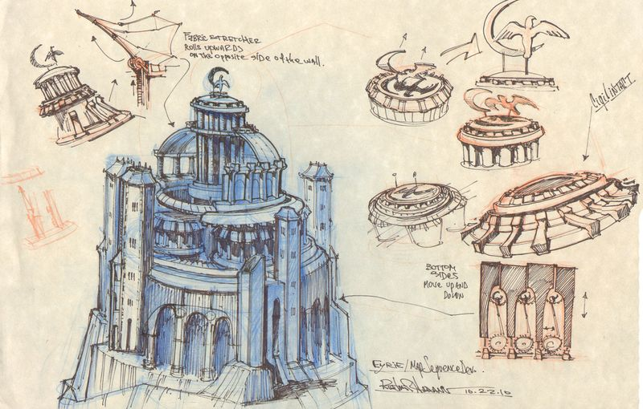
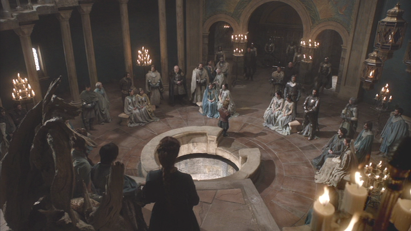
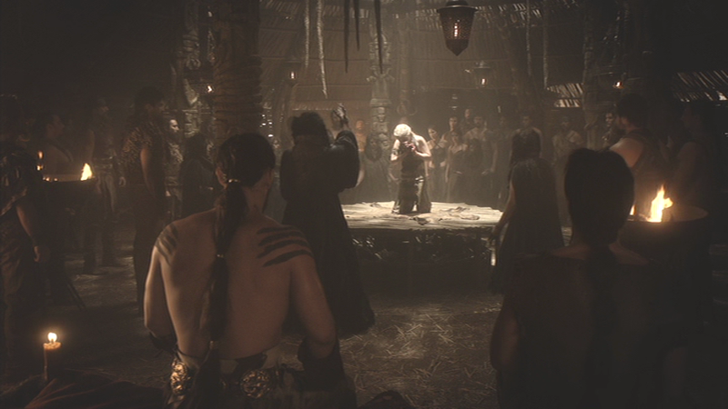
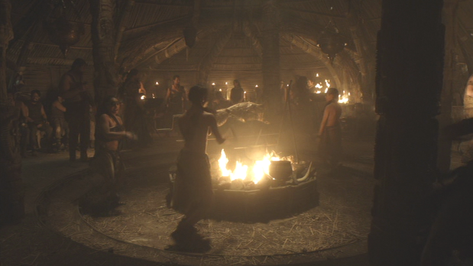
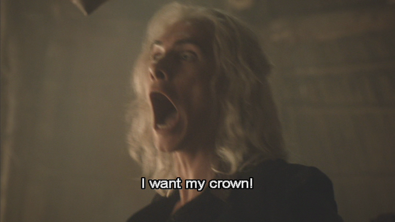
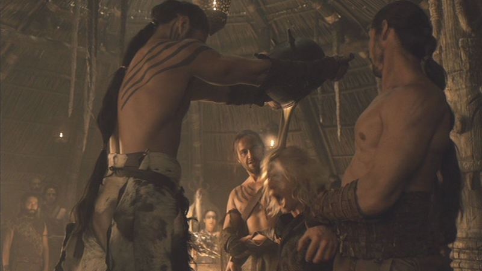

## Game of Thrones - "A Golden Crown": How circular is "A Golden Crown"?

 * Originally located at http://acephalous.typepad.com/acephalous/2012/11/game-of-thrones-how-circular-is-a-golden-crown.html

Very. I know you're tired of hearing me [talk about circles](http://acephalous.typepad.com/acephalous/2012/11/game-of-thrones-everyone-is-alone-everyone-is-surrounded-in-the-wolf-and-the-lion.html), but it's not my fault: the series is making me do it. Consider the set design of the Eyrie:

\ 

Circles within circles—and significantly, the Moon Door, which had been in a wall in the novel, was shifted to the center of the circular audience chamber for the series:

\ 

I mentioned in the previous post that I wouldn't talk about "empty centers," but this one is too significant not to. At the center of the seat of power in the Vale is, literally, nothing. A hole. (An *execution* hole.) An absence that, should someone step into it, well:

\ 

The writers and producers of the show moved the Moon Door so it would occupy the same place in the audience chamber that Jon, Tyrion, Jaime and Bronn did previous episodes: in the center of a circle, surrounded and imperiled. Only this center is pure peril, not possible, and an absence of power that is absolute instead of merely hypothetical. Put differently: it's a powerful absence.

On the one hand this makes perfect sense: in a contest for a throne that only a single person can hold, the position of power is inherently fraught. Visualizing it in circular terms, as the *Game of Thrones* team does, replicates that tension on-screen: Jon was in no more danger in "Lord Snow" than Jaime was in "The Wolf and the Lion" in their central positions, but they were still in some danger, as were those describing the circle around them. Capturing the precariousness of the central position is crucial to understanding the stakes of playing the game of thrones. Consider Dany in this episode:

\ 

She needs to eat that stallion heart, and she needs to keep it down. In the oddly egalitarian Dothraki society, her husband sits on the rim of the circle. Only because she is currently undergoing a trial-by-carpaccio is she allowed to occupy the central position. When the hoard is regularly arrayed, she sits beside her husband on the rim:

\ 

At the center is not a person but a communal meal, which says quite about their society but I'm not going to address that here. I'm more interested in what happens when a person steps into the center of the circle and says

\ 

Why, they give him one, of course:

\ 

A golden crown that, surprisingly, isn't a circle so much as a molten bowl. Point being, this isn't an episode in which one really wants to occupy the central position, and that's not surprisingly, given the run of the narrative: the Lannisters are making their move against Baratheon and Stark, creating a vacuum that undermines the formerly inherent power of the central position, which will remain unoccupied and contested for the remainder of the season.

That said, the next post will only mention circles in passing, I promise.
