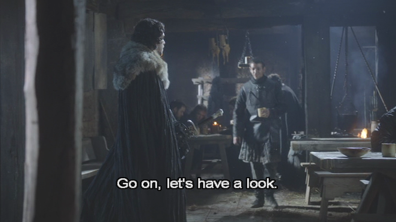
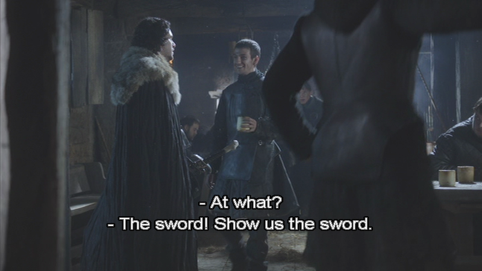
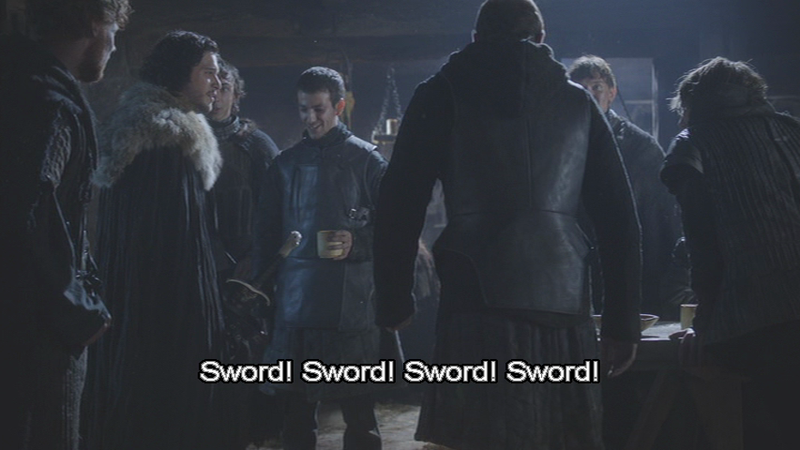
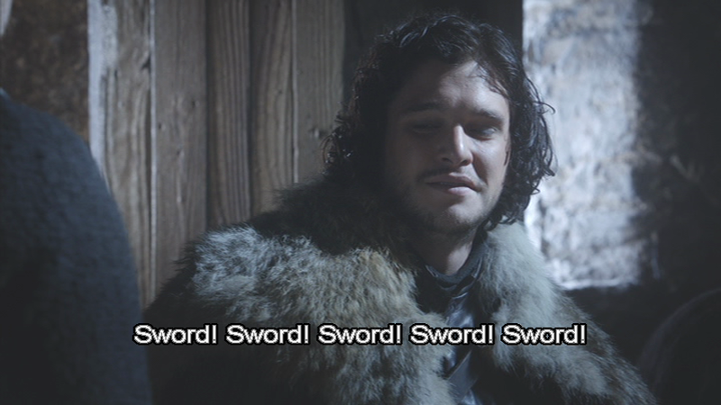
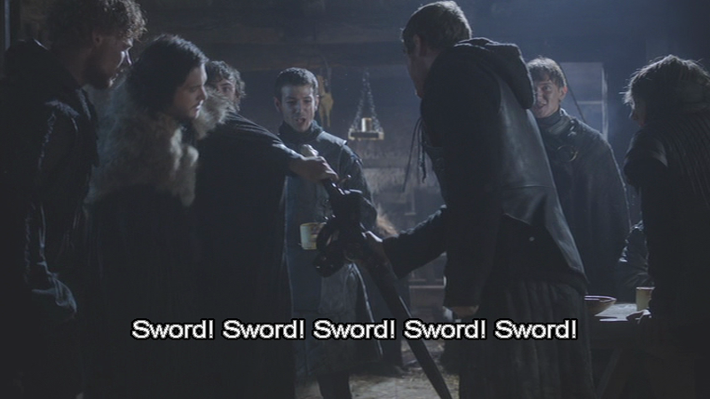
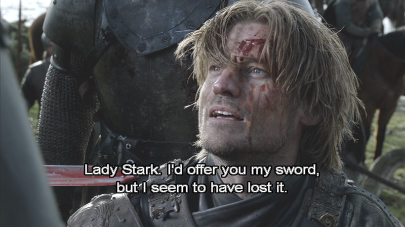
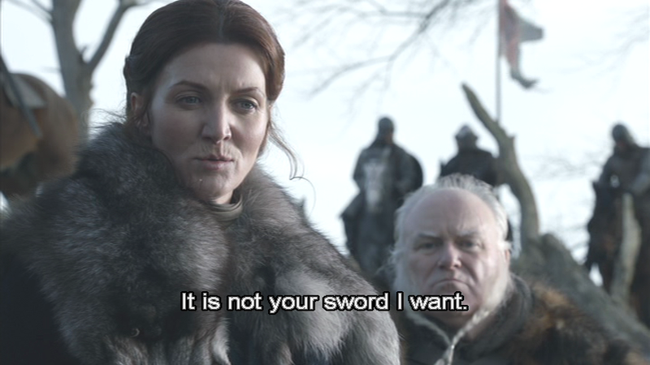
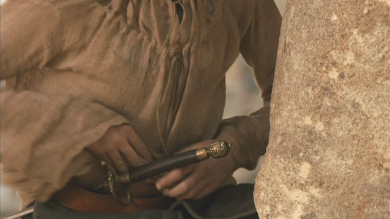
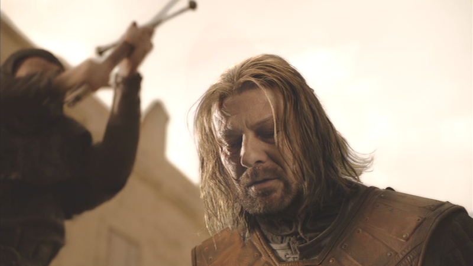

## Game of Thrones - "Baelor": Swords! Swords! Swords! in "Baelor"

 * Originally located at http://acephalous.typepad.com/acephalous/2012/11/game-of-thrones-swords-swords-swords-in-baelor.html

Earlier in the quarter, I introduced my students to [the anything-that's-longer-than-it-is-wide mode of psychoanalytic criticism](http://acephalous.typepad.com/acephalous/2007/06/last_month_i_ch.html). Not very sophisticated, I know, but it helps explain the historical context of certain rhetorical tropes.\* Given that this class is based on *Game of Thrones*, the discussion inevitably landed on the subject of swords as phallic symbols, and I noted that while there's nothing necessary or natural about that connection, it is one of long-standing and therefore might have influenced how George R.R. Martin employed them in his narrative. Which the students took to mean "SWORDS EQUAL PENISES," a not altogether unfortunate development given how the Arya and Needle string undermines conventional gender assumptions. It did, however, make teaching the ninth episode, "Baelor," a little difficult. The episode opens with Lord Commander Mormont gifting a sword, Longclaw, meant for his son, Jorah Mormont, to Jon Snow. Snow proceeds down the stairs and is immediately accosted by his Wall-fellows:

\ 

Keeping in mind what my students think swords equal, consider the eyeline match in this shot. Not explicit enough? Fine:

\ 

That man seems a little too excited to see Jon's sword.

\ 

They *all* seem a little too excited to see Jon's sword.

\ 

And Jon seems a little too happy at how excited they all are to see his sword. But he obliges:

\ 

If you think I'm being juvenile and sword-blinkered, consider this scene in which a captured Jaime Lannister throws himself before the mercy of Lady Stark:

\ 

Nothing emasculating about that. The same can't be said for this:

\ 

Even skipping over the scene in which Daenerys demands that the previously de-sworded Jorah Mormount draw his sword for her, it's clear that this episode is very much about swords. Remember how it ends?

\ 

I mean *after* Arya considers drawing the symbol of male empowerment she's appropriated for herself before realizing the inevitable futility of doing so:

\ 

There you go. The point of all this is that anyone analyzing this episode needs to account for its economy of swords: they're distributed, re-distributed, lost, stolen, and finally wielded by a masked man at a sham of an execution. This execution, by the by, neatly parallels [the scene in the first episode](http://acephalous.typepad.com/acephalous/2012/09/game-of-thrones-winter-is-coming-for-will-and-bran.html) in a manner that highlights their differences: in both instances a man is being executed, only in "Baelor" the beheader has become the beheadee, the trial isn't just, and the Stark child witnessing it is commanded not to look.

So, as I was saying, swords! Swords! Swords! Swords!

\* As an example of psychoanalytic criticism, I use an explication of *The Castle* circa 1950, in which the tall lanky K. and his short round assistants, Artur and Jeremias, are reduced to the walking-talking male genitalia Kafka clearly intended them to be.
