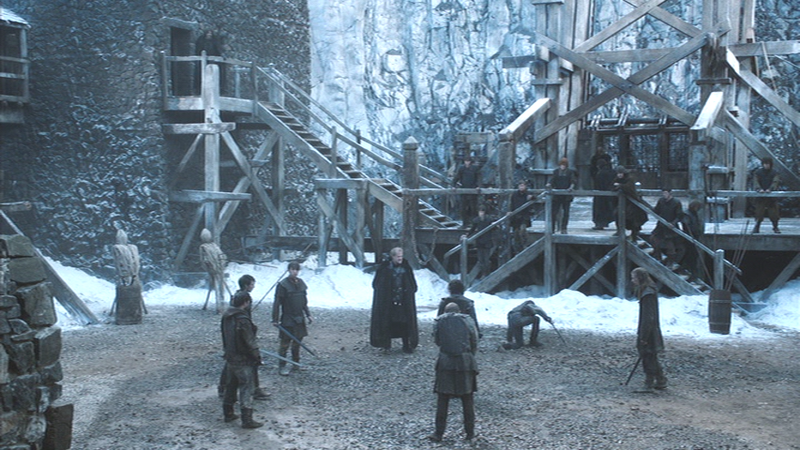
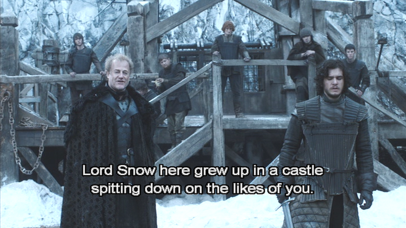
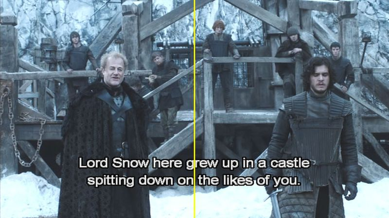
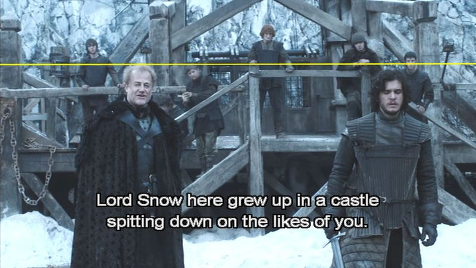
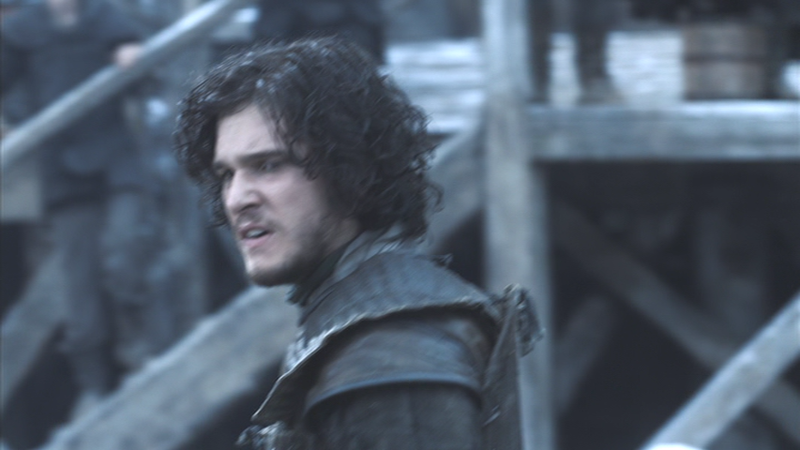
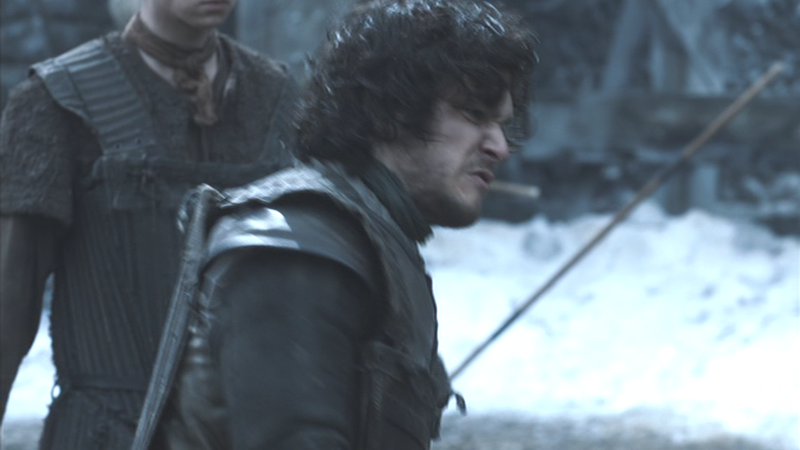
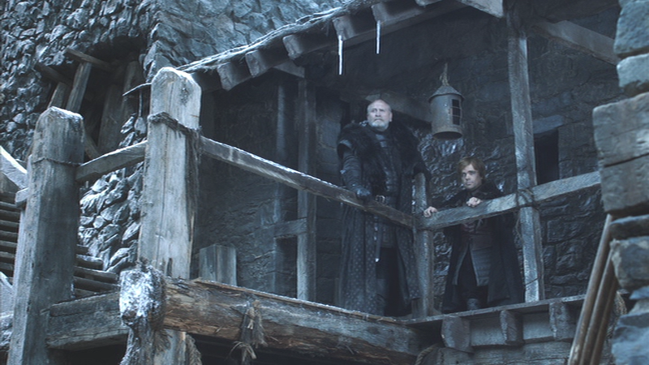

## Game of Thrones - "Lord Snow": "Lord Snow," you're no bigger than a half-man\*

 * Originally located at http://acephalous.typepad.com/acephalous/2012/10/game-of-thrones-lord-snow-theres-a-half-man-here-to-see-you.html

Since I have two classes to devote to "Lord Snow," the third episode in the first season of *Game of Thrones*, I thought I'd divide them between the characters. In this post and the next we'll hie to the Wall with Jon Snow and Tyrion Lannister; in the final one, we'll churn through the Dothraki Sea with Daenerys Targaryen. I'm pairing Jon and Tyrion not simply because of the odd bond they form on the way to the Wall, but because they present similar problems to director Brian Kirk: both must be built up, knocked down, and rebuilt. As [you recall](http://acephalous.typepad.com/acephalous/2012/09/game-of-thrones-winter-is-coming-for-catelyn-stark-and-jon-snow.html), in the first episode of the series Jon Snow's [the victim](http://acephalous.typepad.com/.a/6a00d8341c2df453ef017c32223b74970b-500wi) of Catelyn Starks's [redirected aggression](http://acephalous.typepad.com/.a/6a00d8341c2df453ef017ee3c5f9be970d-500wi): she can't stop Ned from taking Bran to an execution, but she can glower at her husband's bastard from above.

Then he decides to take a position in the Night's Watch, which means leaving Winterfell and joining his "black brothers" on the Wall. So lowly Jon Snow arrives at the Wall and finds himself a trained fighter among thieves and rapists and people who believe they deserve the nickname "Ser Piggy." In this lot, lowly Jon Snow isn't nearly so lowly. Director Kirk establishes that when in a prolonged training sequence early in the episode:

\ 

Everyone in this long shot is diminished by its dimensions: Ser Alliser Thorne, who likes Jon not one whit, is the closest to occupying frame-center, but the scale's so small that his figure can hardly be said to "dominate" the shot:

\ 

My patented yellow-line-technology demonstrates that frame center's about a foot above his head, but it also reveals something else about the Wall's intended scale: all of the sparring combatants are in the bottom triangle, and all of the spectators are in the the one on the right, which leaves the top and left triangles empty of people. (Note: I'm officiating the next two frames like a football ref with a sketchy understanding of what constitutes an offside position.) The compositional weight of the left and top frames seems to bear down on the tiny figure in bottom one, such that even the foremost among them, Alliser, cedes center-frame to a weathered baluster. All of which is only to say that, initially, Kirk continues shooting Jon with the same disdain that came from Catelyn's eyes. Until:

\ 

He cuts to a medium shot in which a weathered baluster still occupies center frame—except in this case it creates a telling vertical element that divides the frame between Alliser and Jon like so:

\ 

It's close enough for government work—which might cause those who have finished the novels to chuckle—but the basic point is that the purpose of this scene is for Alliser to break Jon, but that frame speaks to his inevitable failure. They each occupy the central position of their respective sides, but the importance of each is tempered by the unusally high [level of framing](http://classes.yale.edu/film-analysis/htmfiles/cinematography.htm#48009):

\ 

As [noted previously](http://acephalous.typepad.com/acephalous/2011/11/doctor-who-the-pandorica-opens.html), unusally high levels of framing—by which I mean shots in which the characters who should occupy the entire vertical space in the frame don't—creates the impression that the world the characters occupy is pressing down on them. It communicates to the audience that the circumstances in the frame are, in this case, at least one-third as important as the characters who aren't even central to it. If I wanted to be really clever I'd skew the vertical line from the frame-before-last and claim that the most important element of this shot seems to be the baluster's weathered head:

\ 

But I won't, because the baluster's head being elevated is less important than Alliser and Jon's being humbled by the composition. Alliser considers himself Jon's superior, but the shot says otherwise. Alliser's words directly harken back to Snow and Catelyn's encounter in "Winter Is Coming," meaning the audience should remember that Jon's not the spitter but the spat upon. All of which adds up to Ser Alliser putting on airs and Jon being right about where he should be in the social scheme of things. At least until he begins to fight. He glowers to the left:

\ 

He growls to the right:

\ 

He owns those medium close-ups. He beats down every person from [the bottom triangle above](http://acephalous.typepad.com/.a/6a00d8341c2df453ef017c32b9d9a5970b-800wi) because he is the Big Man on the Wall. Or not:

\ 

Cutting away from the scene of Jon's successive victories to Mormont and Tyrion simultaneously accomplishes two things: first, it puts both Alliser and Jon back in the below-place, beneath the betters whose lowly subjects they are no matter how skillfully they fight; second, it places Jon beneath Tyrion in a manner that, again, reminds the audience of Catelyn's earlier disdain. Except unlike Catelyn, who has the luxury of despising her husband's bastard, there's no condescension in Tyrion's positioning. Is this because he's a "half-man"? (A term I use because it's what the novels and series do, not because I endorse it entering the common tongue.) I don't think so ... and I don't think so because that shot of Tyrion dominates him and Mormont as thoroughly as the earlier one oppressed Alliser and Jon. Feel free to draw your own yellow lines on it, but by now pointing out that the characters are off-center and that the spaces above and beneath them make this long shot feel longer than it is.

Which isn't to say the low angle of framing is unimportant: Mormont and Tyrion are supposed to appear superior to Alliser and Jon, but the scale of the shot indicates that "superior" is a relative term here *because everyone is dwarfed by the wall*.\*\* In sum, this short scene re-establishes Jon's unimportance, establishes his potential significance, then re-re-establishes his unimportance as a function of everyone's insignificance compared to the Wall. "Everyone" is, of course, a group that includes Tyrion, whose building-ups and tearing-downs I'll cover tomorrow.

\* The logic of this post and the next isn't entirely different from that of [this one](http://acephalous.typepad.com/acephalous/2012/05/games-of-thrones-little-big-men-in-blackwater.html), about "Blackwater," except that I can't teach the "Blackwater" post because I'm working through the first season and it's in the second.

\*\* No pun intended. I just couldn't bear to type the word "diminish" again.
