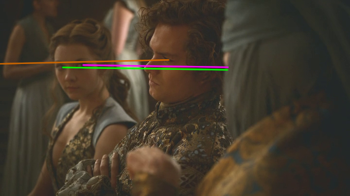
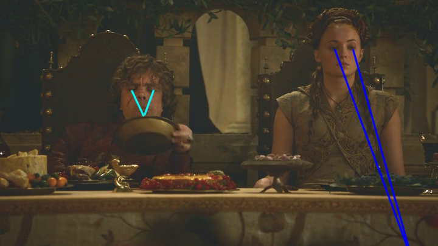

## Game of Thrones - "Second Sons": I see that you've seen that I saw you: miscommunication in "Second Sons"

 * Originally located at http://acephalous.typepad.com/acephalous/2013/05/i-see-that-youve-seen-that-i-saw-you-miscommunication-in-second-sons-game-of-thrones.html

This is a complement to [the most recent podcast Steven Attewell and I produced](http://www.lawyersgunsmoneyblog.com/2013/05/second-sons-an-lgm-podcast-on-game-of-thrones-with-steven-attewell-and-sek), on “Second Sons,” in which we discussed, among many things—[some of them kitten-related](http://youtu.be/5KQ8ti9CHRU#t=10m10s)—miscommunication and the wedding of Sansa Stark and Tyrion Lannister. I found [my contribution to that part of the discussion](http://youtu.be/5KQ8ti9CHRU#t=42m48s) lacking, so I decided to demonstrate what I meant about Tyrion coming to dominate a scene that possesses real potential for chaos. But first let me make two noncontroversial statements:

1. Prior to acquiring language, mammals developed the ability to use their eyeballs to control others’ eyeballs simply by looking around an environment.
2. Filmmakers have long taken advantage of our inability not to follow the eyeballs of characters as they glance around the screen.

So if you walk into a crowd and everyone’s looking up:

\ 

I don’t care who you are or where you’re from, you’re going to follow their eyes and look up too:

\ 

It’s just natural—even if [you’re *really* not from around here](http://acephalous.typepad.com/acephalous/2011/09/richard-donner-knew-that-superman-needed-a-powerful-entrance-in-superman-1978-but-he-also-knew-that-the-one-element-that-i.html). The same logic applies when you’re watching a film. If all the characters look at something, your eyes will follow theirs. It’s the quietest means a director has to move your eyeballs where he or she wants them. Noisier varieties include dramatic movement, the sudden appearance of a new object or character, a loud unexpected sound, etc. Clearly these attentive systems evolved hand-in-hand: the first person who notices the sudden appearance of a new object may make a dramatic movement, which catches the attention of everyone else and compels them to follow that first person’s glance. For example, if four people are in dining room and one of them notices *a giant fucking lion* in the kitchen, that person’s likely to make a dramatic movement accompanied by a loud unexpected sound; everyone else will turn to that person and then follow their glance into the kitchen, at which point they’ll also notice *a giant fucking lion* and panic will happen. At this point in our social evolution, however, we don’t need dramatic movements and loud unexpected sounds to compel our eyes to follow others’ glances—we just do it.

When coupled with all the social strictures that regulate who can look at whom and in what way and when, the potential for a director to make an audience very uncomfortable should be obvious. They can make us look at things we shouldn’t be looking at, or at things we can be looking at but are doing so wrongly, or most powerfully, they can use the sympathy or enmity they’ve already established for particular characters to make us pity or praise them for the direction of their glances. The wedding of Sansa and Tyrion is a perfect example of exactly how this is done by someone quite talented at doing it, Michelle MacClaren, whose episode of *Breaking Bad*, “Gliding Over All,” [was all](http://www.lawyersgunsmoneyblog.com/2012/09/breaking-bad-gliding-over-all-said-the-fly-to-the-money-pile) about [staring](http://www.lawyersgunsmoneyblog.com/2012/09/breaking-bad-gliding-over-all-the-invisible-lines-and-immaterial-connections) and [following stares](http://www.lawyersgunsmoneyblog.com/2012/09/breaking-bad-gliding-over-all-until-youre-not). (In fact that second link contains images [strongly resembling](http://acephalous.typepad.com/files/breaking-bad00076.png) those about to follow, except this time, for ease of reference I’ll keep everyone’s eyelines a consistent color: Joffrey’s yellow, Tyrion’s teal, etc.) So let’s start staring!

\ 

Here we have Joffrey repaying Tyrion for the venomous look Tyrion shot him when he saw that the boy-king, who had murdered Sansa’s father, would be accompanying her down the aisle in her murdered father’s stead. Note that though Joffrey occupies the central element of the screen, his exaggerated posture as he bends to steal Tyrion’s wedding-stool mocks his uncle’s stature. He need not say a word—the insult is understood:

\ 

MacClaren responds to the boy-king’s pettiness by closing in on Tyrion’s face. The audience sympathizes with the sadness in Tyrion’s eyes just as it had the hatred moments earlier. His eyes aren’t open and inviting—as say [this fellow’s are](http://acephalous.typepad.com/frodo%20bigger%20eyes.jpg)—but we’re close enough to his face to register the pain upon it, which makes the following shot all the more judgmental:

\ 

The perspective on Cersei’s eyeline is a little off—she’s actually looking more up and towards the audience, which now stands approximately where Tyrion did—but Joffrey’s clearly looking not at his uncle but at Sansa, his former bride-to-be, as a means of furthering her humiliation. Neither mother nor son need speak a word for the audience to hate them for openly mocking an already tragic scene. We only need follow their eyes to condemn them. This dynamic continues right through to the wedding feast:

\ 

The scene opens without an establishing shot. Instead, this medium shot is the only information the audience has about who's there and where they exist in space. Joffrey and Cersei are staring in the same general direction, and we want to know what they’re looking at:

\ 

Apparently they’re looking at Tyrion, except that doesn’t seem right. They medium shot was level with them and they appeared to be looking down, whereas now we seem to have a close-up that’s angled slightly low, meaning we seem to be looking slightly up. This could be a reverse to an eyeline match—that it follows the shot of Joffrey and Cersei strongly suggests as much—but the attention Tyrion’s paying to pouring his glass suggests that if he’s the object of their eyeline match, he’s an unwitting one. Given how “drunk” he’ll become, that’s a possibility, but my real point here is that the first two shots of the wedding banquet are merely contiguous, nothing more. They follow each other, but they don’t do so in a conventional manner, meaning that two shots into this banquet the audience is already a little lost about who’s where. Perhaps the next shot will provide a clue?

\ 

It will not. The bride’s not watching her new husband attentively pour himself more wine, she’s looking off-screen at something, but we’re not privy to what. But at the very least MacClaren makes a compelling point with the direction of their respective glances: the attentions of the newly betrothed are literally pointed in opposite directions, his to the left, hers to the right. Maybe we’ll get to see what she’s looking at?

\ 

This is at least a possibility: even though the camera’s level on Olenna Tyrell, it’s possible that Sansa’s looking down on her and that this is an eyeline match; but even if she is, what’s significant that Olenna’s not looking up and returning Sansa’s eyeline. There’s no connection between them—no eye contact—which only doubles the audience’s impression of Sansa’s isolation: she was just looking in the opposite direction of her husband, but now she’s watching someone have a conversation with someone else. Who Olenna’s having that conversation with isn’t clear because, again, MacClaren’s still hasn’t provided us with an establishing shot. All we can tell is that it’s *not* Sansa.

At this point in the scene we have no way to orient ourselves in it: we can’t tell who’s looking at what or talking to whom, and as social animals who try to locate ourselves in social spaces, we find this extremely unsettling. It’s the equivalent of being a child lost among a sea of legs in a room we don’t recognize: we can tell that people are looking at things but not what; we can tell that people are related to each other but not how; and we can only acquire information one face at a time because we’re too fucking short to see above the crowd. This can’t go on forever. At some point MacClaren must relent:

\ 

And she does, but only somewhat, because we still don’t know which one of these three Sansa was looking at. We thought we did because of the logic of the initial reverse to Olenna, but now we see that she could’ve been looking at *any* of these three people who aren’t returning her glance. So Sansa’s still doubly lonely, but at least we know that Olenna’s talking to Margaery Tyrell. However, just because we have some information about the relative location of people in the room doesn’t mean people are going to start communicating with each other: Olenna and Margaery’s conversation excludes Loras Tyrell, who sits between them and glares at something off the left side of the screen. What? Maybe we’ll finally have a conventional reverse?

\ 

Didn’t think so. Now we’ve got a long shot of the Lannister table from over Sansa’s shoulder, which may not be a conventional reverse, but at least helps situate us in space. We assumed that Olenna and Margaery and Loras were to Sansa’s left because the earlier shot of Olenna could’ve been an unrequited eyeline match; if we pair that assumption with the fact that Joffrey and Cersei are to her right, we can infer 1) that Cersei’s staring down someone at the Tyrell table, possibly Loras, who was looking in her direction in the previous shot; and 2) that Joffrey and Cersei weren’t staring at Tyrion in that opening shot, but at the Tyrell table. Specifically—albeit for different reasons—they were both [staring at the left side of the Tyrell table](http://www.lawyersgunsmoneyblog.com/wp-content/uploads/2013/05/second-sons00076.png), meaning that in all likelihood this scene opened with mother and son staring at their wife-and-sister-among-many-other-things-to-be, Margaery. But in the above, at least someone’s finally making eye contact with Sansa—except that it’s Joffrey and he’s making shit-eating eyes at her. MacClaren cuts to the groom’s shoulder’s perspective:

\ 

Which informs us that the one example of eye contact previous to Joffrey and Sansa’s has been broken, as Olenna’s now staring at the Lannister table, presumably in response to Cersei shooting red lasers at Margaery in the previous shot. Margaery seems unaware of—or is ignoring—Cersei’s glare, but she has to recognize that Olenna’s broken eye contact with her. Loras, still utterly uninvolved, stares at the table. Tyrion, however, is watching Olenna stare at his sister with what seems—because no one’s looking at him—like an almost anthropological curiosity. He’s watching everyone watch everyone else without making eye contact with anyone. It’s almost like *he’s gauging the room in preparation for some sort of performance*. After Olenna turns back to Margaery, perhaps embarrassed by having been caught staring so intently, Cersei turns to Joffrey:

\ 

Who’s clearly still trying to eye-fuck Sansa. Before seeing her response, it’s important to note that even though she’s his mother and has made him the “man” he is today, she’s being unduly deferential and speaking to him without even attempting to establish eye contact. As for Sansa:

\ 

She has found something very interesting on the floor. She’s looking neither at the Tyrell nor the Lannister table now, while her new husband stares, in an exaggerated fashion, into a pitcher of wine. It’s almost as if he wants people to think that he doesn’t know how it works anymore—that he’s so far in his cups he hasn’t a fucking a clue how to put more wine in them. Although it’s doubtful she knows what Tyrion’s planning, Sansa clearly wants no part of the dynamic she’s witnessing develop. And with good reason:

\ 

Now both of them are staring at her. Which provides Margaery an opportunity to stare at them:

\ 

Note that there’s no cross-talk going on between tables. The only way the Tyrells and Lannisters are communicating are through these glances. But before Margaery can figure out what they’re talking about—and most likely for her own good—Olenna draws her back into conversation:

\ 

Which seems to annoy Loras enough that he decides to leave, but instead of him leaving in this shot, MacClaren returns to the long shot from over Tyrion’s shoulder:

\ 

Tyrion seems to believe that Loras’s departure indicates that rules are about to change. Whatever sense of decorum had held these parties in check has been violated. That it’s Loras tiring of being spoken past by Margaery and Olenna is immaterial. The dynamic in the room is shifting and Tyrion needs to take control of it. He does so the best way he knows how:

\ 

By appearing to be *very* drunk.

\ 

So very drunk Sansa has no choice but to resume her study of the floor, only this time more enthusiastically. But Tyrion’s performance may have been a little too loud and dramatic, because it’s caught his father’s attention:

\ 

Tywin sees Tyrion staring “drunkenly” at his reflection and realizes that Tyrion’s realized something. Tywin isn’t sure exactly what—it’s not like they’ve been talking to each other with words or anything—but he realizes that his clever son has seen an opportunity of some sort and, alerted to the potential threat, will likely do something about it. He knows better than anyone that Tyrion can become *a giant fucking lion* when it suits his needs, and Tywin is determined that nothing of the sort will happen tonight. Because although it’s Tyrion’s wedding night, it’s the culmination of Twyin’s plans, and he’s not about to let his clever son disrupt them. Since he knows Tyrion’s a rational person, Twyin decides to convince him of the wrongness of whatever it is he’s about to do, but he never gets the chance:

\ 

Because as he started walking toward his rational son, his irrational grandson set his sights on Sansa, who has now found a fascinating object of study on the ceiling. Margaery notices Joffrey’s movements:

\ 

But she stared too long. Joffrey notices her noticing him:

\ 

And clearly decides that whatever indignity he was about to subject Sansa to must now include Margaery as well:

\ 

Nice try, Margaery, but he already caught you. You’re now an integral part of whatever plan he’s explaining to his mother:

\ 

Because he’s talking to her—but he’s looking at you. Even she knows this isn’t going to end well:

\ 

So what began as a drunken wedding party in which we, the audience, couldn’t orient ourselves either in space or with relation to the attendants is now about to turn ugly. Imagine that? A drunken wedding party turning ugly! Except given the involvement of Joffrey—a boy-king so monstrous even his mother seems afraid to make eye contact with him—the ugliness that could ensue could be beheading-Eddard-Stark awful. The only hope seems to be that Tywin can convince Tyrion to put aside whatever play he’s developing and put a stop to Joffrey’s ... and about that I’ll have more to say tomorrow.
