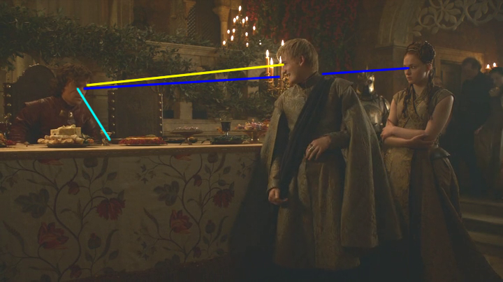

## Game of Thrones - "Second Sons": I still know that you've seen that I saw you: miscommunication in "Second Sons"

 * Originally located at http://acephalous.typepad.com/acephalous/2013/05/i-still-know-that-youve-seen-that-i-saw-you-miscommunication-in-second-sons-game-of-thrones.html

To recap: this is a complement to [the most recent podcast Steven Attewell and I produced](http://www.lawyersgunsmoneyblog.com/2013/05/second-sons-an-lgm-podcast-on-game-of-thrones-with-steven-attewell-and-sek), on “Second Sons,” in which we discussed, among many things, miscommunication at the wedding of Sansa Stark and Tyrion Lannister. I found [my contribution to that part of the discussion](http://youtu.be/5KQ8ti9CHRU#t=42m48s) lacking, so I decided to demonstrate what I meant about Tyrion coming to dominate a scene that possesses real potential for chaos. The first part [can be found here](http://www.lawyersgunsmoneyblog.com/2013/05/www.lawyersgunsmoneyblog.com/2013/05/i-see-that-youve-seen-that-i-saw-you-miscommunication-in-second-sons-game-of-thrones/) and really needs to be read for the following to make sense.

When we left off, what had been a hostile but orderly wedding banquet teetered on the edge of something. Relations had been frosty but fine until Loras Tyrell reminded people how legs work and walked away from the table, which [inspired Tyrion](http://www.lawyersgunsmoneyblog.com/wp-content/uploads/2013/05/second-sons00223a.png) to do something with alcohol. His father, Tywin, noticed his clever son noticing Loras and, aware that Tyrion can become *a giant fucking lion* when the mood strikes, strode across the hall to talk to him. However, his grandson (twice-over) had a terrible idea: Joffrey “Baratheon” decided to humiliate his former bride-to-be, Sansa, but [caught Margaery Tyrell noticing his planning-face](http://www.lawyersgunsmoneyblog.com/wp-content/uploads/2013/05/second-sons00249.png) and decided she should be part of it too. All of this happened via glances passing between parties. We resume mere seconds after the last post ended, with Tyrion staring at Sansa’s ass:

\ 

This is only unusual not only because, in recent episodes, Tyrion’s been shot in a manner that makes his head appear level to those of the people he’s speaking to. From the camera’s perspective, when he spoke to his father, sister or nephew, he’d ceased being a little person. But earlier in this episode, his height — and its relation to his sexual abilities — had been made an issue when he met with Sansa:

\ 

Such is what’s required of him *not* to stare at her ass. The contrast between this shot before the wedding and the one of his father — that’s Twyin behind him in the first image — is part of both Michelle MacClaren, the director, and Tyrion’s respective plans. In order to make himself appear drunker than he actually is, Tyrion abandons the pretense of being the willful supplicant and lets his eyes rest at their natural level. That it happens to coincide with Sansa’s ass is a happy and convenient coincidence that fails to impress his father:

\ 

Note that since she’s merely moving the camera up and to the let about a foot, MacClaren could’ve used a conventional two-shot; but because conventional two-shots create the impression of a bond between characters, she shot them individually. This has two effects: it reinforces the notion that these two are only strategically “intimate,” and it allows Tyrion to dominate the screen when he’s on it. That may not seem significant, but it’s important that the audience, at this moment, see Tyrion as someone capable of dominating the screen:

\ 

Is his father behind him? Yes, in the literal sense; but only maybe in the colloquial, because Tywin doesn’t know what Tyrion’s planning. But in a scene in which eyelines and eyeline matches are so important, it’s not a coincidence that while Tywin’s staring directly at his son, Tyrion’s refusing to establish eye contact at all. It was his eyes, after all, that gave away the fact that he was planning something earlier, so no matter how very intently his father stares at him:

\ 

Tyrion’s going to refuse to meet that stare, which would allow his father further entry into whatever it is he’s planning. It’s significant that the dialogue at this moment is mostly Tywin talking about the importance of *his* plans for Tyrion and Sansa coming to fruition. It’s as if he’s trying to stare Tyrion into submission, but it’s not working:

\ 

Tyrion won’t return his father’s gaze — because in addition to giving away his own plan, it would suggest consenting with his father’s. So he continues to make contact with everything except his father’s eyes. This is where the situation stands when MacClaren pulls the camera back into the only kind of two-shot that doesn’t suggest a bond between characters, *i.e.* one in which the characters are looking past each other *in different directions*:

\ 

This is a singular variation of the two one-shots of [Tyrion](http://www.lawyersgunsmoneyblog.com/wp-content/uploads/2013/05/second-sons00077.png) and [Sansa](http://www.lawyersgunsmoneyblog.com/wp-content/uploads/2013/05/second-sons00078.png) earlier in the scene. So intent is Tyrion on not making eye contact with his father that he’s failed to notice that Joffrey’s returned. Tywin recognizes the gravity of the situation: Joffrey’s decided that Tyrion and Sansa should be “gently” escorted to their wedding chambers and stripped for all to see, and Tywin isn’t entirely sure how to tell his grandson that this is a foul idea. So he leaves:

\ 

Note that as Joffrey enters and calls for Sansa’s public humiliation, he’s looking *right at Margaery*. The threat isn’t even implicit: he caught her staring at his planning-face and wants her to know exactly how their upcoming nuptials will end. Tyrion isn’t sure what to do. Whatever his plan had been, Joffrey’s has interrupted it, so Tyrion takes a moment to stare at his wine glass again. He may not be sure what to do next, but he’s certain it’ll involve alcohol. Joffrey then seeks approval from his mother:

\ 

Or, more accurately, from the chair she recently vacated. Despite the audience’s initial confusion as to where the characters were in space and in relation to each other, at this point it’s clear that Joffrey’s staring at his mother’s empty chair. Sansa, meanwhile, can no more make eye contact with the boy-king [than his mother could](http://www.lawyersgunsmoneyblog.com/wp-content/uploads/2013/05/second-sons00218.png). She knows the depravities of which he’s capable. The audience, at this moment, is reminded of what happened when Margaery stared directly at him. One does not make eye contact with the boy king. Tyrion agrees:

\ 

He continues to stare at the table evaluating his options. He ignores both Joffrey’s taunt and Sansa’s plea. The situation is so unbearable that the audience is happy to follow everyone’s eyelines to the Tyrion, then to the happy couple’s table: better to be staring at the table cloth than dealing with what’s about to happen. And it *is* about to happen:

\ 

Joffrey turns back to the audience generally, and in the direction of the Tyrell table particularly, and reiterates his terrible idea: Sansa shall be carried to her wedding bed and stripped. Publicly. That she’s not included in this shot indicates that this isn’t really about her. Obviously, Joffrey enjoys humiliating her — but his design here is grander and aimed, along with his eyes, on his future in-laws. Tyrion
bides time. Then he doesn’t:

\ 

Now *this* is a lovely little shot. Tyrion’s pretending to be far more intoxicated than he actually is, so initially the fact that this seems to be a shallow focus shot *of nothing* could be his drunken perspective. It isn’t. Tyrion’s decided to act, and though it’s difficult to see, there’s the thin edge of a blade in front of Sansa’s down-turned face. MacClaren racks the focus to capture Joffrey’s expression:

\ 

Tyrion’s just *pulled a knife on the king*. Joffrey’s face says it all: “You don’tpull a knife on the king! *You don’t pull a knife on the king*!” Unless you do:

\ 

And here’s the close-up the entire scene’s been setting up: Tyrion staring down Joffrey at eye level. He’s no longer Sansa’s willful supplicant: he’s dominating this close-up and he’s *a giant fucking lion* and no one has any idea what to do or where to look:

\ 

Because he’s Joffrey, Joffrey looks to his mother’s empty chair. Tywin seems to be looking there too, a plaintive glance that somehow communicates his disdain for how Cersei’s raised the boy-king. Margeary seems to be the only one who can look at Tyrion — Olenna stares at her staring at him while Sansa studies the floor *and silly me I almost forgot* Tyrion continues giving Joffrey the eye-fuck of the century:

\ 

Who owns this room? *Tyrion owns this room*. His father’s impressed:

\ 

Note that he’s not making direct eye contact with Tyrion though. He’s looking in the right direction, but not high enough to be looking at Tyrion. The perspective’s a little off here because he’s looking at the camera, so I had to approximate his eyeline. There’s other evidence that he’s not looking precisely at Tyrion though:

\ 

Joffrey isn’t looking directly at him either. Note that Sansa and Margaery are looking to Tywin for their cues, because everyone seems to realize what happens when the boy-king’s brought to anger. And he’s certainly angry: he’s been forced to lower his eyes to his uncle because he’s suffering what Elizabeth Loftus calls “[weapon focus](http://en.wikipedia.org/wiki/Weapon_focus)“:

\ 

Except it’s not fear that’s blinding him so much as outrage. *You do not pull a knife on the king*! But he’s not only offended: he’s profoundly disappointed that what should have been Sansa’s humiliating moment has become his. Tyrion’s ruined the evening’s “entertainment.” He’s upset the king. That Joffrey can’t steal his eyes away from the knife is a telling detail: it’s part and parcel of [his reluctance to do anything for himself](http://www.lawyersgunsmoneyblog.com/2012/11/game-of-thrones-table-setting-and-brain-burning-in-you-win-or-you-die). He’s as much of a Lannister as a person can possibly be, but he lacks the conviction for self-reliance Tywin tried to teach Jaime in that scene. Unlike Ned Stark, [who in the first episode of the series beheaded poor Will in a manner befitting a lord](http://acephalous.typepad.com/acephalous/2012/09/game-of-thrones-winter-is-coming-for-will-and-bran.html), Joffrey orders knights to kill people and executioners to put them down. Sansa, meanwhile, seems to recognize how precarious her situation is and studies the floor so as not to draw Joffrey’s ire further, and that’s when Tywin calls a stop to it:

\ 

He shifts his eyes — but not his body — from the Tyrion’s blade to the enraged boy-king. Significantly, it’s while he’s looking at Joffrey that Tyrion finally relents:

\ 

He still dominates the screen — and the room for that matter — but he breaks into an ostensibly drunken laugh and eases the tension among the gathered. That he relents doesn’t change the fact that he’s just put the boy-king in his place, publicly, in a moment of enforced humiliation that Joffrey thought would be his. Little as the victory may matter in the long run, on this day Tyrion’s succeeded where Joffrey failed. He’s taken ownership of his own wedding banquet away from the boy-king who thinks the world belongs to him — who thinks he’s the culmination of his grandfather’s lifetime of scheming. And it’s in this moment that Tywin, for once, seems to agree:

\ 

Or sees something on the ceiling and decides to look at it. This is the one eyeline that baffled me. Is he looking at Cersei descending from the balcony maybe? Is this an exaggerated glance at Tyrion for the purpose of making him seem “taller” in the eyes of the assembled? I don’t know. But I do know that his estimation of what Tyrion’s accomplished isn’t out of line with mine. It’s just he doesn’t see the point in needlessly annoying the boy-king. Fortunately for the audience, MacClaren’s been watching the show and understands the joy that comes with watching Joffrey impotently
roar.

*Especially* when it’s at his “little uncle” and *especially* when it’s because he’s interrupted the boy-king’s reindeer games.
