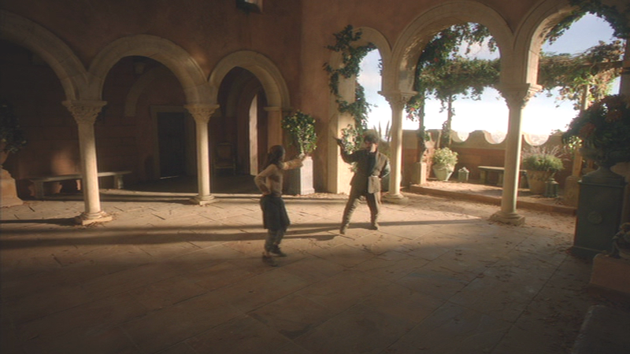
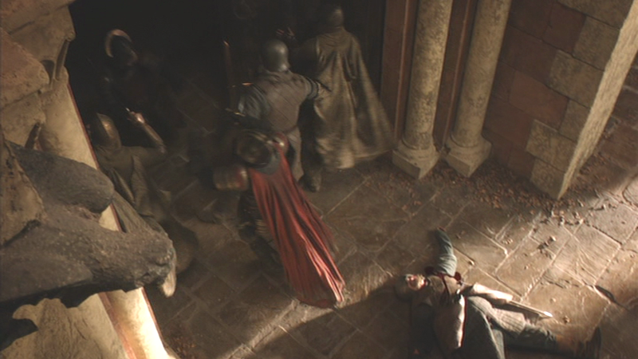
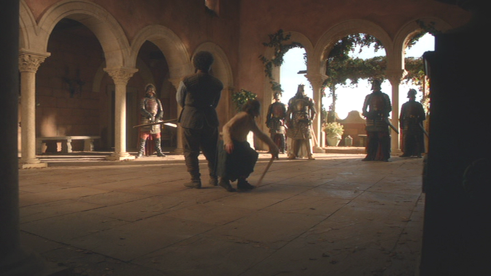
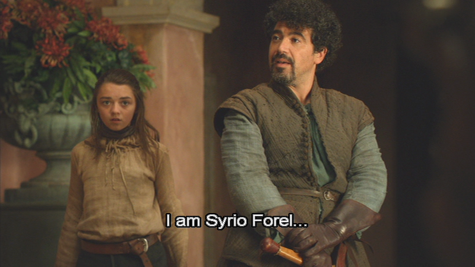
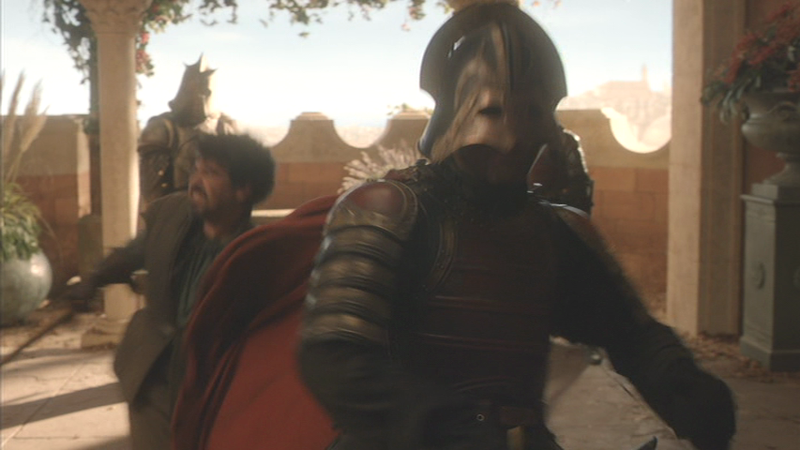
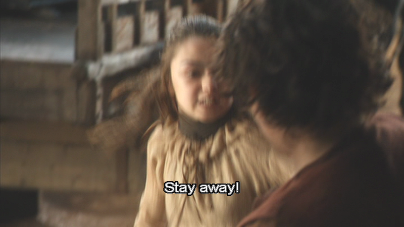
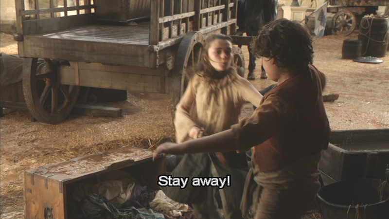
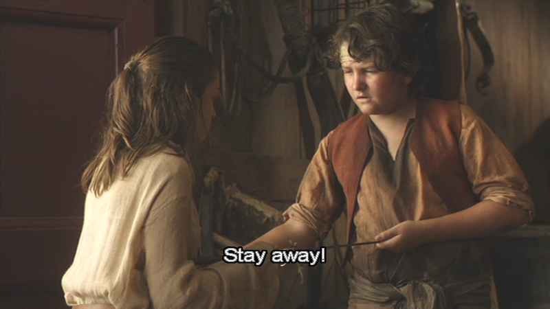
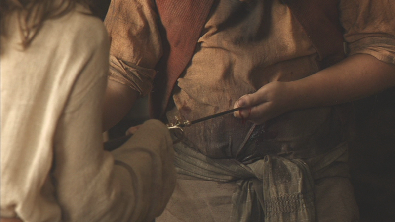

## Game of Thrones - "The Pointy End": Learning to use "The Pointy End"

 * Originally located at http://acephalous.typepad.com/acephalous/2012/11/game-of-thrones-learning-to-use-the-pointy-end-.html

As I noted in my first post about this course, one of the signal elements of high fantasy as a genre is the presence of [a coming-of-age narrative](http://www.lawyersgunsmoneyblog.com/2012/10/fellowship-of-the-ring-conventions-of-film-conventions-of-genre), and *Game of Thrones* is clearly no exception. "The Pointy End," in fact, delivers three distinct moments in which a character is provided an opportunity to take a significant step in his or her maturation process. (It actually contains more than three, but only three of the characters take advantage of the opportunity provided and I want to focus on them.) We'll begin with Arya Stark, who as the episode opens is literally practicing at life:

\ 

The balanced long shot employed by director Daniel Minihan has the effect of bringing a sense of calm to this fencing lesson. Arya and her instructor, Syrio Forel, are playing at combat in a manner as elegant as this shot is composed. Note that Arya moves between the third arch from frame-left, while Syrio strikes at her from the third arch from frame-right. If this is fighting, it is unlike the brutal art being performed outside this very room at this very point in time:

\ 

This violence is sloppily composed, with the elements of the background functioning as mere backdrop to the slaughter before them. The characters rush into and out of focus as jagged edits push and pull the viewer from one point in the mise-en-scene to another seemingly without reason. I say "seemingly" because the disorientation is clearly the point. Not being able to tell who is and isn't on "the pointy end" is why Minihan cuts from the above to:

\ 

To here only after this skirmish concludes. The Lannister guards have a dispatched a man who lies helpless, dying if not already dead, and Minihan makes his suffering seem insignificant by shooting it from a high angle with canted framing. The canted framing is important because it keeps the shot uncomfortable even after the initial confusion is resolved. ("So *that* is who was on the pointy end.") The deliberately awkward composition of the previous two frames and the frantic editing that transitioned one to the next leads to a clash not just between characters in the show but the formal elements of its direction. When the Lannister guards confront Syrio and Arya, the shot maintains most of its initial balance:

\ 

It is slightly altered because the circumstances of the characters it had framed has altered. The fight that follows, then, will be between both the characters and their attendent compositions. Here, it seems as if Syrio and Arya have the upper hand: they occupy the center of the frame and the slightly low angle of framing makes them appear slightly more dominant than the figures in the background. (Who are the same height, relative to the frame, as Arya at this point.) This is Arya's moment—the point in her coming-of-age narrative in which she puts her training into practice—or it would be if not for the fact that

\ 

[...you killed his father. Prepare to die.](http://youtu.be/6JGp7Meg42U) He obviously doesn't say that, but this clearly is *his* moment, the one he for which he has prepared his entire life: he will take on multiple armed and armored guards with a wooden practice sword. How does he fare?

\ 

\ 

Quite well. Note that unlike the earlier scenes with the guards, which employed quick edits and canted angles, here Minihan uses a tracking shot to follow Syrio as he dances his way through the fight. In terms of composition, so long as Syrio retains the upper hand the pans will be gentle and the takes long. Whoever commands the scene dictates how it will be shot. Which makes its final long shot especially poignant:

\ 

The composition suggests that no matter how this fight ends—and given that it ends off-frame the outcome, however strongly implied, remains unknown—Syrio's composure will allow him to win the moral victory. Cold comfort, obviously, but it's what he's imparted to Arya during these lessons. When her moment finally comes, she will decide with the same steadiness of mind and control of body as Syrio displays here.

\ 

\ 

\ 

\ 

\ 

Or not. Arya's first kill is shot through with the same chaotic editing that characterized those of the Lannister guards. Minihan begins with a close-up of Arya yelling and thrusting, cuts to a medium long shot of her still yelling and stabbing, then reverses to a medium shot of her slipping the knife in his belly, then reverses to a medium close-up on Arya's face as she finishes yelling and realizes what she's done, then reverses one last time to the boy's face before panning down to his belly. *All in less than three seconds*. The grace that accompanied Syrio to his likely end is nowhere evident in this moment, meaning that whatever she did here, she didn't put in practice what Syrio had taught her. 

So what did she learn here? What significant development in her coming-of-age narrative did she achieve? I'm not entirely sure. She killed someone, which is surely a moment for sour reflection. She learned that running in the face of death is sometimes better than dying with honor, but she also learned that there's honor in dying with dignity, and while those lessons aren't contradictory, they certainly aren't complementary. What I appreciate about the way these scenes were set up is that they clearly mark important moments in her development, but decline to provide the audience with a pat moral statement of what exactly was developed. (The most extreme cases of which being the once ubiquitous "very special episodes" of sitcoms which weren't "special," much less "very.") In other words, Minihan's provided us with a moment of precise ambiguity, in which we know that something momentous has happened but can't easily decipher what exactly it was.

Tomorrow I'll continue to channel my inner New Critic by doing readings of Robb Stark and Dany's similarly ambiguous developmental milestones.
