## Game of Thrones - "The Wolf and The Lion": Everyone is alone, everyone is surrounded

 * Originally located at http://acephalous.typepad.com/acephalous/2012/11/game-of-thrones-everyone-is-alone-everyone-is-surrounded-in-the-wolf-and-the-lion.html

I always say that titles don't matter, then I go on to demonstrate how they do, so I see no harm in doing so again: the definite articles in the title matter because this episode focuses on what it's like to be "the" Stark (wolf) or "the" Lannister (lion) in the room. And the roles keep reversing. In "Lord Snow," [Jon Snow (wolf) stood alone in the middle of a circle](http://acephalous.typepad.com/acephalous/2012/10/game-of-thrones-lord-snow-theres-a-half-man-here-to-see-you.html), surrounded by people who wished him ill and observed by Tyrion Lannister (lion); in "The Wolf and the Lion," Tyrion stands in the center of a circle, surrounded by people who wish him ill and observed by Lady Stark (wolf):

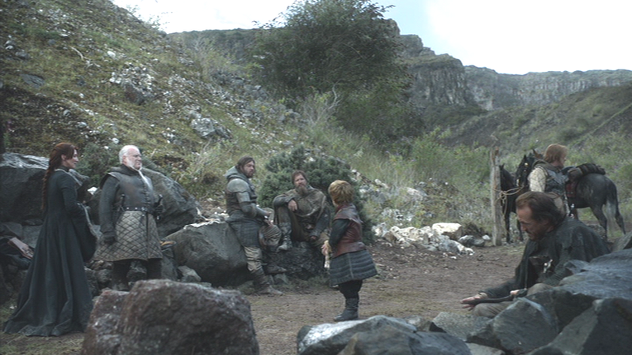\ 

The shots are not identical in scale, but they are nearly identical in composition: in both cases a significant character [is nearly](http://acephalous.typepad.com/.a/6a00d8341c2df453ef017c32b9d9a5970b-popup), but not quite, occupying the center the frame:

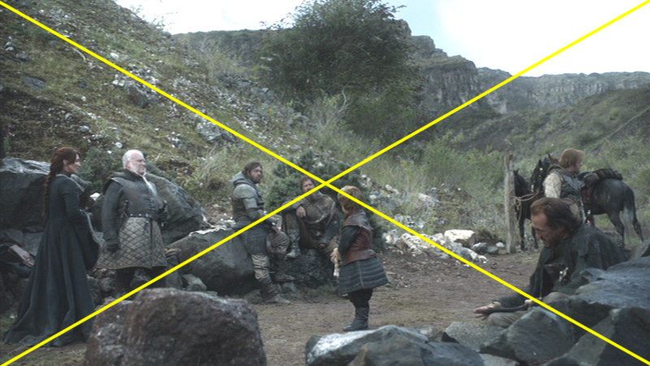\ 

I don't want to harp on about explicitly literary tropes like "empty centers," so instead I'll just note that the reason the center is empty both in "Lord Snow" and this episode is partly because the top half of the frame occupies fifty percent of the shot *and* is (ostensibly) empty of people. The features of the landscape are dominating the characters, and with good reason: the Wall in "Lord Snow" and the Eastern Road here represent (or in this case pose) more of a threat to the characters than they do to each other. Even if, as is almost the case above, a character's head sat square in the crosshairs, he or she still wouldn't be a dominant element in the frame. The (very) long shot allows the viewer to understand that whatever threats or pleas these characters enjoin, those hills behind them don't care, nor do the people in them:

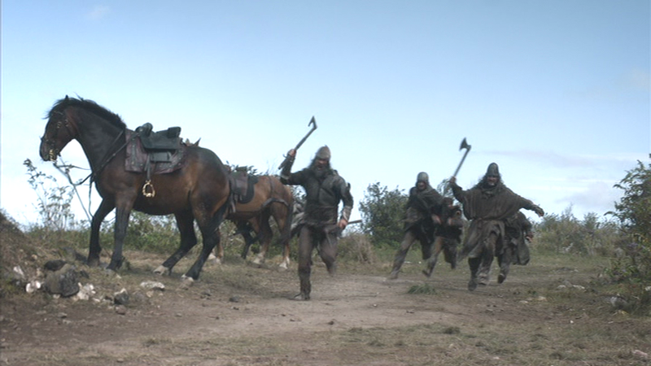\ 

Granted, those hill people are running down the road, but I can't show you the hill people in the hills any better than I did (or didn't) above: they're a part of the landscape from which projectiles emanate more than they are people. Because it only appeared in the first frame above that Lady Stark and those beholden (however temporarily) to her surrounded Tyrion: in truth the circles were concentric, with the hill people surrounding Stark surrounding Tyrion, and when this becomes clear to all involved, these lonely wolves and lions call a kind of truce:

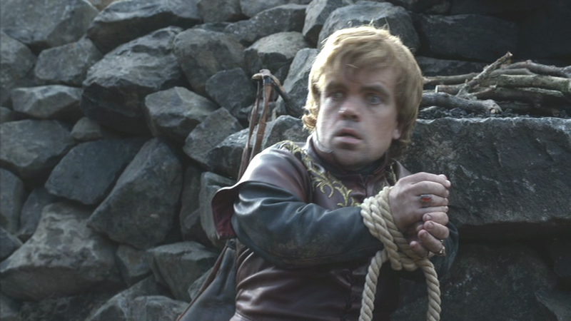\ 

Tyrion stands alone, surrounded by hill people, as does:

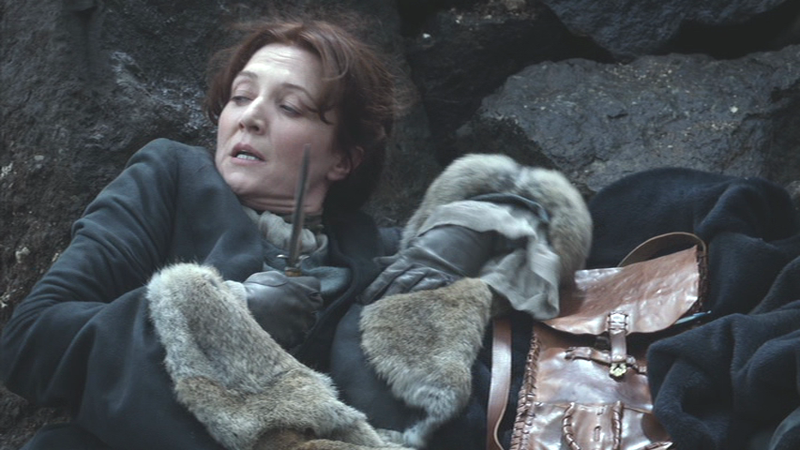\ 

Lady Stark. Both of the proud members of these noble houses are cowering, because both are surrounded now. Shifting to the medium close-up allows the audience to read the fear on their faces, and the fact that both of those eyeline matches look off-frame and, in fact, are unrequited by the next shot creates an addition sense of chaos. Because if the people in the middle of a scrum can't figure out what its focal point is, how is the audience supposed to? Perhaps if they worked together?

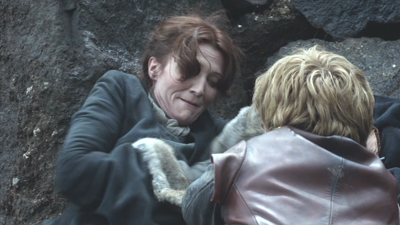\ 

If she unties his hands, maybe the focal point will come into—

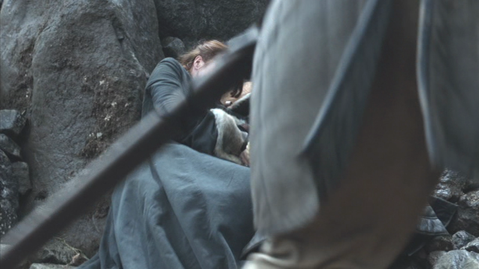\ 

Excuse me, "Ser," Lady Stark and Tyrion are trying to have a momen—

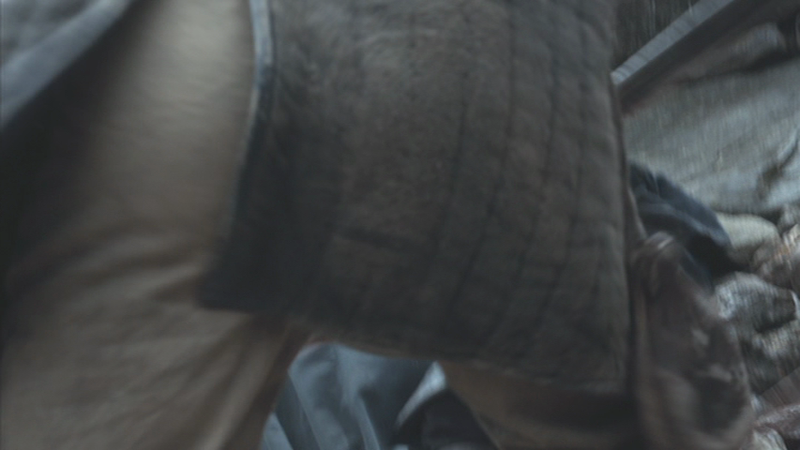\ 

No, that's worse, now all we can see is your a—

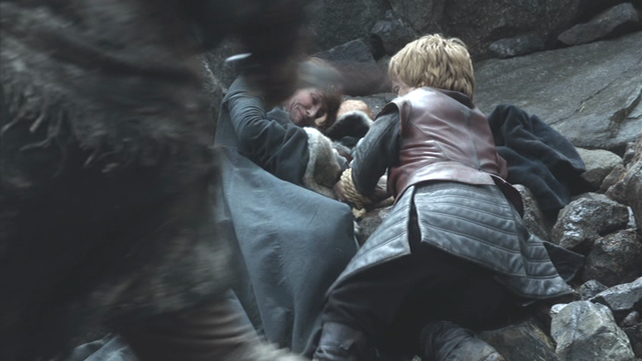\ 

At least now we can see the important people again. Now as I was writing before my shot was so rudely obstructed, Lady Stark and Tyrion are the important people here, which is why when they come together—when they are no longer alone—the person who's actually the most significant in the person in the sequence dances through the foreground. Whatever momentary truce they come to in the midst of battle matters far less than Bronn playing [the interrupting sellsword](http://uncyclopedia.wikia.com/wiki/Interrupting_cow). The rest of the sequence (12:49 and *ff*.) substantiates my point, but this post is unwieldy as is and the visual emphasis on Bronn's talents is easily discernible to anyone who's read any of these posts. The previous scene occurs on the Eastern Road to the Vale, which Lady Stark and Tyrion eventually reach only to find themselves surrounded again:

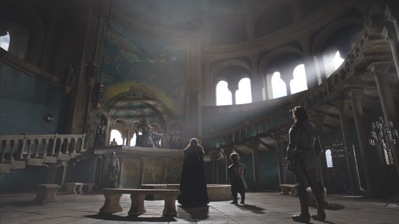\ 

Placing Lady Stark in the center of a circle (described off-frame by the Knights of the Vale) puts her in a position analogous to Jon and Tyrion's earlier, meaning that despite the context of the scene (that is her sister on that throne), because the directors have trained the audience to consider center-circle people imperiled, she doesn't seem altogether safe. Nor is she. The director of this episode, Brian Kirk, points out via his short selection that whatever bond she shared with Tyrion on the road to the Vale has been unforged:

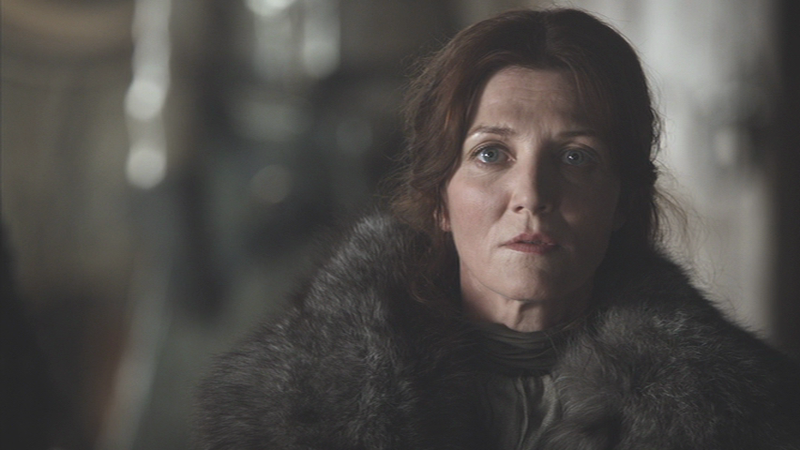\ 

She is as alone here [as she was in "Winter Is Coming."](http://acephalous.typepad.com/acephalous/2012/09/game-of-thrones-winter-is-coming-for-catelyn-stark-and-jon-snow.html) The close-up and shallow focus emphasize her isolation, and a similarly scaled shot is used to reflect Tyrion's reactions to her sister's words:

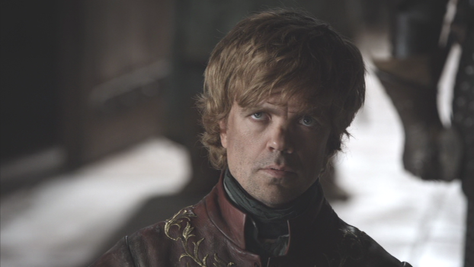\ 

In fact, the only people in this scene who aren't alone—who occupy the same frame at the same time—are her sister and her nephew:

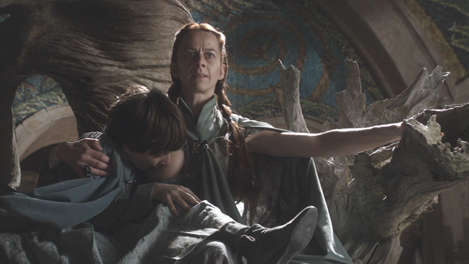\ 

Which strikes me as an unsubtle argument in favor of being alone. But Lady Stark is not the only lonely wolf, nor is Tyrion the only lonely lion. There are five more scenes in the episode I should discuss, but only one more that I must, which is at the end of the episode, and the reason I must is because it deliberately confounds my entire argument about center-circle people:

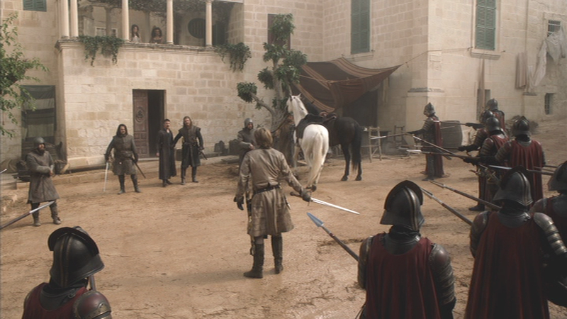\ 

This shot is nearly identical in scale and composition to the first one I discussed, only this time the lonely Lannister isn't in jeopardy. He stands in the center of the circle *threatening* the periphery as opposed to being threatened by it. The suggestion from the earlier shot—that this is secretly a concentric circle—still holds simply because of the percentage of the frame occupied by Littlefinger's bordello, but all those spears seem to be pointing at it too. All of which is only to say that this shot interests me because it undermines my argument, *i.e.* because it surprises me. In an episode dominated by lonely and imperiled wolves and lions, this shot suggests that even though this series is teaching its audience how to watch it, viewers need to keep vigilant because the writers and directors are more than willing to confound the very expectations they created.
