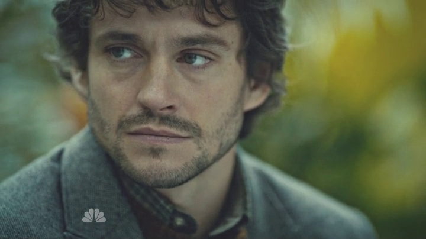
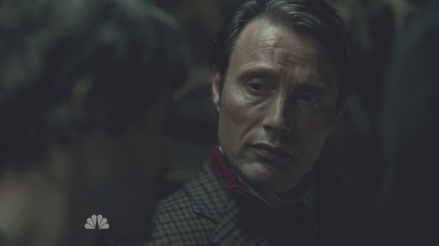
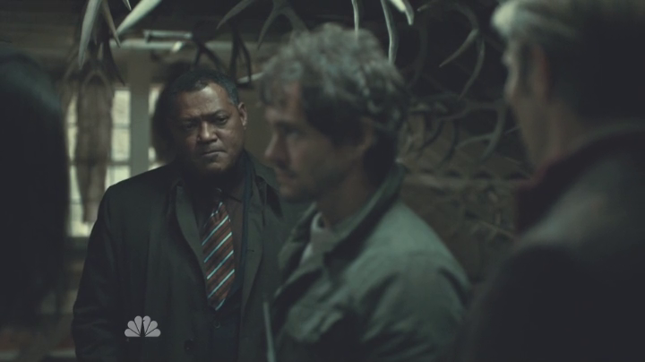
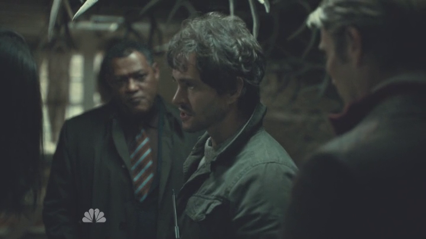

## Hannibal: Surprisingly, not unwatchable

 * Originally located at http://acephalous.typepad.com/acephalous/2013/04/surprisingly-not-unwatchable-hannibal.html

I say “surprisingly” because the show’s producer — and at this point, principle director — is [David Slade](http://www.imdb.com/name/nm1720541/) and [I’m not exactly a fan of his work](http://acephalous.typepad.com/acephalous/2011/03/how-to-ruin-thirty-days-in-a-night.html). That means *Hannibal* is a litmus test for my brand of [auteur theory](http://en.wikipedia.org/wiki/Auteur_theory), because I’m genuinely impressed by some of his work here *and* consider him a derivative hack with all the subtlety of a nine-year-old learning to play the trumpet: whatever talent he possesses is masked by the fact that *all he can do is blow*. I took the fact that he does so [as hard as he can for as long as he can sustain his breath](http://www.amazon.com/exec/obidos/ASIN/B001UV4XFG/diesekoschmar-20) as a fairly damning character flaw. But *Hannibal* suggests he may have finally learned something.

For those of you who know nothing of American popular culture, *Hannibal* is a show about a man named [Hannibal Lecter](http://en.wikipedia.org/wiki/Hannibal_Lecter). He’s a serial killer who loves playing psychological games with know-it-all FBI agents. That’s the show’s motivating irony: he’s contacted by the FBI to provide psychiatric support for their most gifted criminal profiler. He’s solving crimes! While copycatting them! Talk about dramatic irony!

The point being that this is a show about people with deep insight into the thought and behavior of sociopaths who fail to notice that their consultant’s therapist is one. It’s a show about psychological isolation — about people who can’t interact with the world or the people who inhabit it because there’s a felt distance between themselves and their humanity. So it only makes sense that even when they’re together, they’re alone. In “Potage,” for example, Lecter meets with the head of the FBI’s behavioral science division and one of their top psychiatrists:

\ 

The long shot establishes that they’re all in the same room, which is important because if it didn’t, you might not realize that. The conversation proceeds via a series of medium close-ups in shallow focus:

\ 

The [depth of field](http://classes.yale.edu/film-analysis/htmfiles/cinematography.htm#38662) is so shallow that the items on the front of his desk as unfocused as the wall behind him. His body occupies the thin slice of the world that the camera and lighting conspire into focus. Same with her:

\ 

And with him:

\ 

The three of them are sitting in the same room but are connecting neither with it nor each other. Their psychological isolation is being represented by the thin slice of the diegetic world that happens to be in focus. How thin is it?

\ 

Thinner than *this man’s face*. It’s almost as if this man — the aforementioned criminal profiler — doesn’t even understand himself. Maybe he should see somebody about that.

\ 

That’s right — he already is and it’s not working. You can tell because even when Slade switches from medium close-ups that suggest that all men are islands to two-shots that should suggest companionship, the thin depth of field isn’t even ample enough to include both subjects in focus. How isolated does Slade want these people to seem? Even when they’re four of them *in the same frame* he racks the focus from one to another depending on who’s talking:

\ 

\ 

Sticking four people in a frame and creating a sense that they’re talking *at* rather than *to* each other requires a deft touch I didn’t think Slade possessed. It’s not exactly unsubtle, but it effectively creates a mood that untrained viewers would describe as “creepy” without exactly knowing why. Instead of the shallow focus functioning as it normally does — to focus the audience’s attention on one element in the composition — the cumulative effect of these shots is a claustrophobia tinged with obsessive attentiveness. The world is small and largely unfocused except for this little slice of clarity. And on *Hannibal*, as often as not that little slice of clarity contains corpses mutilated by someone with an eye for composition. The mundane world of homes and offices and other people exists only in an unfocused and isolating haze; the frail horror of artfully desecrated bodies is sharply in focus.
