## Mad Men - "Commissions and Fees": Hands and hands and hands

 * Originally located at http://acephalous.typepad.com/acephalous/2012/06/mad-men-commissions-and-fees.html

As with the previous *Mad Men* post, I'll begin here with the title ("Commissions and Fees") as it structures the underlying irony of the entire episode. As Lane Pryce explains to the partners early in the episode, the difference between commissions and fees boils down to be erratically paid fifteen percent based on a finished campaign (commissions) or regularly paid with the possibility of a one or two percent bump based on the success of the campaign (fee). The fee system fails to offer the potential rewards of the commission, but the steadiness of the payouts appeals to an orderly man like Pryce. That Campbell follows Pryce's explanation with the news that Dunlop contacted him and wants to work with Sterling Cooper Draper Pryce enhances the appeal of the fee system because it suggests the possibility of a synergistic structure: land the car company and the manufacturer of its tires follows. The neatness of this risk-averse business model entices Pryce because it provides for reliable growth in an industry predicated on the whims of a hypothetical entity Pryce is incapable of understanding: the American consumer.

Put differently: a person who craves order in the world would prefer fees to commissions based on temperament alone; but a person who (1) works in an industry based on a muddy understanding of the psychological and sociological motivations of the American consumer and (2) relies on unpredictable flashes of insight from mercurial ciphers would consider fees to be a means of imposing order on the world. Which means that Pryce is as quick to encourage the adoption of a fee structure as Draper is to dismiss it. Director Christopher Manley captures their differences in a pair of medium shots designed to draw attention to their hands:

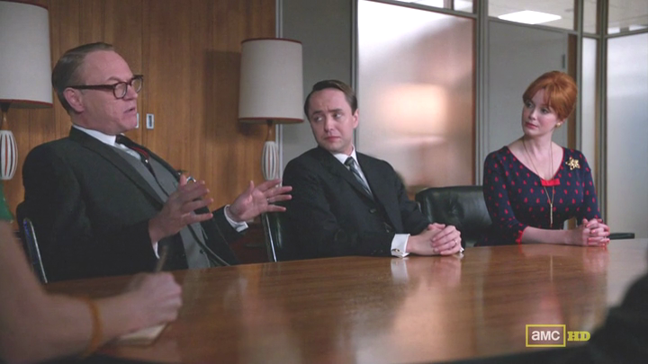\ 

As Pryce explains the difference between fees and commissions his hands are turned inward in a gesture reminiscent of an artist molding a block of clay. He is a gentleman gathering the messiness of the world and bringing order to it. But when Manley reverses to Draper rejecting the fee structure:

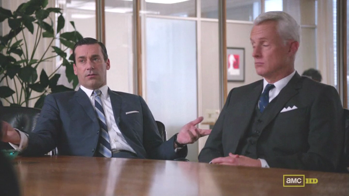\ 

The depth of feeling from which his dismissal originates is present both in the tone of his voice and his inversion of Pryce's gesture. Draper's hands tear apart and toss aside the orderly world Pryce just produced for the partners. These gestures represent in minature the manner in which the episode pits the risk-seeking, commission-loving Draper against the risk-averse, fee-loving Pryce. But there's another reason they're significant:

They're made with hands. Bear with me here:

If the firm had a fee-based structure it would've been able to pay out the Christmas bonuses; if the Christmas bonuses would've been paid out, Pryce wouldn't have had to forge Draper's signature on that $8,000 check; if Pryce hadn't had to forge Draper's signature on that $8,000, he would still be alive. Forging that check in "The Christmas Waltz" represents one of the few moments in which Pryce embraced risk, but even as he did so director Michael Uppendahl made it clear that it was done meticulously. He opens with a medium-long shot of Pryce:

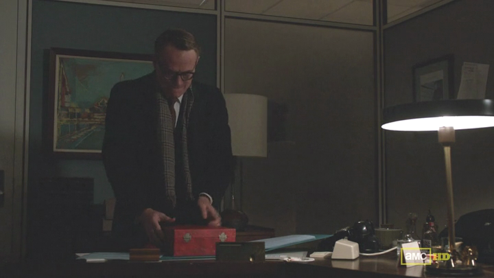\ 

Then cuts to Pryce's hands opening the ledger:

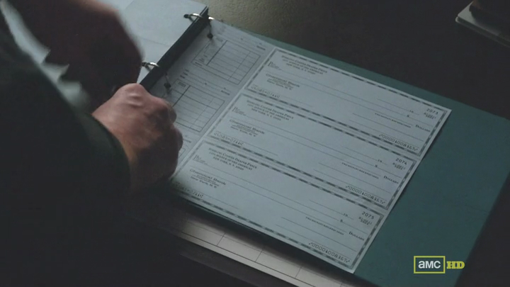\ 

Then back to the medium-long shot, then back to his hands removing a check:

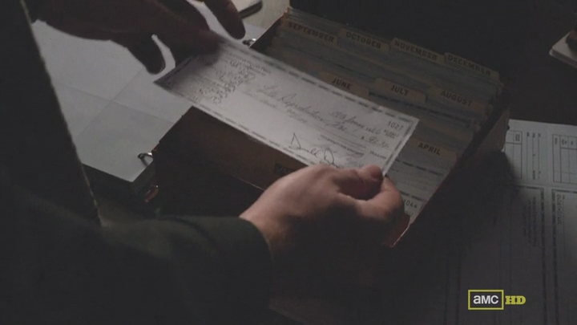\ 

Then to a medium shot of Pryce examining the checks:

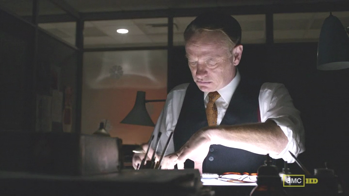\ 

Then to a close-up of his hands as he examines it:

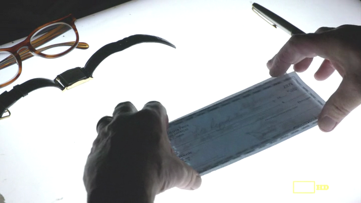\ 

Then back to the medium shot, then to an extreme close-up of his hands as he forges the check:

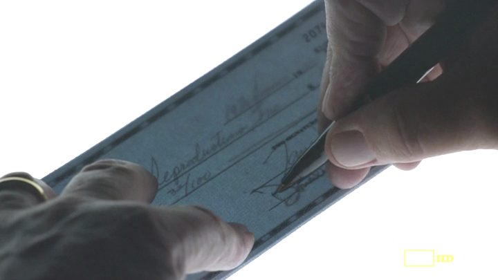\ 

The pattern should be apparent by now: even when Pryce takes risks, the camera emphasizes that this is a man who shapes the world with his hands. The precision required to produce the forgery is akin to the fastidiousness that governs his entire life. He's a man whose hands represent the degree to which he can manipulate his circumstances. He's a man whose hands are meaningful. But he's a man whose hands will fail him. His first attempt at suicide in "Commissions and Fees" is structured, visually, in a fashion virtually identical to the scene from "The Christmas Waltz." It begins with a medium shot of him carrying something:

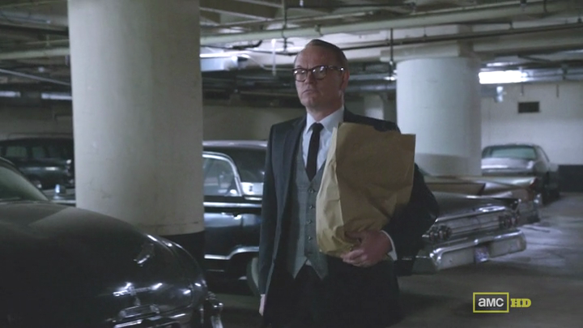\ 

Then Manley cuts to a close-up of his hands:

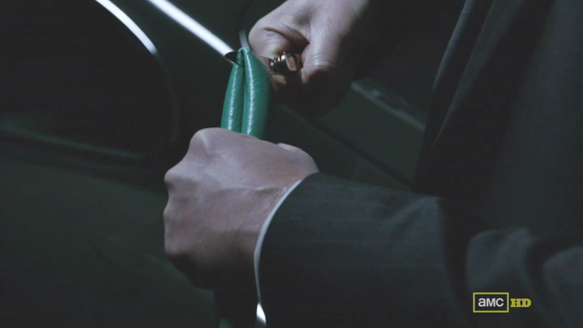\ 

First they cut the hose, then they stuff the pipe:

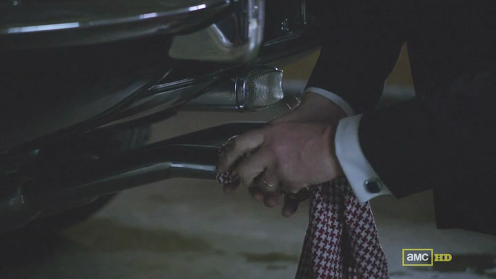\ 

Then a long shot of him entering the car:

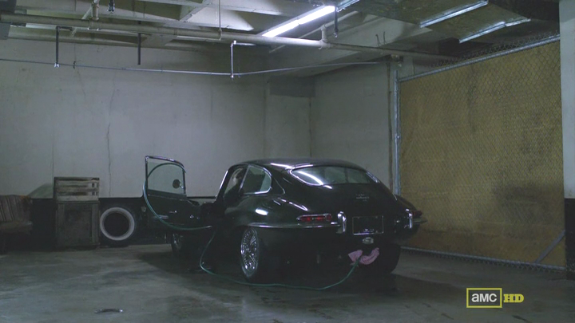\ 

Before returning to a medium close-up of him examining the window as he insulates it:

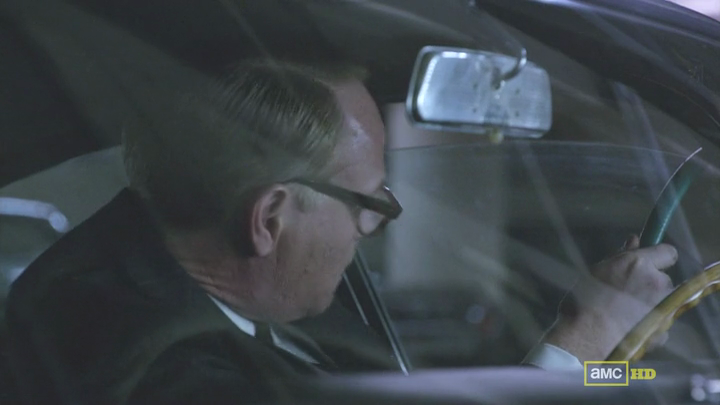\ 

Then back to the long shot of the car, then back to the shot above, then to a medium shot of him drinking, then to a medium close-up of him breaking the item required to continue examining things:

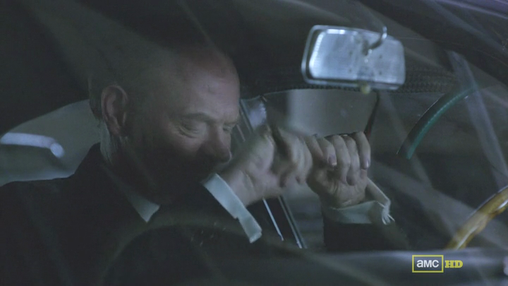\ 

Then back to the long of the car, then to a close-up of his hand starting it:

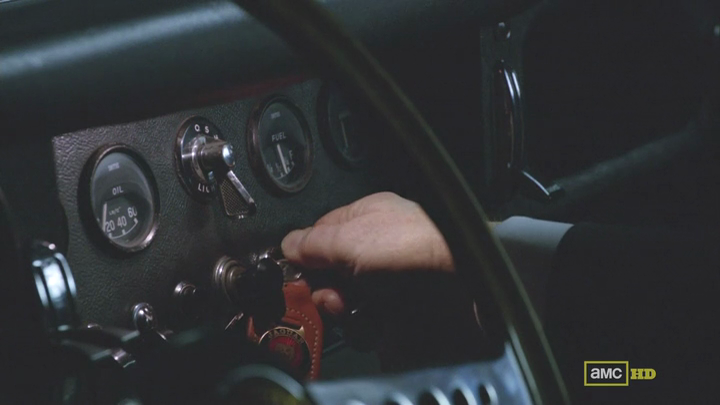\ 

Or failing to. Then back to the medium close-up of his frustrated face, then to an extreme close-up of his hand as he attempts to start the car:

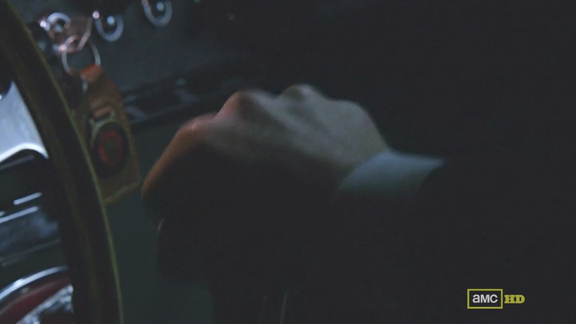\ 

Another medium close-up of his frustrated face is followed by another close-up of his hand attempting to start the car. The editing provides a rhythm to his increasing frustration: face, hand, face, hand, face, hand. The rhythm allows the viewer to register the frustration his face reveals at the failure of his hands. Moreover, as the scene progresses the irony of his firm's prized acquisition failing him mounts. He finally exits the car, but instead of cutting to a long shot of him exiting, Manley cuts straight to:

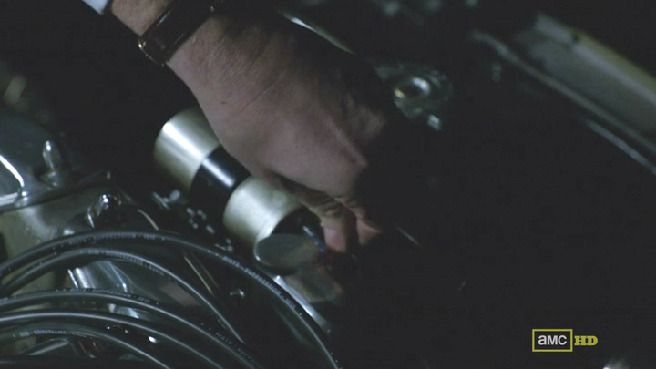\ 

Then back to:

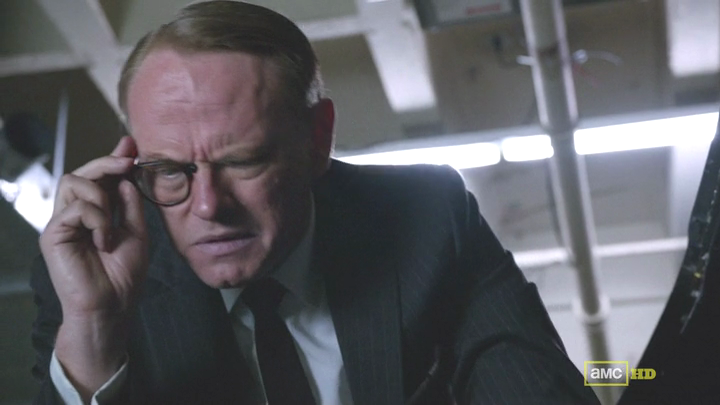\ 

Then back to:

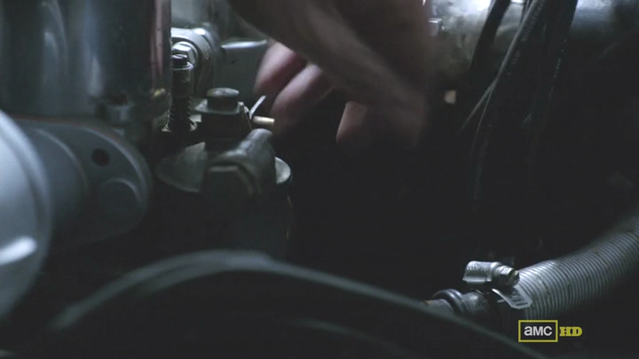\ 

The scene doesn't conclude so much as shift to the office in a manner that somehow suggests that Pryce never got the car started. But the significant thing here is the hands, because the similarity of the scene of the forgery and his first attempt at suicide suggests that he wanted to die as he lived: by his own hands. But he couldn't even manage that.

Sad, isn't it?
