## Mad Men - "For Immediate Release": Is the awesomeness of white men really "For Immediate Release"?

 * Originally located at http://acephalous.typepad.com/acephalous/2013/05/mad-men-is-the-awesomeness-of-white-men-really-for-immediate-release.html

The majority of people watch *Mad Men* wrong. What do I mean? A translation of last night’s episode, “For Immediate Release,” from their perspective should suffice:

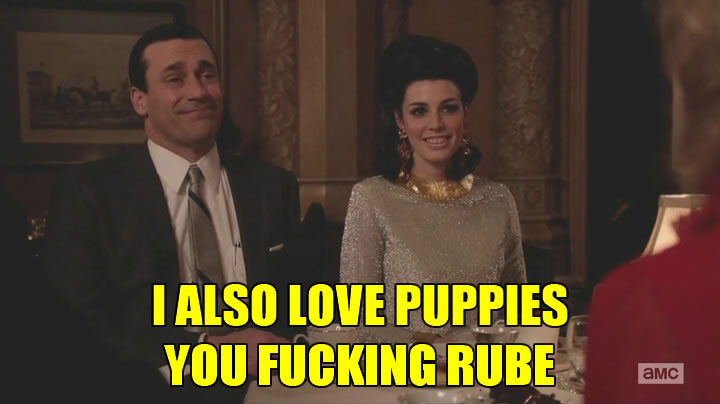\ 

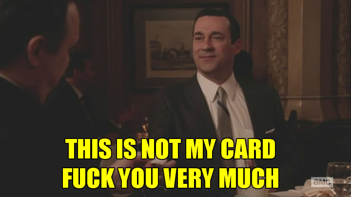\ 

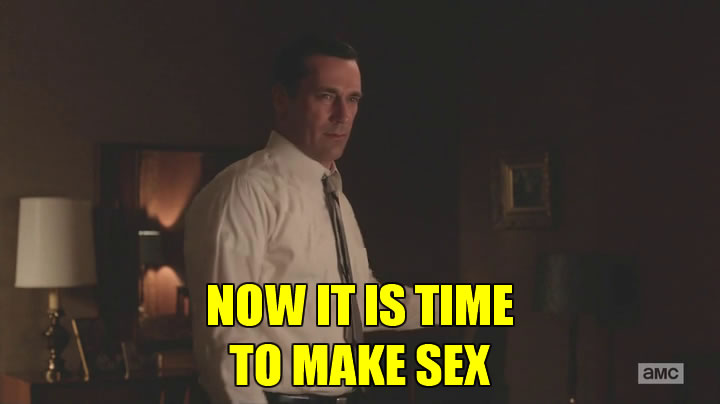\ 

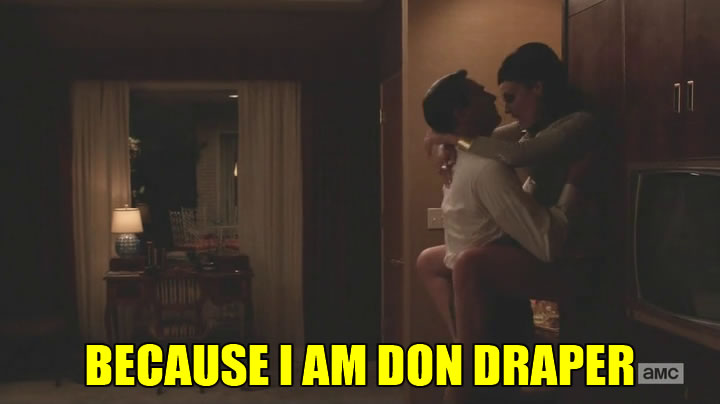\ 

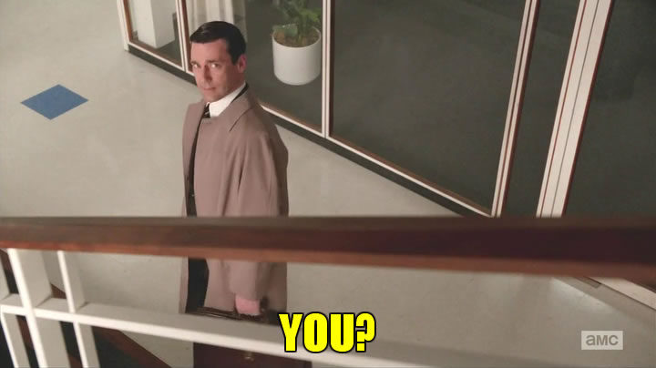\ 

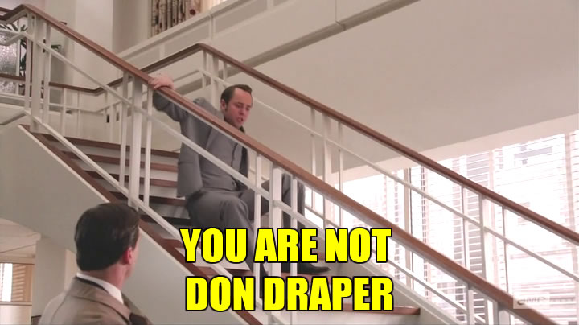\ 

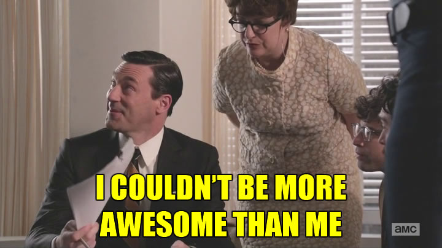\ 

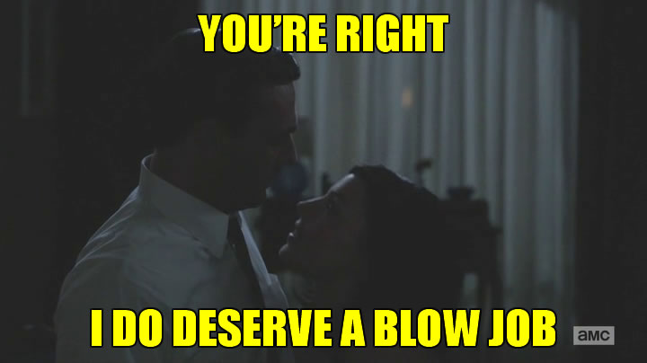\ 

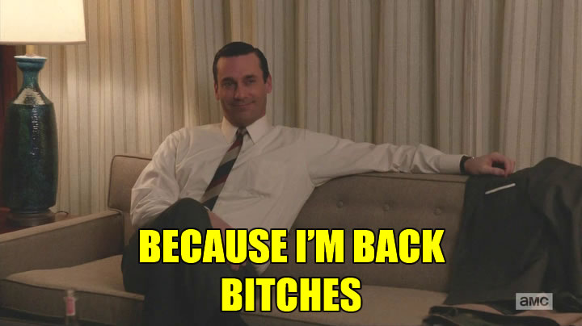\ 

With the exception of [Matt Zoller Seitz](http://www.vulture.com/2013/05/mad-men-recap-season-6-merger.html) and a few others, the majority of responses to this episode have focused on how “satisfying” it was to see Don Draper behaving like Draper again. Meaning the majority of the people writing those responses are *still* watching the show primarily to experience the thrill of being a powerful white man. The episode, directed by the [always excellent Jennifer Getzinger](http://acephalous.typepad.com/acephalous/2010/09/mad-men-in-the-suitcase.html), undermines this reading at nearly every turn. Consider when Sterling announces that he’s landed SCDP a chance at Chevy after Don brushed off Jaguar:

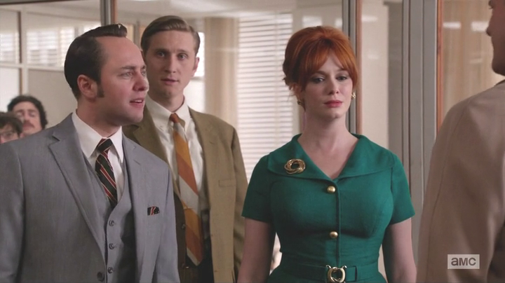\ 

Pete Campbell upbraids Draper, saying “Don’t act like you had a plan, you’re Tarzan, swinging from vine to vine,” creating an image that would seem to correspond with the “appealing” white male narrative above. Draper isn’t just *any* powerful white man — he’s the walking-talking embodiment of early 20th Century theories of white male supremacy. Like Tarzan, he’s an orphan who cultivates the talents required to survive in a hostile and alien society; and like Tarzan, when he finds himself among “normal” people again, these talents appear superhuman to them. To become king of the apes he had to become more than just a man. In this particular context, Campbell’s insult almost reads like a compliment; however, this isn’t the first time this season we’ve encountered an ostensibly superior white man in a society of apes:

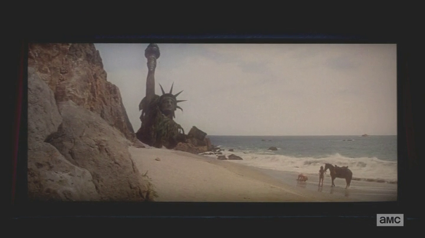\ 

For the second time in two weeks, the show demands we consider the hubris of a white man in the society “unworthy” of his talents. The reference to Tarzan in “For Immediate Release” only seems ambiguous if we conveniently forget that Draper’s mildly obsessed with a film whose premise is that no man — not even a white one on a world mad with apes — is beyond reproach. Campbell’s insult holds these two visions of white male supremacy in tension: Draper can only continue to feel superior if he deliberately forgets what he learned watching *Planet of the Apes*.

Those critics who found this episode a “return to form” fail to realize that they’re taking comfort in a momentary resurgence of white male privilege — a momentary return to that Golden Age “when things just made sense” that conservatives reference every time a woman, person of color, or anyone under the age of forty-five decides to have an opinion. Wasn’t it grand when self-made men like Draper could impose their will
on the world?

The problem with finding “satisfaction” in this episode, then, is that it requires us to ignore the same things Draper does. Note how the medium shot of Campbell upbraiding him is composed: Draper, representing the old guard, is in the foreground, but he’s a face without a brain and out of focus;  Campbell, Ken Cosgrove and Joan Harris, representing the generation after Draper’s, occupy the midground; and in the background is an unfocused Michael Ginsberg and sundry, representatives of the new generation. Although no one actually occupies the center of the frame, the dominant element seems to be the irate Campbell, as he’s on the receiving end of Draper and Cosgrove’s stares.

But then there’s Joan Harris — the color of whose dress seems out of place and whose eyes meet no one and nothing — there’s Joan Harris *on whose back alone* the company survived. What does she have to say about Draper’s “return to form”?

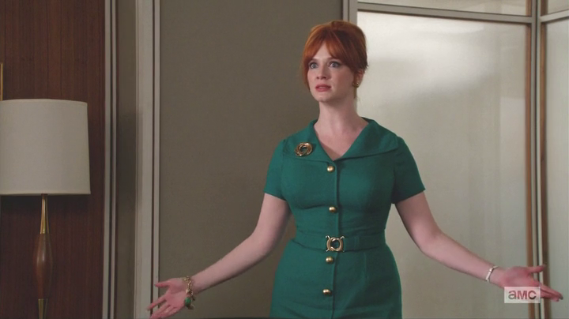\ 

Exactly. She doesn’t belong in the story white men tell themselves about how awesome they are — but she does belong to the one currently being told by *Mad Men.* If only more of the people watching it realized that.
