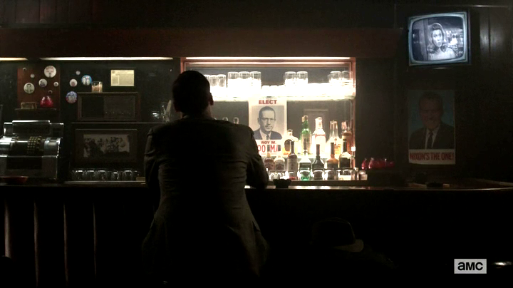
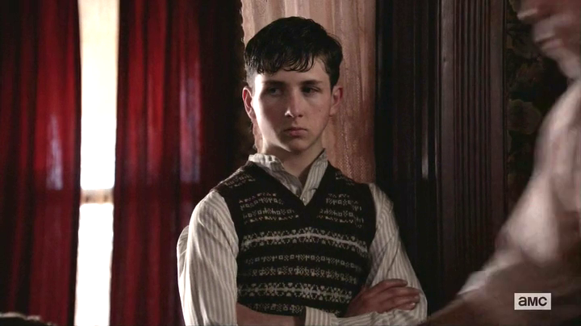
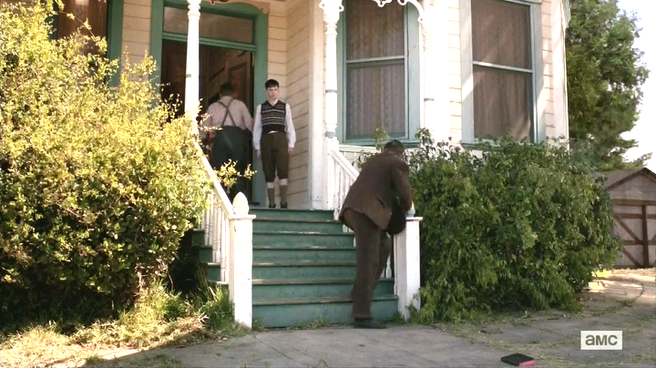
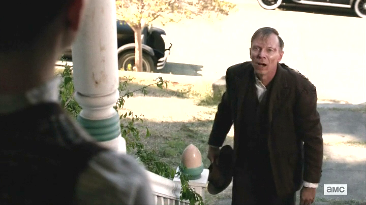
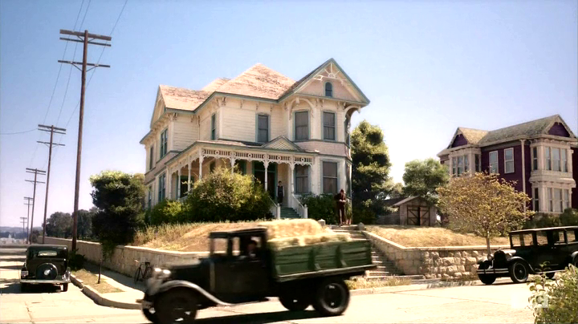
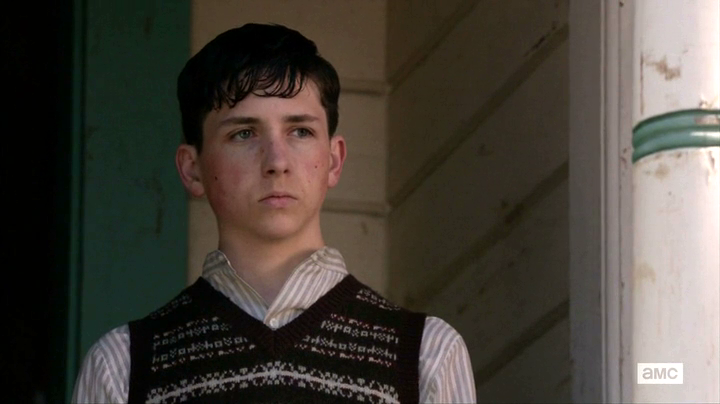
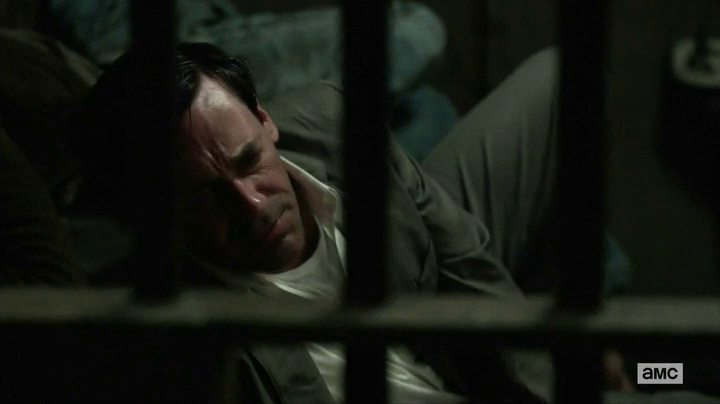

## <em>Mad Men</em>: "In Care Of" What? Oh Really? - Acephalous

 * Originally published at http://acephalous.typepad.com/acephalous/2013/06/mad-men-in-care-of-what-oh-really.html

The season finale of *Mad Men*, “In Care Of,” contains an inordinate number of what I call “Oh Really?” [reverse shots](http://classes.yale.edu/film-analysis/htmfiles/editing.htm#51531). They typically don’t involve dialogue — and the episode will end with one that doesn’t — but at the beginning of the episode it does. It’s also odd because it substitutes a flashback for an “Oh Really?” escalation, but I’m getting ahead of myself. When representatives from the Sheraton Royal Hawaiian arrive at whatever the name of the firm is at this point — because not knowing the firm is part of the point at this point — Don Draper isn’t in the office. You may remember the Royal Hawaiian from the season premier, [and if you do](http://acephalous.typepad.com/acephalous/2013/04/mad-men-dont-go-into-the-doorway-don.html), you can probably anticipate Don’s whereabouts. Here he is at the Royal Hawaiian:

\ 

That’s the opening shot of Draper at the Royal Hawaiian’s bar. Note the quality of the light: there are two on screen sources — the lamp to Don’s left and the Tiki fixture to his right — and a noticeable off-screen, but still [diegetic](http://classes.yale.edu/film-analysis/htmfiles/basic-terms.htm#25890) light illuminating the painting from above. The lighting is high-key, that is, the back and fill lights complement the key light in a way that creates low contrast between brighter and darker areas. (I write “complement” because there are many ways the effect of high-key lighting can be produced: all manners of angles and intensities come into play.) Of the previous episode, “The Quality of Mercy,” I noted [that Don’s shadows were eating at his face](http://www.lawyersgunsmoneyblog.com/2013/06/mad-men-fencing-with-shadows-over-the-quality-of-mercy) because the back and fill lights weren’t providing it illumination. Even though his back is turned in the shot above, were Don to turn around his face would be plenty covered by the back light. All of which is only to say that the light is natural and gentle in this scene at the Royal Hawaiian bar. Which is significant given that when the Royal Hawaiian representatives arrive in New York, Don’s not available to greet them because he’s here:

\ 

At this point, I hope you don’t need me to point out the structural similarities between these two shots. There are many ways to shoot a man at a bar — I know, I know — but to shoot the same man regarding relations with the same corporation in such a similar manner invites comparison. Whereas the scene at the Royal Hawaiian is lit in a high-key, this is clearly lit in the low-key that’s characterized Don’s relation to alcohol the past three episodes. ([*Just look at the poor man pouring vodka*](http://www.lawyersgunsmoneyblog.com/wp-content/uploads/2013/06/mad-men-the-quality-of-mercy00006.png).) The low-key lighting allows the diegetic lights sources — the illuminated bar and the television set — to provide the majority of the illumination. Meaning there isn’t much of any because Don’s in a darker place. Remember the “[dark wood](http://www.gutenberg.org/files/8789/8789-h/8789-h.htm#link1)” that Don read about Dante awakening in while at the Royal Hawaiian? Clearly Don hadn’t actually reached it yet. At the brightly lit bar he interacted with an American icon — the serviceman on shore leave — and never went home that night because, as [I noted in my post on “The Doorway,”](http://acephalous.typepad.com/acephalous/2013/04/mad-men-dont-go-into-the-doorway-don.html) he’d abandoned his wife to give another woman away in marriage. But all that happened in a luminous Hawaiian past.

Now when Hawaii comes mid-day calling in New York, Don’s in a bar that hasn’t seen sunlight since the first time Nixon ran for President. And when another American icon — the itinerant evangelical preacher — starts talking about brotherhood at the bar, Don’s so rattled *it’s almost as if he can recognize the structural similarities with the scene from “The Doorway.”* The young serviceman with whom he shared a moment of brotherhood — false though it may be on Don’s part — has been replaced by a preacher who’s *selling* his idea of a brotherhood to strangers at a bar. The idea likely offends Don both as a man and an ad man: the quality of the preacher’s salesmanship is so shoddy Don can’t help but interrupt his pitch. When the preacher asks his profession, he replies “Keeping out of other people’s business,” which isn’t exactly the best description of someone who works in advertising. That’s likely why the preacher’s response, “You’re not doing a very good job of it,” stings Don more than it should. It’s little wonder he’s annoyed when the preacher approaches. Here’s how the scene actually proceeds:

\ 

We’ll talk about where the scene cuts to momentarily, because I want to note that while the content of the scene isn’t unimportant, the “Oh Really?” reverse shots are doing quite a bit of heavy lifting here. The initial invasion of Don’s personal space by the preacher is a violation, but it’s only the first: the preacher leans in when he speaks until, in the fifth frame above, the director, someone named Matthew Weiner, opts for a close-up on the preacher’s face. Between the preacher leaning in and the close-up — close-ups being violations of our personal space that [we’ve become accustomed to via biology and habit](http://acephalous.typepad.com/acephalous/2012/09/game-of-thrones-winter-is-coming-for-will-and-bran.html#1) — Weiner’s pushing this man into Don’s face. Think about it: how often are you close enough to someone’s face to see it as closely as you do in a close-up? If you’re not a dentist or an ENT or about to kiss someone, I’d wager not very often. Despite our desire to read faces — as discussed at the link — we’re also made uncomfortable by close-ups, and here Weiner’s mapping Don’s discomfort onto the shot by using such a short scale. As the “Oh Really” reversals follow one after the other into the close-up, a necessary escalation that looks something like this occurs:

\ 

At this point one expects the escalation to climax with some violence, but instead Weiner throws to a flashback of a young Don encountering a similarly unpersuasive man of the cloth:

\ 

As we learn later in the episode, Don’s opinions are not yet formed. But Weiner wants us to understand that this may have been where they were. That boy there? He simply doesn’t care enough — about *anything* – to start matching someone “Really” for “Oh Really.” He simply watches the bordello’s owner toss the preacher on the street:

\ 

The long shot is significant not just because it allows more of the house to be visible, but because it provides the very emotional distance between the preacher and Don that was lacking in the previous scene. Even when Weiner reverses to the preacher in a two-shot with Don:

\ 

And has the preacher inform him that “The only unpardonable sin is to believe God cannot forgive you,” Don is impassive.

\ 

He’s *so* impassive that the house itself apparently feels the need to stick up for him:

\ 

Not that he gives a shit:

\ 

But look what happened when the camera zoomed back in on Don. It’s the same shot in terms of composition — a medium close-up on Don — but compare it to the one that preceded the interrupting house. It’s not just tighter — giving us a closer look at Don’s uncaring face — it’s *darker*. The increased contrast may just be an artifact of shooting outside. A cloud may have passed over as Weiner shot the reverse. But even if that’s the case, Weiner could’ve waited until the cloud finished passing and re-shot it, or lightened it in post-production to match the previous shot. And given the emphasis on how Don’s lit the past three episodes — if not the entire season — I think it’s safe to say that this particular darkening is deliberate, as there’s no other reason to cut back to Don’s expressionless face after the shot of the house. His inability to see hope, in whatever guise it may come, seems to be the origin of his darkness, and this may be the moment where he discovered that he can’t find hope in God. While initially his feelings about this non-source of hope may have been trivial, by the time he exchanges “REALLY” with the preacher above he feels so strongly about it that he follows this night at the bar with the same entity he spent the last: the significant absence of Megan:

\ 

Only this time Weiner treats the “marriage is a prison” line a little more literally, since he actually ends up in jail for punching the preacher. It’s significant that we don’t get the gratifying image of Don actually attacking the preacher, because that’d be gratifying. It’s best to see him riled up and suffering the consequences without getting to enjoy the act itself because that’s Don’s life at this point. It’s all suffering and consequences and will continue to be unless he addresses it. Wasn’t I saying something about someone not yet awakening, disoriented, in a “dark wood” earlier? Because this might qualify — much more so than finding one’s self on a beach in Hawaii reading about somebody else awakening in a “dark wood.”

And that’s where I’ll leave you for today. Except more tomorrow. Possibly more all week. Rejoice or disdain accordingly.
