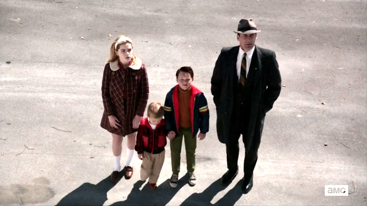
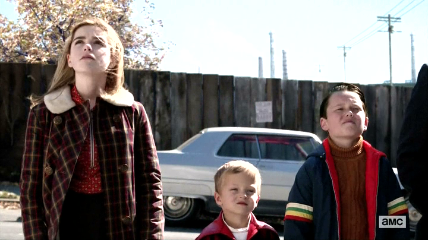
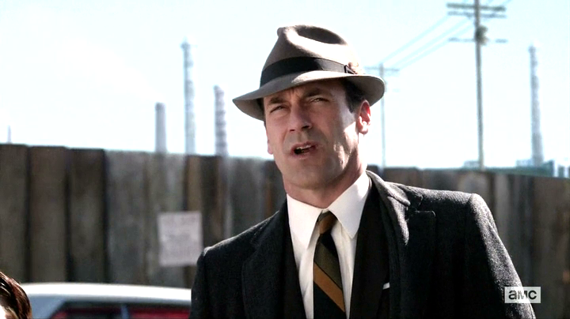
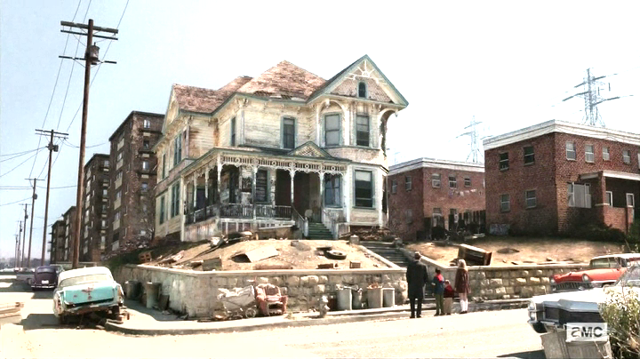
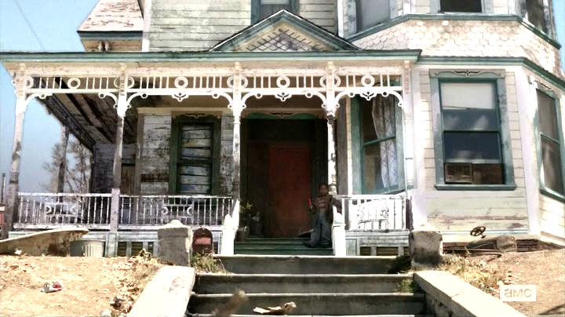
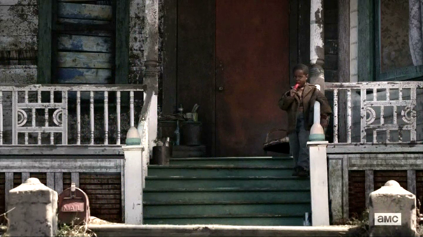
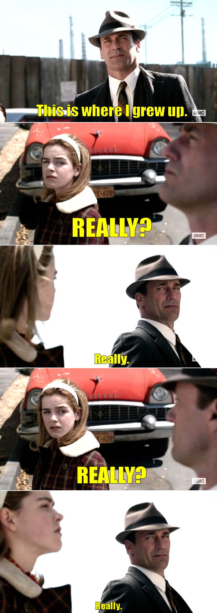

## Mad Men - "In Care Of": Who's "In Care Of" what now?

 * Originally published at http://acephalous.typepad.com/acephalous/2013/07/mad-men-whos-in-care-of-what-now.html

In my [first post](http://www.lawyersgunsmoneyblog.com/2013/06/mad-men-in-care-of-what-oh-really) on “In Care Of,” I discussed the importance of the logic of the “Oh Really” sequence to the episode; in [the second](http://www.lawyersgunsmoneyblog.com/2013/06/mad-men-disappointment-in-care-of-convention),
 I not only proved that cowboy hats aren’t the new lasers, but also that Matthew Weiner is dedicated to creating pain by any means necessary, including undermining the importance of structural elements like the “Oh Really” sequence. In other words, my first two posts were about how Weiner creates tension via the visuals and sustains it by undermining the visuals that created it via the narrative. Most television shows — and most television writers — have a particular set of visual and narrative crutches they break out when they need to rouse their viewers. For example, Joss Whedon favors hackneyed speeches undermined by immediate circumstances:

> **BUFFY:** No, it doesn’t stop! It never stops! Do you — do you think I chose to  be like this? You have any idea how lonely it is? How dangerous? I would  love to be upstairs, watching TV or gossiping about boys or — God,  even studying! But I have to save the world. Again.

Or:

> **LOKI:** Enough! You are, all of you are beneath me! I am a god, you dull creature, and I will not be bullied by –
> (*HULK flattens LOKI by SMASH*)

Whenever one of Whedon’s characters starts to speechify like [William Wallace pontificating about the theoretical possibility of Scottish independence](http://youtu.be/gr_OpFxCx-A), that character’s likely to find his or her authority undermined either by their own words or someone else’s actions.* Whedon telegraphs it to a man who proceeds to semaphore it at your face. Which is why *Mad Men* continues to make for compelling television: Weiner and his writers are clearly aware of how they’re manipulating us and, like a great boxer, always slug us where we’re not expecting. Especially when they’ve established those expectations in a particular episode. In the last scene of this one, he combines the “Oh Really” sequence with its content-dependent and confessional opposite. To wit:

\ 

He opens with this long shot of the Draper/Whitman family. They’re all clearly staring *up* at something, and because of the extremely high angle, seem to be dominated by whatever that something is. Establishing that something’s doing the dominating before actually showing it on screen has two effects: the first is to rouse our curiosity; the second, to remind us of what’s become obvious by now, *i.e.* that this family’s been burdened by an unknown and unspoken something for quite some time. Of course *Don* knows what it is, but to Sally, in particular, there’s just been this horrible presence that’s tainted her father’s relationships with everyone. She has no idea *what* it is, but this shot’s telling you *here* it is. But before cutting to this looming presence, Weiner thinks we need a refresher on how close this family is at the moment:

\ 

These are the children. They’re together, but:

\ 

They’re also apart from Don. Each slightly encroaches into the others’ shot, but for the most part, Weiner segregates the children from their father here. They may share the same physical space and be looking in the same direction, but they’re not seeing at the same thing. Don needs to tell them what it is they’re seeing — the narrative has become content dependent again. Which is why, before cutting to the shot below, Weiner has Don inform them that “This is where I grew up.”

\ 

We’re looking at them looking at the house, not because we don’t know what it is, but because we don’t know what Don’s up to. Nor should we, because that’s not Don. Because this is the moment Dick Whitman’s chosen to pitch his life to his children. He’s spent a lifetime telling them the equivalent of his initial Hershey pitch, so he knows he needs to find something bold and unexpected to draw them into his story. And as with the Hershey pitch, he decides to go with the painfully unvarnished truth: the whorehouse in which he was raised. Weiner then switches to a first-person shot of some sort:

\ 

Your guess is as good as mine as to whose perspective this is. I’d wager it’s Sally’s, for reasons I explain below and because in the previous shot she’s the one most centrally located vis-a-vis the stairs. But Sally still doesn’t quite understand what she’s looking at. This season has addressed the racial upheaval the late ’60s, but Sally’s experience with African-Americans seems limited at this point to a thief and her former nanny, so I doubt she has any real understanding of the larger situation. She seems to understand here, however, that her father’s trying to tell her *something* about race in America at the moment:

\ 

Because the camera jump-cuts to the small boy standing aimlessly on the porch. He’s meaningful — the jump-cut from the extreme to the medium long shot informs us that she’s paying particular attention now — but she doesn’t know what he means. She doesn’t understand how her father could’ve grown up in what her brother referred to as “a bad neighborhood.” So what does the child mean? For Sally, he’s some sort of living connection to her father’s past, but that’s a line of thought that she’s not prepared to handle. She can’t understand what this child could possibly mean. And so the final exchange is unspoken, but the reverse shots fit a familiar pattern:

\ 

I’ve tried to use the font size to demonstrate how, unlike the earlier incarnation of this sequence, at this point everything’s *deescalating*. This isn’t a drunken Draper building up to an inevitable bar fight — it’s a battered Whitman telling his children the quiet truth of his life. That it’s structured as a similar series of two-shots — with one character towering over the other — invites us to consider the differences between his encounter with the bar and this moment with his children. Foremost among them is that there’s [no personal space being violated](http://www.lawyersgunsmoneyblog.com/wp-content/uploads/2013/06/mad-men-in-care-of-montage-02.jpg), although that’s a bit of a dodge because his other two children are standing between them. Or are they? Of course they are, as much was established in the establishing shot. But *they’re not in frame* because they don’t matter. Ages ago, I argued [that *Mad Men* will be remembered as Sally’s show](http://acephalous.typepad.com/acephalous/2012/03/mad-men-a-little-kiss.html), and this is one of those moments when I feel vindicated for doing so. Draper’s effectively gone at this point, but he left behind this broken shell of a man named Whitman and a precocious daughter whose future won’t be burdened by his past.

Which is why I think the final season of *Buffy* was underrated. Critics became annoyed when Whedon let Buffy rehash Saint Crispin’s Day every episode, but that was the point: divorced from her ability to back them up, her words lost their argumentative power; but instead of finding ways to make them more meaningful, she just started to produce more of them, as if she believed that if she talked long enough she’d convince herself, and that once she convinced herself, she’d convince her troops. She failed, spectacularly, to do anything of the sort. It made for stretches of uninspiring dialogue, but that doesn’t mean it made for bad television.
