## Mad Men - "Shut the Door. Have a Seat.": More on the visual rhetoric of *Mad Man* (after a brief acknowledgment of the magnitude of my wrongness)

 * Originally located at http://acephalous.typepad.com/acephalous/2010/01/mad-men-and-visual-rhetoric-again.html

In [the first comment](http://acephalous.typepad.com/acephalous/2010/01/don-draper-as-an-unraptured-emma-bovary.html?cid=6a00d8341c2df453ef012876e1c154970c#comment-6a00d8341c2df453ef012876e1c154970c) to [my first post](http://acephalous.typepad.com/acephalous/2010/01/don-draper-as-an-unraptured-emma-bovary.html) on *Mad Men*, Tom Elrod wrote:

> I definitely want an update to this post once you've finished the third season.  I can't really respond much to this post until then, because I don't want to spoil anything[.]

Nor do I.  If you plan on watching Mad Men but haven't seen the third season finale, stop reading now.  

In a fit of remarkable wrongness, I wrote:

> So Peter and Peggy are not left behind because, over the course of two seasons, they learn to love and accept modernity in their hearts. They still seek Draper's approval, but they recognize that he's valuable in a way the world soon stop valuing. When the rapture comes, they know Draper won't be numbered among the chosen [...] Nor, for that matter, will Joan Holloway[.]

Had Matt Weiner decided to re-shoot "Shut the Door. Have a Seat." after having read my post in order to maximize my wrongness, he wouldn't have had his work cut out for him.  This shot alone refutes much of what I wrote:

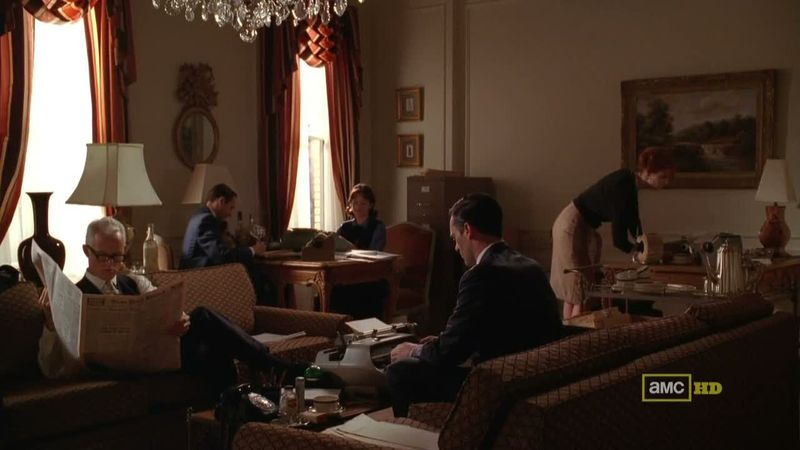\ 

There sit Pete and Peggy, toiling into the future alongside Draper and Joan in the temporary headquarters of Sterling Cooper Draper Pryce.  Why was I so wrong?  I didn't anticipate that Draper would recognize that he belonged to the past.  He admits as much when Pete demands Draper tell him why he's needed:

> You've been ahead on a lot of things. Aeronautics. Teenagers. The Negro market. We need you to keep us looking forward. I do, anyway.

In one respect, then, my claim that Pete and Peggy belong to the future is validated; but unfortunately for me, my claim's being validated by the very person I had claimed was constitutionally incapable of recognizing its validity.  My argument went awry because I failed to account for the complexity of Draper's reaction to Betty divorcing him: without the illusion of a perfect marriage to stabilize his conception of self, Donald Draper is as free to reinvent himself as Dick Whitman had been.  I think.  More on Draper as a character later.  For now I'd like to focus on just how effective Matt Weiner's direction of "Shut the Door. Have a Seat." was.  

*Mad Men* typically uses the [angle](http://classes.yale.edu/film-analysis/htmfiles/cinematography.htm#48004) and [level of framing](http://classes.yale.edu/film-analysis/htmfiles/cinematography.htm#48009) fairly conventionally.  Consider the scene in which Betty leaves for her rendezvous with Henry Francis:

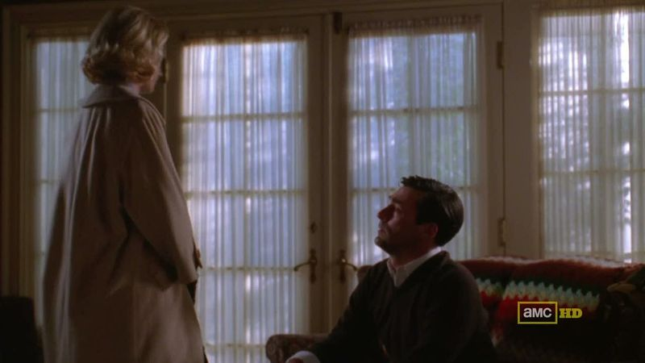\ 

The dominant character literally towers over the subservient one.  When the shot shifts to them individually, the angle of framing reinforces their respective positions.  Dominant Betty is shot from a slightly lower angle—you can tell the canting of the camera by the fact that the ceiling is almost visible:

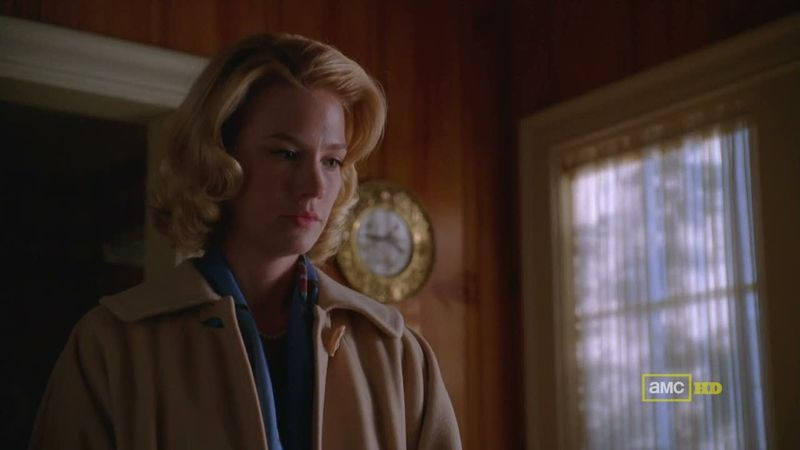\ 

But although Draper is shot looking up at her, the camera is framed almost level to his head, meaning it is barely even tilted:

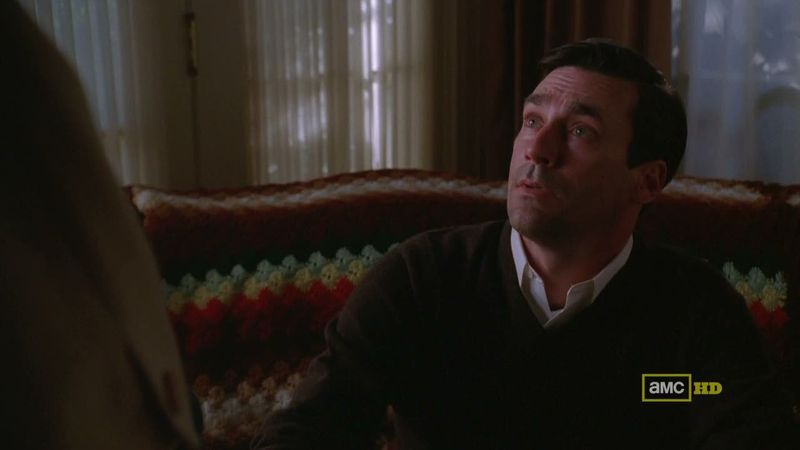\ 

In visual terms, he is only barely the lesser party, which is in keeping with the tone of the scene (if not the season): he may not be dominant, but he is never subservient.  Because the camera is level with his head and its angle so slight, Draper appears to be in control of the scene, which leads to friction between its formal composition and narrative content.  Note also that in neither case does the angle of framing indicate that shot is from the [point of view](http://classes.yale.edu/film-analysis/htmfiles/cinematography.htm#48019) of either character.  Instead of [reversing the shot](http://classes.yale.edu/film-analysis/htmfiles/editing.htm#51531) and having them look at the viewer, Weiner organizes the sequence by [matching their eyelines](http://classes.yale.edu/film-analysis/htmfiles/editing.htm#98485): she looks down from the left in an angled shot and he looks up from the right in a level one, almost as if the camera refuses to acknowledge that Draper's not the dominant one here.  Same thing happens when Draper tries to recruit Peggy:

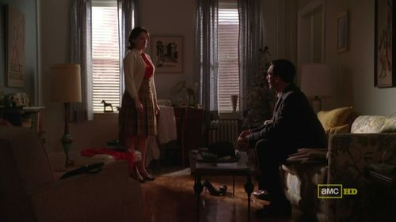\ 

The extremely traditional staging indicates that he's the supplicant, but even when he resorts to begging, this reverse shot is the weakest Weiner will allow Draper to look:

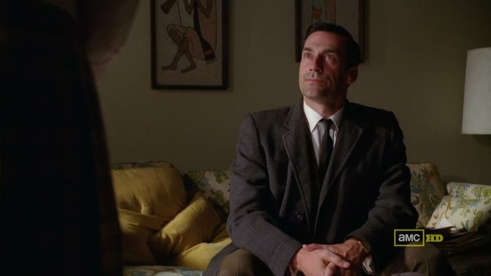\ 

He looks up from the right in a level medium close-up, although unlike the scene with Betty, he may actually be in control of this scene, meaning the non-angled framing would be ironic.  He may be the supplicant, as the composition of the establishing shot tells us, but this reverse shot indicates that he already knows how his plea will be answered.  This shot is, after all, when he reminds Peggy that they are kindred:

> There are people out there who buy things.  People like you and me and something happened.  Something terrible.  And the way that they saw themselves is gone.  And nobody understands that. But you do and that’s very valuable.

He's telling her that being knocked up by Pete and almost dying during a delivery that left her clinically insane makes her "very valuable" to him.  It is, then, an odd but strong bond he appeals to here, but one which he believed would be effective: he may not be able to assume her allegiance, but he knows he can needle her secret trauma to great effect.  As it does.  They're equals by the next reverse shot:

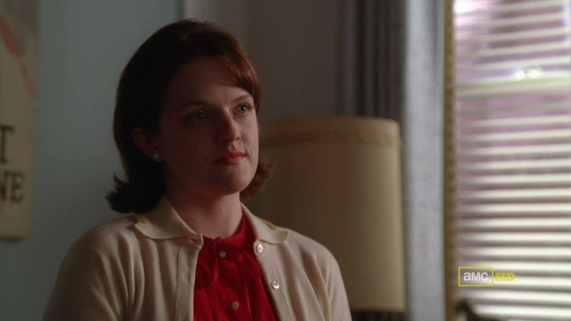\ 

Much like everybody in that first frame above:

\ 

Or not: the partners occupy the foreground, their juniors and the head secretary the background.  They're not equals, but the subsequent camerawork tells us that they're not as unequal as they were before.  When it cuts to Peggy and Pete, the level of the camera jumps up and frames them in a medium shot:

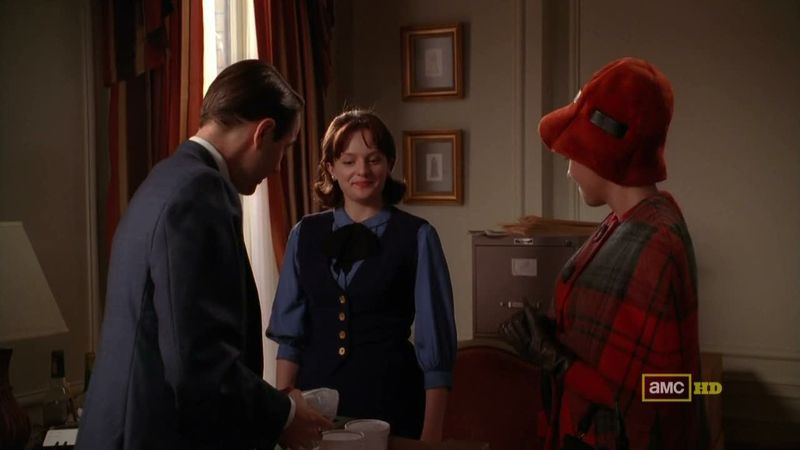\ 

The level then shifts down when it cuts back to Draper:

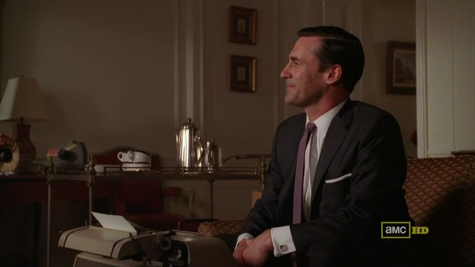\ 

At least in terms of composition, they are close to coequals.  (Especially when compared to the ubiquitous shots of Draper pacing behind his desk and looking down at whichever underling happened to be seated before it.)  It is at this point that something really remarkable happens.  In my [first post on the visual rhetoric of the show](http://acephalous.typepad.com/acephalous/2010/01/mand-men-and-visual-rhetoric.html), I noted that "[n]o contemporary television show employs a quieter camera than *Mad Men.*"  So how does Weiner choose to end this scene?  Dynamically:

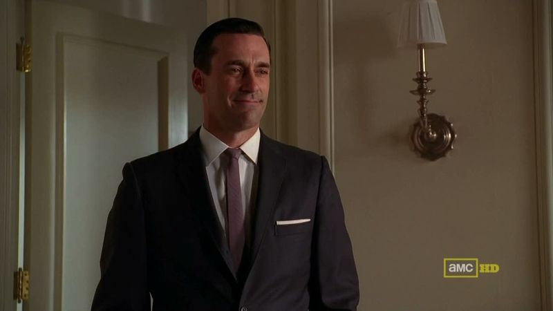\ 

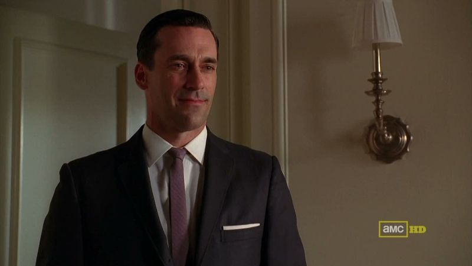\ 

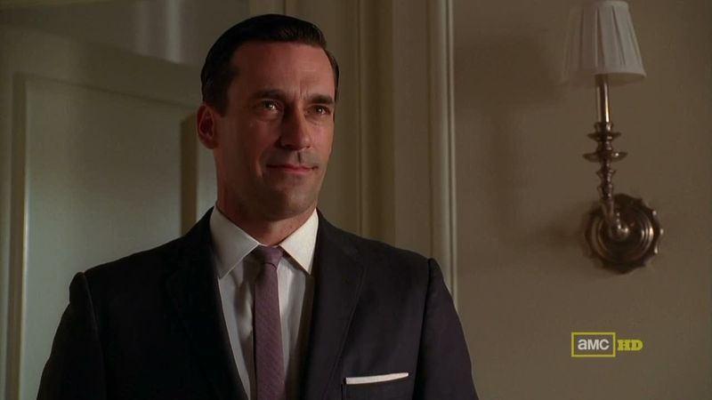\ 

The zoom is all the more effective because of the degree of its departure from the established conventions of the show.  
