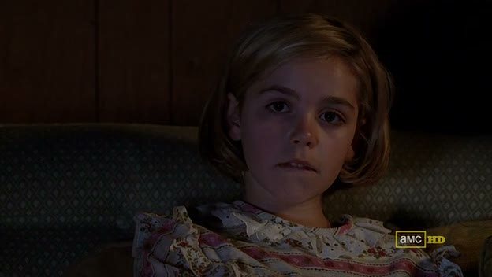

## Mad Men - "The Chrysanthemum and the Sword": Everything in "The Chrysanthemum and the Sword" that pertains to neither chrysanthemum nor swords.

 * Originally located at http://acephalous.typepad.com/acephalous/2010/08/everything-in-the-chrysanthemum-and-the-sword-that-pertains-to-neither-chrysanthemum-nor-swords.html

I can't counter Lemieux's [endorsement](http://www.lawyersgunsmoneyblog.com/2010/08/an-embarassment-of-riches) of Matt Zoller Seitz's [recap](http://www.tnr.com/article/books-and-arts/77157/mad-men-review-the-chrysanthemum-and-the-sword) of "The Chrysanthemum and the Sword," but I would like to register my annoyance with Seitz for setting the bar so high.  Particularly annoying is the fact that Seitz discussed at length the most salient visual element of this episode, *i.e.* "the interplay of close-ups and wide shots on the show, specifically how  the camera will start very close on characters' faces, encouraging our  empathy, then slowly dollying back to put them in a context."  I noted this dynamic in my [analysis of Peggy and Pete](http://acephalous.typepad.com/acephalous/2010/08/the-fourth-season-of-mad-men-has-been-maligned-in-some-corners-because-it-merely-continues-to-be-superb-such-are-the-burdens.html#more) in "The Rejected," but Lesli Linka Glatter structured the entirety of "The Chrysanthemum and the Sword" around it.  The one point on which I'll differ with Seitz (and Jefferson Robbins, whose [work](http://filmfreakcentral.blogspot.com/2009/08/in-retrograde.html) Seitz discusses there) is that with characters who are unaware of the larger context, the shots often begin wide before moving in for a close-up.
When, for example, Sally cuts her hair, the scene does open with a close-up, but not one that encourages empathy:

\ 

Glatter, having established the true object of the characters' attention, then pulls back behind the couch in order to create a space for Sally to enter:

\ 

While it may seem as if the shot that follows works to establish empathy, the logic of the scene makes me think the decision to go with the close-up here is more pragmatic, as viewers would be unable to tell from a remove that Sally had lopped off her hair:

\ 

I say that because after this close-up, the Glatter isolates her for while the babysitter frets about Don holding her responsible for Sally's actions:

\ 

When the camera does return to a close-up, it does so not to create sympathy, but almost ironically: not for the last time this episode, Sally will have unwittingly done something that will cause someone else grief.  The close-up emphasizes its own futility, as it demonstrates the distance between Sally and her interlocutor, be it her babysitter, her father, her mother or the man from U.N.C.L.E.:

\ 

This scene will surely draw the ire (not to mention critical attention) of many, but instead of focusing on the rather tame thematic element—it turns out that even if they never watch an episode of *Jersey Shore*, children still experiment with their sexuality—I want to concentrate on the intimacy actually created by these shots.  (If only to contradict myself a bit.)  This moment of centering the shot on the television differs from the previous because it cuts to the following close-up:

\ 

Unlike before, where the shot following the television pulled back, indicating a lack of total engagement with the image on the screen, here Glatter shows viewers that Sally is finally connecting with someone, albeit someone on a television screen.  Her brother and their sitter passed time passively watching a cartoon, but for reasons the show has made plain, Sally is in desperate need of someone who can restore a sense (however imagined) of security to her world.  Glatter provides her with a fictional one, as if to counter the argument that children from broken homes are raised by television with the claim that, in truth, they are *seduced* by them.  (That the episode ends with Betty and Sally starting therapy is somewhat of a relief.)

I'm not sure what the larger context is here, but pace Seitz and Robbins, the camera does dolly back to head-to-toe wide shot at this point:

\ 

Moments like this seem to me the show at its weakest: condemning middle-class prudes in the 1960s for being middle-class prudes.  Similar shots with Betty are weightier because of her hypocrisy, but all Glatter provides here is the unknown mother of an unknown friend who is horrified to find Sally doing what all children eventually do.  (Perhaps the impersonality of it all is the point?  Sally in a strange house, pleasuring herself to the image of a stranger, being caught by persons unknown, etc.)

There is much more to say about this episode, but I wanted to focus on Sally before discussing Peggy's brief-but-significant appearance and Don's—I'll save the bit about Don for later this afternoon. (And apologies in advance for this post being a bit thin.  It was either  divide this week's episode into three moderately long posts or write  one Holbonic one on Thursday.)
