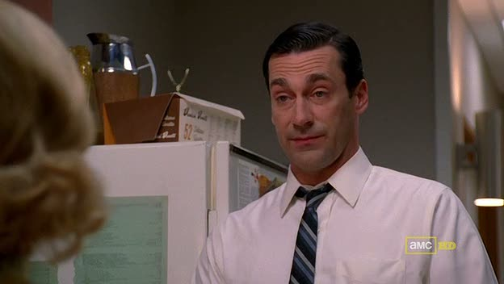
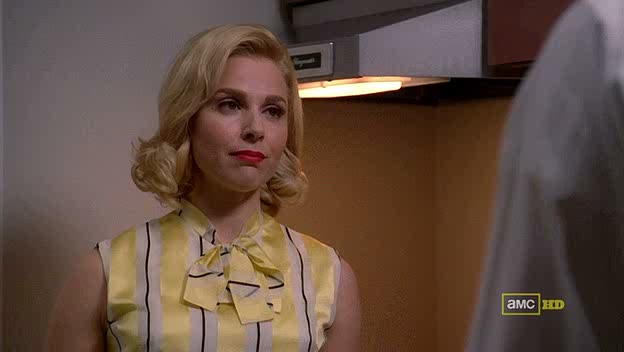
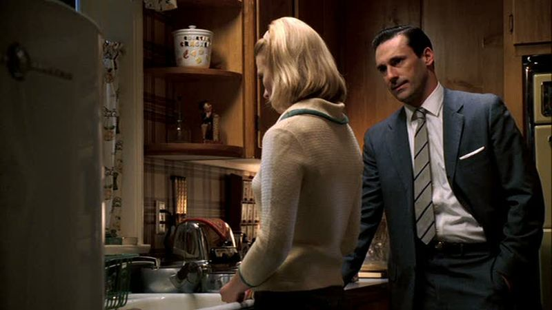
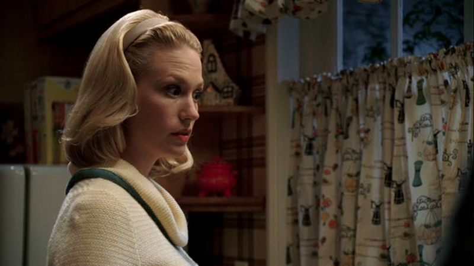
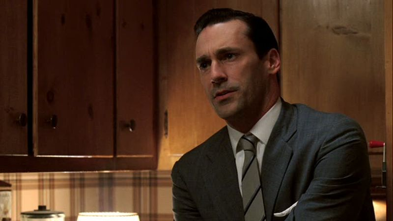
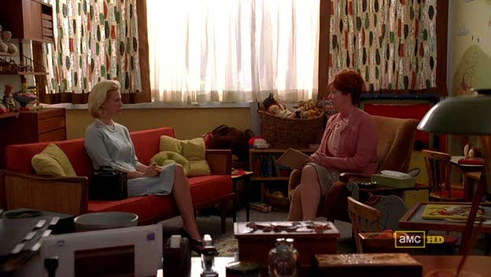
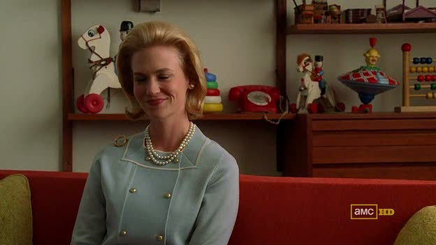

## Mad Men - "The Chrysanthemum and the Sword": Enforced intimacy

 * Originally located at http://acephalous.typepad.com/acephalous/2010/08/mad-men-enforced-intimacy-in-the-chrysanthemum-and-the-sword.html

Thirty-six minutes into "[The Chrysanthemum and the Sword](http://acephalous.typepad.com/acephalous/2010/08/everything-in-the-chrysanthemum-and-the-sword-that-pertains-to-neither-chrysanthemum-nor-swords.html)," a surprisingly intimate conversation between Don and Dr. Faye Miller takes an uncertain turn when the subject of analysis comes up:

> "Why does everybody need to talk about everything?"  
> "I don't know, but they do."  

Which reminded me of this exchange from *Waiting for Godot*:

> "What do they say?"  
> "They talk about their lives."  
> "To have lived is not enough for them."  
> "They have to talk about it."  

I've elided who said what in both cases because it doesn't matter: these are people who are talking about other people talking about their lives.  Their hypocrisy is a function of the scene itself.  Or is it?  Discussing a life, as Draper and Miller do, with relative strangers in a structured work environment doesn't count as "talk[ing] about everything," whereas going to a therapist, who is a relative stranger, and discussing a life with him or her in a structured therapeutic environment does.  The weight of the phrase, then, either falls on "talk" or "everything," because the two of them are either not "talk[ing]" or they are, but not "about everything."

Except they are, manifestly, doing both: they are in a kitchen-type-area discussing his divorce and his child learning how to masturbate and entering therapy.  Few items could be more "about everything" than those, and as if to press the point that they are "talk[ing]" about something significant, the camera pulls in tight for the final reverse shots:

\ 

\ 

\ 

What began as a semi-professional conversation filmed in a medium shot has become, as if by the power of the social lubricant provided by the sake they share, a medium close up.  The shot becomes more intimate as their conversation does; that is, they insist they are not "talk[ing] about everything," but the camera suggests otherwise.  I mentioned the Beckett above because Draper and Miller embrace the complaint in the first, second and fourth lines while denying the validity of the third: to have lived is, apparently, not enough for them either.  To "talk" is the only way for them to establish the intimacy the camera—if not the entire scene—imputes to them.  Consider how it opens:

\ 

Draper walks in with a bottle of sake, but moves so silently that he startles Miller, who despite possessing a doctorate and working in an office, is washing dishes in stockinged feet.  The scene begins as a recapitulation of one the show has presented innumerable times: Draper walks into a kitchen to find a blonde behaving in a wifely fashion and pours himself a drink while offering her some small talk.  For example, this scene from the second episode, "Ladies Man," even follows the same the conversational pattern and shot sequencing as the one above:

\ 

\ 

\ 

As the small talk turns to more important matters, the camera moves from a medium to a medium close-up.  The difference, of course, is that the blonde in "Ladies Man" is Betty Draper, not a professional colleague.  Such an intimacy between a man and a wife is expected, but for him to slide into a similar one with Miller is almost demeaning to her as a professional: the only qualities she shares with his ex-wife are that she is a conventionally attractive blonde and doing something in front of a sink.  Draper imposes himself on the conversation in a way that suggests desperation for an intimacy he never knew he needed with the very person he took advantage of.

Or so says the camera seems to say.

That the central issue here is "enforced intimacy" is also supported by the shot immediately following Miller and Draper's conversation:

\ 

What better image for "enforced intimacy" can there be than a static [long shot](http://classes.yale.edu/film-analysis/htmfiles/cinematography.htm#48039)—by definition a "relatively stable shot that can accommodate movement without [reframing](http://classes.yale.edu/film-analysis/htmfiles/cinematography.htm#48018)"—of a psychoanalyst and analysand sitting stiffly in an office seemingly designed for play?  That Betty is unaware that she will be tricked into undergoing analysis too only makes the dynamic even more operative.  Her resistance to this intimacy is figured by the fact that she, unlike Draper and Miller or her and Draper, is denied a close-up when she tells the therapist precisely what Draper told Miller:

\ 

\ 

The irony of the entire sequence of shots that begins with Miller and Draper and ends in a therapist's office is that although Miller and Draper are the ones who complain about the need to speak compulsively, only Betsy is able to successfully resist doing so.  They claim she needs to "talk about everything," but the camera contradicts them at every point.
