## Mad Men - "The Collaborators": "Collaborators" in the Secret, Sacred Curb Dances of Suburban Love

 * Originally located at http://acephalous.typepad.com/acephalous/2013/04/mad-men-the-collaborators.html

The title of the episode, "The Collaborators," is so obviously meant to be evocative that it almost sinks beneath its own freight. The episode's foremost "collaboration" occurs between Don Draper and his upstairs neighbor, Sylvia Rosen, who are acting out the transparent stratagems of Updike's titular *Couples* (1968). Though Updike's novel covers the time addressed in earlier seasons, its particular combination of adultry and war is relevant here:

> This pattern, of quarrel and reunion, of revulsion and surrender, was repeated three or four times that winter, while airplanes collided over Turkey, and coups transpired in Iraq and Togo[.] (161)

Simply put, there's something about having sex while the radio describes some new front in the [Tet Offensive](http://en.wikipedia.org/wiki/Tet_Offensive) makes [*The Man in the Grey Flannel Suit*](http://www.amazon.com/exec/obidos/ASIN/1568582463/diesekoschmar-20) feel more like *[The Spy Who Came in from the Cold](http://www.amazon.com/exec/obidos/ASIN/0143121421/diesekoschmar-20)*. (And [we well know how accurate that novel is](http://www.guardian.co.uk/books/2013/apr/12/john-le-carre-spy-anniversary).) Consider the first time Don and Sylvia play "collaborators." The scene begins with a point-of-view shot from Don's perspective as the elevator door opens on Sylvia and her husband, Dr. Arnold Rosen, arguing over money:

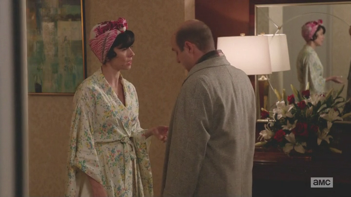\ 

It's significant that even though she's shot in profile here, Don's able to see her entire face. He can see more of her than she can of him; he exists only in her peripheral vision, if at all, whereas he can observe her from two angles. He's not spying on her, but he is paying attention to their private matter. When Dr. Rosen enters the elevator, she throws Don the most meaningful glance she can in the half-second that she has:

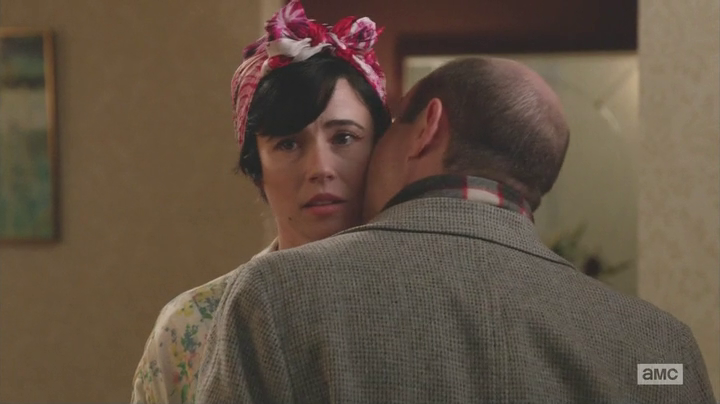\ 

The director of this episode, some clown by the name of Jon Hamm, uses this medium close-up to great effect. Remember that close-ups are [meant to suggest intimacy](http://acephalous.typepad.com/acephalous/2012/09/game-of-thrones-winter-is-coming-for-will-and-bran.html#1), whereas medium shots are designed to give some sense of body language. In terms of scale, this medium close-up provides intimate access to her face as she shoots Don a plea, while simultaneously allowing enough frame to depict the familiarity of Dr. Rosen's body language. He's distant from her (emotionally) but doesn't know it (physically); she's distant from Don (physically) but acutely feels it (emotionally); and Don's somewhere back there on the elevator, but the camera's not aligned with his perspective anymore so his feelings are absent from this shot. (If it were his perspective, the eyeline match wouldn't be slightly frame-left.)
But not from the scene. This is the first example of the "collaboration" between the two, so it should come as no surprise that after Dr. Rosen enters the elevator, Don remembers he's forgotten his cigarette:

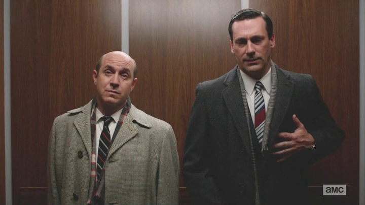\ 

The medium shot is perfunctory, because its main purpose is to capture Don's exaggerated gesture. The fact that the gesture's exaggerated is important, or would be if Dr. Rosen were paying attention. (Which he seems not to be.) But Don puts on a show *just in case* and zips back up the elevator:

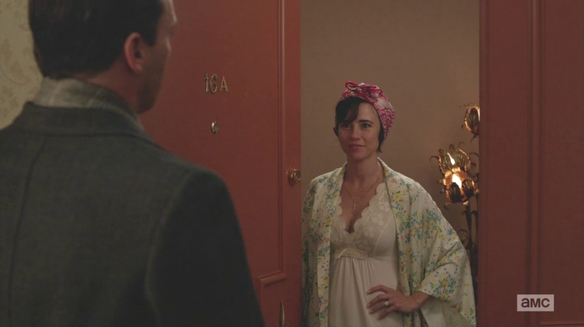\ 

To Dr. Rosen's apartment, where Sylvia awaits. Whether she knew he was also playing this game at this point is unclear. That she wanted it to be one of the days he did goes without saying, but her attractiveness here isn't a function of being "made up" so much as being natural. Which reminds Don of something:

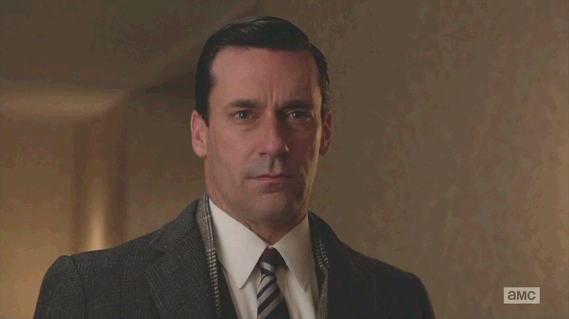\ 

If you click you can see the subtle hint of a [thinking zoom](http://acephalous.typepad.com/acephalous/2012/01/follow-that-thought.html) that makes the reverse from the shot above more significant. Instead of reversing back to the door as Don enters it, the audience is presented with another point-of-view shot from Don's perspective:

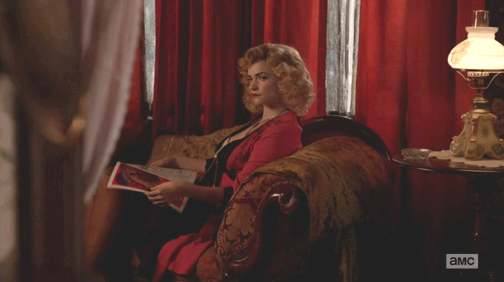\ 

Instead of entering Sylvia Rosen's apartment to continue playing "collaborations," the camera reverses into Don's memory. Note how the same subtle zoom works in two different ways here: the first begins with a close-up and moves into a closer-up, and because the perspective belongs to the audience, it believes that it is "getting inside Don's head." And it is, as evidenced by the second zoom, which moves from a medium into a closer medium and is clearly from a perspective within the diegetic space:

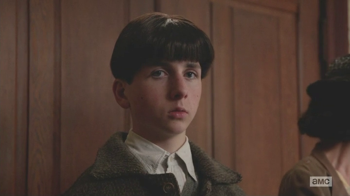\ 

Young Don's. The subtle zoom here is a young boy staring at a prostitute into whose house his pregnant stepmother has brought him. There is a lot to untangle here, but the main point is the very subtle way in which the memory of young Don's time in the bordello is coloring what's about to happen between elder Don and Sylvia Rosen. Because remember what Sylvia and her husband were arguing about earlier? In case you forgot, here's how her encounter with elder Don ends:

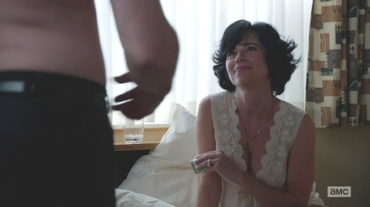\ 

They're not playing "collaborators" anymore: the movement between his memory and the present moment makes it clear that, in Don's mind, they're playing "prostitute." And they're doing so while being informed of yet another U.S. setback in Vietnam because of the Tet Offensive, which itself followed on the heels of the Koreans taking the USS *Pueblo*. Death and violence are not *visible* on screen, but their presence is pervasive. As, for example, is the case with Peter and his game of "collaboration," which begins innocently enough:

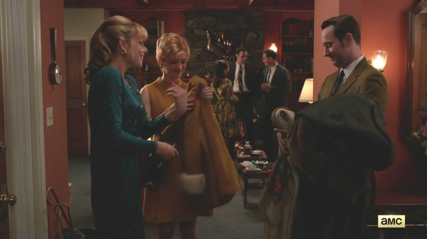\ 

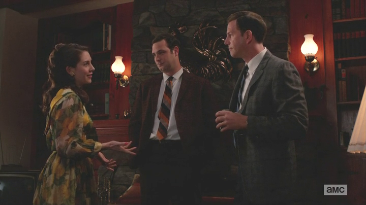\ 

Combined, these two images strongly suggest that wives are about to swapped, but 1968 is not yet the 1970s in suburbia, so this should be nothing more than a dinner party. Which it seems to be until one of the wives stops by Pete Campbell's apartment in the city:

\ 

Yet again, the woman is playing "collaborator," and clearly enjoying her role in what she believes to be their affair. However, after sex, she tries to talk to Pete about the covert operations they will undertake: cars parked near rather than next to mailboxes or on the street rather than in the driveway—the secret, sacred curb dances of suburban love. The reclining long shot of her as she snaps on her special lingerie seems to indicate attraction, as this is a clearly attractive, nearly naked woman offering to play her part:

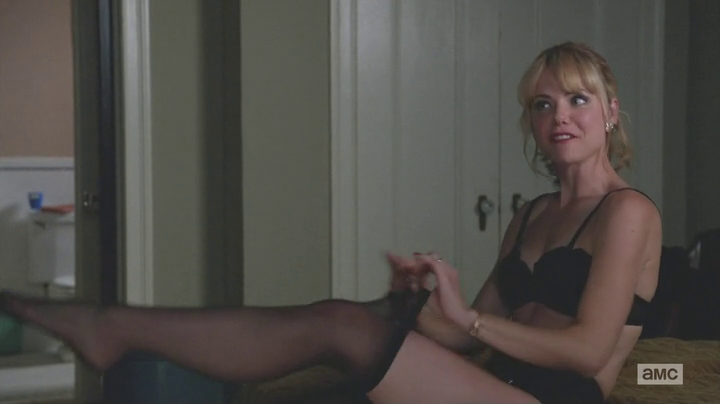\ 

Pete looks at her and *wishes she were a prostitute*. So he just starts playing "prostitute" anyway. He walks up to her and invades her space, but instead of an intimate close-up of the sort that would be appropriate, given they've just been intimate, Pete looks at her, gently touches her hair and says

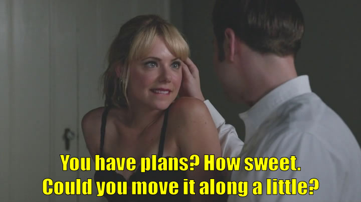\ 

That we can't see his face as he delivers this blow isn't a surprise. After all, only one person can play "prostitute" at a time. Sylvia and this woman are both forced into the role of playing prostitute by someone they considered their collaborator, but while the outcome of Don's mid-course game-change is merely violence on the radio, the off-screen violence this woman suffers is more personal:

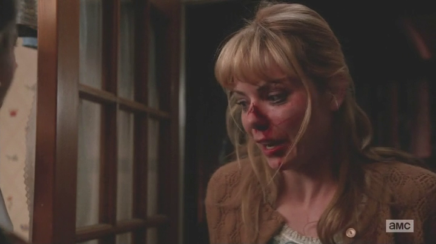\ 

In terms of scale and angle, this shot nearly mirrors the one above it, in that both register the prolongation of a moment of pain in a medium close-up. The first pain, in the panel above this one, is psychological, in that she's merely be made to feel like a whore; the second pain is also psychological, in that she has lost both her first collaborator, her husband, and must run to her second lost collaborator, Pete. But the second pain is also physical, because her first collaborator beat the shit out of her. But he did so off-screen, leaving Pete and Trudie to deal with the repercussions of violence.

And this is the key to the episode: the deaths and violence that happen off-screen are beginning to intrude into the lives of these characters. Such things have happened before on *Mad Men*, but they seem to be coming at an accelerated pace. Why? Because the game is changing, as are the players, but the game's not merely evolving from one into another, as it seemed previously; now the rules of the game are being changed such that it's the bottom of the third inning, the batter asks the umpire if he can take two free throws instead trying to hit that wicked curve again *and is being given the go-ahead*.
