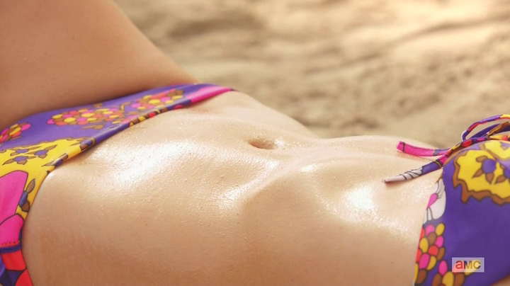

## Mad Men - "The Doorway": One foot in "The Doorway"

 * Originally located at http://acephalous.typepad.com/acephalous/2013/04/mad-men-dont-go-into-the-doorway-don.html

Midway through Don Draper's life journey, he strayed from the path and found himself in a dark wood:

\ 

I know that doesn't look much like a dark wood—and the idea that Draper somehow just started his midlife crisis is rather far-fetched—but this is what writer [Matthew Weiner](http://www.imdb.com/name/nm1980806/) and director [Scott Hornbacher](http://www.imdb.com/name/nm0394954/) wanted the audience to be looking at while Draper read the opening lines of the infamous beach book that is Dante's *Inferno*. Of note is the fact that Don is just beginning the book, and the only evidence that he's finished it is that, when asked by its owner, he replies "It made me think of you." Which means that in all likelihood he didn't read it, and so what follows has less to do with Dante's actual poem and more with what it stands for in this scene, *i.e.* an epic midlife crisis written in *[terza rima](http://en.wikipedia.org/wiki/Terza_rima)* that no man in recorded history has ever read on a beach. The juxtaposition of Dante's meditative lines and Megan's taut stomach signals the insincerity of Draper's reading. The last time the audience directly occupied Don's head, after all, is when he composed his anti-tobacco letter, an effective but utterly insincere and ultimately petulant rebuke to a suitor who'd already rejected him. But he's trying, for whatever reason and however insincerely, to come to terms with the state of his soul.

\ 

*While on an all-expense paid trip to Hawaii*. How well is it going for him? He attends the Sheraton's approximation of a luau:

\ 

And seems unsatisfied with it:

\ 

Catching him in a medium close-up with a fuzzy couple in the foreground and fuzzier G.I. in the background is significant because the camera is calling attention to Don in a crowd—a crowd comprised of happy people busy enjoying this simulation of a traditional Hawaiian festival in a way that he can't. It's not because he's unmoored from culture or that he doesn't want to enjoy the proceedings; he feels the absence of something acute here, which ironically enough presents itself, visually, as being the only sole subject in focus. His pain is more real than the joy of the fuzzy faceless crowd to which he belongs—but thinks himself better than. Love, after all, is a feeling invented by guys like him to sell nylons. The folks at this luau are just stupid enough to *feel* it. So what does someone who can't muster fake emotions at a simulated celebration of nothing in particular do?

\ 

He drinks. But he doesn't just drink anywhere, no, he drinks immediately before a painting of what is, presumably, an actual version of same ceremony he just witnessed. It's still mediated, only this time by art instead of commerce; and it's still unsatisfying, because he's not even looking at it. It clearly exists, dominating the central area of the frame as it does, but it almost seems to be shaming him, almost as if he can't make eye-contact with it without being reminded of his inability to feel the emotions he evokes in others *via mediations like this one*. Don seems to have lost the ability to feel anything other than drunk, and with this anhedonia comes an inability to even appreciate artifice for its own sake, a skill that's not merely critical to his profession, but the one that sets him apart from others in it. (But more on that later.)

As those of you who've been reading these for a while no doubt already noticed, this shot is extremely unbalanced. Don occupies frame-left in a way that begs for something to occupy frame-right to balance it out, and who better to occupy it than a fellow military man? They bond over military issue lighters and the groom-to-be joins Don for a drink, thereby balancing out the shot in a way that suggests that Don's balancing himself out:

\ 

Only *no*. Even when the groom-to-be joins him, his blacked-out best man tilts the frame in the other direction, with a compositional element on the right that vainly demands a similar one on the left. The reasons for this are complicated: like Don, Private First Class Dinkins has tangled up war and marriage in an unconventional way. P.F.C. Dinkins wants to ensure that his wife acquires American citizenship before he returns to Vietnam and (possibly) meets a terrible end; in short, he's  using his war as an excuse to legitimize her identity, as opposed to Don, who used his war to acquire an illegitimate identity. Who is Dick Whitman to commune with such a soldier, much less the woman marrying him to acquire, through legal means, an identity?

\ 

He's the man to give her away, that's who he is. I'm not even going to try to unravel the ironies evident in this shot here. I'm not going to point out that he abandoned his wife all night to give another woman away in marriage; or that Dick Whitman is helping a Mexican immigrant acquire an identity he doesn't have; or that the painting Draper and Dinkins decided to do this before is of a wedding ceremony that failed to move Draper in the least; or any of the other ironies compounded in this simple long shot of some people getting married on the beach. Instead, I'm going to point out that Don is no more moved here than he will be later, when he sees this image again through one of Megan's photographs:

\ 

Don's inability to be moved by this image of himself being unmoved during a ceremony that replicates, in life, the subject of a painting that also failed to move him is even more significant because of how it's being displayed:

\ 

That's a Kodak Carousel, which [as you remember from "The Wheel,"](http://acephalous.typepad.com/acephalous/2012/06/mad-men-the-wheel.html) is a machine that produces nostalgia, that "twinge in your heart far more powerful than memory alone." Except here, Don feels no twinge. Despite his old wounds, some of the most significant of which come *from this exact same sort of intermingling of love and war and identity*, Don feels no pain. His moving and dramatic speech in "The Wheel" betrays him, as this episode isn't about Dantean self-reflection so much as fleeing. What is Don fleeing?

Nothing.

The nothing that he can't seem to escape but which has incapacitated him. When he pitches to Sheraton near the end of the episode, he's a hollow shell of the man who sold Kodak on selling not just memories, but the emotions they necessarily evoke; because whatever necessity tied him to his emotions has been severed by something. What?

Nothing, as in, the Big Nothing.

Don's [struggle to understand Lane's suicide](http://acephalous.typepad.com/acephalous/2012/06/mad-men-its-not-your-tooth-thats-rotten-.html), which initially manifested itself as guilt-by-hallucination, has been replaced with nothing. Neither life nor its many imitations, be they painted or projected, can move him, because he's nothing so much as a member of the title of the show whose time-slot *Mad Men* took: *The Walking Dead*. In the Sheraton pitch, he desperately tries to make art imitate life in a meaningful fashion. Here's his bedroom floor the night before:

\ 

Here's his pitch:

\ 

As the Sheraton executives bluntly inform Don, this guy? The one who made the footprints? *He's dead*. From their perspective—and this is, literally, from their perspective—this man who walked into the ocean believes he has nothing to live for. Don's examination of this board after they leave is heartbreaking in its cluelessness:

\ 

\ 

\ 

He simply doesn't see it. He feels it—or more accurately, he doesn't—but he doesn't know what it isn't is. He doesn't know what's missing. The medium close-up here emphasizes that instead of the emotional response he had to his Kodak pitch, Don's intellectualizing everything. He's thinking instead of feeling, and the result is unambiguously inappropriate art accompanying suicidal copy. When he tells Dr. Rosen earlier in the episode that he doesn't want to compare what he does, advertising, to what Dr. Rosen does, doctoring, it's partly because you have to want to live to care enough to save someone else's life.

Don clearly doesn't.

About which more tomorrow.
