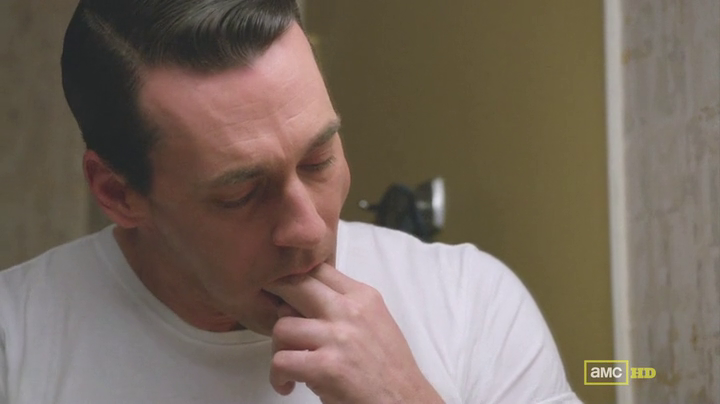
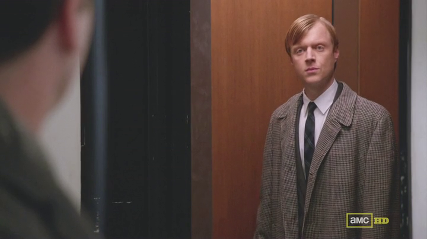
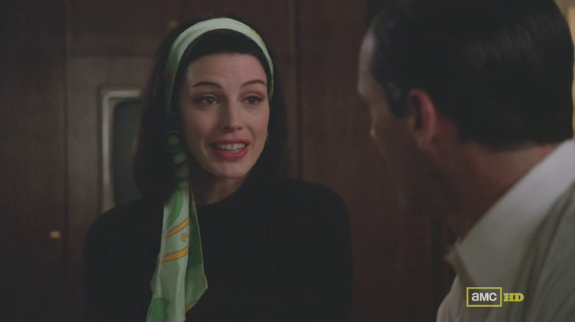
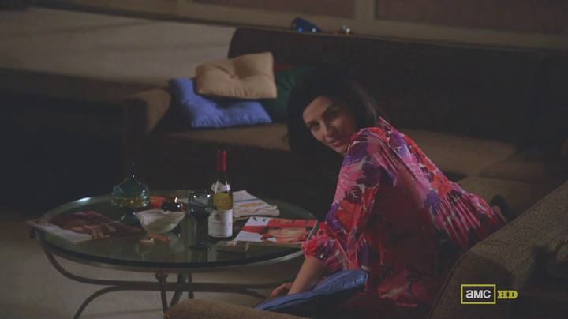
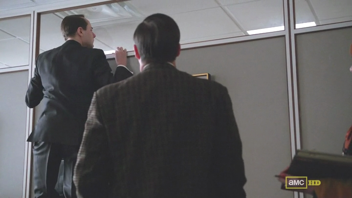
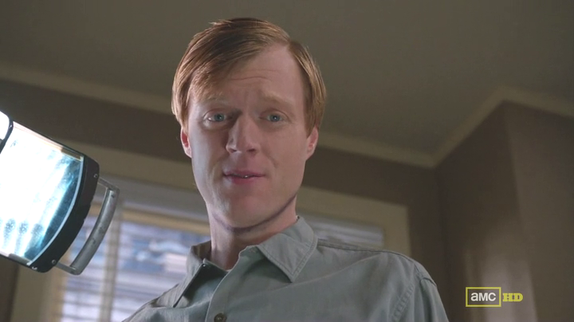

## Mad Men - "The Phantom": "It's not your tooth that's rotten," it's "The Phantom."

 * Originally located at http://acephalous.typepad.com/acephalous/2012/06/mad-men-its-not-your-tooth-thats-rotten-.html

My [previous post](http://www.lawyersgunsmoneyblog.com/2012/06/mad-men-nostalgia-forestalled-and-the-wheel), on "The Wheel," discussed in great detail the relationship of Don Draper to his past via the fading photographs of him and Betty and the children. "Nostalgia," Draper says,"literally means pain from an old wound." The "twinge" Don describes to the Kodak Eastman people is tinged with sadness—the life projected on the wall is one his actions have destroyed—but it is also a pain that's tempered by the knowledge that it can be compartmentalized. The Kodak Carousel is more than a projector: the titular wheel effectively functions as a container for captured moments that can be opened and reexperienced at a whim *or* it can be a simple storage device for memories a person wants to know are safely preserved. This second person doesn't necessarily want to reexperience their lives one twinge at a time, but the thought of being unable to do so could cause a pain unmitigated by memory. This would be a powerful pain, a constant reminder of itself by virtue of its absence. In "The Wheel," Don feels remorse for transforming the family projected on the wall into something that evokes no more than the twinge of memory. He claims that twinge is "more powerful than memory alone," but clearly it isn't.

In the fifth season finale, "The Phantom," directed, like "The Wheel," by Matt Weiner, the problem with Don's definition of nostalgia is immediately challenged by, of all things, a toothache:

\ 

But his toothache isn't an ordinary toothache. As his dentist informs him later in the episode, his tooth had formed an abscess, which means that its core has become rotten and the tooth must be pulled. It's an absence that can only be treated by the creation of a larger *controllable* absence. Early in "The Phantom," the abscess functions as a physical manifestation of the guilt Don feels about his complicity in the suicide of Lane Pryce in "[Commission and Fees](http://www.lawyersgunsmoneyblog.com/2012/06/mad-men-hands-and-hands-and-hands-in-commissions-and-fees)." Weiner signals as much in the form of the phantom that accompanies Don's pain:

\ 

\ 

The reverse from Don's swollen jaw and tired eyes to Adam's calm and open face connects the pain to its source: Lane's the second person who came to Don for help and, after being turned away, committed suicide. Don can feel a "twinge" of nostalgia for the family he fathered under his assumed identity, but his feelings for his younger brother, Adam Whitman, are complicated by the fact that he tried to store them in a wheel he knew he'd never attach to a Carousel. Adam had been stored and compartmentalized, incapable of causing a "twinge," at least unil Lane's suicide forces Don to remember his complicity in Adam's. In keeping with the carousel as a central image, Don's abscessed tooth is the equivalent of being forced to watch Adam meet his end *a la*

\ 

Once he questions his role in Lane's death, Don is incapable of thinking about his life in the neatly compartmentalized way to which he'd become accustomed. He can't drink away the pain of his abscessed tooth any more than he can stop seeing his brother's phantom. When does Adam phantom's disappear? When Don goes to the dentist, which he only does after realizing that he's dangerously close to losing someone else:

\ 

Megan petitions her miserable husband to score her an audition on one of his commercials, but he refuses, telling her that it's "better to be somebody's discovery than somebody's wife." He later returns home to find her sprawled on the couch, too drunk to stand:

\ 

For the first time, he realizes that she's veering dangerously close to being "somebody's discovery," only that person would be more like Pete Campbell:

\ 

And it wouldn't be Megan he'd discovered, only her body.  Don recognizes in Megan what he missed in the days before Adam and Lane killed themselves: the spoken desire to find and maintain a place in the world. He'd denied that to Adam and undermined Lane of his, but now he is confronted by his wife, who insists that if he doesn't help her, she's only valuable for one thing:

\ 

And that would be sex. "Isn't that what you want?" she asks him, and the look on his face is one of intense grief intermingling with physical pain:

\ 

Here the physical pain of the tooth and the psychological pain of the guilt collapse into a single close-up on the face of a man who has finally decided what he wants. He wants to go to the dentist:

\ 

But not just any dentist—his abscess can only be treated by the phantom of his suicided brother, and unlike earlier in the episode, when Adam stood calm and composed on the elevator, this Adam clearly bears the scars of his untimely end. Don's not just remembering here, he's facing the very memory he's denied himself access to for nearly five years. The payoff is still a hole where a tooth should have been, only instead of it being a festering sore it's just a hole. He can manage the hole, as he does by conceding to Megan's wishes in order to make sure he doesn't find himself with another.

There's clearly more to be discussed vis-a-vis holes and memories in this episode—Pete's paramour, Beth, will be using electroshock therapy to create a Pete-shaped hole in her memory—but for now all I'll say about that situation is that it seems at odds with an episode that deals with repression in such a psychoanalytic fashion. Lane's suicides heralds the return of the repressed, which takes the forms an Adam and an abscess, and Don deals with both of them in a manner that speaks to increased psychological health. Beth, however, removes the need for any sort of reintegration by obliterating the organ that records and reshapes memories. She is, by the episode's end, less of herself than she was at its opening. I'm not sure what to make of that, but I'll put it out there and see whether you can't do something with it.
