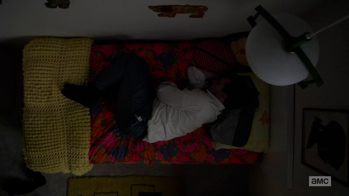
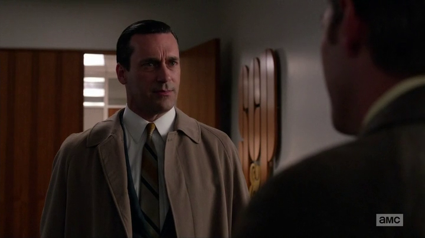
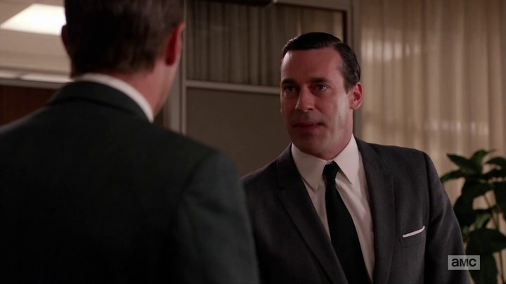
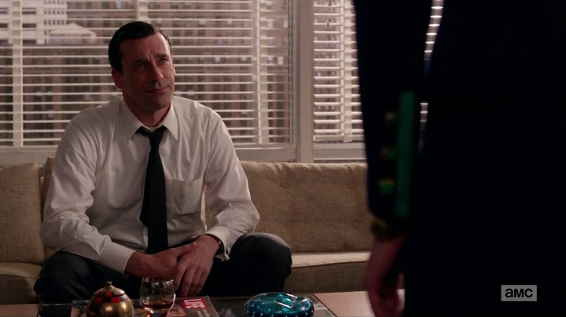

## Mad Men - "The Quality of Mercy": Fencing with shadows over "The Quality of Mercy"

 * Originally located at http://acephalous.typepad.com/acephalous/2013/06/mad-men-fencing-with-shadows-over-the-quality-of-mercy.html

I keep on reading that the title of this season's penultimate *Mad Men* episode, "The Quality of Mercy," is "[a phrase from Shakespeare](http://www.hollywoodreporter.com/bastard-machine/mad-men-ready-evolve-569970)" without any explanation as to what its significance might be. [Todd's the exception](http://www.avclub.com/articles/the-quality-of-mercy,98638/), but his account of the play muddies his most pressing insight: one only appeals to the quality of mercy when dealing with people who don't deserve it *because one wants it from that very same person*. It only exists as a rhetorical tactic. But it doesn't work quite that way anymore. For contemporary audiences the quality of mercy is something granted through extra-textual means -- the play's antisemitism retroactively grants it to Shylock -- which is another way of saying that characters exist in history and shouldn't be judged by their actions in the moment so much as their reputation over
the not-so-*[longue durée](http://en.wikipedia.org/wiki/Longue_dur%C3%A9e)*. This excuses nothing:

Shylock behaves like a stock Jew because Shakespeare didn't think his character worth elevating. The same can't be said of Don Draper in a season in which his status as an unknown quantity's been highlighted by the presence of fellow professional liar Bob Benson. Or can it? The last two episodes have seen him turn against his wife (Megan) and his protege (Peggy) for reasons that aren't entirely clear but clearly aren't merciful. And yet the arrival of Benson mingles with his failing marriage and office foibles in a manner that makes him seem deserving of the mercy Shylock wanted to refuse Antonio. That mercy would've denied Shylock his "pound of flesh." Care to guess who we are in this analogy?

That's correct: we're Shylock demanding a pound of Draper's flesh *and* we're the contemporary audience extending him mercy because we know that Shylock's been misunderstood by history. Which is about where we stand at this point in the series: Draper's a tragic figure made all the more tragic by the decisions he's making. He's an unforgivable human being widely recognized as a product of his circumstances. He's the man everyone envies until they see his substance is little more than strategically placed shadows -- particularly in this episode. But before I comment on that I should note how this episode begins:

\ 

With Draper in the fetal position. I'm not going to go all Freudian on you because [I don't do that anymore](http://acephalous.typepad.com/acephalous/2006/07/on_the_power_of.html). What's more significant than any Freudian overtones is that this is the first time in this episode that one side of Draper's face is hidden from the camera. That Phil Abraham went with an overhead shot in order to accomplish that is a telling oddity: we don't normally see shots from this perspective outside of the opening credits. Make of that what you will. What I find significant is that the opening shot of the episode 1) informs us that Don's wounded and 2) suggests that he's hiding his wound by hiding his face. I know this isn't actually true -- you can't hide psychological scars behind turned heads or well-positioned shadows -- but consider how the rest of the episode is shot. Here's Don pouring orange juice:

\ 

Abraham's clearly taking advantage of the "natural" light streaming in the set's windows -- it's most likely a key light -- but it's all coming from frame-right.  If you imagine Jon Hamm's standing in the center of a clock facing 12 o'clock, it appears as if there's a key light with a diffuser of some sort around 9 o'clock. If there weren't a diffuser of some sort the contrast would be harsher and it would look more noir -- but the shot's not that flat, as we can see light gently reflecting off the cupboards behind him. What's missing is some sort of fill light at 2 o'clock to illuminate Hamm's face. Why's it missing? Because Abraham wanted him to look "shady" without seeming [Manichean](http://en.wikipedia.org/wiki/Manichaeism#Figurative_use). That's why the diffuser's significant: it prevents the contrast from being harsh and turning Draper into [an anti-heroic image of stock-noir](http://icandi-art.deviantart.com/art/Film-Noir-The-Mobster-158987548). The conflict in most noir films being, of course, that Humphrey Bogart's trying to apply his black-and-white code of right and wrong to a grey world. Draper's conflict, of course, is that he has no code to apply to an increasingly colorful world, so it stands to reason that Abraham wouldn't shoot him so harshly. Especially when he's pouring
orange juice. But what about when he's pouring vodka *into* the orange juice?

\ 

Nope. That's the same key light. Hamm's just turned around so now the other side of his face is shaded. Not completely, though, because as noted there's some light reflecting off the cupboards that's preventing the entirety of the left side of his face from being in darkness. There's clearly something wrong with him in these shots: it's not that Draper's drinking in the morning, but that he's *hiding* drinking in the morning. Even the functional alcoholic occasionally needs a day off to drink inappropriately -- not that I speak from experience. But that's clearly what's happening here: more of the same only slightly different. But it doesn't get any better as the scene progresses:

\ 

As soon as he turns around he may as well not have: he's not bathed in the radiance of the same missing fill light. Maybe it'll improve once he stops celebrating Screwdriver Appreciation Day and shows up for work?

\ 

It's dogging him. I know shadows can't actually dog people and that it's all about strategically placed lights *but if I didn't know any better* I'd say this shadow was dogging him. Because rhetorically it is. In terms of its effect on the audience this shadow has been plastered to a side of his face since the moment he woke up *in the fetal position* trying to hide it from the camera in that overhead shot. It dissipates some in the meeting in which he "saves" Peggy by attributing her idea to the dear and recently departed:

\ 

It's not nearly so extreme here, which makes sense, because Draper's in his element. If the producers are manifesting his demons as shadows, it's understandable that they'd be less prominent in the one place Draper still feels somewhat comfortable. But the lighting's still working against Hamm: there's a fill light illuminating most of him, but it seems more designed to highlight the drawings of Peggy's *Rosemary's Baby*-inspired children's aspirin ad. He's catching the light *incidentally* and Draper's not a character often filmed in reflected glory. But here he is. I don't have any inside knowledge about why he keeps his head canted throughout this scene, but I can say that the effect echoes the shadowing from earlier in the episode. He's fighting the lights to spite his face here, and I don't think that's unintentional. Especially not considering his conversation after the meeting:

\ 

And this one's the give-away. This shot shouts the director's intent loud as subtitles: he's determined to create shadows on Hamm's face *even if it requires off-lighting it very brightly*. That glare on the right side of his head is the unfortunate side-effect of burying the rest of his face beneath shadow in what is, otherwise, a very bright room. I'm not sure what the thematic function of this shadow is -- I'm wary of explanations of characters that rely too heavily on how they're being presented by individual directors -- but there has to be one. I mean:

\ 

There has to be one. It's extremely difficult to create that sort of contrast -- diffused or otherwise -- in such well-lit spaces. I'd praise the dedicated crew responsible for creating this effect if I knew what their names were, because they deserve praise for creating this impression of a Don dogged by something. I could be glib and say it's history generally, or his personal history, or his night with Betty, or his non-nights with Megan, but I'd rather let the show tell me which of those is bothering him. Apparently it's the latter:

\ 

Whatever his problem is, the visual structure of the episode is relating it back to Megan. He ends this episode as he began it: in the fetal position sleeping with Megan's significant absence.
