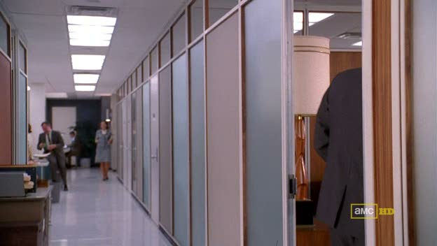
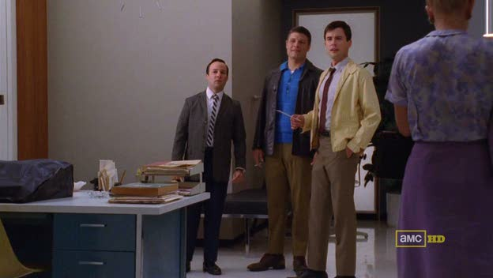
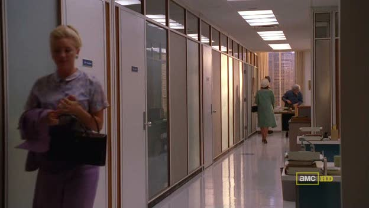
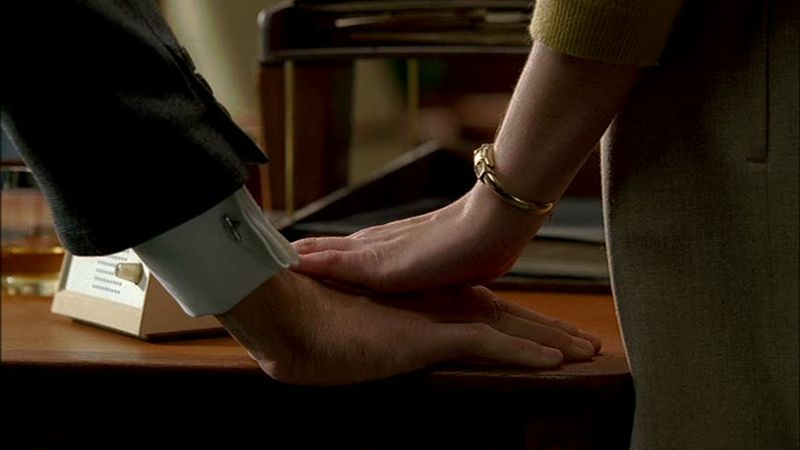
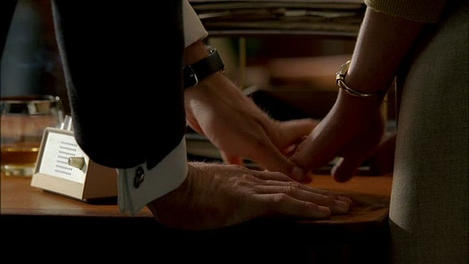
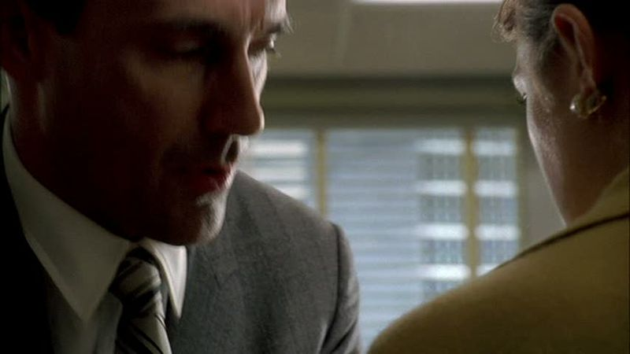
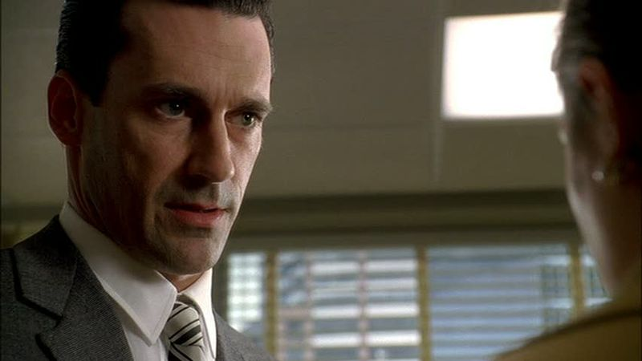
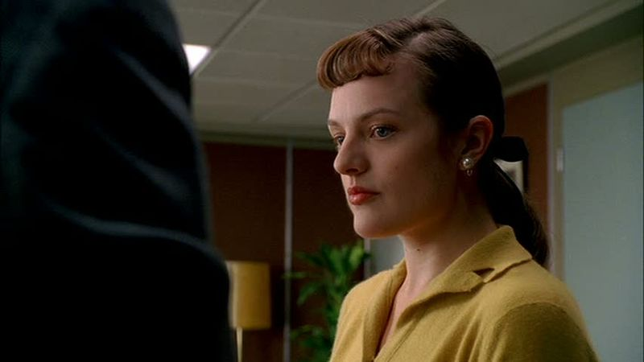
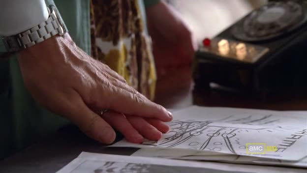

## Mad Men - "The Suitcase": Picking up "The [wrong] Suitcase"

 * Originally located at http://acephalous.typepad.com/acephalous/2010/09/mad-men-picking-up-the-wrong-suitcase.html

In [the first post](http://acephalous.typepad.com/acephalous/2010/09/mad-men-in-the-suitcase.html) about "The Suitcase," I concerned myself with the way Getzinger's camera conspired with blocking to frame the characters oppressively, and I want to build on that at the beginning of this one, but need to backtrack a bit first.  In that post I noted that Getzinger switches to a medium shot and [opens up an abyss](http://acephalous.typepad.com/.a/6a00d8341c2df453ef0133f40193c2970b-500wi) beneath Draper that terminates in his office.  I was spectacularly wrong.  At the beginning of the episode, Draper's office sits atop an abyss, as the shot after the aforelinked one clearly demonstrates:

\ 

The abyss does open up, but Draper escapes it by hanging a hard left into his office.  That his office is all that saves him from falling is significant when the state of life outside of it is considered.  I may be [reading too much into this](http://ighomb.blogspot.com/2010/09/mad-men.html), but note that the wall at the end of the hall is dark, much like the bottom of a hole.  If this dynamic is operative (instead of merely interpretative), that would put Draper's office at the "top" of the abyss and the end of the hall at its "bottom."  Why would this be significant?  Because after emerging from the restroom (after a series of encounters I wish I had time and space to write about), Peggy observes the lowliest of the firm's creative team at that bottom:

\ 

And proceed to mock her for, need I even say it?

\ 

Just in case I need to: Peggy is climbing up to the "top" of the abyss, with the directionality being clearly indicated by the natural sunlight streaming through the windows at the hallway's end.  Now, I have a number of problems with the argument as set up here; foremost among them, it seems like I may have let the content of the episode (not to mention the arc of the series) overdetermine the visuals here.  Peggy is on her way to becoming Draper's equal, and when coupled with the current state of his life and career, his being positioned at the "top" of anything other than an abyss would be ironic; that is, Peggy is clearly on her way up, and barring some great miracle, Draper is clearly on his way down.  Is my entire analysis here predicated on the existence of the abyss I claimed had been created with the cut to [this shot](http://acephalous.typepad.com/.a/6a00d8341c2df453ef0133f40193c2970b-500wi)?

Probably.  Absent some more compelling visual evidence, I'm not comfortable making a case as dependent on an initial observation as this one seems to be.\*  Besides, I can make the case for their coming equality without having to build a house of cards.  In the first episode of the first season, "Smoke Gets in Your Eyes," Peggy—during her first day serving as Draper's secretary—reveals that she allowed Peter Campbell to enter Draper's office to retrieve his fountain pen; while in there, Campbell stole the research into the death drive that Draper had tossed in the trash, then used said research during the meeting with Lucky Strike.  Draper upbraids her while leaning heavily on his desk, to which Peggy responds by doing this:

\ 

Draper removes her hand:

\ 

Because he is off-balance, his face lurches toward the camera in what could seem, at least for a moment, as a prelude to a gentle reprimand whispered in the ear:

\ 

Except then he pulls back, straightens his back and asserts his dominance over her:

\ 

He is bigger and more powerful than her, so the camera looks up to him.  She is weaker and less powerful than him, so the camera looks down on her:

\ 

She is incapable of making eye contact with him.  This is so classic an example of establishing power relations in the Western film that I have nothing interesting to say about it other than to note the way in which a very similar scene is treated in "The Suitcase."  As in "Smoke Gets in Your Eyes," Peggy is in Draper's office; and as in "Smoke Gets in Your Eyes," she had taken a bit of a verbal beating from him in the episode; there is, however, one significant difference:

\ 

That would be his hand on hers.  This role-reversal is the better way to make the argument I attempted above, but it's also patently less interesting and makes for a boring post.

\* I actually did do some research into optics to see if there were some hardwired reason that the brain would interpret looking from right-to-left as "down" and left-to-right as "up" but came up empty.  That's a lie.  I discovered some stuff by Pinker about the relation of language to visual perception in which he discussed the "natural" eye movements of English readers as being left-to-right, meaning that movements from right-to-left seem wrong, which wrongness might be interpreted by the brain as "down" because humans are hardwired to fear falling ... but as he was presenting this theory solely to dismiss it, I thought it best not to press the issue.
