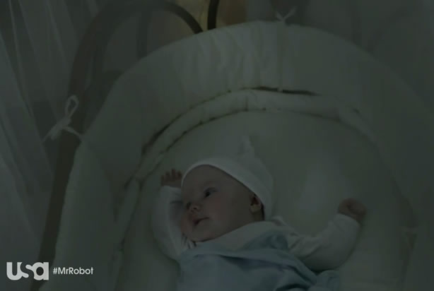

## Anatomy of an oppressive image: Why the sky is always falling on “Mr. Robot”

 * Originally published at `http://www.salon.com/2016/08/03/anatomy_of_an_oppressive_image_why_the_sky_is_always_falling_on_mr_robot/`

As a series, USA’s “[Mr. Robot](http://amzn.to/2albFmO)” is profoundly devoted to examining the interplay between control and freedom — a dynamic the show figures, as it were, in the hallucinated body of an absent father, Mr. Robot (Christian Slater). The viewer knows that conversations between Elliot Alderson (Rami Malek) and Mr. Robot stand in for the internal dialogue of a man who feels he has lost control of both his life and sanity, despite having successfully led an Anonymous-style hacker organization’s attack on the world banking system in the first season.

It would stand to reason that as the second season opened, Elliot would at least be in partial control of Mr. Robot — and he is, but only at great personal cost. He’s isolated himself from the rest of his team and regimented his life to a degree that would make Franciscans blush with envy. But as much as his acquired obsessive-compulsive disorder structures his life, it doesn’t allow him to rid himself of Mr. Robot, who returns daily to shoot Elliot in the head.

One way to read Elliott’s&nbsp;inability to free himself from his hallucination would be to say that the psychological reality of the situation is that Elliot is attempting to use routine to manage a psychotic break, and admirable though his efforts may be — washing and re-washing dishes, listening to Leon (Joey Bada$$) prattle philosophical about the true meaning of “[Seinfeld](http://amzn.to/2aljite),” etc. — the show’s visuals inform the viewer exactly why he’s been unsuccessful. Taking down the financial institutions that dominated the&nbsp;lives of the characters had little to no effect, because they’ve internalized their oppression.

The hackers and other Evil Corp. opponents always believed the sky was falling. But after it fell, they can’t escape the feeling that it’s still in the process of falling. Put differently, the sky is *always* falling on “Mr. Robot,” at least inasmuch as the top half of almost every shot is *always* threatening to crush the insignificant lives occupying the bottom. Consider, for example, a typical medium shot:

\ 

A conventional medium shot would place their heads far higher in frame, if only because humans tend to prefer human proportions. Of course, the people featured in that shot are the proverbial “little” ones, those whose necks are crushed by the heels of oligarchs, so perhaps it makes sense to emphasize their insignificance by visually diminishing them in this manner. Perhaps in the halls of power, humans are allowed to occupy more of the frame:

\ 

They are not. In fact, if anything they are shot in such a way that makes them appear even tinier than those whose lives they once ruled. And that difference isn’t simply an artifact of the first shot above being a medium and the one immediately above being a long. When director Sam Esmail switches to a medium in that same meeting, this is how he shoots it:

\ 

The cumulative effect of this framing is a pervasive feeling of helplessness — after all, how do people stop being crushed by the world when the world refuses to stop crushing them? That’s not a question Elliot can answer:

\ 

It doesn’t matter how many self-help mantras Angela Moss (Portia Doubleday) repeats:

\ 

Or how well-connected Ray (Craig Robinson) really is:

\ 

Everyone on “Mr. Robot” — as well as every viewer who feels drawn to the oppression it engenders — is just about as helpless as this baby:

\ 

