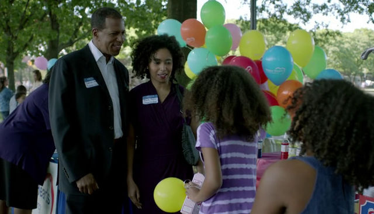
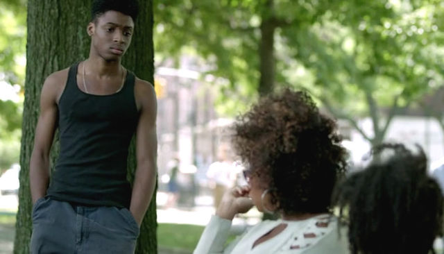
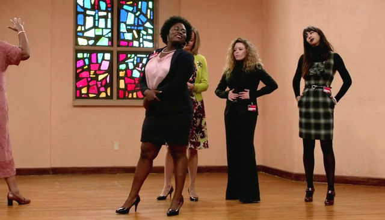
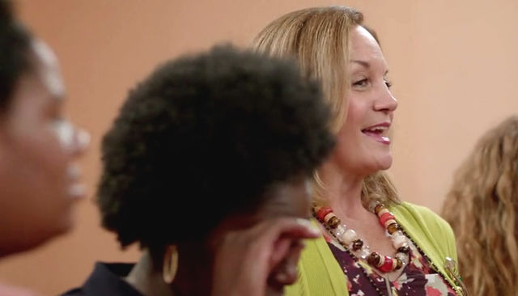
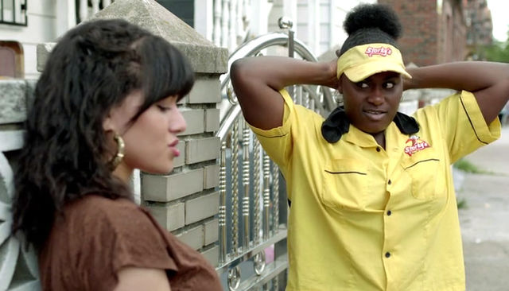
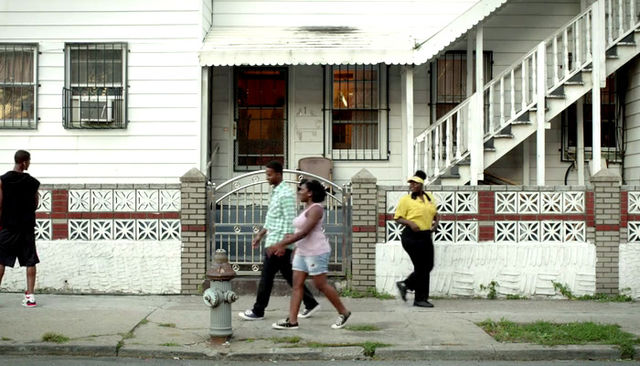
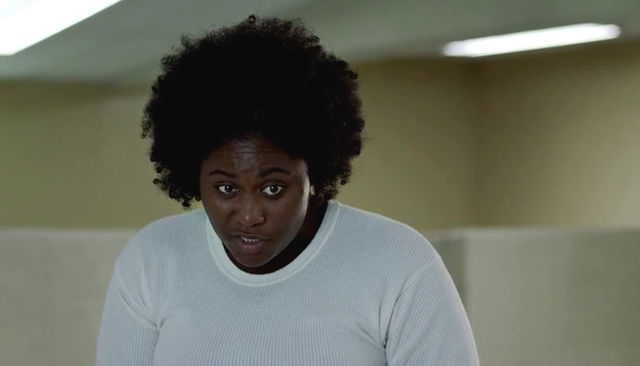
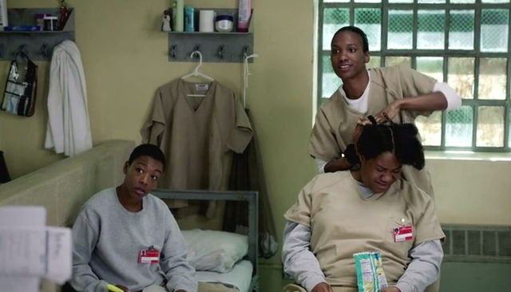
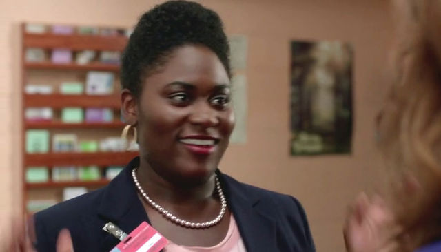
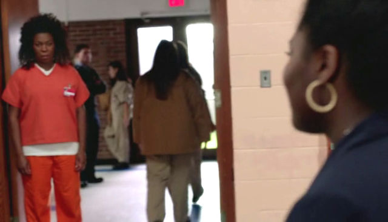

## Orange is the New Black: Orange Is The New Black demonstrates the importance of contiguity

 * Originally published at http://www.avclub.com/article/orange-new-black-demonstrates-importance-contiguit-205793

The second season of Netflix’s *[Orange Is The New Black](/article/orange-new-hill-street-blues-205425?utm_source=Twitter&amp;utm_medium=SocialMarketing&amp;utm_campaign=Default:1:Default)* opens by delivering what it believes its audience wants—all Piper, all the time—and does so with a suitably big directorial gun in Jodie Foster. It is also, hands down, the most dull and predictable episode of the season. However, the second episode, “[Looks Blue, Tastes Red](/tvclub/orange-new-black-thirsty-birdlooks-blue-tastes-red-205323),” is a reminder of what makes the series work, being less about the big-named principals and more about the people whose stories slip through the cracks, and directed by someone with talent, but not name recognition.

Director Michael Trim worked for showrunner Jenji Kohan on *[Weeds](/tv/weeds/)* and had a brief directing stint on *[Parks And Recreation](/tv/parks-and-recreation/)*, but his work in “Looks Blue, Tastes Red” surpasses either. Foster used a series of short tracking shots to follow Piper on her journey to Chicago in “Thirsty Bird,” which meant that as disorienting as the trip was for both the character and the audience, whatever confusion arose was mitigated by the fact that these shots were sequential. Trim lacks the crutch of having a single character to hang a sequence on, but this allows him to create what Foster never could—the element of meaningful surprise via simple juxtaposition.

*Orange Is The New Black* uses simple contiguity—meaning nothing more complicated than “two scenes put next to each other”—as well as any show on television, and it has to, given the size of its talented cast and its commitment to telling characters’ stories via flashbacks. The advantage of juxtaposing meaningfully related scenes is that it allows the audience to create connections, resulting in an episode that is less like a lecture than a lively discussion session.

In this episode, Trim recounts the life of Tasha “Taystee” Jefferson through the story of her employment history. It begins with Taystee auditioning for the job of “adopted daughter” by singing a rank rendition of Christina Aguilera’s “Beautiful,” only to be interrupted by another candidate child, Brichelle...

\ 

Trim frames the shot of Taystee, Brichelle, and the prospective parents such that Taystee is almost pushed off frame-right. Not only is her performance interrupted, Brichelle physically occupies the space between Taystee and the prospective parents, suggesting the importance of not allowing other people to horn in on your job interviews. Because that’s what these orphan fairs are—job interviews for children trapped in the foster system, and being that Taystee is both black and not a baby, the odds of her being selected are, unfortunately, long.

The scene then cuts to Vee Parker sitting next to Taystee on a park bench. Again, the conversation is interrupted by a third party, and again, Taystee is almost forced off frame-right...

\ 

This time, however, Taystee is allowed to finish her audition, because Vee is looking to hire someone who memorizes the periodic table and knows pi. What had, minutes earlier, been an audition for the role of “child” in a production of “family” has transformed into one for the role of “cog” in “drug enterprise.” The confusion created by placing these scenes back-to-back will resonate throughout the season, as Taystee must decide whether Vee is a caring mother figure or an exacting boss. Initially, at least, she seems to understand the difference—but as the episode progresses, the amount of emotional energy she invests in acquiring a job becomes increasingly excessive, making the stitching of these two scenes together seem increasingly meaningful.

This is especially evident when Trim flashes forward to the prison as those participating in the “Mock Job Fair” seek outfits that will meet their prospective employers’ approval and, significantly for Taystee, there is a competitive aspect to the “Dress For Success” fashion show:

\ 

Her performance here is as much a failure as her initial one with the prospective parents, and her reaction to the judge who declares the shirt too sheer and the skirt too short is that she’s wearing the outfit that won the previous year’s fashion show. The unsubtle suggestion is that the outfit is not at fault, but that Taystee is. Her legs are too long and her curves are too curvy to pull off wearing that outfit in a manner befitting a professional. “A fuller-figured woman might want to choose a looser fitting garment,” the judge says, and Taystee’s reaction is...

\ 

To break down in tears, but only for a moment—and an unfocused one at that—before she regroups and lashes out. She believes she did everything required of her to win the fashion show, but again, what she thinks is correct and what the world does are at odds. Trim is layering these scenes of Taystee’s failure in order to create a portrait of a misshapen worldview, but in a manner that never feels didactic, because the camera is suggesting connections instead of making them.

Her failure at the fashion show, for example, is immediately followed by a scene of her donning another workplace ensemble...

\ 

Taystee wears the fast-food uniform not because it flatters her, as she believed the dress at the fashion show did, but because she believes it is the correct thing to wear in order to live the life she wants to lead. She walks the straight-and-narrow path and seems proud of herself for doing so, especially when Vee and her familial “crew” walk up and invite her to join them in a workplace that “doesn’t leave [them] smelling like rancid oil.” That she chooses work over Vee and the potential for family is clear when Trim ends the scene with a moment of camaraderie between her and RJ...

\ 

The long shot shows him turning back to look at her, her turning back to look at him—and most significantly, a couple that looks suspiciously like the one that was kicking her tires before Brichelle interrupted at the beginning of the episode. Even if it’s not the same couple, the dynamic in the shot still works, with the young couple walking in front of a ramshackle but tidy white house as a pair of people who care about each other look back, longingly, as one goes off to deal drugs and the other to make an honest living.

Taystee then disappears from the episode, allowing other plots room to breathe, until the mock job interviews for the “Mock Job Fair.” As with Vee in the episode’s opening scene, Taystee relies on her intelligence to win over the man interviewing her. “Because I can remember shit and add real fast,” she says,  “I have high retention abilities and exceptional math skills.” When she asks what he makes of her ability to rhyme, she offers “poetic inclinations,” to which Vee responds with unbridled enthusiasm, “That’s what I’m talking about! You and me, we gonna be friends!” The pattern established by juxtaposing the two encounters at the beginning of the episode continues here—when she fails to conform to what others want in a prospective child or employee, she falls back on her intelligence.

Trim then cuts to two scenes, one of which—between Red and her son—is specifically about business, and another in which Maria “interviews” the father of her child. Both scenes suggest a connection with Taystee’s narrative without directly referencing it. Red is desperately trying to keep her family together via the business, while Maria would seemingly kill to have her “interviewee” say anything at all. The failing family business and impassive interviewee are followed by a scene in which Taystee’s makeshift inmate family discusses the interview stage of the “Mock Job Fair.”

She has, it seems, acquired the family she always wanted with Black Cindy, Janae Watson, and Poussey Washington, but as they discuss the upcoming interviews, Taystee reveals that she’s kept something from them: “I’m gonna rock that interview, then I’m gonna be the winner of the job fair, and they gonna hook me up with a real job.”

\ 

Trim has created a clear line in this scene by shooting Taystee in a one-shot and Black Cindy, Janae, and Poussey in a three-shot.

\ 

They may be a family, but as the camera reverses between them, it becomes obvious that they are a disjointed one. Janae even asks her, “Why didn’t you tell us there was a prize?” but before Taystee can answer, Black Cindy does for her: “Man, why you think? We are the competition.”

Family is a competition, as Trim’s next shifting of scene makes plain. He moves from the divided prison family to a bereft Taystee begging Vee to take her in. “You had your shots, you had several shots,” Vee tells her.

“But I can’t stay no more in that place, and I can’t start over in another home,” Taystee replies. She is willing to do whatever it takes to acquire the family—or familial dynamic—she so desperately seeks. She proves her worth to Vee when a customer interrupts her pleading by relying on her ability to “remember shit and add real fast,” only this time, Trim seems to reward her with a dinner scene in which she, Vee, and RJ sit down to a homemade meal.

But, of course, this Norman Rockwell moment is infused with talk of jobs and careers. “I’m just saying,” Taystee tells Vee, “this is not my forever job.” Although she is clearly talking about the drug trade, she is doing so at a kitchen table with a boy who acts like her brother and a woman who acts like her mother. Her entire concept of family cannot be extricated from her desire to have a job or career. The two have become fused simply by repeatedly placing elements of each within—or next to—the same scene.

So it should come as no surprise that the episode ends with her “winning” the Mock Job Fair...

\ 

Only to have the camera move slowly to her left and reveal...

\ 

Vee standing in the door at the moment of Taystee’s victory. The two elements that Trim had placed next to each other the entire episode are now together, in the narrative’s present moment, next to each other in the prison.
